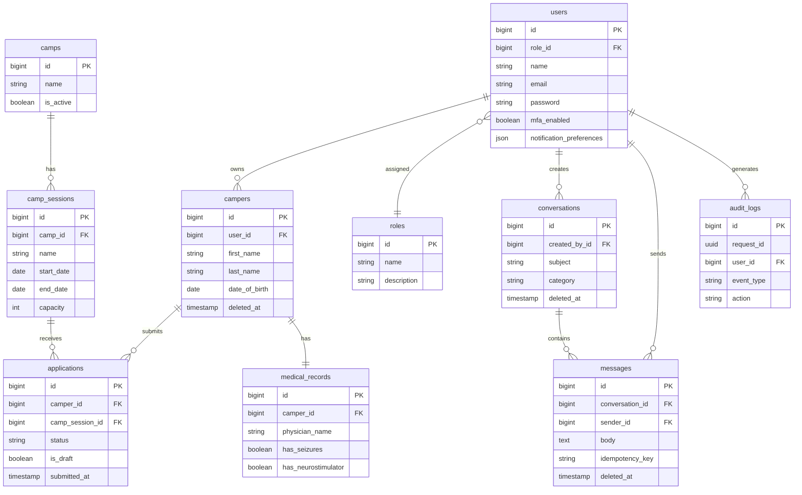
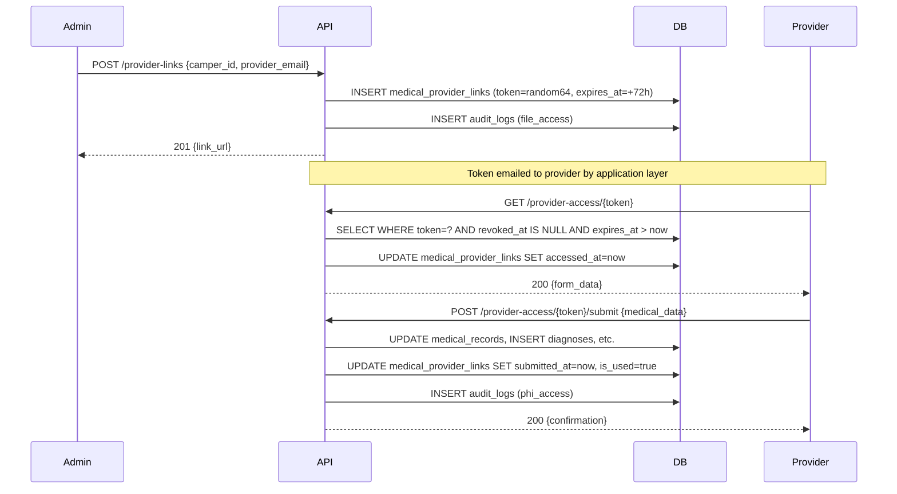

# DATABASE ARCHITECTURE AND SCHEMA DOCUMENTATION

**System:** Camp Burnt Gin — CYSHCN Camp Management Platform
**Document Version:** 1.0.0
**Database Engine:** MySQL 8.0
**Framework:** Laravel 12 (PHP 8.2+)
**Classification:** Internal Technical Documentation
**Audience:** Senior Software Engineers, Database Architects, Security Reviewers

---

## Table of Contents

1. [Executive Summary](#1-executive-summary)
2. [Database Technology Stack](#2-database-technology-stack)
3. [High-Level Architecture Overview](#3-high-level-architecture-overview)
4. [Entity-by-Entity Breakdown](#4-entity-by-entity-breakdown)
5. [Relationship Matrix](#5-relationship-matrix)
6. [Normalization Analysis](#6-normalization-analysis)
7. [Data Integrity Strategy](#7-data-integrity-strategy)
8. [Security Model](#8-security-model)
9. [Performance Considerations](#9-performance-considerations)
10. [Migration and Versioning Strategy](#10-migration-and-versioning-strategy)
11. [Data Flow Scenarios](#11-data-flow-scenarios)
12. [Edge Cases and Failure Handling](#12-edge-cases-and-failure-handling)
13. [Future Expansion Design](#13-future-expansion-design)
14. [Appendix](#14-appendix)

---

## 1. Executive Summary

### 1.1 Purpose of the Database

The Camp Burnt Gin database serves as the authoritative data store for a HIPAA-regulated camp management platform designed specifically to support children and youth with special health care needs (CYSHCN). The database persists and governs all operational data including user authentication, role-based access control, camper medical profiles, application submissions, inter-staff and parent-staff communications, administrative scheduling, document management, audit logging, and system configuration.

The system manages the complete lifecycle of a camper's relationship with the organization: from initial applicant registration through application submission, medical record completion, administrative review, session enrollment, and ongoing communications. Every data operation that touches protected health information (PHI) is logged in a dedicated audit trail.

### 1.2 System Context

The database underpins a multi-portal web application with four distinct user roles:

- **Parent (Applicant):** Registers campers, submits applications, manages documents, and communicates with staff.
- **Admin:** Reviews and approves applications, manages sessions and camps, produces reports, handles announcements and scheduling.
- **Medical:** Read-only access to medical records, diagnoses, allergies, medications, and behavioral profiles for enrolled campers.
- **Super Admin:** Full system access including user management, role assignment, audit log review, form template management, and all admin capabilities.

The application is structured as a Laravel 12 REST API consumed by a React 18 single-page application. Authentication is handled by Laravel Sanctum using bearer tokens. All API endpoints are protected by role middleware enforcing least-privilege access.

### 1.3 Design Philosophy

The database is designed around three primary principles:

**Data Fidelity:** Every piece of information entered into the system is stored once, normalized, and referenced by foreign key. Redundancy is avoided except where explicit denormalization serves a documented performance or compliance purpose.

**HIPAA Compliance by Design:** Protected health information fields are encrypted at rest using Laravel's built-in encrypted cast, which applies AES-256-CBC encryption transparently at the model layer. Sensitive columns are not stored in plaintext under any circumstances. A comprehensive audit log records every authenticated system event, providing the evidentiary trail required by HIPAA's audit controls standard (45 CFR §164.312(b)).

**Operational Stability:** The schema is designed to be stable under concurrent access, with unique constraints preventing duplicate records, soft deletes preserving data lineage, idempotency keys preventing duplicate message delivery, and foreign key constraints enforcing referential integrity throughout.

### 1.4 Architectural Principles

| Principle | Implementation |
|---|---|
| Normalization | Third Normal Form (3NF) throughout, with targeted denormalization in the conversations table (`last_message_at`) |
| Modularity | Domain-separated table groups: identity, camps, medical, communications, system |
| Scalability | Composite indexes on all high-cardinality filter patterns; soft deletes with deleted_at included in composite indexes |
| Security | Encrypted casts on all PHI fields; hidden attributes on tokens and passwords; audit log on all state changes |
| Soft Delete | Applied to campers, conversations, and messages; all other records use hard delete with cascade |
| Idempotency | Messages carry a unique `idempotency_key` to prevent duplicate delivery under network retry conditions |

### 1.5 Intended Usage

This document is the authoritative reference for any engineer modifying, extending, auditing, or migrating the Camp Burnt Gin database. It supersedes any implicit schema documentation derived from source code. All schema changes must be implemented through numbered Laravel migrations and must update this document accordingly.

---

## 2. Database Technology Stack

### 2.1 Database Engine

| Property | Value |
|---|---|
| Engine | MySQL 8.0+ |
| ORM | Eloquent (Laravel 12) |
| Query Builder | Laravel Fluent Query Builder |
| Connection Pooling | PHP-FPM per-process persistent connections |
| Storage Engine | InnoDB (all tables) |

InnoDB is required for all tables. It provides row-level locking, ACID transaction semantics, and foreign key constraint enforcement. MyISAM and other engines are not used.

### 2.2 Character Sets and Collation

| Property | Value |
|---|---|
| Default Character Set | `utf8mb4` |
| Default Collation | `utf8mb4_unicode_ci` |

`utf8mb4` is used to support the full Unicode character range including supplementary characters (four-byte sequences), which is required for name fields that may contain emoji characters in medical notes entered by clinicians, or non-Latin characters in proper names. `utf8mb4_unicode_ci` provides case-insensitive comparison using the Unicode Collation Algorithm.

### 2.3 Indexing Strategy Overview

The indexing strategy follows these rules:

1. Every primary key is an auto-incrementing unsigned 8-byte integer (`bigIncrements`).
2. Every foreign key column carries an index added by the `foreignId()` migration helper.
3. Columns used in `WHERE` clauses with high cardinality (status, type, event_type) carry individual indexes.
4. Columns used in multi-column `WHERE` or `ORDER BY` patterns carry composite indexes with columns ordered by selectivity (most selective first).
5. Columns included in composite indexes for soft-deleted tables always include `deleted_at` as the final component to allow partial index exploitation.
6. Boolean columns are indexed only when they appear in filtered queries with other columns.

### 2.4 Migration and Version Control

Database schema is versioned through Laravel's migration system. Migration files are stored at `database/migrations/` and follow a strict naming convention:

```
YYYY_MM_DD_NNNNNN_<description>.php
```

Migrations are irreversible by intent — the `down()` method is implemented for local development rollback only and is never executed in production. Production schema evolution is additive: columns and tables are added, not removed. Deprecated columns are nulled and eventually removed through a documented two-phase migration process.

---

## 3. High-Level Architecture Overview

### 3.1 Domain Groupings

The database is organized into six functional domains:

```
+---------------------------+     +---------------------------+
|   IDENTITY DOMAIN         |     |   CAMP DOMAIN             |
|   users                   |     |   camps                   |
|   roles                   |     |   camp_sessions           |
|   personal_access_tokens  |     |   calendar_events         |
|   password_reset_tokens   |     |   announcements           |
|   sessions (framework)    |     |   form_templates          |
+---------------------------+     +---------------------------+
            |                                   |
            |                                   |
+---------------------------+     +---------------------------+
|   CAMPER / MEDICAL DOMAIN |     |   APPLICATION DOMAIN      |
|   campers                 |     |   applications            |
|   medical_records         |     |   documents               |
|   emergency_contacts      |     |   required_document_rules |
|   allergies               |     |   activity_permissions    |
|   medications             |     +---------------------------+
|   diagnoses               |
|   behavioral_profiles     |
|   feeding_plans           |
|   assistive_devices       |
|   medical_provider_links  |
+---------------------------+

+---------------------------+     +---------------------------+
|   COMMUNICATIONS DOMAIN   |     |   SYSTEM DOMAIN           |
|   conversations           |     |   audit_logs              |
|   conversation_participants|    |   notifications           |
|   messages                |     |   cache                   |
|   message_reads           |     |   cache_locks             |
|   (documents via morph)   |     |   jobs                    |
+---------------------------+     |   job_batches             |
                                  |   failed_jobs             |
                                  +---------------------------+
```

### 3.2 Conceptual Entity Relationship Diagram

```
IDENTITY                  CAMP                     APPLICATION
--------                  ----                     -----------
users ─────────────────── camps                    applications
  |                         |                          |
  |─── campers ─────────── camp_sessions ─────────────┘
  |       |                                            |
  |       |── medical_records                      documents (morph)
  |       |── emergency_contacts
  |       |── allergies
  |       |── medications
  |       |── diagnoses
  |       |── behavioral_profiles
  |       |── feeding_plans
  |       |── assistive_devices
  |       └── activity_permissions
  |
  |── conversations ──── messages ──── message_reads
  |       |                  └──── documents (via message_id)
  |       └── conversation_participants
  |
  |── announcements
  |── calendar_events
  |── audit_logs
  └── form_templates
```

### 3.3 Mermaid Entity Relationship Diagram



### 3.4 Primary Data Flows

**Registration Flow:** A user registers, creating a `users` record with a `role_id` pointing to the `parent` role. They subsequently create one or more `campers` linked to their user account.

**Application Flow:** A camper is associated with a `camp_session` via an `applications` record. Medical sub-records (allergies, medications, diagnoses, etc.) are created against the camper. Documents are uploaded and morphologically associated with the application. The application transitions from draft to submitted, then through administrative review states.

**Communication Flow:** Conversations are created by any authenticated user, with participants added to `conversation_participants`. Messages are posted to conversations, and read receipts are tracked per user in `message_reads`. Attachments are linked via `documents.message_id`.

**Audit Flow:** Every state-changing API call writes one or more records to `audit_logs` with the event type, requesting user, target entity, before/after values, IP address, and a UUID request identifier for correlation.

---

## 4. Entity-by-Entity Breakdown

---

### 4.1 `users`

#### Overview

| Property | Value |
|---|---|
| Table Name | `users` |
| Purpose | Stores all authenticated human actors in the system |
| Business Responsibility | Identity, authentication, authorization, lockout state, MFA, notification preferences |
| Lifecycle | Created on registration; never hard deleted (last super_admin deletion is prevented at model boot) |
| Soft Delete | No — records are deactivated via `email_verified_at` nulling |

#### Columns

| Column | Type | Nullable | Default | Index | Description |
|---|---|---|---|---|---|
| `id` | bigint unsigned | No | AUTO_INCREMENT | PK | Surrogate primary key |
| `role_id` | bigint unsigned | Yes | NULL | FK, Index | Foreign key to `roles.id`; NULL means no role assigned |
| `name` | varchar(255) | No | — | — | Full display name |
| `email` | varchar(255) | No | — | Unique | Login identifier; must be unique across all users |
| `email_verified_at` | timestamp | Yes | NULL | — | Null means unverified or deactivated |
| `password` | varchar(255) | No | — | — | Bcrypt hash; never stored or returned as plaintext |
| `remember_token` | varchar(100) | Yes | NULL | — | Laravel persistent login token |
| `mfa_enabled` | boolean | No | false | — | Whether TOTP MFA is active for this user |
| `mfa_secret` | varchar(255) | Yes | NULL | — | TOTP secret; hidden from API responses; encrypted in storage |
| `mfa_verified_at` | timestamp | Yes | NULL | — | Timestamp of last successful MFA challenge |
| `failed_login_attempts` | int unsigned | No | 0 | — | Incremented on each failed credential check |
| `lockout_until` | timestamp | Yes | NULL | Index | When set, all login attempts are rejected until this time |
| `last_failed_login_at` | timestamp | Yes | NULL | — | Timestamp of most recent failed login |
| `notification_preferences` | json | Yes | NULL | — | Serialized notification preference flags per channel |
| `created_at` | timestamp | Yes | NULL | — | Record creation timestamp |
| `updated_at` | timestamp | Yes | NULL | — | Record last update timestamp |

**Data Type Reasoning:**
`email` is stored as a standard varchar with a unique index. It is not encrypted because it serves as the lookup key for authentication and password reset flows. `password` uses Laravel's `hashed` cast, which invokes bcrypt automatically on assignment. `mfa_secret` is a TOTP base32 secret and is hidden from all API serialization. `notification_preferences` uses a JSON column because the shape of notification preferences may evolve without requiring a schema migration.

#### Keys and Constraints

| Constraint | Column(s) | Type | Behavior |
|---|---|---|---|
| PK | `id` | Primary | — |
| UQ | `email` | Unique | Prevents duplicate accounts |
| FK | `role_id` → `roles.id` | Foreign | ON DELETE SET NULL |

#### Indexing Strategy

| Index | Columns | Type | Purpose |
|---|---|---|---|
| PRIMARY | `id` | B-Tree | Row lookup |
| `users_email_unique` | `email` | Unique B-Tree | Login authentication lookup |
| `users_role_id_index` | `role_id` | B-Tree | Role-based user listing |
| `users_lockout_until_index` | `lockout_until` | B-Tree | Efficiently query locked-out accounts |

#### Relationships

- `BelongsTo` Role (via `role_id`)
- `HasMany` Camper
- `HasMany` Application (as reviewer, via `reviewed_by`)
- `HasMany` Conversation (as creator)
- `HasMany` Message (as sender)
- `HasMany` AuditLog
- `HasMany` FormTemplate (as creator)
- `HasMany` MedicalProviderLink (as creator and revoker)

---

### 4.2 `roles`

#### Overview

| Property | Value |
|---|---|
| Table Name | `roles` |
| Purpose | Defines the named access tiers of the application |
| Business Responsibility | Authorization classification |
| Lifecycle | Seeded at installation; not modified at runtime |
| Soft Delete | No |

#### Columns

| Column | Type | Nullable | Default | Index | Description |
|---|---|---|---|---|---|
| `id` | bigint unsigned | No | AUTO_INCREMENT | PK | Surrogate key |
| `name` | varchar(255) | No | — | Unique | Machine identifier: `parent`, `admin`, `medical`, `super_admin` |
| `description` | varchar(255) | Yes | NULL | — | Human-readable description of role scope |
| `created_at` | timestamp | Yes | NULL | — | |
| `updated_at` | timestamp | Yes | NULL | — | |

#### Keys and Constraints

| Constraint | Column(s) | Type |
|---|---|---|
| PK | `id` | Primary |
| UQ | `name` | Unique |

#### Relationships

- `HasMany` User (via `users.role_id`)

---

### 4.3 `camps`

#### Overview

| Property | Value |
|---|---|
| Table Name | `camps` |
| Purpose | Represents a named physical camp program |
| Business Responsibility | Top-level organizational grouping for sessions |
| Lifecycle | Created by admin; deactivated via `is_active = false` |
| Soft Delete | No |

#### Columns

| Column | Type | Nullable | Default | Index | Description |
|---|---|---|---|---|---|
| `id` | bigint unsigned | No | AUTO_INCREMENT | PK | |
| `name` | varchar(255) | No | — | — | Official camp program name |
| `description` | text | Yes | NULL | — | Extended description for informational display |
| `location` | varchar(255) | Yes | NULL | — | Physical address or venue name |
| `is_active` | boolean | No | true | — | Controls visibility and registration eligibility |
| `created_at` | timestamp | Yes | NULL | — | |
| `updated_at` | timestamp | Yes | NULL | — | |

#### Relationships

- `HasMany` CampSession (via `camp_sessions.camp_id`)

---

### 4.4 `camp_sessions`

#### Overview

| Property | Value |
|---|---|
| Table Name | `camp_sessions` |
| Purpose | Represents a specific scheduled session within a camp |
| Business Responsibility | Enrollment capacity management, date range definition, registration window |
| Lifecycle | Created by admin; deactivated via `is_active = false` |
| Soft Delete | No |

#### Columns

| Column | Type | Nullable | Default | Index | Description |
|---|---|---|---|---|---|
| `id` | bigint unsigned | No | AUTO_INCREMENT | PK | |
| `camp_id` | bigint unsigned | No | — | FK, Index | Parent camp |
| `name` | varchar(255) | No | — | — | Session identifier, e.g. "Summer 2026 Session A" |
| `start_date` | date | No | — | Composite | Session start date |
| `end_date` | date | No | — | Composite | Session end date |
| `capacity` | int unsigned | No | — | — | Maximum number of enrollable campers |
| `min_age` | tinyint unsigned | No | — | — | Minimum camper age for eligibility |
| `max_age` | tinyint unsigned | No | — | — | Maximum camper age for eligibility |
| `registration_opens_at` | datetime | Yes | NULL | Composite | When application submission window opens |
| `registration_closes_at` | datetime | Yes | NULL | Composite | When application submission window closes |
| `is_active` | boolean | No | true | Index | Whether the session is open for administrative use |
| `created_at` | timestamp | Yes | NULL | — | |
| `updated_at` | timestamp | Yes | NULL | — | |

#### Keys and Constraints

| Constraint | Column(s) | Type |
|---|---|---|
| PK | `id` | Primary |
| FK | `camp_id` → `camps.id` | Foreign, CASCADE |

#### Indexing Strategy

| Index | Columns | Purpose |
|---|---|---|
| `camp_sessions_start_date_end_date_index` | `start_date`, `end_date` | Calendar range queries |
| `camp_sessions_is_active_index` | `is_active` | Filter active sessions |
| `camp_sessions_registration_window` | `registration_opens_at`, `registration_closes_at` | Registration eligibility window queries |

#### Relationships

- `BelongsTo` Camp
- `HasMany` Application

---

### 4.5 `campers`

#### Overview

| Property | Value |
|---|---|
| Table Name | `campers` |
| Purpose | Represents an individual child or youth requiring specialized camp services |
| Business Responsibility | Central subject entity for all medical, application, and safety data |
| Lifecycle | Created by parent during application; soft deleted for data retention compliance |
| Soft Delete | Yes — `deleted_at` timestamp |

#### Columns

| Column | Type | Nullable | Default | Index | Description |
|---|---|---|---|---|---|
| `id` | bigint unsigned | No | AUTO_INCREMENT | PK | |
| `user_id` | bigint unsigned | No | — | FK, Index | Owning parent/applicant account |
| `first_name` | varchar(255) | No | — | Composite | |
| `last_name` | varchar(255) | No | — | Composite | |
| `date_of_birth` | date | No | — | Index | Used for age eligibility checks against session min/max_age |
| `gender` | varchar(255) | Yes | NULL | — | Optional self-reported gender identity |
| `supervision_level` | varchar(255) | No | 'standard' | Index | One of: `standard`, `elevated`, `intensive` |
| `record_retention_until` | date | Yes | NULL | Index | HIPAA-driven retention date; records may be purged after this date |
| `deleted_at` | timestamp | Yes | NULL | — | Soft delete marker; non-null means logically deleted |
| `created_at` | timestamp | Yes | NULL | — | |
| `updated_at` | timestamp | Yes | NULL | — | |

**Data Type Reasoning:**
`supervision_level` is stored as a varchar backed by a PHP enum (`SupervisionLevel`) rather than a MySQL ENUM type. This avoids the DDL-level migration cost of adding enum values in MySQL and allows application-level validation. `record_retention_until` implements HIPAA's minimum necessary retention policy; after this date, records can be purged during scheduled compliance runs.

#### Keys and Constraints

| Constraint | Column(s) | Type |
|---|---|---|
| PK | `id` | Primary |
| FK | `user_id` → `users.id` | Foreign, CASCADE |

#### Indexing Strategy

| Index | Columns | Purpose |
|---|---|---|
| `campers_date_of_birth_index` | `date_of_birth` | Age eligibility range queries |
| `campers_last_name_first_name_index` | `last_name`, `first_name` | Alphabetical search by name |
| `campers_supervision_level_index` | `supervision_level` | Staffing allocation queries |
| `campers_record_retention_until_index` | `record_retention_until` | Scheduled retention purge queries |

#### Relationships

- `BelongsTo` User
- `HasMany` Application
- `HasOne` MedicalRecord
- `HasMany` EmergencyContact
- `HasMany` Allergy
- `HasMany` Medication
- `HasMany` Diagnosis
- `HasOne` BehavioralProfile
- `HasOne` FeedingPlan
- `HasMany` AssistiveDevice
- `HasMany` ActivityPermission
- `HasMany` MedicalProviderLink

---

### 4.6 `applications`

#### Overview

| Property | Value |
|---|---|
| Table Name | `applications` |
| Purpose | Represents a camper's request to enroll in a specific camp session |
| Business Responsibility | Application lifecycle management, reviewer assignment, signature collection |
| Lifecycle | Created as draft; progresses through pending, under_review, accepted, rejected, waitlisted |
| Soft Delete | No |

#### Columns

| Column | Type | Nullable | Default | Index | Description |
|---|---|---|---|---|---|
| `id` | bigint unsigned | No | AUTO_INCREMENT | PK | |
| `camper_id` | bigint unsigned | No | — | FK, Composite | Applicant camper |
| `camp_session_id` | bigint unsigned | No | — | FK, Composite | Target session |
| `is_draft` | boolean | No | false | Index | True until explicitly submitted |
| `status` | varchar(255) | No | 'pending' | Index | One of: `pending`, `under_review`, `accepted`, `rejected`, `waitlisted` |
| `submitted_at` | timestamp | Yes | NULL | Index | When applicant formally submitted |
| `reviewed_at` | timestamp | Yes | NULL | Index | When admin completed review |
| `reviewed_by` | bigint unsigned | Yes | NULL | FK | Admin user who performed review |
| `notes` | text | Yes | NULL | — | Admin review notes |
| `signature_data` | text | Yes | NULL | — | Base64-encoded drawn signature; hidden from API |
| `signature_name` | varchar(255) | Yes | NULL | — | Typed signature name alternative |
| `signed_at` | timestamp | Yes | NULL | — | When signature was applied |
| `signed_ip_address` | varchar(45) | Yes | NULL | — | IP address at time of signature for legal traceability |
| `created_at` | timestamp | Yes | NULL | — | |
| `updated_at` | timestamp | Yes | NULL | — | |

#### Keys and Constraints

| Constraint | Column(s) | Type | Behavior |
|---|---|---|---|
| PK | `id` | Primary | — |
| UQ | `camper_id`, `camp_session_id` | Unique | Prevents duplicate applications |
| FK | `camper_id` → `campers.id` | Foreign | CASCADE |
| FK | `camp_session_id` → `camp_sessions.id` | Foreign | CASCADE |
| FK | `reviewed_by` → `users.id` | Foreign | SET NULL |

#### Indexing Strategy

| Index | Columns | Purpose |
|---|---|---|
| `applications_status_index` | `status` | Admin filter by status |
| `applications_submitted_at_index` | `submitted_at` | Date range filtering |
| `applications_reviewed_at_index` | `reviewed_at` | Admin workflow queue sorting |
| `applications_is_draft_index` | `is_draft` | Exclude drafts from review queues |
| `applications_status_camp_session_id_index` | `status`, `camp_session_id` | Per-session enrollment counts |

#### Relationships

- `BelongsTo` Camper
- `BelongsTo` CampSession
- `BelongsTo` User (as reviewer, via `reviewed_by`)
- `MorphMany` Document (via polymorphic `documentable`)

---

### 4.7 `medical_records`

#### Overview

| Property | Value |
|---|---|
| Table Name | `medical_records` |
| Purpose | Stores the primary medical summary record for a camper |
| Business Responsibility | Insurance information, primary physician, dietary needs, seizure history |
| Lifecycle | Created when camper completes Section 2 of application; updated as needed |
| Soft Delete | No |
| PHI Fields | All named clinical fields are encrypted at rest |

#### Columns

| Column | Type | Nullable | Default | Index | Description |
|---|---|---|---|---|---|
| `id` | bigint unsigned | No | AUTO_INCREMENT | PK | |
| `camper_id` | bigint unsigned | No | — | FK, Unique | One-to-one with campers |
| `physician_name` | text (encrypted) | Yes | NULL | — | Primary care physician name |
| `physician_phone` | text (encrypted) | Yes | NULL | — | Physician contact number |
| `insurance_provider` | text (encrypted) | Yes | NULL | — | Health insurance company name |
| `insurance_policy_number` | text (encrypted) | Yes | NULL | — | Policy number |
| `special_needs` | text (encrypted) | Yes | NULL | — | Free-text narrative of special needs |
| `dietary_restrictions` | text (encrypted) | Yes | NULL | — | Free-text dietary restrictions |
| `notes` | text (encrypted) | Yes | NULL | — | Miscellaneous clinical notes |
| `has_seizures` | boolean | No | false | — | Flag indicating seizure history; triggers required document rule |
| `last_seizure_date` | date | Yes | NULL | — | Date of most recent seizure |
| `seizure_description` | text (encrypted) | Yes | NULL | — | Clinical description of seizure type |
| `has_neurostimulator` | boolean | No | false | — | Flag for implanted neurostimulator devices |
| `created_at` | timestamp | Yes | NULL | — | |
| `updated_at` | timestamp | Yes | NULL | — | |

**PHI Encryption Note:**
Fields marked as encrypted use Laravel's `encrypted` cast, which applies AES-256-CBC encryption with a key derived from the application's `APP_KEY` environment variable. The ciphertext is stored as a base64-encoded string. These fields cannot be searched with SQL LIKE operators; all search operations on PHI fields must be performed at the application layer after decryption.

#### Keys and Constraints

| Constraint | Column(s) | Type | Behavior |
|---|---|---|---|
| PK | `id` | Primary | — |
| UQ | `camper_id` | Unique | Enforces one medical record per camper |
| FK | `camper_id` → `campers.id` | Foreign | CASCADE |

#### Relationships

- `BelongsTo` Camper (one-to-one, enforced by unique constraint)

---

### 4.8 `emergency_contacts`

#### Overview

| Property | Value |
|---|---|
| Table Name | `emergency_contacts` |
| Purpose | Stores emergency contact persons for a camper |
| Business Responsibility | Emergency notification chain; authorized pickup list |
| PHI Fields | All contact fields encrypted at rest |

#### Columns

| Column | Type | Nullable | Default | Index | Description |
|---|---|---|---|---|---|
| `id` | bigint unsigned | No | AUTO_INCREMENT | PK | |
| `camper_id` | bigint unsigned | No | — | FK, Index | Parent camper |
| `name` | text (encrypted) | No | — | — | Contact full name |
| `relationship` | text (encrypted) | No | — | — | e.g. "Mother", "Grandmother", "Legal Guardian" |
| `phone_primary` | text (encrypted) | No | — | — | Primary contact number |
| `phone_secondary` | text (encrypted) | Yes | NULL | — | Alternate contact number |
| `email` | text (encrypted) | Yes | NULL | — | Contact email address |
| `is_primary` | boolean | No | false | Index | Indicates the highest-priority emergency contact |
| `is_authorized_pickup` | boolean | No | false | — | Whether this contact may collect the camper |
| `created_at` | timestamp | Yes | NULL | — | |
| `updated_at` | timestamp | Yes | NULL | — | |

#### Keys and Constraints

| Constraint | Column(s) | Type |
|---|---|---|
| PK | `id` | Primary |
| FK | `camper_id` → `campers.id` | Foreign, CASCADE |

#### Indexing Strategy

| Index | Columns | Purpose |
|---|---|---|
| `emergency_contacts_camper_id_index` | `camper_id` | Retrieve all contacts for a camper |
| `emergency_contacts_is_primary_index` | `is_primary` | Quickly identify primary contact |

---

### 4.9 `allergies`

#### Overview

| Property | Value |
|---|---|
| Table Name | `allergies` |
| Purpose | Records known allergens for a camper with severity classification |
| PHI Fields | `allergen`, `reaction`, `treatment` are encrypted |

#### Columns

| Column | Type | Nullable | Default | Index | Description |
|---|---|---|---|---|---|
| `id` | bigint unsigned | No | AUTO_INCREMENT | PK | |
| `camper_id` | bigint unsigned | No | — | FK, Index | Parent camper |
| `allergen` | text (encrypted) | No | — | — | Substance causing the allergic response |
| `severity` | varchar(255) | No | — | Index | Enum: `mild`, `moderate`, `severe`, `life_threatening` |
| `reaction` | text (encrypted) | Yes | NULL | — | Documented reaction description |
| `treatment` | text (encrypted) | Yes | NULL | — | Required treatment protocol |
| `created_at` | timestamp | Yes | NULL | — | |
| `updated_at` | timestamp | Yes | NULL | — | |

#### Relationships

- `BelongsTo` Camper

---

### 4.10 `medications`

#### Overview

| Property | Value |
|---|---|
| Table Name | `medications` |
| Purpose | Records prescribed and over-the-counter medications administered to a camper |
| PHI Fields | All fields encrypted: `name`, `dosage`, `frequency`, `purpose`, `prescribing_physician`, `notes` |

#### Columns

| Column | Type | Nullable | Default | Index | Description |
|---|---|---|---|---|---|
| `id` | bigint unsigned | No | AUTO_INCREMENT | PK | |
| `camper_id` | bigint unsigned | No | — | FK, Index | Parent camper |
| `name` | text (encrypted) | No | — | — | Medication name (brand or generic) |
| `dosage` | text (encrypted) | No | — | — | Dose amount and unit |
| `frequency` | text (encrypted) | No | — | — | Administration schedule |
| `purpose` | text (encrypted) | Yes | NULL | — | Clinical indication |
| `prescribing_physician` | text (encrypted) | Yes | NULL | — | Prescribing practitioner name |
| `notes` | text (encrypted) | Yes | NULL | — | Administration instructions |
| `created_at` | timestamp | Yes | NULL | — | |
| `updated_at` | timestamp | Yes | NULL | — | |

---

### 4.11 `diagnoses`

#### Overview

| Property | Value |
|---|---|
| Table Name | `diagnoses` |
| Purpose | Stores formal clinical diagnoses for a camper |
| PHI Fields | `description`, `notes` encrypted |

#### Columns

| Column | Type | Nullable | Default | Index | Description |
|---|---|---|---|---|---|
| `id` | bigint unsigned | No | AUTO_INCREMENT | PK | |
| `camper_id` | bigint unsigned | No | — | FK, Index | Parent camper |
| `name` | varchar(255) | No | — | — | Diagnosis name or ICD code description |
| `description` | text (encrypted) | Yes | NULL | — | Extended clinical description |
| `severity_level` | varchar(255) | No | — | Index | Enum: `mild`, `moderate`, `severe`, `profound` |
| `notes` | text (encrypted) | Yes | NULL | — | Additional clinical notes |
| `created_at` | timestamp | Yes | NULL | — | |
| `updated_at` | timestamp | Yes | NULL | — | |

---

### 4.12 `behavioral_profiles`

#### Overview

| Property | Value |
|---|---|
| Table Name | `behavioral_profiles` |
| Purpose | Records behavioral risk indicators and communication methods for a camper |
| Business Responsibility | Staffing ratio decisions, safety planning |
| PHI Fields | `notes` encrypted |

#### Columns

| Column | Type | Nullable | Default | Index | Description |
|---|---|---|---|---|---|
| `id` | bigint unsigned | No | AUTO_INCREMENT | PK | |
| `camper_id` | bigint unsigned | No | — | FK, Unique | One-to-one with campers |
| `aggression` | boolean | No | false | — | History of aggressive behavior |
| `self_abuse` | boolean | No | false | — | History of self-injurious behavior |
| `wandering_risk` | boolean | No | false | Index | Elopement risk flag |
| `one_to_one_supervision` | boolean | No | false | Index | Requires dedicated 1:1 staff support |
| `developmental_delay` | boolean | No | false | — | Documented developmental delay |
| `functioning_age_level` | varchar(255) | Yes | NULL | — | Approximate functional age equivalent |
| `communication_methods` | json | Yes | NULL | — | Array of methods: verbal, sign, AAC device, PECS, etc. |
| `notes` | text (encrypted) | Yes | NULL | — | Staff-facing behavioral notes |
| `created_at` | timestamp | Yes | NULL | — | |
| `updated_at` | timestamp | Yes | NULL | — | |

#### Keys and Constraints

| Constraint | Column(s) | Type |
|---|---|---|
| PK | `id` | Primary |
| UQ | `camper_id` | Unique |
| FK | `camper_id` → `campers.id` | Foreign, CASCADE |

---

### 4.13 `feeding_plans`

#### Overview

| Property | Value |
|---|---|
| Table Name | `feeding_plans` |
| Purpose | Records specialized nutritional and feeding requirements for campers with complex feeding needs |
| Business Responsibility | G-tube management, dietary compliance, feeding schedule |
| PHI Fields | `diet_description`, `notes` encrypted |

#### Columns

| Column | Type | Nullable | Default | Index | Description |
|---|---|---|---|---|---|
| `id` | bigint unsigned | No | AUTO_INCREMENT | PK | |
| `camper_id` | bigint unsigned | No | — | FK, Unique | One-to-one with campers |
| `special_diet` | boolean | No | false | — | Requires modified diet |
| `diet_description` | text (encrypted) | Yes | NULL | — | Diet modification details |
| `g_tube` | boolean | No | false | Index | Gastrostomy tube present; triggers required document rule |
| `formula` | varchar(255) | Yes | NULL | — | Tube feeding formula name/type |
| `amount_per_feeding` | varchar(255) | Yes | NULL | — | Volume per administration |
| `feedings_per_day` | int | Yes | NULL | — | Number of daily feedings |
| `feeding_times` | json | Yes | NULL | — | Array of scheduled feeding times |
| `bolus_only` | boolean | No | false | — | Whether feedings are bolus only (not continuous drip) |
| `notes` | text (encrypted) | Yes | NULL | — | Staff instructions for feeding management |
| `created_at` | timestamp | Yes | NULL | — | |
| `updated_at` | timestamp | Yes | NULL | — | |

#### Keys and Constraints

| Constraint | Column(s) | Type |
|---|---|---|
| PK | `id` | Primary |
| UQ | `camper_id` | Unique |
| FK | `camper_id` → `campers.id` | Foreign, CASCADE |

---

### 4.14 `assistive_devices`

#### Overview

| Property | Value |
|---|---|
| Table Name | `assistive_devices` |
| Purpose | Catalogs mobility and adaptive devices used by a camper |
| Business Responsibility | Staff training requirements, transfer protocol, equipment logistics |

#### Columns

| Column | Type | Nullable | Default | Index | Description |
|---|---|---|---|---|---|
| `id` | bigint unsigned | No | AUTO_INCREMENT | PK | |
| `camper_id` | bigint unsigned | No | — | FK, Index | Parent camper |
| `device_type` | varchar(255) | No | — | Index | e.g. wheelchair, walker, CPAP/BiPAP, hearing aid, communication device |
| `requires_transfer_assistance` | boolean | No | false | Index | Staff must assist with transfer to/from device |
| `notes` | text | Yes | NULL | — | Device-specific operational notes |
| `created_at` | timestamp | Yes | NULL | — | |
| `updated_at` | timestamp | Yes | NULL | — | |

---

### 4.15 `activity_permissions`

#### Overview

| Property | Value |
|---|---|
| Table Name | `activity_permissions` |
| Purpose | Records per-activity permission levels for individual campers |
| Business Responsibility | Liability management, activity planning, safety compliance |

#### Columns

| Column | Type | Nullable | Default | Index | Description |
|---|---|---|---|---|---|
| `id` | bigint unsigned | No | AUTO_INCREMENT | PK | |
| `camper_id` | bigint unsigned | No | — | FK, Composite | Parent camper |
| `activity_name` | varchar(255) | No | — | Composite | Activity identifier (e.g. "swimming", "hiking", "horseback_riding") |
| `permission_level` | varchar(255) | No | — | Index | Enum: `full`, `modified`, `excluded` |
| `restriction_notes` | text | Yes | NULL | — | Specific restriction instructions |
| `created_at` | timestamp | Yes | NULL | — | |
| `updated_at` | timestamp | Yes | NULL | — | |

#### Keys and Constraints

| Constraint | Column(s) | Type |
|---|---|---|
| PK | `id` | Primary |
| UQ | `camper_id`, `activity_name` | Unique |
| FK | `camper_id` → `campers.id` | Foreign, CASCADE |

---

### 4.16 `documents`

#### Overview

| Property | Value |
|---|---|
| Table Name | `documents` |
| Purpose | Tracks all uploaded files in the system with polymorphic ownership |
| Business Responsibility | File metadata, virus scan tracking, verification workflow, attachment to messages |
| Polymorphic | Yes — `documentable_type` + `documentable_id` attaches to any model |
| PHI Fields | `original_filename` encrypted |

#### Columns

| Column | Type | Nullable | Default | Index | Description |
|---|---|---|---|---|---|
| `id` | bigint unsigned | No | AUTO_INCREMENT | PK | |
| `documentable_type` | varchar(255) | No | — | Composite | PHP class name of owning model (morph type) |
| `documentable_id` | bigint unsigned | No | — | Composite | Primary key of owning model record |
| `message_id` | bigint unsigned | Yes | NULL | Index | Set when document is a message attachment |
| `uploaded_by` | bigint unsigned | Yes | NULL | FK, Index | User who uploaded; nullable for provider submissions |
| `original_filename` | text (encrypted) | No | — | — | User-facing filename; encrypted to protect PII in filenames |
| `stored_filename` | varchar(255) | No | — | — | UUID-based server-side filename; hidden from API |
| `mime_type` | varchar(255) | No | — | — | Validated MIME type: pdf, jpeg, png, gif, doc, docx |
| `file_size` | bigint unsigned | No | — | — | File size in bytes; max 10,485,760 (10 MB) |
| `disk` | varchar(255) | No | 'local' | — | Laravel filesystem disk identifier; hidden from API |
| `path` | varchar(255) | No | — | — | Server-side storage path; hidden from API |
| `document_type` | varchar(255) | Yes | NULL | Index | Categorical type: seizure_plan, gtube_plan, cpap_waiver, etc. |
| `is_scanned` | boolean | No | false | Composite | Whether virus scan has been performed |
| `scan_passed` | boolean | Yes | NULL | Composite | Result of virus scan; null means not yet scanned |
| `scanned_at` | timestamp | Yes | NULL | — | Timestamp of completed scan |
| `verification_status` | varchar(255) | No | 'pending' | Index | One of: `pending`, `verified`, `rejected`, `expired` |
| `verified_by` | bigint unsigned | Yes | NULL | FK | Admin user who verified the document |
| `verified_at` | timestamp | Yes | NULL | — | Verification completion timestamp |
| `expiration_date` | date | Yes | NULL | Index | For time-limited documents (e.g., immunization records) |
| `created_at` | timestamp | Yes | NULL | — | |
| `updated_at` | timestamp | Yes | NULL | — | |

#### Keys and Constraints

| Constraint | Column(s) | Type |
|---|---|---|
| PK | `id` | Primary |
| FK | `uploaded_by` → `users.id` | Foreign, SET NULL |
| FK | `message_id` → `messages.id` | Foreign, CASCADE |
| FK | `verified_by` → `users.id` | Foreign, SET NULL |

#### Indexing Strategy

| Index | Columns | Purpose |
|---|---|---|
| Morph composite | `documentable_type`, `documentable_id` | Polymorphic eager loading |
| Scan composite | `is_scanned`, `scan_passed` | Background scan queue processing |
| `documents_document_type_index` | `document_type` | Filter by required document category |
| `documents_verification_status_index` | `verification_status` | Admin verification queue |
| `documents_expiration_date_index` | `expiration_date` | Scheduled expiration checks |
| `documents_uploaded_by_index` | `uploaded_by` | User upload history |
| `documents_message_id_index` | `message_id` | Retrieve message attachments |

---

### 4.17 `medical_provider_links`

#### Overview

| Property | Value |
|---|---|
| Table Name | `medical_provider_links` |
| Purpose | Manages time-limited tokenized access links for medical providers to submit health records |
| Business Responsibility | Secure external provider record submission without requiring portal registration |
| Lifecycle | Created by admin; expires after 72 hours by default; revocable at any time |

#### Columns

| Column | Type | Nullable | Default | Index | Description |
|---|---|---|---|---|---|
| `id` | bigint unsigned | No | AUTO_INCREMENT | PK | |
| `camper_id` | bigint unsigned | No | — | FK | Target camper |
| `created_by` | bigint unsigned | No | — | FK | Admin who generated the link |
| `token` | varchar(64) | No | — | Unique | Random 64-character cryptographically secure token |
| `provider_email` | varchar(255) | No | — | Index | Recipient email address |
| `provider_name` | varchar(255) | Yes | NULL | — | Provider's display name |
| `expires_at` | timestamp | No | — | Index | Hard expiry; tokens are invalid after this time |
| `accessed_at` | timestamp | Yes | NULL | — | When provider first loaded the link |
| `submitted_at` | timestamp | Yes | NULL | — | When provider completed their submission |
| `revoked_at` | timestamp | Yes | NULL | — | When admin revoked the token |
| `revoked_by` | bigint unsigned | Yes | NULL | FK | Admin who revoked |
| `is_used` | boolean | No | false | — | True after first successful provider submission |
| `notes` | text | Yes | NULL | — | Admin notes about the link purpose |
| `created_at` | timestamp | Yes | NULL | — | |
| `updated_at` | timestamp | Yes | NULL | — | |

#### Keys and Constraints

| Constraint | Column(s) | Type |
|---|---|---|
| PK | `id` | Primary |
| UQ | `token` | Unique |
| FK | `camper_id` → `campers.id` | Foreign, CASCADE |
| FK | `created_by` → `users.id` | Foreign, CASCADE |
| FK | `revoked_by` → `users.id` | Foreign, SET NULL |

**Security Note:** The token column is declared as `hidden` in the Eloquent model and is never returned in API responses. Token lookup is performed via constant-time comparison using `Hash::check()` to prevent timing attacks.

---

### 4.18 `required_document_rules`

#### Overview

| Property | Value |
|---|---|
| Table Name | `required_document_rules` |
| Purpose | Defines the conditional document requirements triggered by camper characteristics |
| Business Responsibility | Compliance matrix — maps clinical conditions to mandatory document types |

#### Columns

| Column | Type | Nullable | Default | Index | Description |
|---|---|---|---|---|---|
| `id` | bigint unsigned | No | AUTO_INCREMENT | PK | |
| `medical_complexity_tier` | varchar(255) | Yes | NULL | Index | Complexity classification triggering this rule |
| `supervision_level` | varchar(255) | Yes | NULL | Index | Supervision level triggering this rule |
| `condition_flag` | varchar(255) | Yes | NULL | Index | Boolean condition name (e.g. `has_seizures`, `g_tube`) |
| `document_type` | varchar(255) | No | — | Index | Required document category |
| `description` | text | No | — | — | Human-readable description of why this document is required |
| `is_mandatory` | boolean | No | true | — | Whether document is mandatory vs. recommended |
| `created_at` | timestamp | Yes | NULL | — | |
| `updated_at` | timestamp | Yes | NULL | — | |

#### Keys and Constraints

| Constraint | Column(s) | Type |
|---|---|---|
| PK | `id` | Primary |
| UQ | `medical_complexity_tier`, `supervision_level`, `condition_flag`, `document_type` | Unique (`rdr_unique_rule`) |

---

### 4.19 `notifications`

#### Overview

| Property | Value |
|---|---|
| Table Name | `notifications` |
| Purpose | Stores in-application notifications using Laravel's polymorphic notification system |
| Primary Key | UUID (not auto-increment integer) |

#### Columns

| Column | Type | Nullable | Default | Index | Description |
|---|---|---|---|---|---|
| `id` | char(36) | No | — | PK | UUID primary key |
| `type` | varchar(255) | No | — | — | Fully qualified notification class name |
| `notifiable_type` | varchar(255) | No | — | Composite | Polymorphic owner type |
| `notifiable_id` | bigint unsigned | No | — | Composite | Polymorphic owner ID |
| `data` | text | No | — | — | JSON-serialized notification payload |
| `read_at` | timestamp | Yes | NULL | Composite | Null means unread |
| `created_at` | timestamp | Yes | NULL | — | |
| `updated_at` | timestamp | Yes | NULL | — | |

#### Indexing Strategy

| Index | Columns | Purpose |
|---|---|---|
| Morph+read composite | `notifiable_type`, `notifiable_id`, `read_at` | Fetch unread count and unread list per user |

---

### 4.20 `conversations`

#### Overview

| Property | Value |
|---|---|
| Table Name | `conversations` |
| Purpose | Represents a threaded message conversation between one or more participants |
| Business Responsibility | Parent-staff communication, application-linked discussions |
| Lifecycle | Created by any authenticated user; archived or soft deleted |
| Soft Delete | Yes |

#### Columns

| Column | Type | Nullable | Default | Index | Description |
|---|---|---|---|---|---|
| `id` | bigint unsigned | No | AUTO_INCREMENT | PK | |
| `created_by_id` | bigint unsigned | No | — | FK, Composite | Conversation initiator |
| `subject` | varchar(255) | No | — | — | Conversation subject line |
| `category` | varchar(50) | No | 'general' | Index | One of: `general`, `medical`, `application`, `other` |
| `application_id` | bigint unsigned | Yes | NULL | FK, Composite | Optional link to a specific application |
| `camper_id` | bigint unsigned | Yes | NULL | FK, Composite | Optional link to a specific camper |
| `camp_session_id` | bigint unsigned | Yes | NULL | FK, Composite | Optional link to a specific session |
| `last_message_at` | timestamp | Yes | NULL | Composite | Denormalized: updated on each new message for efficient sorting |
| `is_archived` | boolean | No | false | Composite | Whether conversation is in the archive folder |
| `deleted_at` | timestamp | Yes | NULL | — | Soft delete marker |
| `created_at` | timestamp | Yes | NULL | — | |
| `updated_at` | timestamp | Yes | NULL | — | |

**Denormalization Note:**
`last_message_at` is intentionally denormalized. It duplicates data available via `messages.created_at` but avoids a correlated subquery or JOIN on every inbox list render. It is maintained by application code on every message insert and is the primary sort key for the inbox view.

#### Keys and Constraints

| Constraint | Column(s) | Type | Behavior |
|---|---|---|---|
| PK | `id` | Primary | — |
| FK | `created_by_id` → `users.id` | Foreign | CASCADE |
| FK | `application_id` → `applications.id` | Foreign | SET NULL |
| FK | `camper_id` → `campers.id` | Foreign | SET NULL |
| FK | `camp_session_id` → `camp_sessions.id` | Foreign | SET NULL |

#### Indexing Strategy

| Index | Columns | Purpose |
|---|---|---|
| Creator + delete | `created_by_id`, `deleted_at` | User's own conversation list |
| Application + delete | `application_id`, `deleted_at` | Application-linked threads |
| Camper + delete | `camper_id`, `deleted_at` | Camper-linked threads |
| Session + delete | `camp_session_id`, `deleted_at` | Session-linked threads |
| Inbox sort | `is_archived`, `deleted_at`, `last_message_at` | Inbox and archive sorted views |

---

### 4.21 `conversation_participants`

#### Overview

| Property | Value |
|---|---|
| Table Name | `conversation_participants` |
| Purpose | Junction table mapping users to conversations |
| Business Responsibility | Participant management, join/leave tracking |

#### Columns

| Column | Type | Nullable | Default | Index | Description |
|---|---|---|---|---|---|
| `id` | bigint unsigned | No | AUTO_INCREMENT | PK | |
| `conversation_id` | bigint unsigned | No | — | FK, Index | Parent conversation |
| `user_id` | bigint unsigned | No | — | FK, Composite | Participant user |
| `joined_at` | timestamp | No | — | — | When user was added to conversation |
| `left_at` | timestamp | Yes | NULL | Composite | When user left; null means currently active |
| `created_at` | timestamp | Yes | NULL | — | |
| `updated_at` | timestamp | Yes | NULL | — | |

#### Keys and Constraints

| Constraint | Column(s) | Type |
|---|---|---|
| PK | `id` | Primary |
| UQ | `conversation_id`, `user_id` | Unique |
| FK | `conversation_id` → `conversations.id` | Foreign, CASCADE |
| FK | `user_id` → `users.id` | Foreign, CASCADE |

#### Indexing Strategy

| Index | Columns | Purpose |
|---|---|---|
| UQ | `conversation_id`, `user_id` | Prevent duplicate participation |
| User+leave | `user_id`, `left_at` | Fetch all active conversations for a user |

---

### 4.22 `messages`

#### Overview

| Property | Value |
|---|---|
| Table Name | `messages` |
| Purpose | Stores individual messages within a conversation |
| Lifecycle | Created by sender; soft deleted by admin |
| Soft Delete | Yes |

#### Columns

| Column | Type | Nullable | Default | Index | Description |
|---|---|---|---|---|---|
| `id` | bigint unsigned | No | AUTO_INCREMENT | PK | |
| `conversation_id` | bigint unsigned | No | — | FK, Composite | Parent conversation |
| `sender_id` | bigint unsigned | No | — | FK, Composite | Sending user |
| `body` | text | No | — | — | Message content |
| `idempotency_key` | varchar(64) | No | — | Unique | Client-generated key preventing duplicate message delivery under retry |
| `deleted_at` | timestamp | Yes | NULL | Composite | Soft delete marker |
| `created_at` | timestamp | Yes | NULL | — | |
| `updated_at` | timestamp | Yes | NULL | — | |

**Idempotency Note:**
The `idempotency_key` is a 64-character random string generated by the client before transmission. If a client retries a POST due to a network timeout, the server will detect the duplicate key via the unique constraint and return the existing message rather than creating a duplicate. This constraint is enforced at the database level.

#### Keys and Constraints

| Constraint | Column(s) | Type |
|---|---|---|
| PK | `id` | Primary |
| UQ | `idempotency_key` | Unique |
| FK | `conversation_id` → `conversations.id` | Foreign, CASCADE |
| FK | `sender_id` → `users.id` | Foreign, CASCADE |

#### Indexing Strategy

| Index | Columns | Purpose |
|---|---|---|
| Thread display | `conversation_id`, `created_at`, `deleted_at` | Paginated thread display ordered by time |
| Thread delete filter | `conversation_id`, `deleted_at` | Exclude deleted messages from thread |
| Sender history | `sender_id`, `created_at`, `deleted_at` | User's sent message history |

---

### 4.23 `message_reads`

#### Overview

| Property | Value |
|---|---|
| Table Name | `message_reads` |
| Purpose | Tracks per-user read receipts for individual messages |
| Business Responsibility | Unread count calculation, read indicator display |

#### Columns

| Column | Type | Nullable | Default | Index | Description |
|---|---|---|---|---|---|
| `id` | bigint unsigned | No | AUTO_INCREMENT | PK | |
| `message_id` | bigint unsigned | No | — | FK, Index | Message that was read |
| `user_id` | bigint unsigned | No | — | FK, Composite | User who read the message |
| `read_at` | timestamp | No | — | Composite | When the message was marked as read |
| `created_at` | timestamp | Yes | NULL | — | |
| `updated_at` | timestamp | Yes | NULL | — | |

#### Keys and Constraints

| Constraint | Column(s) | Type |
|---|---|---|
| PK | `id` | Primary |
| UQ | `message_id`, `user_id` | Unique |
| FK | `message_id` → `messages.id` | Foreign, CASCADE |
| FK | `user_id` → `users.id` | Foreign, CASCADE |

---

### 4.24 `audit_logs`

#### Overview

| Property | Value |
|---|---|
| Table Name | `audit_logs` |
| Purpose | Immutable append-only audit trail for all system events |
| Business Responsibility | HIPAA audit controls compliance, security investigation, administrative oversight |
| Lifecycle | Append-only; no updates or deletes |
| Soft Delete | No — records are never modified or removed |

#### Columns

| Column | Type | Nullable | Default | Index | Description |
|---|---|---|---|---|---|
| `id` | bigint unsigned | No | AUTO_INCREMENT | PK | |
| `request_id` | char(36) | No | — | Index | UUID identifying the HTTP request; links multiple events in one request |
| `user_id` | bigint unsigned | Yes | NULL | FK | Authenticated user; null for unauthenticated events |
| `event_type` | varchar(50) | No | — | Index | Category: `auth`, `phi_access`, `admin_action`, `security`, `data_change`, `file_access` |
| `auditable_type` | varchar(255) | Yes | NULL | Composite | PHP class name of affected model |
| `auditable_id` | bigint unsigned | Yes | NULL | Composite | Primary key of affected record |
| `action` | varchar(100) | No | — | — | Specific action verb, e.g. `application.submitted`, `document.downloaded` |
| `description` | text | Yes | NULL | — | Human-readable event description |
| `old_values` | json | Yes | NULL | — | Record state before change |
| `new_values` | json | Yes | NULL | — | Record state after change |
| `metadata` | json | Yes | NULL | — | Additional contextual data |
| `ip_address` | varchar(45) | Yes | NULL | — | IPv4 or IPv6 source address |
| `user_agent` | text | Yes | NULL | — | Client browser or API consumer identifier |
| `created_at` | timestamp | Yes | NULL | Index | Event timestamp (no `updated_at`) |

**Append-Only Enforcement:**
The `UPDATED_AT` constant is set to `null` in the Eloquent model, disabling automatic timestamp updates. There are no application-level update operations against this table. Database-level write permissions for the application service account should not include UPDATE or DELETE on this table in production environments.

#### Indexing Strategy

| Index | Columns | Purpose |
|---|---|---|
| `audit_logs_request_id_index` | `request_id` | Correlate all events within a single HTTP request |
| `audit_logs_user_id_index` | `user_id` | User activity timeline |
| `audit_logs_event_type_index` | `event_type` | Filter by event category |
| `audit_logs_auditable_composite` | `auditable_type`, `auditable_id` | Events for a specific record |
| `audit_logs_event_created_composite` | `event_type`, `created_at` | Time-bounded event category queries |
| `audit_logs_created_at_index` | `created_at` | Chronological listing |

---

### 4.25 `announcements`

#### Overview

| Property | Value |
|---|---|
| Table Name | `announcements` |
| Purpose | Stores published communications from staff to parents or all users |
| Business Responsibility | Broadcast messaging, urgent notifications, pinned notices |

#### Columns

| Column | Type | Nullable | Default | Index | Description |
|---|---|---|---|---|---|
| `id` | bigint unsigned | No | AUTO_INCREMENT | PK | |
| `author_id` | bigint unsigned | No | — | FK | Admin author |
| `title` | varchar(255) | No | — | — | Announcement headline |
| `body` | text | No | — | — | Full announcement content |
| `is_pinned` | boolean | No | false | Index | Pinned announcements appear at the top of all lists |
| `is_urgent` | boolean | No | false | — | Triggers visual urgency indicator |
| `audience` | varchar(20) | No | 'all' | Composite | Target audience: `all`, `parents`, `staff`, `medical` |
| `target_session_id` | bigint unsigned | Yes | NULL | FK | Optional: limit to a specific session's participants |
| `published_at` | timestamp | Yes | NULL | Composite | Null means draft; non-null means published |
| `created_at` | timestamp | Yes | NULL | — | |
| `updated_at` | timestamp | Yes | NULL | — | |

#### Keys and Constraints

| Constraint | Column(s) | Type |
|---|---|---|
| PK | `id` | Primary |
| FK | `author_id` → `users.id` | Foreign, CASCADE |
| FK | `target_session_id` → `camp_sessions.id` | Foreign, SET NULL |

#### Indexing Strategy

| Index | Columns | Purpose |
|---|---|---|
| Published+audience | `published_at`, `audience` | Fetch visible announcements per audience |
| Pin sort | `is_pinned` | Float pinned announcements |

---

### 4.26 `calendar_events`

#### Overview

| Property | Value |
|---|---|
| Table Name | `calendar_events` |
| Purpose | Stores scheduled events visible on the organizational calendar |
| Business Responsibility | Session dates, deadlines, orientation days, staff meetings |

#### Columns

| Column | Type | Nullable | Default | Index | Description |
|---|---|---|---|---|---|
| `id` | bigint unsigned | No | AUTO_INCREMENT | PK | |
| `created_by` | bigint unsigned | No | — | FK | Admin who created the event |
| `title` | varchar(255) | No | — | — | Event name |
| `description` | text | Yes | NULL | — | Extended description |
| `event_type` | varchar(20) | No | 'internal' | Index | One of: `deadline`, `session`, `orientation`, `staff`, `internal` |
| `color` | varchar(20) | No | '#22C55E' | — | Hex color code for calendar display |
| `starts_at` | timestamp | No | — | Composite | Event start datetime |
| `ends_at` | timestamp | Yes | NULL | — | Event end datetime; null for point-in-time events |
| `all_day` | boolean | No | false | — | True suppresses time display |
| `audience` | varchar(20) | No | 'all' | Composite | Target audience filter |
| `target_session_id` | bigint unsigned | Yes | NULL | FK | Optional session scope |
| `created_at` | timestamp | Yes | NULL | — | |
| `updated_at` | timestamp | Yes | NULL | — | |

---

### 4.27 `form_templates`

#### Overview

| Property | Value |
|---|---|
| Table Name | `form_templates` |
| Purpose | Stores uploaded form templates (PDF, DOCX) managed by super admins |
| Business Responsibility | Document template library for applicants and providers |

#### Columns

| Column | Type | Nullable | Default | Index | Description |
|---|---|---|---|---|---|
| `id` | bigint unsigned | No | AUTO_INCREMENT | PK | |
| `created_by` | bigint unsigned | No | — | FK | Super admin who uploaded the template |
| `name` | varchar(255) | No | — | — | Human-readable template name |
| `file_name` | varchar(255) | No | — | — | Original uploaded filename |
| `storage_path` | varchar(255) | No | — | — | Server-side storage path |
| `file_type` | enum('pdf','docx','online') | No | 'pdf' | — | File format |
| `is_active` | boolean | No | true | Index | Whether template is available for download |
| `version` | smallint unsigned | No | 1 | — | Template version number |
| `session_id` | bigint unsigned | Yes | NULL | FK, Index | Optional: scope template to a specific session |
| `created_at` | timestamp | Yes | NULL | — | |
| `updated_at` | timestamp | Yes | NULL | — | |

---

### 4.28 Framework Tables

The following tables are created and managed by the Laravel framework. They require no application-level modification.

#### `password_reset_tokens`

| Column | Type | Description |
|---|---|---|
| `email` | varchar(255) PK | Lookup key for password reset |
| `token` | varchar(255) | Hashed reset token |
| `created_at` | timestamp | Used for token expiration (60 minutes) |

#### `sessions`

| Column | Type | Description |
|---|---|---|
| `id` | varchar(255) PK | Session identifier |
| `user_id` | bigint unsigned nullable | Authenticated user |
| `ip_address` | varchar(45) | Client IP |
| `user_agent` | text | Client browser |
| `payload` | longtext | Serialized session data |
| `last_activity` | int | Unix timestamp for garbage collection |

#### `personal_access_tokens`

| Column | Type | Description |
|---|---|---|
| `id` | bigint unsigned PK | |
| `tokenable_type` | varchar(255) | Morph type (User) |
| `tokenable_id` | bigint unsigned | User ID |
| `name` | text | Token name/label |
| `token` | varchar(64) unique | SHA-256 hash of actual token |
| `abilities` | text nullable | JSON array of token abilities |
| `last_used_at` | timestamp nullable | Last API use |
| `expires_at` | timestamp nullable | Optional hard expiry |

#### `cache` / `cache_locks`

Used by Laravel's cache system for Redis fallback or database-backed caching. Not used for application data.

#### `jobs` / `job_batches` / `failed_jobs`

Laravel queue system. Used for background tasks including document scanning notifications, email dispatch, and audit log writes where async processing is preferred.

---

## 5. Relationship Matrix

| Parent Table | Child Table | Relationship Type | FK Column | Cascade Rule | Notes |
|---|---|---|---|---|---|
| `roles` | `users` | One-to-Many | `users.role_id` | SET NULL | A user without a role has no portal access |
| `users` | `campers` | One-to-Many | `campers.user_id` | CASCADE | All campers deleted when parent account deleted |
| `users` | `applications` | One-to-Many (reviewer) | `applications.reviewed_by` | SET NULL | Historical review preserved if reviewer deleted |
| `users` | `conversations` | One-to-Many | `conversations.created_by_id` | CASCADE | |
| `users` | `messages` | One-to-Many | `messages.sender_id` | CASCADE | |
| `users` | `conversation_participants` | One-to-Many | `conversation_participants.user_id` | CASCADE | |
| `users` | `message_reads` | One-to-Many | `message_reads.user_id` | CASCADE | |
| `users` | `documents` | One-to-Many (uploader) | `documents.uploaded_by` | SET NULL | Document preserved if uploader deleted |
| `users` | `documents` | One-to-Many (verifier) | `documents.verified_by` | SET NULL | |
| `users` | `audit_logs` | One-to-Many | `audit_logs.user_id` | SET NULL | Audit records preserved if user deleted |
| `users` | `announcements` | One-to-Many | `announcements.author_id` | CASCADE | |
| `users` | `calendar_events` | One-to-Many | `calendar_events.created_by` | CASCADE | |
| `users` | `form_templates` | One-to-Many | `form_templates.created_by` | CASCADE | |
| `users` | `medical_provider_links` | One-to-Many (creator) | `medical_provider_links.created_by` | CASCADE | |
| `users` | `medical_provider_links` | One-to-Many (revoker) | `medical_provider_links.revoked_by` | SET NULL | |
| `camps` | `camp_sessions` | One-to-Many | `camp_sessions.camp_id` | CASCADE | Deleting a camp cascades to all sessions |
| `camp_sessions` | `applications` | One-to-Many | `applications.camp_session_id` | CASCADE | |
| `camp_sessions` | `announcements` | One-to-Many (optional) | `announcements.target_session_id` | SET NULL | |
| `camp_sessions` | `calendar_events` | One-to-Many (optional) | `calendar_events.target_session_id` | SET NULL | |
| `camp_sessions` | `form_templates` | One-to-Many (optional) | `form_templates.session_id` | SET NULL | |
| `camp_sessions` | `conversations` | One-to-Many (optional) | `conversations.camp_session_id` | SET NULL | |
| `campers` | `applications` | One-to-Many | `applications.camper_id` | CASCADE | |
| `campers` | `medical_records` | One-to-One | `medical_records.camper_id` | CASCADE | Enforced by unique constraint |
| `campers` | `emergency_contacts` | One-to-Many | `emergency_contacts.camper_id` | CASCADE | |
| `campers` | `allergies` | One-to-Many | `allergies.camper_id` | CASCADE | |
| `campers` | `medications` | One-to-Many | `medications.camper_id` | CASCADE | |
| `campers` | `diagnoses` | One-to-Many | `diagnoses.camper_id` | CASCADE | |
| `campers` | `behavioral_profiles` | One-to-One | `behavioral_profiles.camper_id` | CASCADE | Enforced by unique constraint |
| `campers` | `feeding_plans` | One-to-One | `feeding_plans.camper_id` | CASCADE | Enforced by unique constraint |
| `campers` | `assistive_devices` | One-to-Many | `assistive_devices.camper_id` | CASCADE | |
| `campers` | `activity_permissions` | One-to-Many | `activity_permissions.camper_id` | CASCADE | Unique on (camper_id, activity_name) |
| `campers` | `medical_provider_links` | One-to-Many | `medical_provider_links.camper_id` | CASCADE | |
| `campers` | `conversations` | One-to-Many (optional) | `conversations.camper_id` | SET NULL | |
| `applications` | `documents` | One-to-Many (morph) | `documentable_id` + `documentable_type` | — | Polymorphic — application as document owner |
| `conversations` | `messages` | One-to-Many | `messages.conversation_id` | CASCADE | |
| `conversations` | `conversation_participants` | One-to-Many | `conversation_participants.conversation_id` | CASCADE | |
| `messages` | `message_reads` | One-to-Many | `message_reads.message_id` | CASCADE | |
| `messages` | `documents` | One-to-Many | `documents.message_id` | CASCADE | Message attachments |

---

## 6. Normalization Analysis

### 6.1 Normal Form Assessment

The schema is designed to Third Normal Form (3NF) throughout, with one documented exception.

**First Normal Form (1NF):** All tables have a single-valued primary key, all columns contain atomic values, and no repeating groups exist. JSON columns (`communication_methods`, `feeding_times`, `notification_preferences`, `old_values`, `new_values`, `metadata`) are used where the structure is genuinely variable and schema-less, which is a recognized exception to strict 1NF and is standard practice in modern relational schemas.

**Second Normal Form (2NF):** All non-key attributes in all tables are fully functionally dependent on the entire primary key. No partial dependencies exist. Junction tables (`conversation_participants`, `message_reads`, `activity_permissions`) carry only the attributes belonging exclusively to the relationship (join timestamps and status flags), not attributes belonging to either parent entity.

**Third Normal Form (3NF):** No transitive dependencies exist. For example, camper name and date of birth are stored in `campers`, not duplicated in `applications`. Session dates are stored in `camp_sessions`, not replicated per application.

### 6.2 Documented Denormalization

**`conversations.last_message_at`**

This column is the sole intentional denormalization. It stores a value that could be computed as `MAX(messages.created_at) WHERE conversation_id = ?`. The inbox UI sorts all conversations by most recent activity. Computing this dynamically for every inbox page load would require a correlated subquery or GROUP BY over potentially millions of message rows. The denormalized column is updated atomically with every message insert, maintaining consistency through application-layer enforcement rather than a derived column or trigger. This trade-off is accepted explicitly.

### 6.3 JSON Column Usage

JSON columns are used in three contexts:

1. **`behavioral_profiles.communication_methods`** — The set of communication methods is a genuinely unordered multi-value attribute with no bounded cardinality. It is never filtered at the SQL level; it is always retrieved and processed at the application layer.

2. **`feeding_plans.feeding_times`** — Structured time array with no query requirements beyond retrieval.

3. **`users.notification_preferences`** — A map of boolean flags per notification channel. The schema of this map is expected to evolve frequently as notification types are added, and a JSON column avoids repeated migrations.

4. **`audit_logs.old_values` / `new_values` / `metadata`** — By definition unstructured; the shape varies by event type.

---

## 7. Data Integrity Strategy

### 7.1 Referential Integrity

All foreign key relationships are enforced at the database engine level using InnoDB foreign key constraints. The application layer is not relied upon as the sole enforcement mechanism. This ensures that orphaned records cannot be created by any code path, including direct SQL execution or future developers bypassing the ORM.

Cascade behavior is deliberately chosen per relationship:

- **CASCADE DELETE** is used when child records have no independent meaning without the parent. Example: a camper's medical record, allergies, and medications have no value if the camper record is deleted.
- **SET NULL** is used when child records have independent historical value and should be preserved. Example: audit log entries referencing a deleted user should remain for compliance purposes; the user reference is nulled.
- **RESTRICT** (implicit, no explicit cascade) is not used. It is avoided because it can cause confusing errors when deleting parent records that the developer expects to succeed.

### 7.2 Transaction Strategy

All multi-table write operations are wrapped in database transactions. The Laravel framework uses `DB::transaction()` for this purpose. The following operations are transactional:

- Application submission (updates application status + creates audit log entry)
- User role assignment (updates user + creates audit log)
- Message send (inserts message + updates `conversations.last_message_at` + creates message_reads entries for all active participants)
- Document upload (inserts document record + creates audit log)
- Medical provider link revocation (updates link + creates audit log)

### 7.3 ACID Compliance

InnoDB provides full ACID compliance:

- **Atomicity:** Enforced by InnoDB's write-ahead log; a transaction either completes entirely or is rolled back in full.
- **Consistency:** Enforced by foreign key constraints, unique constraints, not-null constraints, and application-level validation.
- **Isolation:** Default isolation level is `REPEATABLE READ` (MySQL default for InnoDB). No explicit isolation level changes are made.
- **Durability:** Enforced by InnoDB's redo log with `innodb_flush_log_at_trx_commit = 1`.

### 7.4 Unique Constraint Enforcement

The following business uniqueness rules are enforced at the database level:

| Table | Unique Columns | Business Rule |
|---|---|---|
| `users` | `email` | One account per email address |
| `roles` | `name` | Role names are globally unique |
| `applications` | `camper_id`, `camp_session_id` | One application per camper per session |
| `medical_records` | `camper_id` | One medical record per camper |
| `behavioral_profiles` | `camper_id` | One behavioral profile per camper |
| `feeding_plans` | `camper_id` | One feeding plan per camper |
| `activity_permissions` | `camper_id`, `activity_name` | One permission record per activity per camper |
| `conversation_participants` | `conversation_id`, `user_id` | A user participates in a conversation once |
| `message_reads` | `message_id`, `user_id` | A message is read once per user |
| `messages` | `idempotency_key` | No duplicate message delivery |
| `medical_provider_links` | `token` | Tokens are globally unique |
| `personal_access_tokens` | `token` | API tokens are globally unique |
| `required_document_rules` | `medical_complexity_tier`, `supervision_level`, `condition_flag`, `document_type` | No duplicate document rules |

---

## 8. Security Model

### 8.1 Role-Based Access Control

The application implements a four-tier role hierarchy enforced at the API middleware layer:

| Role | Identifier | Data Access Scope |
|---|---|---|
| Super Admin | `super_admin` | Full system access; user management; audit log; form templates |
| Admin | `admin` | All campers, applications, sessions, reports; messaging; announcements |
| Medical | `medical` | Read-only access to medical records, diagnoses, allergies, medications |
| Parent | `parent` | Own campers and applications only; own inbox |

Route-level enforcement is applied via custom Laravel middleware (`role:admin`, `role:super_admin`, `role:admin,medical`) registered on the route definitions in `api.php`. Model-level scope is enforced in controllers using the authenticated user's role and ownership relationships.

### 8.2 Protected Health Information Fields

The following fields contain PHI and are encrypted at rest using AES-256-CBC via Laravel's `encrypted` cast:

| Table | Encrypted Columns |
|---|---|
| `medical_records` | physician_name, physician_phone, insurance_provider, insurance_policy_number, special_needs, dietary_restrictions, notes, seizure_description |
| `emergency_contacts` | name, relationship, phone_primary, phone_secondary, email |
| `allergies` | allergen, reaction, treatment |
| `medications` | name, dosage, frequency, purpose, prescribing_physician, notes |
| `diagnoses` | description, notes |
| `behavioral_profiles` | notes |
| `feeding_plans` | diet_description, notes |
| `documents` | original_filename |

Encryption key: Derived from `APP_KEY` in the Laravel environment configuration. Key rotation requires re-encryption of all affected ciphertext columns and is a planned operational procedure, not an ad hoc migration.

### 8.3 Hidden Fields

The following fields are declared in their models' `$hidden` array, preventing their inclusion in any JSON API response:

| Table | Hidden Columns | Reason |
|---|---|---|
| `users` | password, remember_token, mfa_secret | Credential and session security |
| `applications` | signature_data | Legal document; served only through dedicated endpoint |
| `documents` | path, stored_filename, disk | Server-side path disclosure prevention |
| `medical_provider_links` | token | Token exposure would enable unauthorized provider access |
| `personal_access_tokens` | token | Served only at creation time |

### 8.4 Authentication Security

**Password Hashing:** All passwords are stored using bcrypt via Laravel's `hashed` cast. The bcrypt work factor follows Laravel's default (12 rounds as of PHP 8.2). Passwords are never logged, stored in plain text, or transmitted after hashing.

**MFA:** Time-based One-Time Password (TOTP) is supported. The TOTP secret is stored as a nullable column that is populated only when MFA is configured. It is included in the `$hidden` array and is encrypted in the database via application-level encrypted cast.

**Account Lockout:** After 5 consecutive failed login attempts, the `lockout_until` column is set to `current_time + 5 minutes`. All login attempts during the lockout window return a 429 response without incrementing the counter. This threshold is enforced in the `AuthService` layer, not a database trigger.

**Sanctum Token Model:** Bearer tokens issued by Sanctum store only the SHA-256 hash of the actual token in `personal_access_tokens.token`. The plaintext token is returned once at issue time and is not recoverable from the database.

### 8.5 Audit Trail (HIPAA Compliance)

Every system event generates an immutable `audit_logs` record. The six event type categories map to HIPAA Technical Safeguard requirements:

| Event Type | HIPAA Requirement | Examples |
|---|---|---|
| `auth` | Access controls | Login, logout, MFA verification, lockout |
| `phi_access` | Audit controls | Medical record view, document download |
| `admin_action` | Accountability | Application review, role change, user deactivation |
| `security` | Security incident response | Failed login attempts, token revocation |
| `data_change` | Data integrity | Application status change, document verification |
| `file_access` | Audit controls | Provider link generation and access |

The `request_id` UUID field allows all events from a single HTTP request to be grouped in security investigations.

### 8.6 Data Retention

`campers.record_retention_until` implements HIPAA's requirement (45 CFR §164.530(j)) that covered entities retain documentation for six years. A scheduled job should query `WHERE record_retention_until < CURDATE()` and initiate compliant purge procedures with appropriate audit logging.

---

## 9. Performance Considerations

### 9.1 Expected Data Growth

| Table | Growth Pattern | Estimated Annual Volume |
|---|---|---|
| `users` | Slow linear | Hundreds |
| `campers` | Moderate linear | Hundreds to low thousands |
| `applications` | Seasonal peaks | Hundreds per session cycle |
| `messages` | Continuous | Tens of thousands |
| `message_reads` | High fan-out | Proportional to messages × participants |
| `audit_logs` | Continuous, never purged | Hundreds of thousands per year |
| `documents` | Moderate | Thousands per session cycle |
| `notifications` | High volume, purgeable | Tens of thousands |

### 9.2 Index Coverage Analysis

**High-frequency query patterns and their index coverage:**

| Query Pattern | Index Used |
|---|---|
| Inbox list for user, ordered by last activity | `conversations` — `(is_archived, deleted_at, last_message_at)` |
| Unread count for user | `message_reads` — `(user_id, read_at)` join `messages` — `(conversation_id, deleted_at)` |
| Applications pending review | `applications` — `(status)` or `(status, camp_session_id)` |
| Documents pending verification | `documents` — `(verification_status)` |
| Audit log by user | `audit_logs` — `(user_id)` |
| Audit log by entity | `audit_logs` — `(auditable_type, auditable_id)` |
| Active camp sessions | `camp_sessions` — `(is_active)` |
| Upcoming calendar events | `calendar_events` — `(starts_at, audience)` |
| Published announcements | `announcements` — `(published_at, audience)` |

### 9.3 N+1 Query Prevention

All list endpoints use Eloquent eager loading via `with()` clauses to prevent N+1 query problems. Critical relationships that must always be eager loaded:

- `applications` always loads `camper`, `campSession`, and `reviewer`
- `conversations` always loads `lastMessage` and `participantRecords`
- `campers` with medical context load all one-to-one relationships in a single query batch

### 9.4 Caching Strategy

Laravel's cache system is available via the `cache` / `cache_locks` tables or Redis (recommended for production). The following data patterns are candidates for caching:

- Active roles list (changes only on seeding or manual update)
- Active camp sessions (low change frequency; high read frequency for eligibility checks)
- Unread message counts (can be cached per-user with short TTL)
- Required document rules (static configuration data)

### 9.5 Partitioning Considerations

At current scale, table partitioning is not required. If `audit_logs` grows beyond 10 million rows, range partitioning by `created_at` year-month is recommended. If `messages` grows beyond 5 million rows, range partitioning by `created_at` is recommended with retention archival after two years.

### 9.6 Connection Pooling

PHP-FPM workers create persistent MySQL connections. Connection pool sizing should be tuned to match `pm.max_children` in the FPM configuration. A production deployment should consider PgBouncer or ProxySQL if connection count becomes a bottleneck at scale.

---

## 10. Migration and Versioning Strategy

### 10.1 Migration Naming Convention

All migration files follow this naming standard:

```
YYYY_MM_DD_NNNNNN_verb_subject_context.php
```

Examples:
- `2024_01_03_000001_create_medical_records_table.php`
- `2026_02_05_000002_create_audit_logs_table.php`
- `2026_02_27_000002_add_missing_indexes_and_constraints.php`

The numeric suffix (000001) disambiguates multiple migrations on the same date and ensures deterministic execution order.

### 10.2 Migration Chronology

| Date Range | Migration Group | Description |
|---|---|---|
| 2024-01-01 to 2024-01-03 | Foundation | Users, roles, camps, sessions, campers, applications, medical records, contacts, allergies, medications |
| 2024-01-07 | Extended Auth | MFA, draft applications, signatures, documents, provider links, notifications |
| 2024-01-10 to 2024-01-11 | CYSHCN Extension | Diagnoses, behavioral profiles, feeding plans, assistive devices, activity permissions, document verification, document rules |
| 2026-01-27 | Authentication | Sanctum personal access tokens |
| 2026-02-05 | Security | Login attempts, lockout, audit logs, performance indexes |
| 2026-02-11 | Soft Delete | Camper soft deletes |
| 2026-02-13 | Messaging | Conversations, participants, messages, reads, document message links |
| 2026-02-26 | Communication | Announcements, calendar events |
| 2026-02-27 to 2026-02-28 | System | Conversation categories, index hardening, notification preferences, form templates |

### 10.3 Production Deployment Protocol

1. Place application in maintenance mode (`php artisan down`)
2. Run `php artisan migrate --force` — never use `--pretend` in production
3. Clear all caches (`php artisan optimize:clear`)
4. Restart PHP-FPM worker pool
5. Remove maintenance mode (`php artisan up`)
6. Verify migration batch in `migrations` table

### 10.4 Rollback Policy

The `down()` method in each migration is implemented for local development only. In production, forward-only migrations are the standard. If a migration must be undone in production, a new corrective migration is written. Rollback via `php artisan migrate:rollback` is explicitly prohibited on the production database.

### 10.5 Schema Evolution Rules

1. **Additive only in production:** New columns must be nullable or have a default value to avoid locking the table during backfill.
2. **Column removal:** Deprecated columns are first nulled application-wide, then removed in a subsequent migration after one full deployment cycle.
3. **Index additions:** Adding indexes on large tables must be performed during low-traffic windows as MySQL rebuilds the entire index.
4. **Enum changes:** PHP-backed enums are used instead of MySQL ENUM types to avoid DDL-level enum modification costs.

---

## 11. Data Flow Scenarios

### 11.1 User Registration

```
Client                  API                     Database
------                  ---                     --------
POST /auth/register -->
                        Validate input
                        Hash password
                                           INSERT users (name, email, password_hash, role_id=parent_role_id)
                        Generate Sanctum token
                                           INSERT personal_access_tokens
                        Log auth event
                                           INSERT audit_logs (event_type=auth, action=user.registered)
                    <-- 201 {user, token}
```

**Tables Written:** `users`, `personal_access_tokens`, `audit_logs`

### 11.2 Application Submission

```
Client                  API                     Database
------                  ---                     --------
POST /applications -->
  (section data)
                        Authenticate user
                        Validate camper ownership
                                           SELECT campers WHERE id=? AND user_id=?
                        Create sub-records
                                           INSERT medical_records, allergies, medications,
                                                  diagnoses, behavioral_profiles, feeding_plans,
                                                  assistive_devices, emergency_contacts
                        Create application
                                           INSERT applications (status=pending, submitted_at=now)
                        Upload documents
                                           INSERT documents (documentable=application)
                        Process signature
                                           UPDATE applications SET signature_data, signed_at, signed_ip
                        Log PHI access
                                           INSERT audit_logs (event_type=data_change, action=application.submitted)
                    <-- 201 {application}
```

**Tables Written:** `medical_records`, `allergies`, `medications`, `diagnoses`, `behavioral_profiles`, `feeding_plans`, `assistive_devices`, `emergency_contacts`, `applications`, `documents`, `audit_logs`

### 11.3 Document Upload

```
Client                  API                     Database
------                  ---                     --------
POST /documents -->
  (multipart file)
                        Authenticate user
                        Validate MIME type (allowlist)
                        Validate file size (max 10MB)
                        Generate UUID stored_filename
                        Write file to disk
                                           INSERT documents (
                                             documentable_type, documentable_id,
                                             original_filename (encrypted),
                                             stored_filename, mime_type, file_size,
                                             disk, path (hidden),
                                             verification_status=pending,
                                             is_scanned=false
                                           )
                        Dispatch scan job
                                           INSERT jobs (payload=ScanDocumentJob)
                        Log file access
                                           INSERT audit_logs (event_type=file_access)
                    <-- 201 {document_metadata}
```

**Tables Written:** `documents`, `jobs`, `audit_logs`

### 11.4 Role Assignment

```
Client (super_admin)    API                     Database
--------------------    ---                     --------
PUT /users/{id}/role -->
  {role: 'admin'}
                        Authenticate + verify super_admin
                        Prevent self-modification
                                           SELECT users WHERE id=?
                        Validate target role exists
                                           SELECT roles WHERE name='admin'
                        Capture old values
                        Update user
                                           UPDATE users SET role_id=? WHERE id=?
                        Log admin action
                                           INSERT audit_logs (
                                             event_type=admin_action,
                                             action=user.role_changed,
                                             old_values={role: 'parent'},
                                             new_values={role: 'admin'}
                                           )
                    <-- 200 {user}
```

**Tables Written:** `users`, `audit_logs`

### 11.5 Message Send

```
Client                  API                     Database
------                  ---                     --------
POST /inbox/conversations/{id}/messages -->
  {body, idempotency_key}
                        Authenticate user
                        Verify user is active participant
                                           SELECT conversation_participants WHERE
                                             conversation_id=? AND user_id=? AND left_at IS NULL
                        Check idempotency
                                           SELECT messages WHERE idempotency_key=? [cache lookup]
                        BEGIN TRANSACTION
                                           INSERT messages (conversation_id, sender_id, body, idempotency_key)
                                           UPDATE conversations SET last_message_at=now WHERE id=?
                                           INSERT message_reads (message_id, user_id=sender, read_at=now)
                        COMMIT
                        Dispatch notification for other participants
                                           INSERT notifications (notifiable_id=each_participant)
                    <-- 201 {message}
```

**Tables Written (transactional):** `messages`, `conversations`, `message_reads`, `notifications`

### 11.6 Provider Access Token Flow



---

## 12. Edge Cases and Failure Handling

### 12.1 Orphan Record Prevention

**Camper without medical record:** Application submission is gated on the existence of a medical record. The application controller validates that a `medical_records` row exists for the camper before accepting an application submission.

**Application without a camper:** Prevented by the `NOT NULL` constraint on `applications.camper_id` and the `CASCADE` delete rule. If a camper is soft deleted, their applications remain queryable. Hard deletion of a camper cascades to all applications.

**Document without an owner:** The `documentable_type` and `documentable_id` columns are both `NOT NULL`. The morph relationship is always provided at insert time. Orphaned documents (whose owner was deleted) are theoretically possible only if the polymorphic owner uses hard delete, in which case the `documents` row would remain with a dangling reference — this is acceptable as the document record serves as audit evidence of what was uploaded.

### 12.2 Race Conditions

**Duplicate Application:** The unique constraint on `(camper_id, camp_session_id)` in `applications` prevents two concurrent submissions from the same parent creating duplicate applications. The second insert will fail with a unique constraint violation, which the application layer translates to a 409 Conflict response.

**Duplicate Message:** The unique constraint on `messages.idempotency_key` prevents message duplication under network retry. The client generates the idempotency key before the first attempt and reuses it on all retries. The server detects the duplicate, retrieves the existing message, and returns it with a 200 status.

**Concurrent Role Change:** Role changes are executed as atomic UPDATE statements. Without explicit pessimistic locking, two concurrent role changes to the same user can succeed independently. This is acceptable as role assignments are administrative operations unlikely to occur concurrently and the `audit_logs` table captures both operations for investigation.

### 12.3 Soft Delete Impact

**Soft-deleted campers:** All queries against campers should use Eloquent's default behavior, which automatically appends `WHERE deleted_at IS NULL`. Medical records, applications, and other related data remain accessible through their direct primary keys even when the camper is soft deleted, but they will not appear in the camper list endpoint. This is intentional: deleting a camper should hide them from operational lists without destroying historical application and medical records.

**Soft-deleted conversations:** Inbox and archive views filter on `deleted_at IS NULL`. Conversation destruction (by admin) soft-deletes the conversation. Messages within a deleted conversation are also soft-deleted via the cascade soft delete behavior implemented in `Conversation::deleting()`.

**Soft-deleted messages:** A deleted message is excluded from thread display but its `message_reads` entries, `documents`, and the conversation's `last_message_at` are preserved.

### 12.4 Duplicate Document Rules

The `required_document_rules` table has a four-column composite unique constraint (`rdr_unique_rule`) that prevents duplicate rule definitions. If an identical rule is seeded twice, the constraint violation is caught at the application layer and treated as a no-op.

### 12.5 Referential Integrity on User Deletion

The model boot method in `User` prevents deletion of the last `super_admin` account. If an administrator attempts to delete or deactivate the only remaining super admin, a `403 Forbidden` response is returned before any database operation occurs. This prevents a locked-out state where no privileged user can access the system.

---

## 13. Future Expansion Design

### 13.1 Extensibility Principles

The schema has been designed with three extensibility mechanisms:

1. **Polymorphic morphs:** The `documents` table uses a polymorphic `documentable` relationship. Any new entity can become a document owner without a schema change by adding a `MorphMany` relationship in the corresponding model.

2. **JSON columns for evolving structures:** `notification_preferences`, `communication_methods`, and `audit_logs.metadata` use JSON columns to accommodate new fields without migrations.

3. **PHP-backed enums over MySQL ENUMs:** Extending status values or permission levels requires only a PHP enum value addition, not a DDL-level ALTER TABLE.

### 13.2 Potential Schema Additions

| Feature | Tables Required | Notes |
|---|---|---|
| Camper medical complexity scoring | Add `medical_complexity_tier` to `campers` or compute it dynamically from diagnoses | Supports `required_document_rules` tier filtering |
| Staff scheduling | New `staff_shifts` and `staff_assignments` tables linking `users` and `camp_sessions` | No impact on existing tables |
| Waitlist management | Add `waitlisted_at` and `waitlist_position` to `applications` | Additive migration to existing table |
| Incident reporting | New `incident_reports` table with `camper_id`, `reported_by`, `incident_type`, `description` (encrypted), `occurred_at` | New domain table |
| Invoice/billing | New `invoices` and `invoice_line_items` tables linked to `applications` | New domain; links to applications FK |
| Parent e-signature verification | Add `signature_verification_hash` and `signature_provider` to `applications` | Additive migration |
| Multi-language announcements | New `announcement_translations` table with `announcement_id`, `locale`, `title`, `body` | Current `announcements.body` remains as default language |
| Session waitlist with priority | New `session_waitlist` table with unique (camper_id, camp_session_id) | Separate from applications table |

### 13.3 Microservice Compatibility

If the system is decomposed into microservices in the future, the domain groupings defined in Section 3.1 map directly to service boundaries:

- **Identity Service:** `users`, `roles`, `personal_access_tokens`, `password_reset_tokens`
- **Camp Service:** `camps`, `camp_sessions`, `calendar_events`, `announcements`, `form_templates`
- **Camper/Medical Service:** `campers`, all medical sub-tables
- **Application Service:** `applications`, `documents`, `required_document_rules`, `activity_permissions`
- **Messaging Service:** `conversations`, `conversation_participants`, `messages`, `message_reads`
- **Audit Service:** `audit_logs`, `notifications`

Cross-service communication would require event-driven integration (e.g., message queues) to replace the current synchronous foreign key relationships between domains.

### 13.4 API Evolution Impact

All schema additions must maintain backward compatibility with existing API response shapes. New nullable columns are safe to add at any time. Renaming columns requires a two-phase migration: add the new column, deploy code reading both, migrate data, remove the old column in a subsequent deployment.

---

## 14. Appendix

### 14.1 Complete Table List

| # | Table Name | Domain | Record Count Estimate (Year 1) |
|---|---|---|---|
| 1 | `users` | Identity | ~500 |
| 2 | `roles` | Identity | 4 (seeded) |
| 3 | `personal_access_tokens` | Identity | ~1,000 |
| 4 | `password_reset_tokens` | Identity | ~50/year |
| 5 | `sessions` | Identity | ~200 active |
| 6 | `camps` | Camp | ~5 |
| 7 | `camp_sessions` | Camp | ~20/year |
| 8 | `calendar_events` | Camp | ~100/year |
| 9 | `announcements` | Camp | ~50/year |
| 10 | `form_templates` | Camp | ~20 |
| 11 | `campers` | Medical | ~300 |
| 12 | `medical_records` | Medical | ~300 |
| 13 | `emergency_contacts` | Medical | ~600 |
| 14 | `allergies` | Medical | ~500 |
| 15 | `medications` | Medical | ~600 |
| 16 | `diagnoses` | Medical | ~800 |
| 17 | `behavioral_profiles` | Medical | ~300 |
| 18 | `feeding_plans` | Medical | ~300 |
| 19 | `assistive_devices` | Medical | ~400 |
| 20 | `activity_permissions` | Medical | ~1,500 |
| 21 | `medical_provider_links` | Medical | ~200/year |
| 22 | `required_document_rules` | Application | ~20 (configured) |
| 23 | `applications` | Application | ~300/year |
| 24 | `documents` | Application | ~2,000/year |
| 25 | `conversations` | Communications | ~1,000/year |
| 26 | `conversation_participants` | Communications | ~3,000/year |
| 27 | `messages` | Communications | ~20,000/year |
| 28 | `message_reads` | Communications | ~60,000/year |
| 29 | `notifications` | System | ~30,000/year |
| 30 | `audit_logs` | System | ~100,000/year |
| 31 | `cache` | System | Variable |
| 32 | `cache_locks` | System | Variable |
| 33 | `jobs` | System | Variable |
| 34 | `job_batches` | System | Variable |
| 35 | `failed_jobs` | System | Minimal |

### 14.2 Complete Index List

| Table | Index Name | Columns | Type |
|---|---|---|---|
| `users` | PRIMARY | `id` | Primary |
| `users` | `users_email_unique` | `email` | Unique |
| `users` | `users_role_id_index` | `role_id` | B-Tree |
| `users` | `users_lockout_until_index` | `lockout_until` | B-Tree |
| `roles` | PRIMARY | `id` | Primary |
| `roles` | `roles_name_unique` | `name` | Unique |
| `camps` | PRIMARY | `id` | Primary |
| `camp_sessions` | PRIMARY | `id` | Primary |
| `camp_sessions` | FK | `camp_id` | B-Tree |
| `camp_sessions` | `camp_sessions_start_end` | `start_date`, `end_date` | B-Tree |
| `camp_sessions` | `camp_sessions_is_active_index` | `is_active` | B-Tree |
| `camp_sessions` | `camp_sessions_registration_window` | `registration_opens_at`, `registration_closes_at` | B-Tree |
| `campers` | PRIMARY | `id` | Primary |
| `campers` | FK | `user_id` | B-Tree |
| `campers` | `campers_dob_index` | `date_of_birth` | B-Tree |
| `campers` | `campers_name_index` | `last_name`, `first_name` | B-Tree |
| `campers` | `campers_supervision_level_index` | `supervision_level` | B-Tree |
| `campers` | `campers_retention_index` | `record_retention_until` | B-Tree |
| `applications` | PRIMARY | `id` | Primary |
| `applications` | `applications_unique` | `camper_id`, `camp_session_id` | Unique |
| `applications` | FK | `camp_session_id` | B-Tree |
| `applications` | FK | `reviewed_by` | B-Tree |
| `applications` | `applications_status_index` | `status` | B-Tree |
| `applications` | `applications_submitted_at_index` | `submitted_at` | B-Tree |
| `applications` | `applications_reviewed_at_index` | `reviewed_at` | B-Tree |
| `applications` | `applications_is_draft_index` | `is_draft` | B-Tree |
| `applications` | `applications_status_session_index` | `status`, `camp_session_id` | B-Tree |
| `medical_records` | PRIMARY | `id` | Primary |
| `medical_records` | `medical_records_camper_id_unique` | `camper_id` | Unique |
| `emergency_contacts` | PRIMARY | `id` | Primary |
| `emergency_contacts` | FK | `camper_id` | B-Tree |
| `emergency_contacts` | `ec_is_primary_index` | `is_primary` | B-Tree |
| `allergies` | PRIMARY | `id` | Primary |
| `allergies` | FK | `camper_id` | B-Tree |
| `allergies` | `allergies_severity_index` | `severity` | B-Tree |
| `medications` | PRIMARY | `id` | Primary |
| `medications` | FK | `camper_id` | B-Tree |
| `diagnoses` | PRIMARY | `id` | Primary |
| `diagnoses` | FK | `camper_id` | B-Tree |
| `diagnoses` | `diagnoses_severity_index` | `severity_level` | B-Tree |
| `behavioral_profiles` | PRIMARY | `id` | Primary |
| `behavioral_profiles` | `bp_camper_id_unique` | `camper_id` | Unique |
| `behavioral_profiles` | `bp_wandering_index` | `wandering_risk` | B-Tree |
| `behavioral_profiles` | `bp_supervision_index` | `one_to_one_supervision` | B-Tree |
| `feeding_plans` | PRIMARY | `id` | Primary |
| `feeding_plans` | `fp_camper_id_unique` | `camper_id` | Unique |
| `feeding_plans` | `fp_gtube_index` | `g_tube` | B-Tree |
| `assistive_devices` | PRIMARY | `id` | Primary |
| `assistive_devices` | FK | `camper_id` | B-Tree |
| `assistive_devices` | `ad_device_type_index` | `device_type` | B-Tree |
| `assistive_devices` | `ad_transfer_index` | `requires_transfer_assistance` | B-Tree |
| `activity_permissions` | PRIMARY | `id` | Primary |
| `activity_permissions` | `ap_unique` | `camper_id`, `activity_name` | Unique |
| `activity_permissions` | `ap_permission_level_index` | `permission_level` | B-Tree |
| `documents` | PRIMARY | `id` | Primary |
| `documents` | `documents_morph_composite` | `documentable_type`, `documentable_id` | B-Tree |
| `documents` | `documents_uploaded_by_index` | `uploaded_by` | B-Tree |
| `documents` | `documents_message_id_index` | `message_id` | B-Tree |
| `documents` | `documents_scan_composite` | `is_scanned`, `scan_passed` | B-Tree |
| `documents` | `documents_document_type_index` | `document_type` | B-Tree |
| `documents` | `documents_verification_status_index` | `verification_status` | B-Tree |
| `documents` | `documents_expiration_date_index` | `expiration_date` | B-Tree |
| `medical_provider_links` | PRIMARY | `id` | Primary |
| `medical_provider_links` | `mpl_token_unique` | `token` | Unique |
| `medical_provider_links` | `mpl_email_index` | `provider_email` | B-Tree |
| `medical_provider_links` | `mpl_expires_at_index` | `expires_at` | B-Tree |
| `notifications` | PRIMARY | `id` (UUID) | Primary |
| `notifications` | `notifications_morph_composite` | `notifiable_type`, `notifiable_id`, `read_at` | B-Tree |
| `conversations` | PRIMARY | `id` | Primary |
| `conversations` | FK | `created_by_id` | Composite with `deleted_at` |
| `conversations` | FK | `application_id` | Composite with `deleted_at` |
| `conversations` | FK | `camper_id` | Composite with `deleted_at` |
| `conversations` | FK | `camp_session_id` | Composite with `deleted_at` |
| `conversations` | `conversations_inbox_sort` | `is_archived`, `deleted_at`, `last_message_at` | B-Tree |
| `conversations` | `conversations_category_index` | `category` | B-Tree |
| `conversation_participants` | PRIMARY | `id` | Primary |
| `conversation_participants` | `cp_unique` | `conversation_id`, `user_id` | Unique |
| `conversation_participants` | `cp_user_leave_index` | `user_id`, `left_at` | B-Tree |
| `messages` | PRIMARY | `id` | Primary |
| `messages` | `messages_idempotency_unique` | `idempotency_key` | Unique |
| `messages` | `messages_thread_display` | `conversation_id`, `created_at`, `deleted_at` | B-Tree |
| `messages` | `messages_thread_delete` | `conversation_id`, `deleted_at` | B-Tree |
| `messages` | `messages_sender_history` | `sender_id`, `created_at`, `deleted_at` | B-Tree |
| `message_reads` | PRIMARY | `id` | Primary |
| `message_reads` | `mr_unique` | `message_id`, `user_id` | Unique |
| `message_reads` | `mr_user_read_index` | `user_id`, `read_at` | B-Tree |
| `audit_logs` | PRIMARY | `id` | Primary |
| `audit_logs` | `audit_request_id_index` | `request_id` | B-Tree |
| `audit_logs` | FK | `user_id` | B-Tree |
| `audit_logs` | `audit_event_type_index` | `event_type` | B-Tree |
| `audit_logs` | `audit_auditable_composite` | `auditable_type`, `auditable_id` | B-Tree |
| `audit_logs` | `audit_event_created_composite` | `event_type`, `created_at` | B-Tree |
| `audit_logs` | `audit_created_at_index` | `created_at` | B-Tree |
| `announcements` | PRIMARY | `id` | Primary |
| `announcements` | FK | `author_id` | B-Tree |
| `announcements` | `announcements_published_audience` | `published_at`, `audience` | B-Tree |
| `announcements` | `announcements_is_pinned_index` | `is_pinned` | B-Tree |
| `calendar_events` | PRIMARY | `id` | Primary |
| `calendar_events` | FK | `created_by` | B-Tree |
| `calendar_events` | `ce_starts_at_audience` | `starts_at`, `audience` | B-Tree |
| `calendar_events` | `ce_event_type_index` | `event_type` | B-Tree |
| `form_templates` | PRIMARY | `id` | Primary |
| `form_templates` | FK | `created_by` | B-Tree |
| `form_templates` | `ft_is_active_index` | `is_active` | B-Tree |
| `form_templates` | `ft_session_id_index` | `session_id` | B-Tree |
| `required_document_rules` | PRIMARY | `id` | Primary |
| `required_document_rules` | `rdr_unique_rule` | `medical_complexity_tier`, `supervision_level`, `condition_flag`, `document_type` | Unique |
| `personal_access_tokens` | PRIMARY | `id` | Primary |
| `personal_access_tokens` | `pat_token_unique` | `token` | Unique |
| `personal_access_tokens` | Morph | `tokenable_type`, `tokenable_id` | B-Tree |
| `personal_access_tokens` | `pat_expires_at_index` | `expires_at` | B-Tree |

### 14.3 Naming Conventions

| Convention | Standard | Example |
|---|---|---|
| Table names | Snake case, plural | `camp_sessions`, `medical_records` |
| Column names | Snake case | `first_name`, `created_at` |
| Primary keys | Always `id` | `id` |
| Foreign keys | `{referenced_table_singular}_id` | `camp_id`, `user_id`, `reviewed_by` (exception: semantic name) |
| Boolean columns | `is_` or `has_` prefix | `is_active`, `has_seizures` |
| Timestamp columns | `_at` suffix | `submitted_at`, `verified_at` |
| JSON columns | Descriptive noun | `notification_preferences`, `communication_methods` |
| Migration files | `YYYY_MM_DD_NNNNNN_verb_noun.php` | `2026_02_05_000002_create_audit_logs_table.php` |
| Index names | `{table}_{columns}_{type}` | `applications_status_index`, `rdr_unique_rule` |

### 14.4 Environment Configuration Requirements

The following environment variables are required for correct database operation:

| Variable | Purpose |
|---|---|
| `DB_CONNECTION` | Must be `mysql` |
| `DB_HOST` | MySQL server hostname |
| `DB_PORT` | MySQL port (default 3306) |
| `DB_DATABASE` | Database name |
| `DB_USERNAME` | Application service account username |
| `DB_PASSWORD` | Application service account password |
| `APP_KEY` | 32-byte base64 key; used for AES-256-CBC PHI encryption via Laravel's `encrypted` cast. Rotation invalidates all encrypted PHI data. |

**Critical:** Rotation of `APP_KEY` requires a data migration to re-encrypt all encrypted columns with the new key before the old key is discarded. A key rotation procedure must be executed using a tool capable of reading with the old key and writing with the new key within a single transaction batch.

---

*End of Document*

*Camp Burnt Gin — DATABASE_ARCHITECTURE_AND_SCHEMA_DOCUMENTATION.md*
*Version 1.0.0 — Generated from live schema and model analysis*
