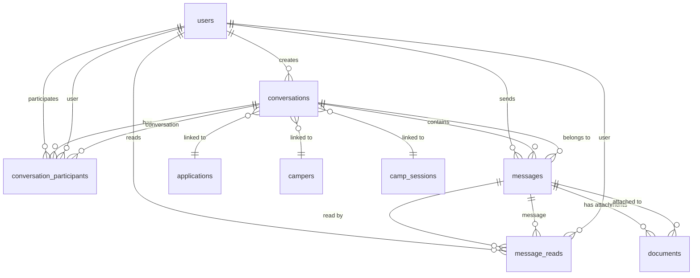
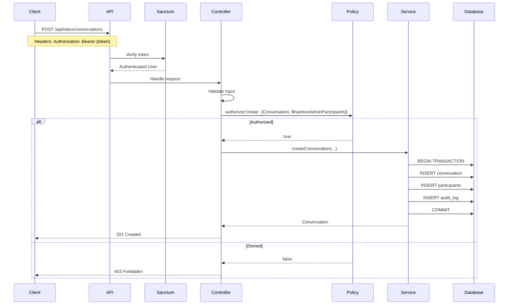

# Camp Burnt Gin Inbox System - Architecture Documentation

**Document Version:** 1.0
**Last Updated:** February 13, 2026
**Classification:** Internal - Technical Reference

---

## Table of Contents

1. [System Overview](#system-overview)
2. [Architectural Principles](#architectural-principles)
3. [Component Design](#component-design)
4. [Data Model](#data-model)
5. [Security Architecture](#security-architecture)
6. [API Design](#api-design)
7. [Performance Characteristics](#performance-characteristics)
8. [Operational Considerations](#operational-considerations)

---

## System Overview

### Purpose

The Inbox Messaging System provides HIPAA-compliant internal messaging capabilities for the Camp Burnt Gin application system. It enables secure communication between parents, camp administrators, and authorized medical providers regarding camper applications, medical documentation, and camp session logistics.

### Design Goals

1. **HIPAA Compliance:** All PHI communication secured with comprehensive audit trails
2. **RBAC Enforcement:** Strict role-based access control preventing unauthorized communication
3. **Message Immutability:** Audit trail integrity through write-once message records
4. **Scalability:** Support for 10,000+ users with optimized query patterns
5. **Reliability:** Transaction-based operations with referential integrity guarantees

### Technology Stack

- **Framework:** Laravel 12 (PHP 8.2+)
- **Authentication:** Laravel Sanctum (token-based API authentication)
- **Database:** MySQL 8.0+ (production), SQLite 3 (development/testing)
- **Authorization:** Laravel Policy-based RBAC
- **File Handling:** Integrated DocumentService with virus scanning
- **Testing:** PHPUnit 12 with Feature and Unit test coverage

---

## Architectural Principles

### 1. Layered Architecture

The system follows strict separation of concerns across layers:

```
HTTP Layer (Controllers)
    ↓ Delegates to
Service Layer (Business Logic)
    ↓ Uses
Model Layer (Data Access)
    ↓ Persists to
Database Layer (Storage)
```

**Enforcement:**
- Controllers contain ONLY: validation, authorization calls, response formatting
- Services contain ALL business logic, transaction management, audit logging
- Models contain relationships, scopes, and simple business methods
- No business logic in controllers or models

### 2. Policy-Based Authorization

All access control decisions use Laravel Policies:

```
Request → Controller → Policy Check → Service Layer
                ↓
            403 Forbidden (if denied)
```

**Benefits:**
- Centralized authorization logic
- Consistent enforcement across all endpoints
- Testable access control rules

### 3. Service Layer Pattern

Business operations encapsulated in dedicated service classes:

- **InboxService:** Conversation management, participant operations, conversation listing
- **MessageService:** Message sending, read receipts, attachment handling
- **DocumentService:** File uploads, virus scanning, storage management

**Benefits:**
- Reusable business logic
- Transaction boundary control
- Audit logging centralization

### 4. Defense in Depth

Security controls at multiple layers:

| Layer | Control Type | Example |
|-------|--------------|---------|
| Database | Constraints | Foreign keys, unique constraints, indexes |
| Model | Mass Assignment Protection | Explicit $fillable arrays |
| Service | Business Validation | Participant count limits, role checks |
| Policy | Authorization | Role-based access control |
| Controller | Input Validation | Laravel validation rules |
| HTTP | Authentication | Sanctum token verification |

---

## Component Design

### HTTP Layer

#### ConversationController

**Responsibilities:**
- Request validation using Laravel validation rules
- Policy authorization via `Gate::authorize()`
- Delegation to InboxService for business logic
- Response formatting (JSON API responses)

**Key Endpoints:**
```
GET    /api/inbox/conversations              List user's conversations
POST   /api/inbox/conversations              Create new conversation
GET    /api/inbox/conversations/{id}         View conversation details
POST   /api/inbox/conversations/{id}/archive Archive conversation
POST   /api/inbox/conversations/{id}/participants  Add participant (admin only)
DELETE /api/inbox/conversations/{id}/participants/{user} Remove participant
POST   /api/inbox/conversations/{id}/leave   Leave conversation
DELETE /api/inbox/conversations/{id}         Soft delete (admin only)
```

**Validation Rules:**
```php
// Conversation creation
'subject' => 'required|string|max:255',
'participant_ids' => 'required|array|min:1|max:10',
'participant_ids.*' => 'required|integer|exists:users,id|distinct',
'application_id' => 'nullable|integer|exists:applications,id',
'camper_id' => 'nullable|integer|exists:campers,id',
'camp_session_id' => 'nullable|integer|exists:camp_sessions,id',
```

#### MessageController

**Responsibilities:**
- Request validation for message operations
- Policy authorization for message access
- Delegation to MessageService
- Response formatting

**Key Endpoints:**
```
GET    /api/inbox/conversations/{id}/messages     List messages in conversation
POST   /api/inbox/conversations/{id}/messages     Send new message
GET    /api/inbox/messages/{id}                   View specific message
GET    /api/inbox/messages/unread-count           Get unread count
GET    /api/inbox/messages/{id}/attachments/{doc} Download attachment
DELETE /api/inbox/messages/{id}                   Soft delete (admin only)
```

**Validation Rules:**
```php
// Message creation
'body' => 'required|string|max:65535',
'attachments' => 'nullable|array|max:5',
'attachments.*' => 'file|max:10240|mimes:pdf,jpeg,png,gif,doc,docx',
'idempotency_key' => 'nullable|string|max:64',
```

---

### Policy Layer

#### ConversationPolicy

**Authorization Rules:**

| Method | Rule | Permitted Roles |
|--------|------|----------------|
| `viewAny()` | View all conversations | Admin only |
| `view()` | View specific conversation | Participants + Admin |
| `create()` | Create conversation | Admin (anyone), Parent (admins only), Medical Provider (never) |
| `archive()` | Archive conversation | Creator + Admin |
| `delete()` | Soft delete conversation | Admin only |
| `addParticipant()` | Add participant | Admin only |
| `removeParticipant()` | Remove participant | Admin only (cannot remove creator) |
| `leave()` | Leave conversation | Participants (except creator) |

**Key Implementation:**
```php
public function create(User $user, bool $hasNonAdminParticipants = false): bool
{
    if ($user->isMedicalProvider()) {
        return false; // Medical providers cannot initiate
    }
    if ($user->isAdmin()) {
        return true; // Admins can message anyone
    }
    if ($user->isParent()) {
        return !$hasNonAdminParticipants; // Parents can only message admins
    }
    return false;
}
```

#### MessagePolicy

**Authorization Rules:**

| Method | Rule | Permitted Roles |
|--------|------|----------------|
| `viewAny()` | List messages | Conversation participants + Admin |
| `view()` | View specific message | Conversation participants + Admin |
| `create()` | Send message | Active conversation participants |
| `update()` | Edit message | NEVER (immutability enforcement) |
| `delete()` | Soft delete message | Admin only |
| `viewAttachments()` | Download attachments | Conversation participants + Admin |

**Immutability Enforcement:**
```php
public function update(User $user, Message $message): bool
{
    return false; // Messages are immutable for audit integrity
}
```

---

### Service Layer

#### InboxService

**Responsibilities:**
- Conversation lifecycle management
- Participant addition/removal
- Conversation archiving
- User conversation listing with pagination
- Unread count calculation

**Key Methods:**

```php
public function createConversation(
    User $creator,
    string $subject,
    array $participantIds,
    ?int $applicationId = null,
    ?int $camperId = null,
    ?int $campSessionId = null
): Conversation

public function addParticipant(Conversation $conversation, User $user): ConversationParticipant

public function removeParticipant(Conversation $conversation, User $user): void

public function archiveConversation(Conversation $conversation): Conversation

public function getUserConversations(
    User $user,
    bool $includeArchived = false,
    int $perPage = 25
): LengthAwarePaginator

public function getUnreadConversationCount(User $user): int
```

**Transaction Boundaries:**
- `createConversation()` wraps conversation creation + participant addition in DB transaction
- Ensures atomicity of multi-step operations
- Rollback on any step failure

**Validation Logic:**
```php
// Guard clauses in createConversation()
if (empty($participantIds)) {
    throw new \InvalidArgumentException('Participant list cannot be empty');
}

$participantIds = array_diff($participantIds, [$creator->id]);

if (empty($participantIds)) {
    throw new \InvalidArgumentException('Cannot create conversation with only yourself');
}

if (count($participantIds) > 10) {
    throw new \InvalidArgumentException('Maximum 10 participants allowed per conversation');
}
```

#### MessageService

**Responsibilities:**
- Message sending with idempotency protection
- Attachment handling via DocumentService integration
- Read receipt management
- Message listing and retrieval
- Unread count calculation

**Key Methods:**

```php
public function sendMessage(
    Conversation $conversation,
    User $sender,
    string $body,
    array $attachments = [],
    ?string $idempotencyKey = null
): Message

public function markAsRead(Message $message, User $user): void

public function getConversationMessages(
    Conversation $conversation,
    User $user,
    int $perPage = 25
): LengthAwarePaginator

public function getUnreadMessageCount(User $user): int

public function deleteMessage(Message $message): void
```

**Idempotency Implementation:**
```php
// Check for existing message with same idempotency key
$existingMessage = Message::where('idempotency_key', $idempotencyKey)->first();

if ($existingMessage) {
    // Return existing message (idempotent behavior)
    return $existingMessage->load(['sender', 'attachments']);
}

// Create new message...
```

**Attachment Validation:**
```php
protected function validateAttachment(UploadedFile $file): void
{
    // File size limit: 10MB
    if ($file->getSize() > 10485760) {
        throw new \Exception('File size exceeds 10MB limit');
    }

    // MIME type whitelist
    $allowedMimeTypes = [
        'application/pdf',
        'image/jpeg',
        'image/png',
        'image/gif',
        'application/msword',
        'application/vnd.openxmlformats-officedocument.wordprocessingml.document',
    ];

    if (!in_array($file->getMimeType(), $allowedMimeTypes)) {
        throw new \Exception('File type not allowed');
    }
}
```

---

### Model Layer

#### Conversation

**Relationships:**
```php
// One-to-Many
public function messages(): HasMany
public function conversationParticipants(): HasMany

// One-to-One (latest)
public function lastMessage(): HasOne

// Many-to-Many (through pivot)
public function participants(): BelongsToMany
public function activeParticipantRecords(): HasMany

// Belongs To
public function creator(): BelongsTo
public function application(): BelongsTo
public function camper(): BelongsTo
public function campSession(): BelongsTo
```

**Query Scopes:**
```php
// Filter conversations for a specific user
public function scopeForUser($query, User $user)

// Filter active (non-archived) conversations
public function scopeActive($query)

// Filter archived conversations
public function scopeArchived($query)

// Order by most recent activity
public function scopeRecentActivity($query)
```

**Business Methods:**
```php
public function hasParticipant(User $user): bool
public function getUnreadCountForUser(User $user): int
public function isLinkedToCamper(): bool
public function isLinkedToApplication(): bool
```

#### Message

**Relationships:**
```php
public function conversation(): BelongsTo
public function sender(): BelongsTo
public function attachments(): HasMany
public function reads(): HasMany
```

**Query Scopes:**
```php
public function scopeInConversation($query, int $conversationId)
public function scopeSentBy($query, User $user)
public function scopeUnreadBy($query, User $user)
public function scopeNewest($query)
public function scopeOldest($query)
```

**Business Methods:**
```php
public function isReadBy(User $user): bool
public function hasAttachments(): bool
public function attachmentCount(): int
public function markAsReadBy(User $user): void
```

#### ConversationParticipant

**Purpose:** Junction table for many-to-many relationship with lifecycle tracking.

**Relationships:**
```php
public function conversation(): BelongsTo
public function user(): BelongsTo
```

**Business Methods:**
```php
public function hasLeft(): bool
public function isActive(): bool
public function markAsLeft(): void
public function rejoin(): void
```

**Query Scopes:**
```php
public function scopeActive($query)        // WHERE left_at IS NULL
public function scopeLeft($query)          // WHERE left_at IS NOT NULL
public function scopeForConversation($query, int $conversationId)
public function scopeForUser($query, int $userId)
```

#### MessageRead

**Purpose:** Read receipt tracking for unread message calculations.

**Relationships:**
```php
public function message(): BelongsTo
public function user(): BelongsTo
```

**Query Scopes:**
```php
public function scopeForMessage($query, int $messageId)
public function scopeByUser($query, int $userId)
```

---

## Data Model

### Entity-Relationship Diagram



### Database Schema

#### conversations

| Column | Type | Constraints | Index | Description |
|--------|------|-------------|-------|-------------|
| id | bigint | PRIMARY KEY | Yes | Auto-increment |
| created_by_id | bigint | FOREIGN KEY → users(id) CASCADE DELETE | Yes (composite) | Creator user ID |
| subject | varchar(255) | NOT NULL | - | Conversation subject |
| application_id | bigint | FOREIGN KEY → applications(id) NULL ON DELETE | Yes (composite) | Linked application |
| camper_id | bigint | FOREIGN KEY → campers(id) NULL ON DELETE | Yes (composite) | Linked camper |
| camp_session_id | bigint | FOREIGN KEY → camp_sessions(id) NULL ON DELETE | Yes (composite) | Linked camp session |
| last_message_at | timestamp | NULLABLE | Yes (composite) | Last message timestamp |
| is_archived | boolean | DEFAULT false | Yes (composite) | Archive status |
| created_at | timestamp | NOT NULL | - | Record creation |
| updated_at | timestamp | NOT NULL | - | Last update |
| deleted_at | timestamp | NULLABLE | Yes (composite) | Soft delete timestamp |

**Indexes:**
```sql
PRIMARY KEY (id)
INDEX idx_created_by_deleted (created_by_id, deleted_at)
INDEX idx_application_deleted (application_id, deleted_at)
INDEX idx_camper_deleted (camper_id, deleted_at)
INDEX idx_camp_session_deleted (camp_session_id, deleted_at)
INDEX idx_archive_deleted_last_message (is_archived, deleted_at, last_message_at)
INDEX idx_last_message (last_message_at)
INDEX idx_is_archived (is_archived)
```

#### messages

| Column | Type | Constraints | Index | Description |
|--------|------|-------------|-------|-------------|
| id | bigint | PRIMARY KEY | Yes | Auto-increment |
| conversation_id | bigint | FOREIGN KEY → conversations(id) CASCADE DELETE | Yes (composite) | Parent conversation |
| sender_id | bigint | FOREIGN KEY → users(id) CASCADE DELETE | Yes (composite) | Message sender |
| body | text | NOT NULL | - | Message content |
| idempotency_key | varchar(64) | UNIQUE NOT NULL | Yes | Deduplication key |
| created_at | timestamp | NOT NULL | - | Message sent time |
| updated_at | timestamp | NOT NULL | - | Last update |
| deleted_at | timestamp | NULLABLE | Yes (composite) | Soft delete timestamp |

**Indexes:**
```sql
PRIMARY KEY (id)
UNIQUE INDEX idx_idempotency_key (idempotency_key)
INDEX idx_conversation_created_deleted (conversation_id, created_at, deleted_at)
INDEX idx_conversation_deleted (conversation_id, deleted_at)
INDEX idx_sender_created_deleted (sender_id, created_at, deleted_at)
```

#### conversation_participants

| Column | Type | Constraints | Index | Description |
|--------|------|-------------|-------|-------------|
| id | bigint | PRIMARY KEY | Yes | Auto-increment |
| conversation_id | bigint | FOREIGN KEY → conversations(id) CASCADE DELETE | Yes (composite unique) | Conversation |
| user_id | bigint | FOREIGN KEY → users(id) CASCADE DELETE | Yes (composite unique) | Participant user |
| joined_at | timestamp | NOT NULL | - | Join timestamp |
| left_at | timestamp | NULLABLE | Yes | Leave timestamp |
| created_at | timestamp | NOT NULL | - | Record creation |
| updated_at | timestamp | NOT NULL | - | Last update |

**Indexes:**
```sql
PRIMARY KEY (id)
UNIQUE INDEX idx_conversation_user (conversation_id, user_id)
INDEX idx_user_left (user_id, left_at)
INDEX idx_conversation (conversation_id)
```

#### message_reads

| Column | Type | Constraints | Index | Description |
|--------|------|-------------|-------|-------------|
| id | bigint | PRIMARY KEY | Yes | Auto-increment |
| message_id | bigint | FOREIGN KEY → messages(id) CASCADE DELETE | Yes (composite unique) | Message |
| user_id | bigint | FOREIGN KEY → users(id) CASCADE DELETE | Yes (composite unique) | Reader |
| read_at | timestamp | NOT NULL | Yes | Read timestamp |
| created_at | timestamp | NOT NULL | - | Record creation |
| updated_at | timestamp | NOT NULL | - | Last update |

**Indexes:**
```sql
PRIMARY KEY (id)
UNIQUE INDEX idx_message_user (message_id, user_id)
INDEX idx_user_read_at (user_id, read_at)
INDEX idx_message (message_id)
```

---

## Security Architecture

### Authentication Flow



### Authorization Matrix

| Operation | Parent | Admin | Medical Provider |
|-----------|--------|-------|------------------|
| Create conversation with admin | Yes | Yes | No |
| Create conversation with parent | No | Yes | No |
| Create conversation with medical provider | No | Yes | No |
| View own conversations | Yes | Yes | Yes |
| View all conversations | No | Yes | No |
| Send message in conversation | Yes (if participant) | Yes | Yes (if participant) |
| Archive conversation (creator) | Yes | Yes | Yes |
| Delete conversation | No | Yes | No |
| Add participant | No | Yes | No |
| Remove participant | No | Yes | No |
| Leave conversation | Yes (except creator) | Yes (except creator) | Yes (except creator) |

### Audit Logging

**All operations log to `audit_logs` table:**

```php
AuditLog::create([
    'request_id' => request()->header('X-Request-ID', \Illuminate\Support\Str::uuid()),
    'user_id' => $user->id,
    'event_type' => 'conversation', // or 'message', 'message_attachment'
    'auditable_type' => Conversation::class,
    'auditable_id' => $conversation->id,
    'action' => 'created', // or 'sent', 'read', 'archived', etc.
    'description' => "Human-readable description",
    'old_values' => [...], // For updates/deletes
    'new_values' => [...], // For creates/updates
    'metadata' => [...],   // Additional context
    'ip_address' => request()->ip(),
    'user_agent' => request()->userAgent(),
    'created_at' => now(),
]);
```

**Logged Events:**
- Conversation created
- Conversation archived/unarchived
- Conversation soft deleted
- Participant added
- Participant removed
- Participant rejoined
- Message sent
- Message read
- Message soft deleted
- Attachment uploaded
- Attachment accessed

---

## API Design

### RESTful Conventions

**Resource:** `/api/inbox/conversations`

| Method | Endpoint | Description | Auth | Rate Limit |
|--------|----------|-------------|------|------------|
| GET | /api/inbox/conversations | List user's conversations | Required | 60/min |
| POST | /api/inbox/conversations | Create conversation | Required | 10/min |
| GET | /api/inbox/conversations/{id} | View conversation | Required | 60/min |
| POST | /api/inbox/conversations/{id}/archive | Archive conversation | Required | 60/min |
| POST | /api/inbox/conversations/{id}/unarchive | Unarchive conversation | Required | 60/min |
| POST | /api/inbox/conversations/{id}/participants | Add participant | Required | 30/min |
| DELETE | /api/inbox/conversations/{id}/participants/{user} | Remove participant | Required | 30/min |
| POST | /api/inbox/conversations/{id}/leave | Leave conversation | Required | 30/min |
| DELETE | /api/inbox/conversations/{id} | Soft delete (admin) | Required | 30/min |

**Resource:** `/api/inbox/messages`

| Method | Endpoint | Description | Auth | Rate Limit |
|--------|----------|-------------|------|------------|
| GET | /api/inbox/conversations/{id}/messages | List messages | Required | 60/min |
| POST | /api/inbox/conversations/{id}/messages | Send message | Required | 20/min |
| GET | /api/inbox/messages/{id} | View message | Required | 60/min |
| GET | /api/inbox/messages/unread-count | Unread count | Required | 60/min |
| GET | /api/inbox/messages/{id}/attachments/{doc} | Download attachment | Required | 60/min |
| DELETE | /api/inbox/messages/{id} | Soft delete (admin) | Required | 30/min |

### Response Format

**Success Response:**
```json
{
  "success": true,
  "data": {
    "id": 1,
    "subject": "Camper Medical Questions",
    "created_by_id": 42,
    "is_archived": false,
    "last_message_at": "2026-02-13T10:30:00Z",
    "participants": [...],
    "creator": {...}
  },
  "meta": {
    "current_page": 1,
    "last_page": 3,
    "per_page": 25,
    "total": 67,
    "unread_count": 5
  }
}
```

**Error Response:**
```json
{
  "success": false,
  "error": "You do not have permission to perform this action",
  "code": "AUTHORIZATION_FAILED"
}
```

**Validation Error:**
```json
{
  "success": false,
  "errors": {
    "participant_ids": [
      "The participant ids field is required."
    ],
    "subject": [
      "The subject field must not be greater than 255 characters."
    ]
  }
}
```

---

## Performance Characteristics

### Query Optimization

**Conversation Listing:**
```php
// Optimized query with eager loading
Conversation::query()
    ->forUser($user)
    ->with(['creator', 'lastMessage.sender', 'activeParticipantRecords.user'])
    ->recentActivity()
    ->active()
    ->paginate(25);
```

**Query Count:** 4 queries (1 base + 3 eager loads)
**Index Usage:** Covering index on [is_archived, deleted_at, last_message_at]

**Unread Conversation Count:**
```php
// Single optimized query
Conversation::forUser($user)
    ->active()
    ->whereHas('messages', function ($query) use ($user) {
        $query->where('sender_id', '!=', $user->id)
            ->whereDoesntHave('reads', function ($q) use ($user) {
                $q->where('user_id', $user->id);
            });
    })
    ->count();
```

**Query Count:** 1 query
**Complexity:** O(1)

### Scalability Projections

**User Growth:**
- 1,000 users: No optimization needed
- 10,000 users: Current architecture supports
- 100,000 users: Consider conversation table partitioning

**Message Volume:**
- 10,000 messages/month: No optimization needed
- 100,000 messages/month: Current architecture supports
- 1,000,000 messages/month: Consider read-replica for reporting queries

**Database Size Estimates (1 year, 10,000 users):**
- Conversations: ~5,000 records (~500KB)
- Messages: ~120,000 records (~50MB)
- Message Reads: ~240,000 records (~10MB)
- Attachments: ~24,000 files (~50GB storage)

---

## Operational Considerations

### Deployment Requirements

**PHP Extensions:**
- pdo_mysql
- fileinfo
- gd (for image processing)
- zip (for document handling)

**Database:**
- MySQL 8.0.16+ (for check constraint support)
- InnoDB storage engine
- utf8mb4 character set

**File Storage:**
- Writable storage directory
- Virus scanning service configured
- 100GB+ storage for attachments

### Monitoring Recommendations

**Key Metrics:**
- Conversation creation rate
- Message send rate
- Unread message count (per user)
- Attachment upload failures
- Policy authorization denials
- Audit log growth rate

**Alerts:**
- Message send failure rate > 1%
- Attachment upload failure rate > 5%
- Authorization denial spike (potential attack)
- Database slow query log entries

### Backup Strategy

**Critical Data:**
- conversations table
- messages table
- message_reads table
- audit_logs table
- documents table + file storage

**Retention:**
- Daily backups: 30 days
- Weekly backups: 1 year
- Monthly backups: 7 years (HIPAA requirement)

**Recovery Time Objective (RTO):** 4 hours
**Recovery Point Objective (RPO):** 24 hours

---

## Appendix

### Migration Execution Order

```bash
# Inbox system migrations (executed in order)
2026_02_13_000001_create_conversations_table.php
2026_02_13_000002_create_conversation_participants_table.php
2026_02_13_000003_create_messages_table.php
2026_02_13_000004_create_message_reads_table.php
2026_02_13_000005_add_message_id_to_documents_table.php
```

### Service Dependencies

```
InboxService
  ├─ No dependencies

MessageService
  ├─ DocumentService (file uploads)
  └─ InboxService (participant listing, timestamp updates)

DocumentService
  ├─ Virus scanning service (external)
  └─ Storage service (Laravel filesystem)
```

### Testing Strategy

**Feature Tests:**
- HTTP request/response validation
- Authorization enforcement
- Business logic integration
- Database transaction rollback scenarios

**Unit Tests:**
- Model relationships
- Query scopes
- Business method logic

**Integration Tests:**
- DocumentService integration
- Notification delivery
- Audit log generation

**Coverage Target:** 80%+ for service and policy layers

---

**Document Maintenance:**
- Review quarterly
- Update on major feature additions
- Sync with codebase changes
- Version control in repository

**Document Owner:** Engineering Lead
**Last Review:** February 13, 2026
**Next Review:** May 13, 2026
