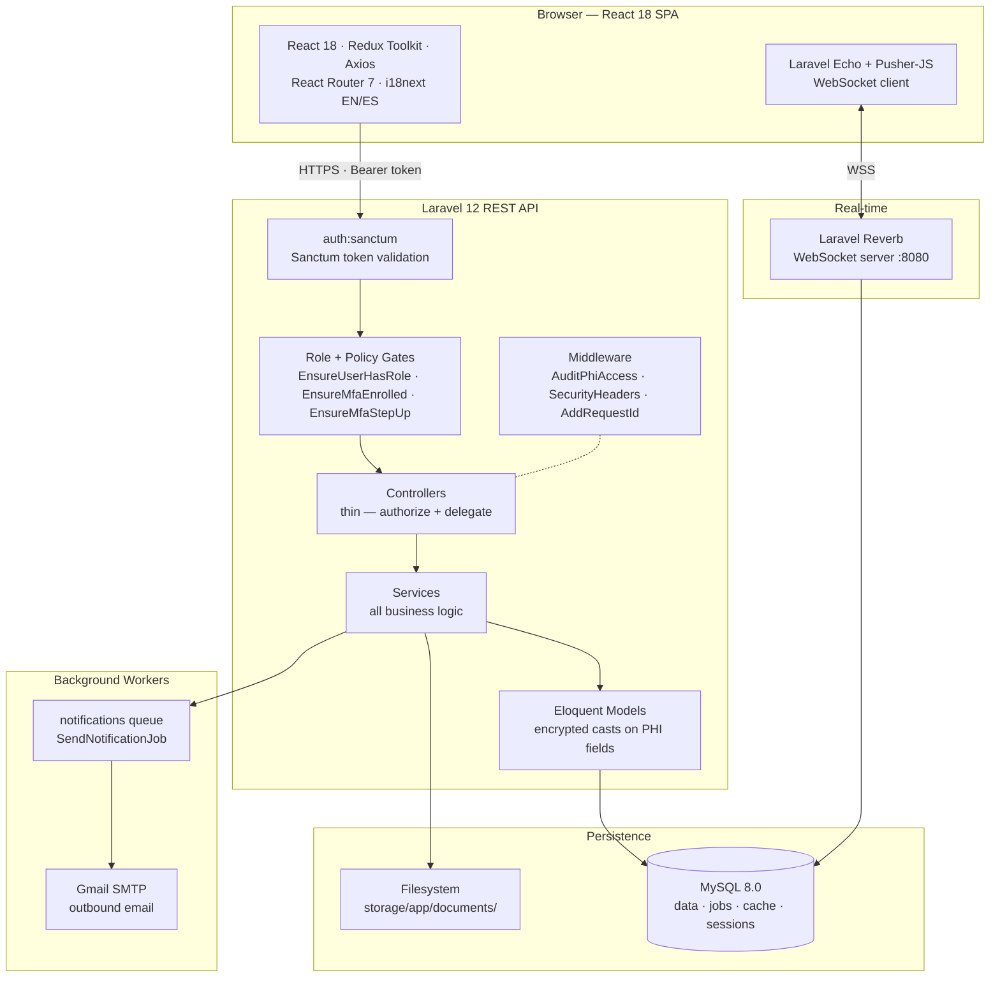
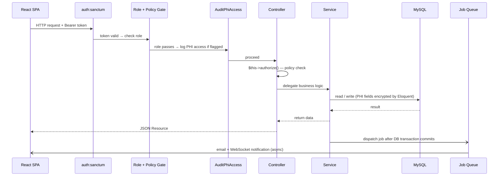
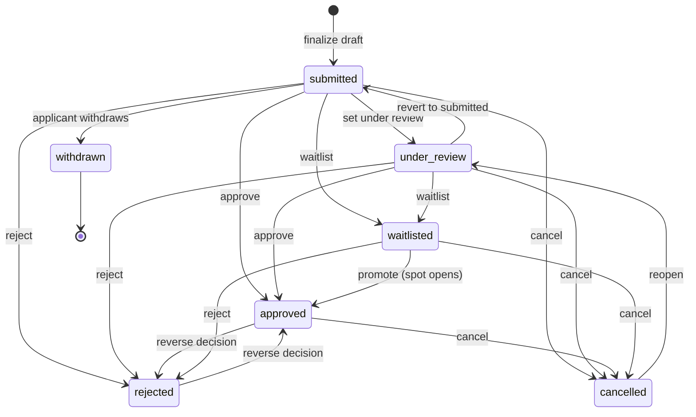

# Camp Burnt Gin

Camp Burnt Gin is a full-stack, HIPAA-conscious camp management platform built for the Children and Youth with Special Health Care Needs (CYSHCN) program in South Carolina. It replaces a paper-and-email enrollment process with a structured, auditable, role-based web application that covers the complete lifecycle of camp enrollment: application submission, medical record management, document compliance, application review and decision, internal communications, and post-approval operations.

Four distinct portals serve applicants (parents and guardians), camp administrators, medical staff, and system owners. The backend is a Laravel 12 REST API. The frontend is a React 18 TypeScript single-page application.

---

## Table of Contents

1. [Project Overview](#1-project-overview)
2. [Key Features](#2-key-features)
3. [User Roles and Permissions](#3-user-roles-and-permissions)
4. [System Architecture](#4-system-architecture)
5. [Application Workflow](#5-application-workflow)
6. [Email and Notification System](#6-email-and-notification-system)
7. [API Overview](#7-api-overview)
8. [Database Overview](#8-database-overview)
9. [Security and Compliance](#9-security-and-compliance)
10. [Technology Stack](#10-technology-stack)
11. [Setup and Installation](#11-setup-and-installation)
12. [Running the System](#12-running-the-system)
13. [Testing and Validation](#13-testing-and-validation)
14. [Known Limitations](#14-known-limitations)
15. [Development Guidance](#15-development-guidance)
16. [Reference Documentation](#16-reference-documentation)

---

## 1. Project Overview

Before this platform, Camp Burnt Gin enrollment relied on paper forms mailed between families and staff, medical records in file cabinets, and administrative review conducted over email. This system centralizes and secures every step of that process.

The platform is built around three core concerns:

- **Enrollment integrity.** Applications flow through a server-enforced state machine. Approval requires capacity checks, document compliance verification, and an authorized reviewer. Every transition is logged.
- **Medical data protection.** Personally identifiable health information (PHI) is encrypted at rest using Laravel's `encrypted` cast, accessed only by authorized roles, and written to a tamper-evident audit trail on every read.
- **Operational clarity.** Administrators manage sessions with capacity enforcement and waitlist promotion, issue and track document requests, generate reports, communicate through a threaded inbox, and publish announcements to all users.

The backend has 99 database migrations, 52 controllers, 44 models, and more than 560 passing integration and unit tests.

---

## 2. Key Features

### Application Management

Applicants complete a multi-section digital form covering biographical data, emergency contacts, session preference, behavioral profile, medical narrative, dietary needs, and seven consent acknowledgements. The form auto-saves server-side as a draft and supports save-and-resume across sessions.

Applications are linked to a specific camp session and may be re-applied in subsequent years using pre-populated biographical fields. A Spanish-language path provides full i18n coverage for Spanish-speaking families.

### Medical Records

Medical staff maintain a comprehensive health profile for each enrolled camper: allergies with severity tiers, medications with dosage and frequency, diagnoses with ICD codes, behavioral risk assessments, feeding plans, assistive device records, activity permissions, and personal care plans covering toileting, dressing, feeding, mobility, and hygiene.

During camp operations, staff log treatment interventions, clinic visits with disposition, medical incidents with severity classification, and follow-up tasks with priority and due date. An emergency snapshot view presents critical information — allergies, behavioral risks, medications, emergency contacts — on a single screen for rapid reference.

External medical providers (physicians, specialists) can be granted time-limited, token-based access to a specific camper's health record without a full system account.

### Document Management

Documents are stored in a polymorphic system: any model (application, message) can own file attachments. Uploads are validated by MIME type and magic bytes before storage outside the public web root.

Administrators issue formal document requests with a deadline. Applicants upload their responses directly. Admins approve or reject each submission. The `DocumentEnforcementService` checks required-document rules against actual submission and verification status before an application can be approved.

Documents have a two-stage lifecycle: draft (applicant-only visibility) and submitted (visible to admin staff for review).

### Inbox and Messaging

The messaging system uses a threaded conversation model. Each message supports TO, CC, and BCC recipients tracked per-message in the `message_recipients` table. Reply sends only to the original sender. Reply-all sends to TO and CC recipients while keeping BCC recipients invisible to non-senders. Server-side idempotency keys prevent duplicate messages on network retry.

Per-user conversation state — starred, important, archived, trashed, read — is tracked separately from the conversation record itself.

### Session and Capacity Management

Administrators create camp sessions with configurable capacity limits, age constraints, active/inactive status, and enrollment tracking. `ApplicationService` enforces capacity at approval time using a `SELECT ... FOR UPDATE` lock. Sessions can be archived and restored. An archived session is preserved for historical access but hidden from active workflows.

### Reporting and Exports

Pre-defined reports include: application summary with status breakdown, accepted applicant lists, rejected applicant lists, mailing labels formatted for standard label stock, and ID labels with allergy warnings and supervision level. All PHI export reports require MFA enrollment. The audit log is exportable up to 5,000 rows in CSV or JSON with filters for date range, user, action type, and PHI flag.

### Announcements and Calendar

Administrators publish announcements visible to all roles. Announcements support pinning and archiving. A camp calendar displays events and application deadlines. Deadlines support an enforcement flag and auto-sync to calendar events. Bulk deadline creation per session is supported.

### Risk Engine

Medical risk scoring is database-driven: `risk_factors`, `risk_rules`, and `risk_thresholds` define the scoring model. `SpecialNeedsRiskAssessmentService` computes a camper's risk score against the active rule set and maps it to a supervision level. Medical staff can add clinical recommendations and apply manual supervision-level overrides. Risk configuration is cached per-request (`risk_engine:factors`, `rules`, `thresholds` keys).

### Audit Logging

Every PHI read and every administrative action writes a record to `audit_logs` with the acting user's ID, IP address, user agent, the model class and record ID affected, a before/after change snapshot, and a PHI access flag. The log is browsable and exportable only by super administrators, with MFA step-up required for CSV export.

---

## 3. User Roles and Permissions

Four roles are defined in the `roles` table. Access is enforced at three independent layers: route middleware, controller `$this->authorize()` calls, and policy class methods.

| Role | Portal Prefix | Core Capabilities |
|---|---|---|
| `applicant` | `/applicant/...` | Own campers and applications; own documents and document requests; inbox participation; announcements and calendar |
| `admin` | `/admin/...` | All application review and management; all sessions, campers, documents, reports, deadlines, announcements; inbox |
| `medical` | `/medical/...` | All medical records, treatment logs, incidents, follow-ups, visits; inbox; no access to applications or admin tools |
| `super_admin` | `/super-admin/...` | All admin capabilities plus user management, audit log, and form builder |

**`super_admin` inheritance.** A single `isAdmin()` override propagates all `admin` authorization checks to `super_admin` without duplication. Super admins pass every admin-level policy and middleware gate automatically.

**MFA requirements.** MFA enrollment is required for `admin`, `medical`, and `super_admin` roles (enforced by `EnsureMfaEnrolled` middleware). MFA step-up (re-verification) is additionally required for sensitive operations: PHI CSV exports, user management actions, and destructive admin operations. See [Section 14](#14-known-limitations) for a current enforcement note.

**Last super_admin protection.** The last active super_admin account cannot be deleted or demoted. This is enforced server-side in `UserController` and `UserPolicy`.

---

## 4. System Architecture

### Component Overview



### Backend Request Lifecycle



### Frontend Structure

Pages are organized into domain feature modules under `src/features/`. Each module owns its pages, components, API layer, Redux slice (if stateful), and TypeScript types. Shared UI primitives live in `src/ui/`. Authentication state (token + user) is the only global Redux state; all other data is fetched per page.

All pages use `React.lazy()` + `Suspense`. Route protection: `ProtectedRoute` (auth check) wraps `RoleGuard` (role check) wraps the layout shell. Unauthenticated requests clear Redux state and redirect to `/login`.

---

## 5. Application Workflow

### States

Applications move through seven states defined in `App\Enums\ApplicationStatus`. State transitions are validated server-side by `ApplicationStatus::canTransitionTo()`. Invalid transitions return HTTP 422.

| State | Value | Meaning |
|---|---|---|
| Submitted | `submitted` | Parent fully submitted; awaiting staff review |
| Under Review | `under_review` | Staff is actively reviewing |
| Approved | `approved` | Accepted; camper activation triggered |
| Rejected | `rejected` | Not accepted |
| Waitlisted | `waitlisted` | Session is full; queued for capacity |
| Cancelled | `cancelled` | Admin-initiated termination |
| Withdrawn | `withdrawn` | Parent-initiated; irreversible |

**Draft state.** Before submission, an application exists as `is_draft = true` with no `submitted_at`. Drafts are not in the state machine — they become `submitted` on finalization.

### State Transition Map



Withdrawn is a terminal state (no outbound transitions). A parent can withdraw any application that is not already in a final state.

### Creation and Submission (Applicant)

1. Applicant navigates to `/applicant/applications/start` and selects or creates a camper.
2. `POST /applications` creates a draft. Server-side draft state is stored in the `application_drafts` table; the frontend mirrors current form state to `localStorage` key `cbg_app_draft` as a fast-restore fallback.
3. Applicant completes all sections. Auto-save writes to the server draft on each step.
4. On final submit, the applicant signs (`POST /applications/:id/sign`) and calls `POST /applications/:id/finalize`. The application transitions to `submitted`, `submitted_at` is set, and `is_draft` becomes `false`.
5. An `ApplicationSubmittedNotification` email is queued to the parent.

### Review and Decision (Admin)

1. Admin opens `ApplicationReviewPage`. The page shows all submitted sections, a completeness checklist, document compliance summary, and current status.
2. Admin may edit sections inline or upload documents on behalf of the applicant.
3. Admin submits `POST /applications/:id/review` with `{ status, notes, override_incomplete? }`.
4. `ApplicationService::reviewApplication()` runs inside a `DB::transaction()`:
   - Validates the transition.
   - If approving: checks session capacity (lock), checks document compliance.
   - Updates `status`, `reviewed_at`, `reviewed_by`, `notes`.
   - On approval: sets `camper.is_active = true` and activates the medical record.
   - On approval reversal: deactivates camper and medical record unless another approved application exists.
   - Writes `AuditLog` entry.
5. After commit: dispatches the appropriate email notification (see Section 6).

---

## 6. Email and Notification System

### Architecture

Two parallel dispatch tracks handle outbound email:

**Track 1 — `SendNotificationJob`** (standard path for most notifications)
```
Service class calls QueuesNotifications::queueNotification($user, $notification)
  → dispatches SendNotificationJob to the 'notifications' queue
    → job calls $user->notify($notification) when processed
```

**Track 2 — `ShouldQueue` direct** (formal decision letters only)
```
LetterService calls $user->notify(new AcceptanceLetterNotification($application))
  → Laravel dispatches SendQueuedNotifications to the 'notifications' queue
    (routed via $this->onQueue('notifications') in the notification constructor)
```

Both tracks use the same `notifications` queue. The queue worker must name it explicitly:
```bash
php artisan queue:work --queue=notifications,default
```

**`SendNotificationJob` retry configuration:**

| Property | Value |
|---|---|
| Queue | `notifications` |
| Max attempts | 3 |
| Backoff schedule | 60s → 300s → 900s |
| Max exceptions | 3 |
| After commit | Yes — job enters queue only after the surrounding DB transaction commits |

### Notification Inventory

| Notification Class | Trigger | Channels | Preference Key |
|---|---|---|---|
| `ApplicationSubmittedNotification` | Application finalized | mail + database | `application_updates` |
| `ApplicationStatusChangedNotification` | Status → under_review, cancelled, re-opened | mail + database | `application_updates` |
| `ApplicationStatusChangedNotification::forDatabase()` | Status → approved or rejected (bell only) | database only | — |
| `AcceptanceLetterNotification` | Application approved | mail only | always sent |
| `RejectionLetterNotification` | Application rejected | mail only | always sent |
| `WaitlistedNotification` | Application waitlisted | mail + database | `application_updates` |
| `ApplicationRevertedToDraftNotification` | Admin reverts to draft | mail + database | `application_updates` |
| `IncompleteApplicationReminderNotification` | Scheduled weekly reminder for stale drafts | mail + database | `deadlines` |
| `DocumentRequiresCompletionNotification` | Admin sends document to applicant | mail + database | `documents` |
| `NewMessageNotification` (forMail) | New inbox message | mail only | `messages` |
| `NewMessageNotification` (forDatabase) | New inbox message | database only | — (synchronous) |
| `NewConversationNotification` | Added to new conversation | mail + database | `messages` |
| `CriticalIncidentLoggedNotification` | Critical medical incident | mail + database | `medical_alerts_email` |
| `MedicalFollowUpDueNotification` | Medical follow-up due | database | `medical_alerts_email` |
| `EmailVerificationNotification` | Account registration | mail only | — |
| `PasswordResetNotification` | Password reset request | mail only | — |
| `PasswordChangedConfirmationNotification` | Password changed | mail only | — |

### Duplicate Email Prevention

When an application is approved or rejected, two email paths would fire by default: `ApplicationStatusChangedNotification` (mail + database) and the formal letter. To prevent two emails reaching the parent, `ApplicationService` calls `$parentUser->notifyNow(ApplicationStatusChangedNotification::forDatabase(...))` for these two statuses. The `forDatabase()` factory overrides `via()` to return `['database']` only. The formal letter handles the single email.

### Notification Preferences

Preferences are stored in the `notification_preferences` JSON column on `users`. All keys default to `true` (email enabled) when absent. Managed by users at **Settings → Notifications**.

| Key | What It Controls |
|---|---|
| `messages` | Inbox message and new conversation emails |
| `application_updates` | Application status, revert-to-draft, waitlist emails |
| `deadlines` | Incomplete application reminder emails |
| `documents` | Document request emails |
| `medical_alerts_email` | Medical alert emails |

`AcceptanceLetterNotification` and `RejectionLetterNotification` are not preference-gated. They always send.

### Email Templates and Branding

Templates are published to `resources/views/vendor/mail/html/` and committed to source control. Customizations:

| Element | Value |
|---|---|
| Primary button color | `#16a34a` (Camp Burnt Gin emerald) |
| Header | `CAMP BURNT GIN` — uppercase, emerald `#15803d`, 20px bold |
| Footer | `© {year} Camp Burnt Gin · 1628 Old Wire Rd, Gaston, SC 29053` + link to notification preferences |
| Body background | `#f3f4f6` |

All email bodies follow the HIPAA pattern: "you have a notification, log in to see details." No PHI fields appear in email content.

### Scheduled Emails

| Schedule | Command | Notification Sent |
|---|---|---|
| Mondays at 09:00 | `applications:send-reminders --days=7` | `IncompleteApplicationReminderNotification` to parents with drafts untouched for 7+ days |

---

## 7. API Overview

All routes are prefixed with `/api`. The full route file is `backend/camp-burnt-gin-api/routes/api.php`.

| Area | Auth Required | Key Endpoints |
|---|---|---|
| Health | None | `GET /health`, `GET /ready` |
| Public form downloads | None (throttled) | `GET /forms`, `GET /forms/{type}` |
| Auth | None (throttled) | `POST /auth/register`, `/login`, `/forgot-password`, `/reset-password`, `/email/verify` |
| Session management | Token only | `POST /auth/email/resend`, `/logout`, `GET /user`, MFA setup/verify/disable/step-up |
| User profile | Auth + verified | Profile read/update, password change, notification preferences, emergency contacts, avatar, account delete |
| Camp sessions | Auth + verified | CRUD; activate/deactivate/archive/restore; session dashboard; session applications list |
| Notifications (bell) | Auth + verified | List; mark read/all-read; clear-all |
| Applications | Auth + verified | CRUD; initialize-draft; sign; finalize; clone; withdraw; completeness check; `POST /review` (admin) |
| Application drafts | Auth + verified | CRUD `/application-drafts` |
| Documents | Auth + verified | Upload; download; submit; archive/restore; verify (admin); send to applicant (admin) |
| Document requests | Auth + role-scoped | Admin: CRUD + approve/reject/cancel/remind/extend/reopen. Applicant: list, upload, download |
| Campers | Auth + verified | CRUD; risk summary/assessment; compliance status; medical alerts; health profile; personal care plan |
| Medical records | Role-scoped | CRUD; all sub-records (allergies, medications, diagnoses, behavioral profiles, feeding plans, assistive devices, activity permissions, incidents, follow-ups, visits, restrictions, treatment logs) |
| Risk engine config | Admin + medical | CRUD for risk factors, rules, thresholds; threshold impact preview |
| Medical stats | Admin + medical | `GET /medical/stats` |
| Family management | Admin | `GET /families`; `GET /families/{user}` (family workspace) |
| Reports | Admin + MFA enrolled | Summary (no MFA gate); accepted/rejected/applications/mailing-labels/id-labels (MFA enrolled + rate-limited) |
| Inbox | Auth + verified | Conversations CRUD + archive/trash/star/important/read/unread/participants/leave; Messages index/store/reply/reply-all |
| Announcements | Auth + verified | CRUD (write: admin only); pin toggle |
| Deadlines | Auth + verified | CRUD; bulk-session; extend; complete |
| Calendar | Auth + verified | CRUD (write: admin only) |
| Form templates | Auth + verified | `GET /form-templates`; `/{type}/download` |
| Form schema | Auth + verified | `GET /form/active`; `/version/{form}` |
| Form builder | Super admin | CRUD for definitions, sections, fields, field options; publish/duplicate; reorder; activate/deactivate |
| User management | Super admin + step-up | CRUD; role assignment; activate/deactivate |
| Audit log | Super admin + MFA step-up + throttled | `GET /audit-log`; `GET /audit-log/export` |

---

## 8. Database Overview

99 migrations. All PHI tables use soft deletes. The queue, cache, and session all run on the same MySQL database (database driver for each).

### Core Tables

| Table | Purpose |
|---|---|
| `users` | All accounts; role_id, is_active, mfa_enabled, failed_login_attempts, lockout_until |
| `roles` | 4 rows: super_admin, admin, medical, applicant |
| `campers` | Child profiles; is_active, cabin_id; soft-deleted |
| `camps` | Camp organization entity |
| `camp_sessions` | Session instances: capacity, enrolled_count, start/end dates, portal_open flag |
| `cabins` | Cabin assignments (table and model exist; admin UI assignment workflow not yet built) |
| `applications` | Enrollment applications: status (enum), is_draft, submitted_at, signed_at, signature_data (hidden), submission_source, sections_reviewed, reapplied_from_id |
| `application_drafts` | Server-side JSON blob save slots for in-progress forms (capped at 10 per user, 512 KB per blob) |
| `application_consents` | 7 guardian consent records per application |

### Medical Tables (PHI — sensitive fields encrypted at rest)

| Table | Purpose |
|---|---|
| `medical_records` | Root record per camper: physician, insurance, special needs flags; is_active |
| `allergies` | Substance, reaction, severity (mild → anaphylaxis) |
| `medications` | Name, dosage, frequency, indication |
| `diagnoses` | Name, ICD code, severity |
| `behavioral_profiles` | Wandering risk, aggression risk, supervision level |
| `feeding_plans` | G-tube and special diet plans |
| `assistive_devices` | Device type, care instructions |
| `activity_permissions` | Per-camper activity clearance levels |
| `emergency_contacts` | Camper emergency contacts |
| `personal_care_plans` | ADL assistance levels: toileting, dressing, feeding, mobility, hygiene, bowel, bladder |
| `treatment_logs` | Clinical interventions and medication administration during camp |
| `medical_visits` | Clinic visit records with disposition |
| `medical_incidents` | Injuries and health events with severity classification |
| `medical_follow_ups` | Follow-up tasks from incidents with priority and due date |
| `medical_restrictions` | Activity restrictions with start/end dates and reason |
| `medical_provider_links` | Time-limited external provider access tokens |

### Document, Messaging, and System Tables

| Table | Purpose |
|---|---|
| `documents` | Polymorphic file records (application and message attachments); verification status, submitted_at, archived_at |
| `document_requests` | Admin-issued requests with deadline and status |
| `applicant_documents` | Tracks original template + submitted document per request |
| `required_document_rules` | Compliance rule definitions consumed by DocumentEnforcementService |
| `conversations` | Thread containers; category; per-user archive and pin state |
| `conversation_participants` | User membership with per-user folder, read, starred, important, trashed state |
| `messages` | Immutable message records; parent_message_id for threading; soft-deleted |
| `message_recipients` | TO / CC / BCC recipient rows per message |
| `message_reads` | Per-user per-message read receipts |
| `notifications` | Laravel database notifications (in-app bell) |
| `announcements` | System-wide announcements with pinned flag |
| `calendar_events` | Camp calendar entries |
| `deadlines` | Time-based enforcement deadlines linked to sessions |
| `form_definitions` | Versioned application form schemas (draft/published) |
| `form_sections` | Sections within a form definition |
| `form_fields` | Fields within a section: type, placeholder, is_active, validation |
| `form_field_options` | Options for select/radio/checkbox fields |
| `risk_assessments` | Computed risk score snapshots per camper |
| `risk_factors` | Configurable scoring factors |
| `risk_rules` | Conditional rules for the risk engine |
| `risk_thresholds` | Score thresholds mapped to supervision levels |
| `audit_logs` | Full audit trail: user, IP, user agent, model, record ID, before/after snapshot, PHI flag |
| `user_emergency_contacts` | Account-level emergency contacts (distinct from camper-level) |
| `jobs` | Laravel database queue |
| `cache` | Laravel database cache |
| `personal_access_tokens` | Sanctum API tokens |

---

## 9. Security and Compliance

### Authentication

Sanctum API tokens are used throughout. Tokens carry an absolute 8-hour expiry (`SANCTUM_EXPIRATION=480`). The frontend enforces a 60-minute inactivity logout via the `useIdleTimeout` hook. Account lockout (15 minutes) activates after 5 consecutive failed login attempts, enforced in `LoginService`.

Tokens are stored in `sessionStorage` under the key `auth_token`. On every page load, `useAuthInit` reads the token, calls `GET /user`, and restores Redux auth state. On logout, the token is deleted from `sessionStorage` and Redux state is cleared.

### Multi-Factor Authentication

TOTP-based MFA is implemented using `pragmarx/google2fa` with QR code setup via `react-qr-code`. The setup flow covers enrollment, verification/confirmation, and disable. MFA step-up (re-verification for a specific action) is enforced via `EnsureMfaStepUp` middleware on PHI CSV exports, user management routes, and destructive admin operations.

See [Section 14](#14-known-limitations) for the current state of `EnsureMfaEnrolled` enforcement.

### Authorization

Role-based access is enforced at three independent layers:

1. **Route middleware.** `EnsureUserHasRole` and `EnsureUserIsAdmin` gate entire route groups before any controller code runs.
2. **Controller policy calls.** Every mutation and sensitive read calls `$this->authorize()` against the resource's policy class before calling any service.
3. **Policy classes.** One policy class per Eloquent model defines the precise conditions under which each action is permitted for each role.

### PHI Protection

All sensitive medical fields are stored using Laravel's `encrypted` cast, which applies AES-256-CBC encryption at the model layer before writing to the database. The `APP_KEY` is the encryption root.

The `AuditPhiAccess` middleware intercepts every request that touches a flagged medical route and writes an `audit_logs` entry with the user's ID, IP, user agent, model class, record ID, and `is_phi_access = true`. Medical data is never included in list or index endpoint responses.

### Data Integrity

- PHI tables use soft deletes. No hard deletes occur at the application layer.
- Messages are immutable. Users cannot edit sent messages; soft deletion is available only to administrators for moderation.
- Application status transitions are enforced server-side. Invalid transitions return HTTP 422.
- Message idempotency keys prevent duplicate records on network retry.
- Application draft writes use an optimistic concurrency guard (409 Conflict) to prevent two-tab overwrite races.

### Security Headers

The `SecurityHeaders` middleware applies `Strict-Transport-Security`, `Content-Security-Policy`, `X-Frame-Options: DENY`, and `X-Content-Type-Options: nosniff` to all API responses.

### File Security

Uploads are validated by MIME type whitelist and magic bytes before storage. Files are stored at `storage/app/documents/` — outside the public web root — and served only through authenticated, policy-gated download endpoints.

---

## 10. Technology Stack

### Backend

| Component | Technology |
|---|---|
| Framework | Laravel 12 |
| Language | PHP 8.2+ |
| Database | MySQL 8.0 |
| Authentication | Laravel Sanctum 4.2 |
| MFA | PragmaRx Google2FA 9.0 (TOTP) |
| Real-time | Laravel Reverb 1.9 (WebSocket server) |
| Queue | Database driver — `notifications` and `default` queues |
| Email | Gmail SMTP (configurable to Mailgun in production) |
| Cache | Database driver |
| Session | Database driver (30-minute lifetime, encrypted) |
| Testing | PHPUnit 11.5 |
| Static Analysis | Larastan 3.0 (PHPStan) |
| Code Style | Laravel Pint |

### Frontend

| Component | Technology |
|---|---|
| Framework | React 18.3 |
| Language | TypeScript 5.9 (strict mode) |
| Build Tool | Vite 6.4 |
| Package Manager | pnpm |
| Styling | Tailwind CSS 3.4 |
| State Management | Redux Toolkit 2.11 + react-redux 9.2 |
| HTTP Client | Axios 1.15 |
| Routing | React Router 7.13 |
| Internationalization | i18next 25 + react-i18next 16 |
| Forms and Validation | React Hook Form 7.71 + Zod 3.25 |
| Animation | Framer Motion 12.35 |
| Rich Text Editor | Tiptap 3.20 |
| UI Primitives | Radix UI (accordion, dialog, dropdown-menu, select) |
| Drag and Drop | @hello-pangea/dnd 18 |
| Icons | Lucide React 0.487 |
| Charts | Recharts 3.8 |
| Toasts | Sonner 2 |
| QR Codes | react-qr-code 2 |
| Real-time Client | Laravel Echo 2.3 + Pusher-JS 8.4 |
| Testing | Vitest 3.2 + React Testing Library 16 + Playwright 1.58 |

### CI/CD

| Workflow | Trigger | Checks |
|---|---|---|
| `ci.yml` | Push / PR | Policy scan, PHPUnit (PHP 8.2/8.3/8.4 matrix), coverage gate (≥20%), Pint style, PHPStan/Larastan, TypeScript type-check, ESLint (zero warnings), Vitest, production build |
| `security.yml` | Push / PR + daily cron | Composer audit, pnpm audit, env file scan, secret pattern scan, dangerous function scan |
| `database.yml` | Push / PR (migrations changed) | `migrate:fresh`, rollback/re-migrate, full seeder run, duplicate timestamp check |
| `deploy.yml` | CI success on `main` / `develop` | Deploy frontend (Vercel) + backend (SSH/Docker) + health check |
| `rollback.yml` | Manual dispatch | Vercel rollback or SSH checkout + Docker rebuild |

---

## 11. Setup and Installation

### Prerequisites

- PHP 8.2 or later with extensions: `dom`, `curl`, `libxml`, `mbstring`, `zip`, `pcntl`, `pdo`, `pdo_mysql`, `bcmath`, `fileinfo`
- Composer
- MySQL 8.0
- Node.js 20 or later
- pnpm (`npm install -g pnpm`)

### Clone

```bash
git clone <repository-url>
cd Camp_Burnt_Gin_Project
```

### Backend Setup

```bash
cd backend/camp-burnt-gin-api

# Install PHP dependencies
composer install

# Copy and configure environment
cp .env.example .env
# Edit .env: set DB_USERNAME, DB_PASSWORD, MAIL_USERNAME, MAIL_PASSWORD, FRONTEND_URL

# Generate application encryption key
php artisan key:generate

# Create the database
mysql -u root -p -e "CREATE DATABASE camp_burnt_gin CHARACTER SET utf8mb4 COLLATE utf8mb4_unicode_ci;"

# Run all migrations
php artisan migrate

# Seed demo data (creates seeded accounts for all four portals)
php artisan db:seed

# Create the storage symlink (serves public files)
php artisan storage:link
```

Or use the setup script, which runs all of the above:

```bash
composer setup
```

> **Email in local development.** Set `MAIL_MAILER=log` in `.env` to write emails to `storage/logs/laravel.log` instead of sending via SMTP. This avoids needing Gmail credentials for development.

> **Document compliance.** Set `APP_COMPLIANCE_CHECKS=false` in `.env` to bypass document compliance enforcement during development, allowing applications to be approved without uploaded documents.

### Frontend Setup

```bash
cd frontend

# Install dependencies
pnpm install

# Copy environment
cp .env.example .env.local
# Default: VITE_API_BASE_URL=http://localhost:8000 — no edits needed for local dev
```

---

## 12. Running the System

Three processes are required for full functionality. Real-time inbox updates (message toasts, unread badge) additionally require the Reverb WebSocket server.

### Start Backend API

```bash
cd backend/camp-burnt-gin-api
php artisan serve
# API available at http://localhost:8000
```

### Start Queue Worker

Required for email delivery. Without this, jobs queue but no emails send.

```bash
cd backend/camp-burnt-gin-api
php artisan queue:work --queue=notifications,default
```

### Start Reverb WebSocket Server

Required for real-time inbox notifications and message toasts.

```bash
cd backend/camp-burnt-gin-api
php artisan reverb:start
# WebSocket server on 0.0.0.0:8080
```

> **Broadcasting setup.** The `.env.example` default sets `BROADCAST_CONNECTION=log`. Change this to `BROADCAST_CONNECTION=reverb` and configure the `REVERB_*` variables to enable WebSocket broadcasting.

### Start Frontend Development Server

```bash
cd frontend
pnpm dev
# Application at http://localhost:5173
```

### Combined Development (Composer Script)

```bash
cd backend/camp-burnt-gin-api
composer dev
# Starts concurrently: API server, queue listener, Pail log viewer, Vite dev server
```

### Production Build (Frontend)

```bash
cd frontend
pnpm build
# Output at frontend/dist/
```

### Useful Artisan Commands

```bash
# Reset database and re-seed
php artisan migrate:fresh --seed

# Clear all caches
php artisan optimize:clear

# Tail the Laravel log in real time
php artisan pail

# Process a single queued job and exit (useful for testing email)
php artisan queue:work --queue=notifications,default --once

# Run the incomplete application reminder manually
php artisan applications:send-reminders --days=7
```

---

## 13. Testing and Validation

### Backend Tests

```bash
cd backend/camp-burnt-gin-api

# Full test suite
php artisan test

# Specific test class
php artisan test --filter ApplicationWorkflowTest

# With coverage report
php artisan test --coverage
```

The backend test suite contains more than 560 passing tests across 65 test files:

| Area | Location | What Is Covered |
|---|---|---|
| API Authorization | `tests/Feature/Api/` | Role-based access enforcement per resource; rate limiting; file upload security |
| Application Workflows | `tests/Feature/Regression/ApplicationWorkflowTest.php` | Complete submission, draft, review, approval, rejection flows |
| Approval Enforcement | `tests/Feature/ApplicationApprovalEnforcementTest.php` | State machine, capacity gate, document compliance |
| Security | `tests/Feature/Security/` | IDOR prevention, account lockout, PHI auditing, token expiration |
| Inbox | `tests/Feature/Inbox/` | Conversations, Gmail-style threading, unread count, BCC privacy |
| Queued Notifications | `tests/Feature/Regression/QueuedNotificationsTest.php` | Queue targets, notification types per status, retry config |
| Regression | `tests/Feature/Regression/` | 25 files covering resolved bugs across capacity, compliance, drafts, identity, concurrency |
| System | `tests/Feature/System/` | Audit log, form templates, user management |
| Database | `tests/Feature/Database/` | Migration integrity, role seed |
| Unit | `tests/Unit/Services/` | DocumentEnforcementService |

### Frontend Tests

```bash
cd frontend

# Run unit and component tests
pnpm test

# With coverage
pnpm test:coverage

# With Vitest UI
pnpm test:ui

# End-to-end (requires running app)
pnpm test:e2e
```

### Type Safety

```bash
cd frontend
pnpm type-check   # TypeScript strict mode; zero errors required
```

### Code Quality

```bash
cd backend/camp-burnt-gin-api
./vendor/bin/pint         # Pint code style (CI runs --test mode; violations fail build)
./vendor/bin/phpstan analyse --memory-limit=2G   # PHPStan level 5

cd frontend
pnpm lint         # ESLint, zero warnings allowed
pnpm lint:fix     # ESLint auto-fix
```

---

## 14. Known Limitations

### MFA Enrollment Not Yet Enforced for Medical and Admin Routes

`EnsureMfaEnrolled` middleware is wired to medical record routes and PHI-adjacent admin routes, but its `handle()` method currently passes through all requests unconditionally. MFA step-up enforcement (`EnsureMfaStepUp`) is fully active for sensitive operations (PHI CSV exports, user management, destructive admin actions). The broader "must be enrolled to access any medical data" check is scaffolded but not enforced.

### WebSocket Broadcasting Off by Default

`.env.example` sets `BROADCAST_CONNECTION=log`. Real-time features (inbox message toasts, unread badge updates) require setting `BROADCAST_CONNECTION=reverb` and configuring `REVERB_APP_ID`, `REVERB_APP_KEY`, `REVERB_APP_SECRET`, and the Echo client-side config. Everything is installed and wired; it is a configuration step, not missing code.

### Cabin Assignment Has No Admin UI Workflow

The `cabins` table and Eloquent model exist. `campers.cabin_id` is a foreign key. There is no admin interface to create cabins or assign campers to them.

### External Medical Provider Portal Not Built

The backend fully implements token-based external provider access: `MedicalProviderLinkController`, `MedicalProviderLinkService`, and `medical_provider_links` table. A frontend portal for providers to access their patient's record has not been built. The route `/provider-access/:token` does not exist in the frontend routing tree.

### CI Coverage Threshold Is 20%, Not 50%

The `ci.yml` comment says "minimum 50%" but the enforced artisan flag is `--min=20`. The effective CI gate is 20% backend coverage.

### Frontend Test Coverage Is Sparse

The frontend testing framework (Vitest, React Testing Library, Playwright) is fully installed. The CI step runs with `--passWithNoTests`, meaning zero frontend tests will not fail the build. A small number of unit tests exist for auth, business rules, and status badges; full page-level component and E2E test coverage has not been written.

---

## 15. Development Guidance

### Non-Negotiable Rules

1. **PHI fields must use the `encrypted` cast.** Never store medical data in plaintext columns.
2. **Authorize before processing.** Call `$this->authorize()` in every controller method before calling any service or reading any model.
3. **All user-facing strings use i18next.** No hardcoded English text in React components. Add keys to both `frontend/src/i18n/en.json` and `frontend/src/i18n/es.json`.
4. **All colors via CSS custom properties.** Use `var(--token-name)` from `frontend/src/assets/styles/design-tokens.css`. No hardcoded hex values in components.
5. **No business logic in controllers.** Delegate all application logic to service classes.
6. **New mutations require a policy method.** Add the authorization check to the corresponding policy class.
7. **Run `php artisan test` before committing.** All tests must pass.

### Where Core Logic Lives

| Concern | File |
|---|---|
| Application status transitions | [app/Enums/ApplicationStatus.php](backend/camp-burnt-gin-api/app/Enums/ApplicationStatus.php) |
| Application approval orchestration | [app/Services/Camper/ApplicationService.php](backend/camp-burnt-gin-api/app/Services/Camper/ApplicationService.php) |
| Document compliance checking | [app/Services/Document/DocumentEnforcementService.php](backend/camp-burnt-gin-api/app/Services/Document/DocumentEnforcementService.php) |
| Email notification dispatch | [ApplicationService.php](backend/camp-burnt-gin-api/app/Services/Camper/ApplicationService.php) + [MessageService.php](backend/camp-burnt-gin-api/app/Services/MessageService.php) |
| Letter service (acceptance/rejection) | [app/Services/System/LetterService.php](backend/camp-burnt-gin-api/app/Services/System/LetterService.php) |
| Medical alert computation | [app/Services/Medical/MedicalAlertService.php](backend/camp-burnt-gin-api/app/Services/Medical/MedicalAlertService.php) |
| Risk scoring | [app/Services/Medical/SpecialNeedsRiskAssessmentService.php](backend/camp-burnt-gin-api/app/Services/Medical/SpecialNeedsRiskAssessmentService.php) |
| BCC-safe recipient resolution | [app/Models/Message.php](backend/camp-burnt-gin-api/app/Models/Message.php) → `getRecipientsForUser()` |
| Frontend route tree | [frontend/src/core/routing/index.tsx](frontend/src/core/routing/index.tsx) |
| Auth token lifecycle | [authSlice.ts](frontend/src/features/auth/store/authSlice.ts) + [axios.config.ts](frontend/src/api/axios.config.ts) |
| Design tokens | [frontend/src/assets/styles/design-tokens.css](frontend/src/assets/styles/design-tokens.css) |

### Extending the System

**New API endpoint:** Create a `FormRequest` validator → add a policy method → add the route in `routes/api.php` with the correct middleware group → implement the controller method → delegate to a service → return a JSON Resource. Write a Feature test.

**New frontend page:** Create a lazy-loaded page component in the appropriate feature module → add a route constant to `frontend/src/shared/constants/routes.ts` → add the lazy route entry in `frontend/src/core/routing/index.tsx`. Add i18n keys to both translation files.

**New PHI field:** Use `'encrypted'` in the model's `casts()` method. Widen the database column to `TEXT` (encrypted values are longer). Never include the field in list resource responses.

**New email notification:** Extend `Notification`, implement `via()` (check `notification_preferences` where appropriate), `toMail()`, and `toArray()`. Dispatch via `$this->queueNotification()` from the `QueuesNotifications` trait, or via `$user->notify()` if implementing `ShouldQueue` directly. Add `$this->onQueue('notifications')` in the constructor if using `ShouldQueue`.

### Common Diagnostic Reference

| Symptom | Where to Look |
|---|---|
| Page renders nothing at a route | `frontend/src/core/routing/index.tsx` — missing or misconfigured route entry |
| API returns 401 | `frontend/src/api/axios.config.ts` (token injection), `useAuthInit.ts` (session restore), `routes/api.php` (middleware group) |
| API returns 403 | Policy class for the resource; route middleware group in `routes/api.php` |
| API returns 422 | `FormRequest::rules()` method for the controller action |
| Field missing in API response | `app/Http/Resources/` — check `toArray()` output |
| Emails not sending | Queue worker not running; check `MAIL_MAILER` is not `log`; run `php artisan queue:failed` |
| Real-time inbox not updating | `BROADCAST_CONNECTION` set to `log` (not `reverb`); Reverb server not running |
| Notification not delivered | Notification `via()` method; `notification_preferences` flags; queue worker status |
| Status badge wrong color | `frontend/src/ui/components/StatusBadge.tsx` — `variantConfig` map |
| Auth state lost on page refresh | `useAuthInit.ts` reads from `sessionStorage['auth_token']` — verify key spelling |
| i18n key renders as literal string | Key missing from `en.json` and `es.json` |
| DecryptException on a list endpoint | PHI field (encrypted cast) loaded in a list query — move to detail endpoint only |
| Database column not found | Run `php artisan migrate` — pending migration not yet applied |

---

## 16. Reference Documentation

All reference documentation is in `docs/`. The index file [docs/INDEX.md](docs/INDEX.md) provides navigation links for every area.

### Architecture

| Document | Link |
|---|---|
| System architecture overview | [docs/architecture/System_Architecture_Overview.md](docs/architecture/System_Architecture_Overview.md) |
| Backend architecture | [docs/architecture/Backend_Architecture.md](docs/architecture/Backend_Architecture.md) |
| Architecture decisions | [docs/architecture/Architecture_Decisions.md](docs/architecture/Architecture_Decisions.md) |

### API and Data

| Document | Link |
|---|---|
| API endpoint reference | [docs/api/API_Reference.md](docs/api/API_Reference.md) |
| Data model | [docs/database/Data_Model.md](docs/database/Data_Model.md) |
| Schema overview | [docs/database/Schema_Overview.md](docs/database/Schema_Overview.md) |

### Security and Auth

| Document | Link |
|---|---|
| Authentication flows | [docs/auth/Authentication.md](docs/auth/Authentication.md) |
| Roles and permissions | [docs/roles-and-permissions/Roles_and_Permissions.md](docs/roles-and-permissions/Roles_and_Permissions.md) |
| Security controls | [docs/security/Security.md](docs/security/Security.md) |
| Audit logging | [docs/security/Audit_Logging.md](docs/security/Audit_Logging.md) |
| Rate limiting | [docs/security/Rate_Limiting.md](docs/security/Rate_Limiting.md) |

### Features and Workflows

| Document | Link |
|---|---|
| Application lifecycle (authoritative) | [docs/workflows/Application_Lifecycle.md](docs/workflows/Application_Lifecycle.md) |
| Application form | [docs/features/Application_Form.md](docs/features/Application_Form.md) |
| Application drafts | [docs/features/Application_Drafts.md](docs/features/Application_Drafts.md) |
| Email notifications | [docs/features/Email_Notifications.md](docs/features/Email_Notifications.md) |
| Medical records | [docs/features/Medical_Records.md](docs/features/Medical_Records.md) |
| Messaging system | [docs/features/Messaging.md](docs/features/Messaging.md) |
| File uploads | [docs/features/File_Uploads.md](docs/features/File_Uploads.md) |

### Frontend

| Document | Link |
|---|---|
| Frontend developer reference (canonical) | [frontend/FRONTEND_GUIDE.md](frontend/FRONTEND_GUIDE.md) |
| Portal overview | [docs/frontend/OVERVIEW.md](docs/frontend/OVERVIEW.md) |
| Routing | [docs/frontend/Routing.md](docs/frontend/Routing.md) |
| State management | [docs/frontend/State_Management.md](docs/frontend/State_Management.md) |
| Design system | [docs/ui-ux/Design_System.md](docs/ui-ux/Design_System.md) |

### Operations

| Document | Link |
|---|---|
| Environment setup | [docs/deployment/Setup.md](docs/deployment/Setup.md) |
| CI/CD pipeline | [docs/deployment/CI_CD.md](docs/deployment/CI_CD.md) |
| Deployment procedures | [docs/deployment/Deployment.md](docs/deployment/Deployment.md) |
| Troubleshooting | [docs/deployment/Troubleshooting.md](docs/deployment/Troubleshooting.md) |
| Testing strategy | [docs/testing/Testing.md](docs/testing/Testing.md) |
| Contributing guidelines | [docs/governance/Contributing.md](docs/governance/Contributing.md) |
| Active bug tracker | [docs/bug-tracking/BUG_TRACKER.md](docs/bug-tracking/BUG_TRACKER.md) |

---

*Last updated: April 2026. For the authoritative application workflow specification, see [docs/workflows/Application_Lifecycle.md](docs/workflows/Application_Lifecycle.md). For the full API surface, see [docs/api/API_Reference.md](docs/api/API_Reference.md).*
