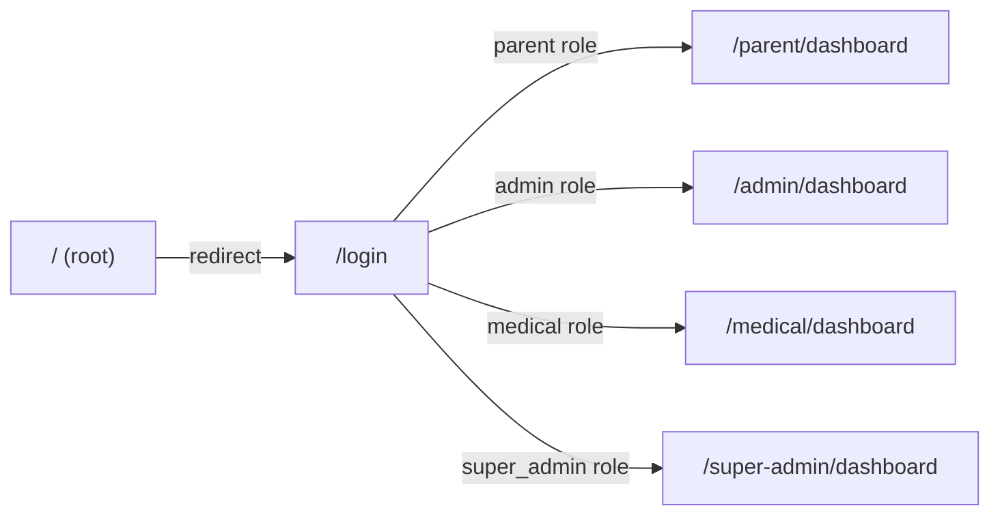

# Camp Burnt Gin — System Documentation

This repository contains the complete Camp Burnt Gin camp management system: a HIPAA-conscious, full-stack web application for managing camp registrations, medical records, internal communications, and administrative operations.

---

## Table of Contents

1. [System Overview](#1-system-overview)
2. [Repository Structure](#2-repository-structure)
3. [Portal Architecture](#3-portal-architecture)
4. [Quick Start](#4-quick-start)
5. [Documentation Map](#5-documentation-map)
6. [Current Build Status](#6-current-build-status)
7. [Version Information](#7-version-information)

---

## 1. System Overview

Camp Burnt Gin is a specialized camp management platform designed for the CYSHCN (Children and Youth with Special Health Care Needs) program. The system replaces legacy workflows with a structured, auditable, role-based platform.

### Core Capabilities

| Domain | Description |
|--------|-------------|
| Registration | Multi-section application form with auto-save, document uploads, and digital signatures |
| Medical Records | PHI-protected medical profiles with conditional logic and provider access links |
| Inbox | Gmail-style threaded messaging with rich text editor and floating compose |
| Administration | Application review, session management, camper management, and reporting |
| Audit Logging | Full audit trail for all administrative and PHI-access events |
| User Management | Role-based access control with super-admin governance interface |

### Technology Stack

| Layer | Technology |
|-------|-----------|
| Backend | Laravel 12, PHP 8.2+, MySQL 8.0, Laravel Sanctum 4.2 |
| Frontend | React 18, TypeScript 5 (strict mode), Tailwind CSS 3, Vite 5 |
| State Management | Redux Toolkit 2 + redux-persist (session storage) |
| Animation | Framer Motion 12 |
| Internationalization | i18next 25 (English and Spanish) |
| Testing | PHPUnit (backend), Vitest (frontend) |

---

## 2. Repository Structure

```
Camp_Burnt_Gin_Project/
├── README.md                              # This file
├── frontend/                              # React + TypeScript application
│   ├── FRONTEND_GUIDE.md                  # Frontend development reference
│   └── src/
│       ├── app/                           # Entry point and providers
│       ├── api/                           # Axios configuration and interceptors
│       ├── core/                          # Auth, routing, and role guards
│       ├── features/                      # Domain feature modules
│       ├── ui/                            # Layout components and overlays
│       ├── shared/                        # Constants, types, hooks, utilities
│       ├── i18n/                          # Translation files (en/es)
│       └── assets/styles/                 # Design tokens and global CSS
├── backend/
│   └── camp-burnt-gin-api/                # Laravel 12 API
│       ├── app/                           # Application code
│       ├── database/                      # Migrations and seeders
│       ├── routes/                        # API route definitions
│       └── tests/                         # PHPUnit test suites
├── docs/                                  # Canonical project documentation
│   ├── backend/                           # Backend reference documentation
│   ├── frontend/                          # Frontend reference documentation
│   ├── governance/                        # Architecture decisions and changelog
│   ├── archive/                           # Historical documents (read-only)
│   ├── DOCUMENTATION_INDEX.md             # Complete documentation catalog
│   └── DOCUMENTATION_GOVERNANCE.md       # Documentation standards
├── design/
│   └── DESIGN_SYSTEM.md                   # Design system specification
└── DATABASE_ARCHITECTURE_AND_SCHEMA_DOCUMENTATION.md  # Database schema reference
```

---

## 3. Portal Architecture

The system provides four distinct role-based portals, each with its own layout, navigation, and feature set.



| Portal | URL Prefix | Role | Access Scope |
|--------|-----------|------|--------------|
| Applicant | `/parent` | `parent` | Own campers, applications, inbox, profile |
| Admin | `/admin` | `admin`, `super_admin` | All applications, campers, sessions, reports, inbox |
| Medical | `/medical` | `medical` | Medical records browser (read access) |
| Super Admin | `/super-admin` | `super_admin` | All admin features plus user management and audit log |

---

## 4. Quick Start

### Backend

```bash
cd backend/camp-burnt-gin-api
cp .env.example .env
composer install
php artisan key:generate
php artisan migrate --seed
php artisan serve
```

Full setup instructions: [docs/backend/SETUP.md](docs/backend/SETUP.md)

### Frontend

```bash
cd frontend
cp .env.example .env.local
# Set VITE_API_BASE_URL=http://localhost:8000
pnpm install
pnpm run dev
```

Full development reference: [frontend/FRONTEND_GUIDE.md](frontend/FRONTEND_GUIDE.md)

---

## 5. Documentation Map

### Backend

| Document | Purpose |
|----------|---------|
| [docs/backend/SYSTEM_OVERVIEW.md](docs/backend/SYSTEM_OVERVIEW.md) | High-level system description |
| [docs/backend/ARCHITECTURE.md](docs/backend/ARCHITECTURE.md) | Technical architecture and design patterns |
| [docs/backend/API_REFERENCE.md](docs/backend/API_REFERENCE.md) | Complete endpoint reference |
| [docs/backend/AUTHENTICATION_AND_AUTHORIZATION.md](docs/backend/AUTHENTICATION_AND_AUTHORIZATION.md) | Auth and session management |
| [docs/backend/ROLES_AND_PERMISSIONS.md](docs/backend/ROLES_AND_PERMISSIONS.md) | RBAC system and permission matrix |
| [docs/backend/SECURITY.md](docs/backend/SECURITY.md) | Security architecture and HIPAA compliance |
| [docs/backend/AUDIT_LOGGING.md](docs/backend/AUDIT_LOGGING.md) | PHI access audit trail implementation |
| [docs/backend/DATA_MODEL.md](docs/backend/DATA_MODEL.md) | Database schema and entity relationships |
| [docs/backend/APPLICATION_WORKFLOWS.md](docs/backend/APPLICATION_WORKFLOWS.md) | Application lifecycle and state transitions |
| [docs/backend/INBOX_SYSTEM_DOCUMENTATION.md](docs/backend/INBOX_SYSTEM_DOCUMENTATION.md) | Messaging system architecture |
| [docs/backend/SETUP.md](docs/backend/SETUP.md) | Development environment setup |
| [docs/backend/DEPLOYMENT.md](docs/backend/DEPLOYMENT.md) | Production deployment procedures |
| [docs/backend/TESTING.md](docs/backend/TESTING.md) | Test strategy and execution |

### Frontend

| Document | Purpose |
|----------|---------|
| [frontend/FRONTEND_GUIDE.md](frontend/FRONTEND_GUIDE.md) | Frontend development reference (canonical) |
| [docs/frontend/DESIGN_SYSTEM.md](docs/frontend/DESIGN_SYSTEM.md) | Design system architecture |
| [docs/frontend/COMPONENT_GUIDE.md](docs/frontend/COMPONENT_GUIDE.md) | Component library reference |
| [docs/frontend/README.md](docs/frontend/README.md) | Frontend module overview |

### Governance

| Document | Purpose |
|----------|---------|
| [docs/DOCUMENTATION_INDEX.md](docs/DOCUMENTATION_INDEX.md) | Complete documentation catalog |
| [docs/DOCUMENTATION_GOVERNANCE.md](docs/DOCUMENTATION_GOVERNANCE.md) | Documentation standards and procedures |
| [docs/governance/ARCHITECTURE_DECISIONS.md](docs/governance/ARCHITECTURE_DECISIONS.md) | Architectural decision records |
| [docs/governance/BACKEND_CHANGELOG.md](docs/governance/BACKEND_CHANGELOG.md) | Backend version history |

### Database

| Document | Purpose |
|----------|---------|
| [DATABASE_ARCHITECTURE_AND_SCHEMA_DOCUMENTATION.md](DATABASE_ARCHITECTURE_AND_SCHEMA_DOCUMENTATION.md) | Complete database schema documentation |

---

## 6. Current Build Status

Both the backend and frontend are complete and functional.

| Component | Status | Detail |
|-----------|--------|--------|
| Backend API | Complete | 308 passing tests, 0 security vulnerabilities |
| Frontend application | Complete | All four portals fully implemented and wired to API |
| Authentication | Complete | Login, registration, MFA, password reset |
| Applicant portal | Complete | Dashboard, application form, camper view, inbox, profile, settings |
| Admin portal | Complete | Dashboard, applications, campers, sessions, reports, calendar, announcements, inbox |
| Medical portal | Complete | Dashboard, medical records browser |
| Super Admin portal | Complete | Dashboard, user management, audit log, form templates |
| Messaging system | Complete | Gmail-style two-panel inbox, floating compose, rich text editor |
| RBAC | Complete | Four roles enforced at route, middleware, and policy layers |
| i18n | Complete | English and Spanish translations |
| Type safety | Complete | TypeScript strict mode, 0 type errors |

---

## 7. Version Information

| Component | Version |
|-----------|---------|
| Backend | 1.0.0 |
| Frontend | 1.0.0 |
| Laravel | 12.x |
| PHP | 8.2+ |
| React | 18.3 |
| TypeScript | 5.7 |
| MySQL | 8.0+ |

---

**Document Status:** Authoritative
**Last Updated:** March 2026
**Version:** 2.0.0
