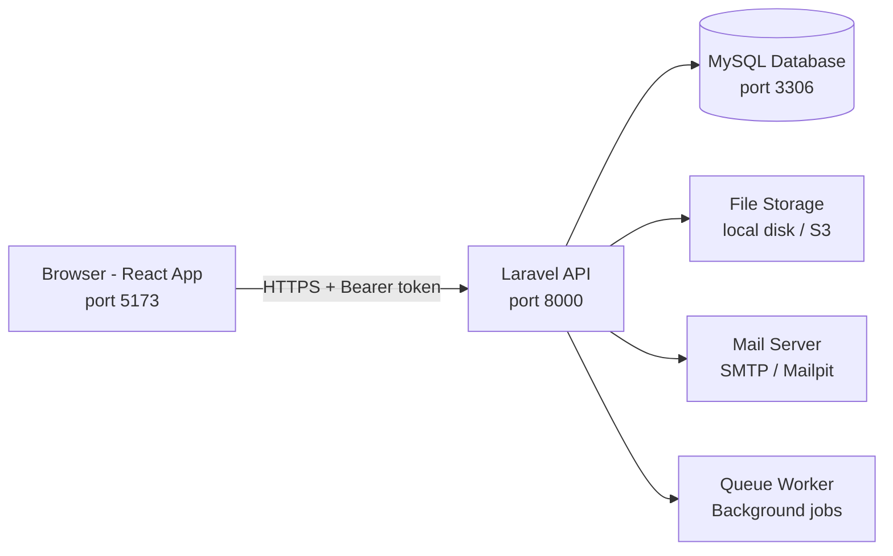
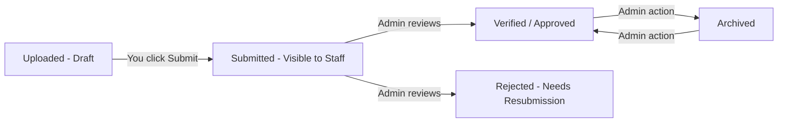
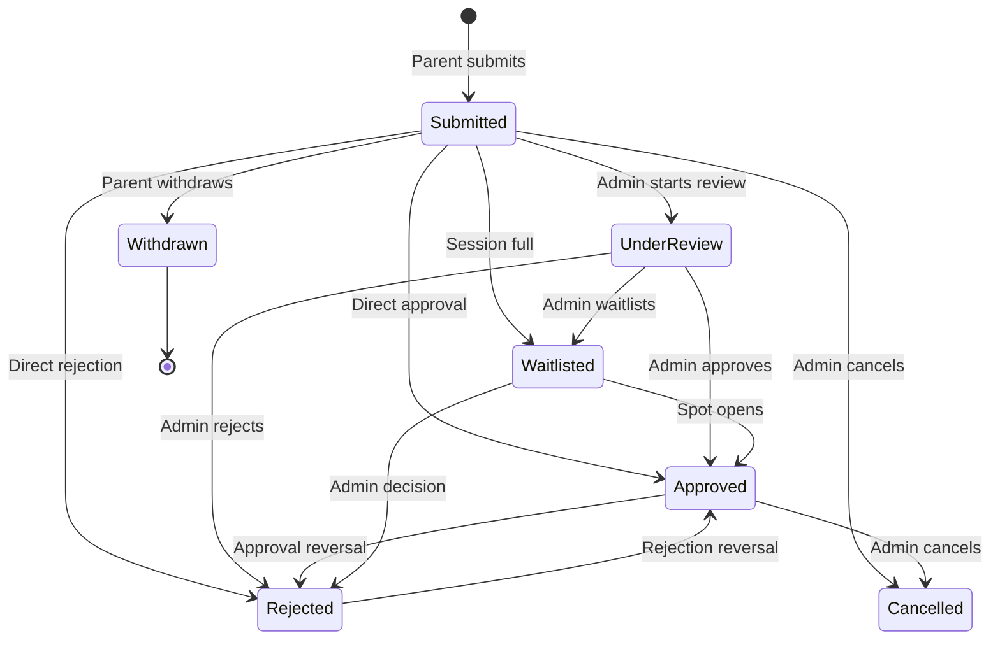

# Camp Burnt Gin  -  User Guide

**Version:** 3.0 | **Last Updated:** April 2026

---

> This guide is written for everyone  -  parents, camp staff, administrators, medical personnel, and developers alike. No technical background is assumed. Where technical detail is needed, it is explained in plain language. Jump to the section that matches your role or task using the Table of Contents below.

---

## Table of Contents

1. [What Is This System?](#1-what-is-this-system)
2. [Quick Start](#2-quick-start)
3. [System Overview](#3-system-overview)
4. [User Roles and Permissions](#4-user-roles-and-permissions)
5. [Core Features](#5-core-features)
   - 5.1 [Creating an Account and Logging In](#51-creating-an-account-and-logging-in)
   - 5.2 [Two-Factor Authentication (MFA)](#52-two-factor-authentication-mfa)
   - 5.3 [The Applicant Portal  -  For Parents and Guardians](#53-the-applicant-portal--for-parents-and-guardians)
   - 5.4 [Digital Application Form](#54-digital-application-form)
   - 5.5 [Paper Applications](#55-paper-applications)
   - 5.6 [Documents and File Uploads](#56-documents-and-file-uploads)
   - 5.7 [Messaging and Inbox](#57-messaging-and-inbox)
   - 5.8 [Notifications](#58-notifications)
   - 5.9 [Medical Records](#59-medical-records)
   - 5.10 [Calendar and Deadlines](#510-calendar-and-deadlines)
   - 5.11 [Reports and Exports](#511-reports-and-exports)
6. [Admin Guide](#6-admin-guide)
   - 6.1 [Admin Dashboard](#61-admin-dashboard)
   - 6.2 [Reviewing Applications](#62-reviewing-applications)
   - 6.3 [Managing Camp Sessions](#63-managing-camp-sessions)
   - 6.4 [Document Management](#64-document-management)
   - 6.5 [User Management (Super Admin)](#65-user-management-super-admin)
   - 6.6 [Announcements](#66-announcements)
   - 6.7 [Compliance Checks](#67-compliance-checks)
7. [Medical Staff Guide](#7-medical-staff-guide)
8. [Setup Requirements](#8-setup-requirements)
9. [Local Development Setup](#9-local-development-setup)
   - 9.1 [Option A  -  Docker (Recommended)](#91-option-a--docker-recommended)
   - 9.2 [Option B  -  Local Installation (macOS)](#92-option-b--local-installation-macos)
   - 9.3 [Option B  -  Local Installation (Linux)](#93-option-b--local-installation-linux)
   - 9.4 [Option B  -  Local Installation (Windows)](#94-option-b--local-installation-windows)
   - 9.5 [Starting the Development Servers](#95-starting-the-development-servers)
   - 9.6 [Demo Accounts for Testing](#96-demo-accounts-for-testing)
10. [Environment Configuration](#10-environment-configuration)
11. [Deployment Guide](#11-deployment-guide)
    - 11.1 [Deployment on AWS EC2 (Validated Path)](#111-deployment-on-aws-ec2-validated-path)
    - 11.2 [Deployment on a Full Linux Server](#112-deployment-on-a-full-linux-server)
    - 11.3 [Frontend Deployment (Vercel)](#113-frontend-deployment-vercel)
    - 11.4 [Post-Deployment Verification](#114-post-deployment-verification)
    - 11.5 [Rollback Procedures](#115-rollback-procedures)
12. [Testing and Verification](#12-testing-and-verification)
13. [Troubleshooting](#13-troubleshooting)
14. [Frequently Asked Questions](#14-frequently-asked-questions)
15. [Maintenance and Operational Notes](#15-maintenance-and-operational-notes)
16. [Glossary](#16-glossary)
17. [Appendix](#17-appendix)
18. [In-App Help](#18-in-app-help)

---

## 1. What Is This System?

**Camp Burnt Gin** is a web-based application management platform for a residential camp serving children and youth with special health care needs (CYSHCN) in South Carolina. Before this system existed, the camp relied on paper forms, email attachments, and spreadsheets to manage applications, medical records, and staff communications. That process was slow, error-prone, and difficult to keep compliant with privacy regulations.

This platform replaces all of that with a single, organized, role-appropriate web application where:

- **Parents and guardians** can apply online, upload required documents, track their application status, and message camp staff.
- **Camp administrators** can review applications, manage sessions, approve or reject applicants, request documents, and communicate with families.
- **Medical staff** can access and update medical records for enrolled campers, log incidents, and track follow-ups  -  all within a protected, HIPAA-aware environment.
- **Super administrators** can manage system users, audit activity, and configure system-wide settings.

### Who This System Is For

| Person | What They Do Here |
|---|---|
| Parent or guardian | Apply for camp enrollment for their child |
| Camp coordinator / admin | Review applications and manage sessions |
| Medical staff | Access and update health records for enrolled campers |
| System administrator | Manage users, audit logs, and system configuration |

### Privacy and Compliance

This system handles Protected Health Information (PHI)  -  medical records and health data for minors  -  and is built to align with HIPAA requirements. Medical data is encrypted at rest, access is strictly role-limited, all PHI access is logged, and sessions time out automatically after periods of inactivity. These protections are non-negotiable and built into every layer of the system.

---

## 2. Quick Start

If you just want to get the system running as fast as possible for the first time, follow these steps. Detailed explanations for each step are in Section 9.

> **Before You Start:** You need Git, Docker Desktop, and Node.js (version 18 or later) installed on your computer. See Section 8 for the full list.

```bash
# 1. Clone the repository
git clone https://github.com/WinthropUniversity/project-2025-2026-pizza-tacos.git
cd project-2025-2026-pizza-tacos

# 2. Set up the backend
cd backend/camp-burnt-gin-api
cp .env.example .env
docker-compose up -d
docker-compose exec app php artisan db:seed
docker-compose exec app php artisan storage:link
cd ../..

# 3. Set up the frontend
cd frontend
cp .env.example .env.local
npm install
npm run dev
```

Open your browser to **http://localhost:5173** and log in with:

- Email: `coordinator@campburntgin.org`
- Password: `password`

The backend API runs on **http://localhost:8000**. Email is captured by Mailpit at **http://localhost:8025**.

---

## 3. System Overview

### The Big Picture

Camp Burnt Gin is divided into two main pieces of software that work together:

1. **The Backend (API)**  -  Built with Laravel 12 (PHP). This is the engine of the system. It handles all data storage, business rules, security, email, and file management. It runs on port 8000 and communicates with the frontend over a secure API.

2. **The Frontend (Web App)**  -  Built with React 18 (TypeScript). This is the website that users see and interact with. It runs on port 5173 in development and connects to the backend automatically.

Between them is a MySQL database that stores all application data, user accounts, and (encrypted) medical records.



### What Happens When You Log In

1. You enter your email and password on the login page.
2. The frontend sends those credentials to the backend API.
3. If correct, the backend issues a secure token and returns it to the browser.
4. The browser stores that token in session storage (it disappears when you close the tab  -  by design, for security).
5. Every page load and every action you take sends that token along so the system knows who you are.
6. After 60 minutes of inactivity, the frontend automatically logs you out. After 8 hours regardless of activity, the token expires.

### Main Subsystems

| Subsystem | What It Does |
|---|---|
| Authentication | Login, registration, password reset, MFA, session management |
| Applications | Online and paper application submission and lifecycle |
| Documents | File uploads, compliance tracking, admin verification |
| Medical Records | Encrypted health records for enrolled campers (PHI) |
| Messaging | Gmail-style threaded inbox with TO/CC/BCC support |
| Notifications | In-app bell notifications and email alerts |
| Reports | Exportable data summaries for admins |
| Risk Engine | Medical risk scoring for enrolled campers |
| Calendar | Camp session dates, deadlines, and events |
| Audit Logging | Immutable record of all PHI access (HIPAA) |

---

## 4. User Roles and Permissions

There are four roles in the system. Every account belongs to exactly one role, which determines what they can see and do.

### Role Summary

| Role | Portal URL | Who Has It |
|---|---|---|
| `applicant` | `/applicant/...` | Parents and legal guardians applying on behalf of a child |
| `admin` | `/admin/...` | Camp coordinators and staff who review applications |
| `medical` | `/medical/...` | Medical staff who manage health records during camp |
| `super_admin` | `/super-admin/...` | System administrators managing accounts and configuration |

> **Note:** `super_admin` inherits all `admin` capabilities. There is no separate login page per role  -  you log in once and the system routes you to your correct portal automatically.

### Detailed Permission Table

| Action | Applicant | Admin | Medical | Super Admin |
|---|:---:|:---:|:---:|:---:|
| Create and submit own application | Yes | | | |
| View own application status | Yes | | | |
| Upload own documents | Yes | | | |
| Send and receive messages | Yes | Yes | Yes | Yes |
| View camp calendar and announcements | Yes | Yes | Yes | Yes |
| View all applications | | Yes | | Yes |
| Approve / reject / waitlist applications | | Yes | | Yes |
| Manage camp sessions and capacity | | Yes | | Yes |
| Request documents from applicants | | Yes | | Yes |
| View and verify uploaded documents | | Yes | | Yes |
| Access medical records | | | Yes | |
| Log treatments and incidents | | | Yes | |
| Generate and export reports | | Yes | | Yes |
| Manage system users | | | | Yes |
| View audit logs | | | | Yes |
| Configure system settings | | | | Yes |

### Important Limitations

- **Medical staff cannot see applications.** Their portal shows only health records for already-enrolled (approved) campers. This separation is intentional.
- **Applicants cannot see other families' data.** Every query the system runs is scoped to the logged-in user's own records.
- **The last super admin account cannot be deleted or demoted.** This prevents accidental lockout of the entire system.

---

## 5. Core Features

### 5.1 Creating an Account and Logging In

#### For New Applicants (Parents/Guardians)

1. Go to the application URL and click **Create Account** (or navigate to `/register`).
2. Enter your full name, email address, and a password.
3. Click **Register**. You will be sent an email with a verification link.
4. Open that email and click the link to verify your account.
5. Return to the app and log in with your email and password.

> **Important:** You cannot access any protected part of the application until your email is verified. If you did not receive the verification email, check your spam folder or use the "Resend Verification" option on the login page.

#### Account Lockout

After 5 consecutive failed login attempts, your account is locked for 15 minutes. Wait and try again, or use the **Forgot Password** link to reset your password.

#### Password Reset

1. Click **Forgot Password** on the login page.
2. Enter your registered email address.
3. Check your email for a reset link (valid for a limited time).
4. Click the link and set a new password.

### 5.2 Two-Factor Authentication (MFA)

Two-factor authentication (also called MFA or 2FA) adds a second layer of security beyond your password. It is optional for applicants but may be required for staff accounts.

When enabled, after entering your password you will be asked to enter a 6-digit code from an authenticator app (such as Google Authenticator or Authy) on your phone.

#### Setting Up MFA

1. Log in to your account.
2. Go to **Profile** or **Account Settings**.
3. Find the **Two-Factor Authentication** section and click **Enable**.
4. Scan the QR code with your authenticator app.
5. Enter the 6-digit code displayed by the app to confirm setup.

#### Disabling MFA

You need both your current password and a current TOTP code to disable MFA  -  this prevents someone from turning off your security without having your phone.

#### Step-Up Verification

For certain sensitive operations (such as exporting PHI data or managing system users), the system will ask you to re-enter your TOTP code even if you are already logged in. This step-up verification is cached for 15 minutes per session.

### 5.3 The Applicant Portal  -  For Parents and Guardians

When you log in as an applicant, you land on your **Dashboard**. From here you can:

- See all applications you have started or submitted
- Check the status of each application
- Access your documents
- Read messages from camp staff
- View announcements and calendar events

Your dashboard shows each of your children (called "campers" in the system) and the status of any application associated with them.

#### Application Statuses Explained

| Status | What It Means |
|---|---|
| Draft | You started but have not submitted yet. Only you can see this. |
| Submitted | You submitted successfully. Staff has been notified. |
| Under Review | A coordinator is actively reviewing your application. |
| Approved | Your child has been accepted. Congratulations! |
| Rejected | Your application was not accepted. You may receive a notification with details. |
| Waitlisted | The session is full. You are in the queue if a spot opens up. |
| Cancelled | An admin cancelled the application (administrative action). |
| Withdrawn | You withdrew the application yourself. This cannot be undone. |

### 5.4 Digital Application Form

The digital application form is the primary way to apply for enrollment. It is divided into sections that you complete at your own pace. Your progress is saved automatically as you go  -  you do not need to finish in one sitting.

#### The 12 Sections of the Application

1. **Session Selection**  -  Choose which camp session you are applying for.
2. **Camper Information**  -  Basic biographical details (name, date of birth, etc.).
3. **Parent / Guardian Information**  -  Your contact information and home address.
4. **Emergency Contacts**  -  At least one emergency contact who is not the primary guardian.
5. **Medical Information**  -  Primary physician, insurance, and general health overview.
6. **Diagnoses**  -  Any medical diagnoses relevant to camp participation.
7. **Medications**  -  Medications the camper takes, including dosage and schedule.
8. **Allergies**  -  Known allergies and reactions.
9. **Behavioral Profile**  -  Information about behavioral and sensory needs.
10. **Assistive Devices and Equipment**  -  Any devices the camper uses (e.g., wheelchair, AAC device).
11. **Dietary Needs**  -  Special diet requirements, G-tube, or feeding plan details.
12. **Consents and Signature**  -  Required consents and your electronic signature.

#### How Sections Work

- Each section has a colored pill indicator at the top: green means complete, amber means incomplete or partially filled.
- You can navigate between sections in any order  -  you do not have to go sequentially.
- Sections 9–11 (behavior, equipment, diet, medications) have a "Nothing to declare" checkbox. If your child has none of those needs, check the box to mark the section complete.
- Your data is saved each time you navigate away from a section.

#### Submitting Your Application

Before you can submit, all 12 sections must be marked complete (green pills), and you must have provided your electronic signature on Section 12.

Click **Submit Application**. You will see a confirmation screen, and the status will change from "Draft" to "Submitted."

> **Common Mistake:** Do not close the tab mid-section without navigating away first. Navigate to another section before closing to ensure the current section's data is saved.

### 5.5 Paper Applications

If a family cannot complete the digital form, the system also supports a paper application workflow.

#### For Applicants

1. Log in and go to **Official Forms** in your portal.
2. Download the printable paper forms provided.
3. Fill them out by hand.
4. Upload the completed packet in the **Official Forms** section.
5. The system records the upload and notifies staff.

You can manage multiple paper applications (for multiple children or sessions) from the same page. Each application has its own upload slot.

#### For Staff

When a paper application packet is received by staff, it can be uploaded on the applicant's behalf directly through the admin portal. Staff can link the document to the correct application and camper.

### 5.6 Documents and File Uploads

#### Required Documents

All applicants must upload the following documents as part of their application:

| Document | Notes |
|---|---|
| Immunization Record | Current South Carolina immunization certificate |
| Health Insurance Card | Front and back, or proof of coverage |
| Medical Examination Form | Signed by the child's physician |
| Paper Application Packet | Only for paper applications  -  not needed for digital |

> **Important:** Uploaded documents start as drafts. They are not visible to staff until you submit them. Look for a **Submit to Staff** button next to each document on your documents page.

#### Uploading a Document

1. Go to **Documents** in your portal.
2. Find the document slot you need to fill (e.g., "Immunization Record").
3. Click **Upload** and select your file.
4. After the file uploads, click **Submit to Staff** to make it visible for review.

#### Accepted File Types

- PDF documents (.pdf)
- Images (.jpg, .jpeg, .png, .webp)

Maximum file size: 10 MB per file.

#### Document Security

All uploaded files pass through a security scan before being stored. Files are stored outside the public web root and are not directly accessible via URL  -  all downloads go through the authenticated API.

#### Document Lifecycle

Once submitted, a document goes through the following states:



### 5.7 Messaging and Inbox

The messaging system works like email within the platform. You can send messages to camp staff, and staff can message you. All messages are organized into threads (conversations).

#### Composing a Message

1. Click the **Inbox** icon or navigate to `/inbox`.
2. Click **Compose** (or the pencil icon) to open a new message.
3. Select recipients. You can add TO, CC, and BCC recipients just like email.
4. Type your subject and message body. The editor supports basic formatting (bold, italic, lists, links).
5. You can attach files to messages.
6. Click **Send**.

#### Replying to a Message

Open a conversation thread and use the **Reply** or **Reply All** button at the bottom. The system automatically populates the correct recipients:

- **Reply**  -  sends only to the original sender
- **Reply All**  -  sends to all TO and CC recipients (BCC recipients are never revealed to Reply All)

#### Who Can Message Whom

- Applicants can message admin and staff.
- Admins can message anyone.
- Medical staff can message admins only (not applicants).
- Messages within the same conversation thread are visible to all conversation participants.

### 5.8 Notifications

The system sends notifications in two ways:

1. **In-app bell**  -  A notification bell in the top navigation bar shows unread alerts. Click it to see recent notifications.
2. **Email**  -  Important events also send an email to your registered address.

> **Privacy Note:** Emails from this system never contain sensitive health information. They only say "You have a new notification  -  log in to see details." This is a HIPAA-required practice to protect your information.

#### Notification Types

| Event | Who Gets Notified |
|---|---|
| Application submitted | Camp staff |
| Application status changed (approved, rejected, etc.) | Parent / guardian |
| New message received | Recipient(s) of the message |
| Document request issued | Applicant |
| Critical medical incident logged | Medical staff |
| Incomplete application reminder (weekly) | Applicants with open drafts |

#### Managing Your Notification Preferences

Go to **Settings** and find **Notification Preferences**. You can turn individual notification types on or off. By default, all notifications are enabled.

### 5.9 Medical Records

Medical records are only accessible by medical staff. Applicants and administrators cannot view the full medical record directly  -  this is intentional and required for HIPAA compliance.

Medical records are created automatically when a camper's application is approved for the first time. All health data (physician name, insurance, diagnoses, medications, allergies, behavioral profile, feeding plans, assistive devices) is encrypted in the database.

If an approval is reversed, the medical record is kept but deactivated  -  it disappears from active workflows while remaining in the system for audit and compliance purposes.

See Section 7 for the full Medical Staff Guide.

### 5.10 Calendar and Deadlines

The calendar shows:

- Camp session start and end dates
- Application deadlines
- Important events posted by admins

Applicants can view calendar entries relevant to their selected session. Admins can create and manage calendar events and deadlines through the admin portal.

When a deadline passes, the system can automatically enforce it  -  for example, closing a session to new applications once the deadline has passed.

### 5.11 Reports and Exports

Admins and super admins can generate reports from the admin portal. Available reports include:

- Application status summaries by session
- Enrolled camper lists
- Document compliance status
- Waitlist reports
- Camper demographic summaries

Reports can be exported as CSV files. Exporting data containing PHI (Protected Health Information) requires a step-up verification (your TOTP code) before the download begins.

---

## 6. Admin Guide

### 6.1 Admin Dashboard

The admin dashboard is your home base. When you log in as an admin, you see:

- A summary of active camp sessions and their enrollment vs. capacity
- Recent applications needing review
- Pending document requests
- Unread messages
- System announcements

Use the sidebar navigation to reach specific sections: Applications, Campers, Sessions, Documents, Reports, Inbox, and Announcements.

### 6.2 Reviewing Applications

The application review workflow is the core of the admin function. Each submitted application moves through a defined lifecycle.



#### Steps to Review an Application

1. Go to **Applications** in the admin sidebar.
2. Filter by status (e.g., "Submitted") to find applications awaiting review.
3. Click an application to open the detail view.
4. Review each section: camper information, emergency contacts, medical overview, behavioral profile, dietary needs, documents.
5. Check the **Documents** section to confirm required documents are uploaded and verified.
6. Scroll to the **Review** section at the bottom.
7. Select an action: **Approve**, **Reject**, **Waitlist**, or **Mark Under Review**.
8. Add optional review notes.
9. Click **Submit Review**.

#### What Approval Does

When you approve an application:

- The application status changes to `approved`.
- The camper's `is_active` flag is set to `true`  -  they appear on operational rosters.
- A medical record is created (or reactivated) for the camper.
- The parent receives an email notification and an acceptance letter.
- Session enrollment count is incremented.

#### Approval Reversal

You can reverse an approval (change it back to `rejected`) if needed. When you do:

- The camper's `is_active` flag is set back to `false` **only if** they have no other active approved applications.
- The medical record is deactivated (not deleted).
- The parent receives a notification.

#### Session Capacity

The system enforces session capacity automatically. When a session is full, the system will offer to waitlist a new approval rather than exceeding capacity. Approving a waitlisted application moves them to `approved` status and increments the enrollment count.

### 6.3 Managing Camp Sessions

Go to **Sessions** in the admin sidebar to manage camp sessions.

For each session you can:

- Set the session name, dates, and capacity
- Open or close the applicant portal (controls whether new applications can be started)
- View current enrollment vs. capacity
- See a list of all applicants for that session

> **Common Mistake:** Closing the applicant portal for a session prevents new applications from being started, but does not affect applications already in progress.

### 6.4 Document Management

#### Requesting Documents

You can request specific documents from an applicant:

1. Open the applicant's record.
2. Click **Request Document**.
3. Specify the document type, description, and deadline.
4. Submit. The applicant receives a notification and the request appears in their portal.

#### Verifying Documents

Uploaded documents submitted by applicants appear in the application review page. For each document:

- Click **Verify** to mark it as reviewed and compliant.
- Click **Reject** to flag it as insufficient (the applicant is notified and can resubmit).

#### Archiving Documents

Documents can be archived to remove them from the active view without deleting them. Archived documents are retained for compliance purposes. Use the **Active / Archived** toggle to view archived documents.

### 6.5 User Management (Super Admin)

Super admins can manage all user accounts from the **Users** section of the super-admin portal.

- **Create a new user**  -  Set their name, email, role, and initial password. Send them a welcome email.
- **Edit a user**  -  Change their name, email, or role.
- **Deactivate a user**  -  Prevents login without deleting their records.
- **View audit activity**  -  See recent PHI access logs for any user.

> **Important:** The system will not allow you to delete or demote the last active super admin account. This prevents accidental full lockout of the system.

#### Audit Log

Go to **Audit Log** in the super-admin portal to see a full history of PHI access events. Each entry records:

- Which user accessed the data
- What record they accessed
- Their IP address and browser
- The timestamp
- Whether the access was flagged as PHI

This log is immutable  -  entries cannot be edited or deleted.

### 6.6 Announcements

Admins can post announcements visible to all users in their respective portals. Go to **Announcements** in the admin sidebar.

You can:
- Create new announcements with a title and body
- Pin important announcements so they appear at the top
- Set an expiration date after which the announcement is no longer shown

### 6.7 Compliance Checks

The system includes a document enforcement engine that verifies whether an application meets all document requirements before approval can proceed. In production, this is fully enforced.

The compliance check validates:
- Required documents are uploaded
- Documents have been submitted (not still in draft)
- Documents have been verified by staff
- Documents are not expired

In development and staging environments, strict compliance can be relaxed by setting `APP_COMPLIANCE_CHECKS=false` in the backend environment file. This is useful for testing submission flows when you do not have real documents.

---

## 7. Medical Staff Guide

Medical staff have access to the `/medical/...` portal. This portal shows only health records for campers who are currently enrolled (have an approved application with `is_active = true`).

### What Medical Staff Can Access

- **Medical Records**  -  Full encrypted health record for each enrolled camper
- **Diagnoses**  -  ICD-coded diagnoses with severity levels
- **Medications**  -  Name, dosage, frequency, indication
- **Allergies**  -  Substance, reaction type, severity (mild to anaphylaxis)
- **Behavioral Profiles**  -  Wandering risk, aggression risk, supervision level
- **Feeding Plans**  -  G-tube, special diet requirements
- **Assistive Devices**  -  Device type and care instructions
- **Activity Permissions**  -  Which activities the camper is cleared for
- **Personal Care Plans**  -  ADL assistance needs (toileting, dressing, feeding, etc.)

### Clinical Workflow

Medical staff can create and update clinical records during a camp session:

- **Treatment Logs**  -  Record clinical interventions with time, type, and outcome
- **Medical Visits**  -  Document clinic visits with disposition (returned to activity, sent to hospital, etc.)
- **Medical Incidents**  -  Log injuries or health events with severity classification
- **Medical Follow-Ups**  -  Create follow-up tasks with priority and due dates
- **Medical Restrictions**  -  Apply activity restrictions with date ranges and reasons
- **Risk Assessments**  -  The system has a built-in risk scoring engine that evaluates a camper's medical complexity based on their profile

### PHI Access Controls

- Every medical record page load is logged to the audit log with user ID, IP, and timestamp.
- Medical staff cannot access applications, financials, or messaging with applicants.
- All medical data is encrypted at rest using AES-256-CBC encryption.
- The portal automatically logs out after inactivity.

### Risk Engine

The risk engine produces an automated risk score for each enrolled camper based on their diagnoses, medications, allergies, and behavioral profile. This score helps medical staff prioritize attention and plan staffing levels. The score is visible on the camper's medical record dashboard.

Risk levels:
- **Low**  -  Minimal medical complexity; standard camp support
- **Moderate**  -  Some ongoing medical needs; additional monitoring recommended
- **High**  -  Significant medical complexity; dedicated medical staffing required
- **Critical**  -  Extreme complexity; requires specialist review before enrollment

---

## 8. Setup Requirements

Before setting up the system locally, make sure your computer has the following:

### For Docker Setup (Recommended)

| Requirement | Version | How to Check |
|---|---|---|
| Docker Desktop | 20.10 or newer | `docker --version` |
| Git | Any recent version | `git --version` |
| Node.js | 18 or newer | `node --version` |
| npm | 10 or newer | `npm --version` |

### For Local (Non-Docker) Setup

| Requirement | Version | Notes |
|---|---|---|
| PHP | 8.2 or newer | With extensions: mysql, mbstring, xml, curl, bcmath, intl, zip, gd |
| Composer | 2.x | PHP package manager |
| MySQL | 8.0 or newer | |
| Node.js | 18 or newer | |
| npm | 10 or newer | |
| Git | Any recent version | |

### Optional (Recommended for Production)

| Requirement | Purpose |
|---|---|
| Redis | Faster cache and queue processing |
| Supervisor | Keeps queue workers running in the background |
| Nginx or Apache | Production web server |
| Certbot | Free SSL certificates via Let's Encrypt |

---

## 9. Local Development Setup

The project repository structure is:

```
project-root/
  backend/
    camp-burnt-gin-api/     <- Laravel application lives here
  frontend/                 <- React application lives here
  scripts/
    dev.sh                  <- Convenience script to start everything at once
  docs/                     <- Project documentation
```

> **Important:** The backend code is NOT at `backend/`  -  it is one level deeper at `backend/camp-burnt-gin-api/`. Keep this in mind for all commands below.

### 9.1 Option A  -  Docker (Recommended)

Docker provides a fully consistent development environment that works the same on any computer. It handles PHP, MySQL, Redis, and email capture automatically.

#### Step 1: Clone the repository

```bash
git clone https://github.com/WinthropUniversity/project-2025-2026-pizza-tacos.git
cd project-2025-2026-pizza-tacos
```

#### Step 2: Set up the backend environment

```bash
cd backend/camp-burnt-gin-api
cp .env.example .env
```

Open `.env` in a text editor. The default values work for Docker. You do not need to change anything to get started, but you may want to set `SEED_MODE=demo` (it is already the default).

#### Step 3: Start Docker containers

```bash
docker-compose up -d
```

This starts four containers: the PHP application (port 8000), MySQL database (port 3306), Redis (port 6379), and Mailpit for email testing (port 8025). The first time this runs, Docker downloads images which may take a few minutes.

Verify that all containers are running:

```bash
docker-compose ps
```

All services should show "Up."

#### Step 4: Seed the database

```bash
docker-compose exec app php artisan db:seed
```

This populates the database with roles, a super admin account, form definitions, and demo data.

#### Step 5: Create the file storage link

```bash
docker-compose exec app php artisan storage:link
```

This one-time command makes uploaded files accessible through the API.

#### Step 6: Set up the frontend

```bash
cd ../../frontend
cp .env.example .env.local
npm install
```

The default `.env.local` values point to `http://localhost:8000` which is where Docker is running the API. No changes needed.

#### Step 7: Start the frontend

```bash
npm run dev
```

Open **http://localhost:5173** in your browser.

---

### 9.2 Option B  -  Local Installation (macOS)

Use this if you prefer not to use Docker.

#### Step 1: Install system dependencies

```bash
# Install Homebrew if not installed
/bin/bash -c "$(curl -fsSL https://raw.githubusercontent.com/Homebrew/install/HEAD/install.sh)"

# Install PHP 8.2
brew install php@8.2

# Install Composer
brew install composer

# Install MySQL
brew install mysql
brew services start mysql
```

#### Step 2: Clone and configure the backend

```bash
git clone https://github.com/WinthropUniversity/project-2025-2026-pizza-tacos.git
cd project-2025-2026-pizza-tacos/backend/camp-burnt-gin-api

cp .env.example .env
```

Edit `.env` to set your database password if MySQL requires one. By default, a fresh Homebrew MySQL install has no root password.

#### Step 3: Install PHP dependencies and generate the app key

```bash
composer install
php artisan key:generate
```

#### Step 4: Create the database

```bash
mysql -u root -e "CREATE DATABASE camp_burnt_gin CHARACTER SET utf8mb4 COLLATE utf8mb4_unicode_ci;"
```

#### Step 5: Run migrations and seed

```bash
php artisan migrate
php artisan db:seed
php artisan storage:link
```

#### Step 6: Set up the frontend

```bash
cd ../../frontend
cp .env.example .env.local
npm install
```

---

### 9.3 Option B  -  Local Installation (Linux)

#### Step 1: Install system dependencies

```bash
sudo add-apt-repository ppa:ondrej/php
sudo apt update
sudo apt install -y php8.2 php8.2-cli php8.2-fpm php8.2-mysql php8.2-mbstring \
    php8.2-xml php8.2-curl php8.2-zip php8.2-gd php8.2-bcmath php8.2-intl

# Install Composer
curl -sS https://getcomposer.org/installer | php
sudo mv composer.phar /usr/local/bin/composer

# Install MySQL
sudo apt install -y mysql-server
sudo systemctl start mysql
sudo systemctl enable mysql
```

Then follow Steps 2–6 from the macOS instructions above.

---

### 9.4 Option B  -  Local Installation (Windows)

Windows setup is more involved. The recommended approach is to use **WSL2** (Windows Subsystem for Linux) and follow the Linux instructions above inside a WSL2 terminal. If you need a native Windows setup without WSL2, follow these steps:

1. Download PHP 8.2 from [windows.php.net/download](https://windows.php.net/download/) and extract to `C:\php`.
2. Add `C:\php` to your system PATH.
3. Copy `php.ini-development` to `php.ini` and uncomment the extensions: `curl`, `fileinfo`, `gd`, `mbstring`, `openssl`, `pdo_mysql`, `zip`.
4. Download and run the Composer installer from [getcomposer.org](https://getcomposer.org/download/).
5. Download and install MySQL Community Server from [dev.mysql.com/downloads/mysql/](https://dev.mysql.com/downloads/mysql/).

Then open PowerShell and follow Steps 2–6 from the macOS instructions.

---

### 9.5 Starting the Development Servers

Once setup is complete, you need three things running simultaneously to use the application:

1. The Laravel API server
2. The queue worker (processes email and notification jobs)
3. The Vite frontend server

The easiest way is to use the included convenience script from the project root:

```bash
./scripts/dev.sh
```

This single command starts all three processes in one terminal window with labeled output. Press `Ctrl+C` to stop everything cleanly.

If you prefer separate terminals:

```bash
# Terminal 1  -  Laravel API
cd backend/camp-burnt-gin-api
php artisan serve --host=0.0.0.0

# Terminal 2  -  Queue worker (required for email notifications)
cd backend/camp-burnt-gin-api
php artisan queue:work --queue=notifications,default --tries=3

# Terminal 3  -  Frontend
cd frontend
npm run dev
```

**When using Docker**, the API is already running inside a container. You only need to run the frontend separately:

```bash
cd frontend
npm run dev
```

Queue workers run inside Docker automatically. To run Artisan commands, prefix with `docker-compose exec app`:

```bash
docker-compose exec app php artisan tinker
```

### 9.6 Demo Accounts for Testing

After seeding with the default `demo` mode, these accounts are ready to use:

| Role | Email | Password |
|---|---|---|
| Super Admin | admin.campburntgin@gmail.com | See `ADMIN_BOOTSTRAP_PASSWORD` in `.env` |
| Admin (Coordinator) | coordinator@campburntgin.org | password |
| Medical Staff | medical@campburntgin.org | password |
| Applicant (Parent) | sarah.johnson@example.com | password |
| Applicant (Parent) | david.martinez@example.com | password |

> **Tip:** If you want a more realistic dataset with many campers, applications in all statuses, and edge cases, set `SEED_MODE=development` in the backend `.env` and re-seed:
> ```bash
> php artisan migrate:fresh --seed
> # or with Docker:
> docker-compose exec app php artisan migrate:fresh --seed
> ```

---

## 10. Environment Configuration

The backend is configured through a file called `.env` inside `backend/camp-burnt-gin-api/`. The frontend is configured through `.env.local` inside `frontend/`.

**Never commit `.env` or `.env.local` files to version control.** They contain secrets and credentials.

### Backend Environment Variables

#### Application Settings

| Variable | Purpose | Default | Production Requirement |
|---|---|---|---|
| `APP_NAME` | Display name of the application | `Camp Burnt Gin API` | Set appropriately |
| `APP_ENV` | Environment identifier | `local` | Must be `production` |
| `APP_KEY` | Encryption key (auto-generated) | Empty | Must be set  -  run `php artisan key:generate` |
| `APP_DEBUG` | Show detailed error pages | `false` | **Must be `false`** |
| `APP_URL` | Public URL of the API | `http://localhost:8000` | Your actual API domain |
| `FRONTEND_URL` | Public URL of the frontend | `http://localhost:5173` | Your actual frontend domain |

#### Database

| Variable | Purpose | Default |
|---|---|---|
| `DB_CONNECTION` | Database type | `mysql` |
| `DB_HOST` | Database server hostname | `127.0.0.1` (Docker: `mysql`) |
| `DB_PORT` | Database port | `3306` |
| `DB_DATABASE` | Database name | `camp_burnt_gin` |
| `DB_USERNAME` | Database user | `root` |
| `DB_PASSWORD` | Database password | (empty) |

#### Security and Sessions

| Variable | Purpose | Notes |
|---|---|---|
| `SANCTUM_EXPIRATION` | Token lifetime in minutes | `480` (8 hours). HIPAA recommends ≤30 min for PHI. |
| `SESSION_LIFETIME` | Session timeout in minutes | `30` |
| `SESSION_ENCRYPT` | Encrypt session data | `true`  -  do not change |
| `SESSION_SECURE_COOKIE` | Require HTTPS for session cookie | `true` in production; `false` only for HTTP-only local dev |
| `CORS_ALLOWED_ORIGINS` | Allowed frontend origins | `http://localhost:5173,http://localhost:5174`  -  update for production |
| `BCRYPT_ROUNDS` | Password hashing strength | `14`  -  do not lower this |

#### Mail

| Variable | Purpose | Default |
|---|---|---|
| `MAIL_MAILER` | How to send mail | `smtp` (use `log` for dev without a mail server) |
| `MAIL_HOST` | SMTP server hostname | `smtp.gmail.com` |
| `MAIL_PORT` | SMTP port | `587` |
| `MAIL_USERNAME` | SMTP login | Your email address |
| `MAIL_PASSWORD` | SMTP password | Gmail App Password (not your account password) |
| `MAIL_FROM_ADDRESS` | Sender email address | Your email address |

> **Tip for Local Development:** Set `MAIL_MAILER=log` to write all outgoing emails to `storage/logs/laravel.log` instead of sending them. Retrieve the email verification link with:
> ```bash
> grep "verify-email" backend/camp-burnt-gin-api/storage/logs/laravel.log | tail -1
> ```

#### Queues and Caching

| Variable | Purpose | Default | Production |
|---|---|---|---|
| `QUEUE_CONNECTION` | How background jobs are processed | `database` | `redis` recommended |
| `CACHE_STORE` | Where to store cached data | `database` | `redis` recommended |
| `BROADCAST_CONNECTION` | Real-time WebSocket events | `log` (disabled) | `reverb` to enable |

#### File Storage

| Variable | Purpose | Default |
|---|---|---|
| `FILESYSTEM_DISK` | Where uploaded files are stored | `local` (server disk) |
| `AWS_*` | S3 credentials | Empty  -  only needed if using S3 |

#### Seeding

| Variable | Purpose | Options |
|---|---|---|
| `SEED_MODE` | What data to load when seeding | `demo` (default), `development`, `minimal` |
| `ADMIN_BOOTSTRAP_EMAIL` | Super admin account email | `admin.campburntgin@gmail.com` |
| `ADMIN_BOOTSTRAP_PASSWORD` | Super admin initial password | Set explicitly in production |

#### Compliance

| Variable | Purpose |
|---|---|
| `APP_COMPLIANCE_CHECKS` | Enforce strict document compliance | `true` in production (forced); `false` in dev/staging to allow testing without real docs |

### Frontend Environment Variables

These go in `frontend/.env.local`:

| Variable | Purpose | Default |
|---|---|---|
| `VITE_API_BASE_URL` | Where the frontend sends API requests | `http://localhost:8000` |
| `VITE_ENVIRONMENT` | Environment label | `development` |
| `VITE_ENABLE_DEVTOOLS` | Enable Redux DevTools | `true` |
| `VITE_REVERB_APP_KEY` | WebSocket app key | `cbg-local-key` (must match backend) |
| `VITE_REVERB_HOST` | WebSocket server hostname | `localhost` |
| `VITE_REVERB_PORT` | WebSocket port | `8080` |

> **Important:** `VITE_REVERB_APP_KEY` must match `REVERB_APP_KEY` in the backend `.env`. Mismatch causes real-time features to fail silently.

---

## 11. Deployment Guide

### 11.1 Deployment on AWS EC2 (Validated Path)

This is the deployment path that has been tested and validated against the live deployment. It uses a t2.micro instance (1 vCPU, 1 GB RAM) running Amazon Linux 2023, with the React frontend built locally and transferred to the server.

> **Constraint:** Do not attempt to build the React frontend on the EC2 instance itself  -  it does not have enough RAM. Build it on your local machine and transfer the output.

#### Prerequisites

On your local machine:
- Terminal with SSH client
- Git
- Node.js 20 and npm 10
- `rsync`

On AWS:
- An account with EC2 permissions
- A key pair file (`.pem`)

#### Part 1: Create the EC2 Instance

1. Log in to the AWS Management Console and navigate to EC2.
2. Click **Launch Instance**.
3. Name it `camp-burnt-gin`.
4. Select **Amazon Linux 2023 AMI** (x86_64).
5. Select instance type `t2.micro`.
6. Create a new key pair named `cbg-key`, download the `.pem` file.
7. Under Network settings, configure inbound rules:
   - SSH (port 22) from anywhere
   - HTTP (port 80) from anywhere
8. Click **Launch Instance**.
9. Wait for status checks to show **2/2 passed**.
10. Copy the **Public IPv4 address**  -  you will use it throughout.

#### Part 2: Connect to the Server

```bash
chmod 400 ~/Downloads/cbg-key.pem
ssh -i ~/Downloads/cbg-key.pem ec2-user@YOUR_EC2_IP
```

#### Part 3: Prepare the Server

Run all of the following on the EC2 instance:

```bash
# Add a swap file (required  -  t2.micro does not have enough RAM)
sudo fallocate -l 2G /swapfile
sudo chmod 600 /swapfile
sudo mkswap /swapfile
sudo swapon /swapfile
echo '/swapfile none swap sw 0 0' | sudo tee -a /etc/fstab

# Install Git
sudo dnf install -y git

# Install PHP 8.2 and extensions
sudo dnf install -y php8.2 php8.2-fpm php8.2-mysqlnd php8.2-xml php8.2-mbstring \
    php8.2-zip php8.2-bcmath php8.2-intl php8.2-gd php8.2-opcache

# Install Composer
curl -sS https://getcomposer.org/installer | php
sudo mv composer.phar /usr/local/bin/composer

# Install MySQL Community Server
sudo dnf install -y mysql-community-server
sudo systemctl enable mysqld
sudo systemctl start mysqld

# Install Nginx
sudo dnf install -y nginx
sudo systemctl enable nginx
sudo systemctl start nginx
```

#### Part 4: Set Up MySQL

```bash
# Get the temporary root password
sudo grep 'temporary password' /var/log/mysqld.log

# Secure the installation and set a new root password
sudo mysql_secure_installation
```

#### Part 5: Deploy the Backend

```bash
# Clone the repository
cd /var/www
sudo git clone https://github.com/WinthropUniversity/project-2025-2026-pizza-tacos.git cbg
sudo chown -R ec2-user:ec2-user /var/www/cbg

cd /var/www/cbg/backend/camp-burnt-gin-api

# Install PHP dependencies
composer install --no-dev --optimize-autoloader

# Configure environment
cp .env.example .env
nano .env
```

Set these values in `.env`:

```
APP_ENV=production
APP_DEBUG=false
APP_URL=http://YOUR_EC2_IP
FRONTEND_URL=http://YOUR_EC2_IP
DB_PASSWORD=<your MySQL password>
SEED_MODE=minimal
ADMIN_BOOTSTRAP_PASSWORD=<strong unique password>
CORS_ALLOWED_ORIGINS=http://YOUR_EC2_IP
SANCTUM_STATEFUL_DOMAINS=YOUR_EC2_IP
SESSION_SECURE_COOKIE=false
```

```bash
# Generate app key and set up database
php artisan key:generate
mysql -u root -p -e "CREATE DATABASE camp_burnt_gin CHARACTER SET utf8mb4 COLLATE utf8mb4_unicode_ci;"
php artisan migrate --force
php artisan db:seed --force
php artisan storage:link
php artisan config:cache
php artisan route:cache
php artisan view:cache
```

#### Part 6: Configure Nginx

Create an Nginx configuration file:

```bash
sudo nano /etc/nginx/conf.d/cbg.conf
```

Paste this configuration:

```nginx
server {
    listen 80;
    server_name YOUR_EC2_IP;
    root /var/www/cbg/frontend/dist;
    index index.html;

    # Serve the frontend (React SPA)
    location / {
        try_files $uri $uri/ /index.html;
    }

    # Proxy API requests to Laravel
    location /api/ {
        proxy_pass http://127.0.0.1:8000;
        proxy_set_header Host $host;
        proxy_set_header X-Real-IP $remote_addr;
        proxy_set_header X-Forwarded-For $proxy_add_x_forwarded_for;
    }
}
```

```bash
sudo nginx -t
sudo systemctl reload nginx
```

#### Part 7: Build and Transfer the Frontend

Run these commands **on your local machine** (not the EC2 instance):

```bash
cd /path/to/project/frontend

# Create a production environment file
echo "VITE_API_BASE_URL=http://YOUR_EC2_IP" > .env.production

# Build the frontend
npm run build

# Transfer the build output to the server
rsync -avz --delete dist/ ec2-user@YOUR_EC2_IP:/var/www/cbg/frontend/dist/
```

#### Part 8: Start the Queue Worker

The queue worker processes email notifications and background jobs. Start it manually (it will stop when you close the SSH session):

```bash
cd /var/www/cbg/backend/camp-burnt-gin-api
php artisan queue:work --queue=notifications,default --daemon &
```

For a persistent queue worker that survives reboots, install Supervisor (see Section 11.2).

---

### 11.2 Deployment on a Full Linux Server

For a more robust production deployment on Ubuntu 22.04 with 4+ cores and 8 GB+ RAM.

#### Server Software

```bash
sudo apt update
sudo add-apt-repository ppa:ondrej/php
sudo apt install -y php8.2-cli php8.2-fpm php8.2-mysql php8.2-mbstring \
    php8.2-xml php8.2-curl php8.2-bcmath php8.2-intl php8.2-zip php8.2-gd \
    nginx mysql-server redis-server supervisor certbot python3-certbot-nginx
```

#### SSL Certificate

```bash
sudo certbot --nginx -d yourdomain.com
```

Certbot auto-renews certificates. Test renewal with:

```bash
sudo certbot renew --dry-run
```

#### Queue Workers with Supervisor

Create a Supervisor configuration:

```bash
sudo nano /etc/supervisor/conf.d/cbg-worker.conf
```

```ini
[program:cbg-worker]
process_name=%(program_name)s_%(process_num)02d
command=php /var/www/cbg/backend/camp-burnt-gin-api/artisan queue:work --queue=notifications,default --tries=3 --sleep=3
autostart=true
autorestart=true
stopasgroup=true
killasgroup=true
user=www-data
numprocs=2
redirect_stderr=true
stdout_logfile=/var/log/cbg-worker.log
stopwaitsecs=3600
```

```bash
sudo supervisorctl reread
sudo supervisorctl update
sudo supervisorctl start cbg-worker:*
```

#### Scheduled Tasks (Cron)

The system runs weekly reminder emails and other automated tasks. Add a cron job:

```bash
sudo crontab -e -u www-data
```

Add this line:

```
* * * * * cd /var/www/cbg/backend/camp-burnt-gin-api && php artisan schedule:run >> /dev/null 2>&1
```

#### Post-Deployment Cache

After every deployment:

```bash
cd /var/www/cbg/backend/camp-burnt-gin-api
php artisan config:cache
php artisan route:cache
php artisan view:cache
php artisan migrate --force
sudo supervisorctl restart cbg-worker:*
```

---

### 11.3 Frontend Deployment (Vercel)

The frontend is configured for Vercel deployment via `frontend/vercel.json`.

#### GitHub Actions Automated Deployment

If you have the CI/CD pipeline configured (see `docs/deployment/CI_CD.md`), pushing to `main` triggers automatic deployment to production and pushing to `develop` deploys to staging.

Required GitHub Secrets:

| Secret | Purpose |
|---|---|
| `VERCEL_TOKEN` | Vercel API authentication |
| `VERCEL_ORG_ID` | Your Vercel organization ID |
| `VERCEL_PROJECT_ID` | Your Vercel project ID |
| `VITE_API_BASE_URL` | Production API URL |

#### Manual Vercel Deployment

```bash
cd frontend
npx vercel --prod
```

---

### 11.4 Post-Deployment Verification

After every deployment, verify the system is working:

1. **Health check:** `curl http://YOUR_DOMAIN/api/health`  -  should return `{"status":"ok"}`
2. **Login:** Open the site, log in with the admin account.
3. **Database:** Confirm the applications list loads.
4. **File upload:** Upload a test document and verify it appears.
5. **Email:** Trigger a notification and verify it appears in Mailpit (dev) or your inbox (production).
6. **Queue:** Check that `php artisan queue:monitor` shows workers running.

---

### 11.5 Rollback Procedures

If a deployment breaks something, rollback by checking out the previous commit:

```bash
cd /var/www/cbg
git log --oneline -10    # Find the last working commit hash
git checkout <commit-hash>

cd backend/camp-burnt-gin-api
composer install --no-dev --optimize-autoloader
php artisan migrate:rollback   # Only if migrations were applied
php artisan config:cache
php artisan route:cache

sudo supervisorctl restart cbg-worker:*
```

For frontend rollback, redeploy the previous build:

```bash
# Local: rebuild from the previous commit and rsync again
git checkout <commit-hash>
cd frontend && npm run build
rsync -avz --delete dist/ ec2-user@YOUR_EC2_IP:/var/www/cbg/frontend/dist/
```

---

## 12. Testing and Verification

### Running Backend Tests

```bash
# From backend/camp-burnt-gin-api/
php artisan test

# Run a specific test class
php artisan test --filter ApplicationWorkflowTest

# Run with coverage report
php artisan test --coverage
```

Tests run against a SQLite in-memory database and do not touch your development database.

### Running Frontend Tests

```bash
# From frontend/
npm test              # Run all unit tests
npm run type-check    # TypeScript strict type check (zero errors required)
npm run lint          # ESLint check (zero warnings required)
npm run test:coverage # Coverage report
```

### Smoke Test Checklist

After setup or deployment, manually verify these key flows:

| Test | Steps | Expected Result |
|---|---|---|
| Registration | Register a new account | Email sent, redirect to verify-email page |
| Email Verification | Click link in email | Redirect to login |
| Login | Log in with demo account | Redirect to correct portal for role |
| Wrong Password | Enter incorrect password 5 times | Account locked for 15 minutes |
| Application Start | Log in as applicant, click Start Application | Section 1 of form displays |
| Application Save | Fill section 1, navigate to section 2 | Section 1 pill turns green |
| Application Submit | Complete all 12 sections and submit | Status changes to Submitted |
| Admin Review | Log in as admin, open submitted app, approve | Status changes to Approved |
| Document Upload | Log in as applicant, upload a PDF | File appears in Documents list |
| Message Send | Compose a message, send | Message appears in recipient Inbox |
| Notification Bell | Trigger any event | Notification count appears in bell |
| Password Reset | Click Forgot Password, follow email link | New password accepted on login |

### What Broken Looks Like

| Symptom | Likely Problem |
|---|---|
| Blank white page after login | Frontend cannot reach the API  -  check `VITE_API_BASE_URL` |
| "Unauthenticated" errors on every request | Token missing or expired  -  clear sessionStorage and re-login |
| Email never arrives | Queue worker not running or mail not configured |
| File upload fails with 422 | File type not allowed or file is too large |
| Application sections always show incomplete | Section save API call failing  -  check browser console |

---

## 13. Troubleshooting

### Application Won't Start

**Symptom:** Navigating to the app shows an error page or nothing loads.

**Cause:** Laravel cannot read the `.env` file, the `APP_KEY` is not set, or the database is not running.

**Fix:**
```bash
cd backend/camp-burnt-gin-api
php artisan key:generate   # If APP_KEY is empty
php artisan config:clear   # Clear cached config
php artisan serve
```

---

**Symptom:** "No application encryption key has been specified."

**Fix:** `php artisan key:generate` then restart the server.

---

### Frontend Cannot Connect to Backend

**Symptom:** Login page submits but nothing happens, or you see a "Network Error" in the browser console.

**Cause:** `VITE_API_BASE_URL` in `frontend/.env.local` does not match where the API is actually running, or CORS is blocking the request.

**Fix:**
1. Confirm the backend is running: `curl http://localhost:8000/api/health`
2. Check `VITE_API_BASE_URL=http://localhost:8000` in `frontend/.env.local`
3. Restart the Vite dev server after changing `.env.local`
4. Check `CORS_ALLOWED_ORIGINS` in the backend `.env` includes the frontend origin

---

### Database Connection Failed

**Symptom:** `SQLSTATE[HY000] [2002] Connection refused`

**Fix:**
- **Local:** Check that MySQL is running: `brew services list` (macOS) or `systemctl status mysql` (Linux)
- **Docker:** Check `docker-compose ps`  -  the `mysql` container should be `Up`
- Verify `DB_HOST`, `DB_PORT`, `DB_USERNAME`, and `DB_PASSWORD` in `.env`

---

### Migrations Fail

**Symptom:** `php artisan migrate` fails with a table already exists error or foreign key error.

**Fix:**
```bash
# Safe for development  -  wipes and recreates all tables
php artisan migrate:fresh --seed

# Check current state
php artisan migrate:status
```

Never run `migrate:fresh` on a production database.

---

### Email Not Sending

**Symptom:** Verification emails, notifications, and application letters never arrive.

**Cause:** Queue worker not running, or mail credentials not configured.

**Fix:**
1. Confirm the queue worker is running: `php artisan queue:monitor`
2. Check `MAIL_MAILER`, `MAIL_HOST`, `MAIL_USERNAME`, and `MAIL_PASSWORD` in `.env`
3. For Gmail: use an App Password (not your account password). Generate one at Google Account → Security → App Passwords.
4. For local testing: set `MAIL_MAILER=log` and find emails in `storage/logs/laravel.log`

---

### "Class Not Found" Errors

**Symptom:** PHP errors mentioning a class not found.

**Fix:**
```bash
composer dump-autoload
```

---

### Permission Errors on Linux

**Symptom:** Laravel cannot write to storage or cache directories.

**Fix:**
```bash
chmod -R 775 storage bootstrap/cache
chown -R www-data:www-data storage bootstrap/cache
```

---

### Authentication Broken After Cache Clear

**Symptom:** Users are logged out, or `401 Unauthenticated` appears on all requests after a config clear.

**Fix:**
```bash
php artisan config:cache   # Rebuild the cache
php artisan route:cache
```

The SANCTUM_EXPIRATION and CORS settings may not be active until the cache is rebuilt in production.

---

### Session Keeps Expiring Unexpectedly

**Symptom:** Users report being logged out frequently, even while actively using the app.

**Cause:** `SESSION_LIFETIME` is too short, or the database session driver is not working correctly.

**Fix:**
- Check `SESSION_LIFETIME` in `.env` (default 30 minutes  -  intentional for HIPAA)
- The frontend enforces a 60-minute inactivity timeout separately  -  this is by design
- If sessions are expiring much sooner than expected, check that `SESSION_DRIVER=database` and that the `sessions` table exists (`php artisan migrate:status`)

---

### File Uploads Failing

**Symptom:** Document upload shows an error, or the file disappears after upload.

**Cause:** Missing storage link, wrong file type, or file too large.

**Fix:**
```bash
php artisan storage:link   # Recreate the symlink if missing
```

Check the file is a PDF or image (jpg, jpeg, png, webp) and under 10 MB.

---

### Page Not Found (404) on Refresh

**Symptom:** Refreshing a page inside the app (like `/admin/applications/5`) shows a 404 error.

**Cause:** The web server is trying to find a file at that path instead of serving `index.html` to the React Router.

**Fix:** Configure the web server to serve `index.html` for all paths that are not API routes or static files. For Nginx:

```nginx
location / {
    try_files $uri $uri/ /index.html;
}
```

---

### Queue Worker Stops Processing

**Symptom:** Emails and notifications stop arriving.

**Fix:**
```bash
# Check worker status
php artisan queue:monitor

# Restart with Supervisor
sudo supervisorctl restart cbg-worker:*

# Check for failed jobs
php artisan queue:failed
php artisan queue:retry all   # Retry all failed jobs
```

---

### "419 Page Expired" Errors

**Symptom:** Form submissions fail with a 419 error.

**Cause:** CSRF token mismatch. This happens when the session cookie and API token are out of sync.

**Fix:** This should not occur in the API-only (Sanctum token) setup. If you see it, check that the frontend is sending the `Authorization: Bearer <token>` header and not relying on cookie-based CSRF. Clear the browser's cookies and session storage and re-login.

---

## 14. Frequently Asked Questions

**Q: Can an applicant apply for multiple children?**
Yes. After registering, a parent can start separate applications for each of their children. Each child is tracked as a separate "camper" profile, and each has their own application, documents, and status.

**Q: Can an applicant apply to multiple camp sessions?**
Yes. If multiple sessions are available and their portals are open, an applicant can start separate applications for different sessions for the same or different children.

**Q: What happens to my draft if I close the browser?**
Your draft is saved on the server automatically each time you navigate between sections. Closing the browser does not lose your progress. However, if you close the browser without navigating away from the current section, the data on that section may not be saved yet. Always navigate to the next section before closing.

**Q: Can I edit an application after submitting?**
No  -  once submitted, applicants cannot edit their application. If a change is needed, contact camp staff through the messaging system.

**Q: Can an admin edit a submitted application?**
Yes. Admins can make changes to submitted applications on behalf of applicants from the admin portal, with a full audit trail of changes.

**Q: What happens when a session reaches capacity?**
New approvals for a full session automatically become waitlisted instead of approved. When an enrolled camper withdraws or is cancelled, the system does not automatically promote waitlisted applicants  -  an admin must manually approve a waitlisted application.

**Q: I withdrew my application. Can I undo it?**
No. Withdrawal is a terminal state and cannot be reversed. If you need to re-apply, contact camp staff.

**Q: Where are uploaded files stored?**
By default, files are stored on the server's local disk inside the application's storage directory (not publicly accessible). For production deployments, S3 or another object storage service is recommended. Files are never stored in the public web root.

**Q: Is medical data visible to camp coordinators?**
No. The `admin` role has access to a medical overview section of the application (as submitted by the parent in the form), but full detailed medical records  -  diagnoses, medications, behavioral details  -  are only accessible to the `medical` role.

**Q: Does the system support languages other than English?**
Yes. The frontend supports English and Spanish via the i18next internationalization library. The language toggle is available in the app interface.

**Q: Can I use the system on a mobile phone?**
The application is primarily designed for desktop use. While it may render on mobile browsers, the form-heavy workflows (particularly the 12-section application form) work best on a laptop or desktop screen.

**Q: How do I reset the entire database for a fresh start in development?**
```bash
cd backend/camp-burnt-gin-api
php artisan migrate:fresh --seed
# Or with Docker:
docker-compose exec app php artisan migrate:fresh --seed
```

This is safe in development but **never do this in production.**

**Q: What is the `development` seed mode versus `demo` mode?**
- `demo`  -  A small, polished dataset with 5 accounts, 3 campers, and a couple of applications. Good for demos and first-time exploration.
- `development`  -  A full simulation dataset with approximately 76 campers, accounts in all roles, and applications in every possible status including edge cases. Best for feature development and testing.
- `minimal`  -  Only system configuration and one super admin account. This is the correct mode for bootstrapping a fresh production server.

**Q: What is the GitHub repository name?**
The repository is a GitHub Classroom project: `WinthropUniversity/project-2025-2026-pizza-tacos`. The name is a placeholder from the Classroom setup  -  the actual project is Camp Burnt Gin.

**Q: The queue worker shows failed jobs. What do I do?**
```bash
php artisan queue:failed                  # List failed jobs
php artisan queue:retry <id>              # Retry a specific job
php artisan queue:retry all               # Retry all failed jobs
php artisan queue:flush                   # Delete all failed jobs (use carefully)
```

**Q: How do I enable real-time notifications in the inbox?**
Real-time WebSocket messaging uses Laravel Reverb. By default it is disabled (`BROADCAST_CONNECTION=log`). To enable:
1. Set `BROADCAST_CONNECTION=reverb` in the backend `.env`
2. Add `REVERB_*` connection settings to the backend `.env`
3. Start the Reverb server: `php artisan reverb:start`
4. Set `VITE_REVERB_*` variables in the frontend `.env.local` (must match)
5. Restart both servers

---

## 15. Maintenance and Operational Notes

### Daily Operations

- **Monitor the queue:** Ensure the queue worker is running and processing jobs. Check `php artisan queue:monitor` or Supervisor's status panel.
- **Check logs:** Review `storage/logs/laravel.log` for errors. In production, set `LOG_LEVEL=warning` to reduce noise.

### Weekly

- **Review failed jobs:** `php artisan queue:failed`  -  investigate and retry or flush old failed jobs.
- **Check disk space:** Uploaded documents accumulate. Monitor the storage directory size.

### Before Every Deployment

- Back up the database
- Run all tests (`php artisan test`)
- Review any new migrations before applying

### Database Backups

There is no built-in backup automation. Set up regular backups with:

```bash
mysqldump -u root -p camp_burnt_gin | gzip > backup-$(date +%Y%m%d-%H%M).sql.gz
```

Store backups off-server (S3, Google Drive, etc.). For HIPAA compliance, backups must be encrypted at rest.

### Clearing Caches

After a deployment or configuration change:

```bash
php artisan config:clear && php artisan config:cache
php artisan route:clear && php artisan route:cache
php artisan view:clear && php artisan view:cache
```

### Updating Dependencies

```bash
# Backend
cd backend/camp-burnt-gin-api
composer update
php artisan test   # Verify nothing broke

# Frontend
cd frontend
npm update
npm run type-check
npm run build
```

Do not update dependencies in production without first testing in a staging environment.

### Log Rotation

Laravel writes logs to `storage/logs/laravel.log`. In production, set up log rotation to prevent the file from growing unboundedly:

```bash
# /etc/logrotate.d/laravel
/var/www/cbg/backend/camp-burnt-gin-api/storage/logs/*.log {
    daily
    missingok
    rotate 14
    compress
    notifempty
    create 0640 www-data www-data
}
```

### Security Patching

Run dependency security audits regularly:

```bash
# Backend
composer audit

# Frontend
npm audit
```

Address critical or high severity vulnerabilities promptly, especially given the HIPAA-sensitive nature of this application.

### Key Scheduled Tasks

The Laravel scheduler runs automatically via cron (every minute). Tasks include:

| Task | Schedule | Purpose |
|---|---|---|
| `IncompleteApplicationReminderNotification` | Weekly, Monday 09:00 | Reminds applicants with open drafts |
| (Additional tasks as configured) | As scheduled | Session deadline enforcement, etc. |

Verify the scheduler is running with:

```bash
php artisan schedule:list
```

---

## 16. Glossary

**Applicant**  -  In this system, "applicant" refers to the parent or legal guardian who creates an account and submits applications on behalf of their child. The child being enrolled is called a "Camper."

**Application**  -  A formal enrollment request submitted by a parent/guardian for a specific camper to attend a specific camp session.

**Camper**  -  A child or youth whose parent/guardian has created an account and started an application. The camper profile contains biographical information (name, date of birth). Campers become "active" when their application is approved.

**Camp Session**  -  A specific, scheduled instance of the camp program with defined dates and a maximum capacity.

**Compliance Check**  -  An automated verification that an application has all required documents uploaded, submitted, and verified before approval can proceed.

**Draft**  -  An application or document that has been started but not yet submitted. Drafts are only visible to the person who created them.

**HIPAA**  -  The Health Insurance Portability and Accountability Act. U.S. federal law governing the privacy and security of Protected Health Information (PHI). This system is built to align with HIPAA requirements.

**MFA / Two-Factor Authentication (2FA)**  -  A security feature that requires you to confirm your identity with a second method (a code from an authenticator app) in addition to your password.

**PHI  -  Protected Health Information**  -  Any health information that can identify a specific individual, including diagnoses, medications, insurance, and medical history. PHI is encrypted at rest in this system and strictly access-controlled.

**Policy**  -  In the Laravel backend, a Policy is a class that defines the rules for who can take specific actions on a resource. Every data type in the system has a corresponding Policy.

**Queue / Queue Worker**  -  Background jobs (like sending emails) are placed in a queue and processed asynchronously by a "queue worker" process. If the queue worker is not running, email and notifications will not be sent.

**Role**  -  A label assigned to a user account that determines what they can see and do in the system. The four roles are: `applicant`, `admin`, `medical`, `super_admin`.

**Risk Engine**  -  An automated scoring system that evaluates a camper's medical complexity based on their health profile. Produces a Low / Moderate / High / Critical risk level used by medical staff.

**Sanctum**  -  The Laravel package used for API authentication. It issues secure bearer tokens that the frontend sends with every API request to prove the user's identity.

**Seeding**  -  The process of populating the database with initial or test data. Running `php artisan db:seed` creates roles, the default admin account, and (depending on `SEED_MODE`) demo or development data.

**Soft Delete**  -  When a record is "soft deleted," it is marked as deleted with a timestamp but not actually removed from the database. This preserves audit history. The system uses soft deletes for all sensitive records.

**Step-Up Verification**  -  A prompt to re-enter your TOTP code (from your authenticator app) before performing a sensitive action, even if you are already logged in. Cached for 15 minutes.

**TOTP**  -  Time-based One-Time Password. The type of 6-digit code generated by authenticator apps like Google Authenticator or Authy, used for MFA.

**Vercel**  -  A cloud platform for deploying the React frontend. The frontend's `vercel.json` configuration supports one-command deployment.

**WebSocket / Reverb**  -  Technology that enables real-time updates in the inbox without refreshing the page. Powered by Laravel Reverb. Disabled by default.

---

## 17. Appendix

### A. Useful Commands Reference

#### Backend (run from `backend/camp-burnt-gin-api/`)

```bash
# Development
php artisan serve                          # Start the API server
php artisan queue:work --queue=notifications,default  # Start the queue worker
php artisan schedule:work                  # Run scheduled tasks continuously (dev only)

# Database
php artisan migrate                        # Apply pending migrations
php artisan migrate:status                 # Check which migrations have run
php artisan migrate:fresh --seed           # Wipe and recreate database (DEV ONLY)
php artisan db:seed                        # Seed without wiping
php artisan db:seed --class=DemoSeeder    # Run a specific seeder

# Cache
php artisan config:cache                   # Cache config (required in production)
php artisan config:clear                   # Clear config cache
php artisan route:cache                    # Cache routes
php artisan route:clear                    # Clear route cache
php artisan view:cache                     # Cache Blade views
php artisan view:clear                     # Clear view cache
php artisan cache:clear                    # Clear application cache

# Queue
php artisan queue:monitor                  # Monitor queue worker status
php artisan queue:failed                   # List failed jobs
php artisan queue:retry all                # Retry all failed jobs
php artisan queue:flush                    # Delete all failed jobs

# Code Quality
./vendor/bin/pint                          # Auto-fix code style
./vendor/bin/pint --test                   # Check style without fixing
./vendor/bin/phpstan analyse               # Static analysis (level 5)

# Testing
php artisan test                           # Run all backend tests
php artisan test --filter ClassName        # Run specific test class
php artisan test --coverage               # With coverage report
```

#### With Docker (prefix with `docker-compose exec app`)

```bash
docker-compose up -d                       # Start all containers
docker-compose down                        # Stop all containers
docker-compose down -v                     # Stop and wipe all data volumes
docker-compose logs -f                     # Stream logs
docker-compose exec app bash               # Open a shell inside the container
docker-compose exec app php artisan ...   # Any artisan command
```

#### Frontend (run from `frontend/`)

```bash
npm run dev           # Start Vite dev server
npm run build         # Production build
npm run type-check    # TypeScript strict check (zero errors)
npm run lint          # ESLint check (zero warnings)
npm test              # Run unit tests
npm run test:coverage # Coverage report
```

### B. Project Folder Structure

```
project-root/
  backend/
    camp-burnt-gin-api/           # Laravel 12 application
      app/
        Console/                  # Scheduled commands
        Http/
          Controllers/Api/        # 52 API controllers (thin wrappers)
          Middleware/              # Auth, role, HIPAA, rate limiting
          Requests/               # Form request validation
          Resources/              # API response serialization
        Models/                   # 44 Eloquent models
        Policies/                 # Authorization policies (one per model)
        Services/                 # Business logic classes
        Enums/                    # PHP enums (ApplicationStatus, etc.)
      config/                     # Laravel configuration files
      database/
        migrations/               # 99 schema migrations
        seeders/                  # Demo, development, minimal seeders
      routes/
        api.php                   # All REST API routes
      storage/
        app/                      # Uploaded files stored here
        logs/                     # Application logs
      tests/
        Feature/                  # Integration tests (560+)
        Unit/                     # Unit tests
  frontend/
    src/
      api/                        # Axios client and request handlers
      assets/                     # CSS, images, design tokens
      core/
        routing/                  # React Router configuration
      features/
        admin/                    # Admin portal pages
        applications/             # Application form components
        auth/                     # Login, register, verify, MFA
        medical/                  # Medical staff portal pages
        messaging/                # Inbox pages (shared)
        parent/                   # Applicant portal pages
        profile/                  # User profile / settings
        sessions/                 # Session management pages
        superadmin/               # Super admin portal pages
      i18n/                       # Translation files (en, es)
      shared/
        components/               # Reusable UI components
        constants/                # Route paths, document types, etc.
        hooks/                    # Custom React hooks
        types/                    # TypeScript type definitions
  docs/                           # Project documentation (30+ files)
  scripts/
    dev.sh                        # Convenience script: start all dev servers
    check-debug-artifacts.sh      # CI: check for debug artifacts
    check-env-files.sh            # CI: check for committed .env files
    check-forbidden-terms.sh      # CI: scan for forbidden terms
```

### C. Setup Checklist

Use this checklist for a clean first-time local setup:

- [ ] Clone the repository
- [ ] Install Docker Desktop (or PHP 8.2, Composer, MySQL)
- [ ] Install Node.js 18+ and npm
- [ ] Copy `backend/camp-burnt-gin-api/.env.example` to `backend/camp-burnt-gin-api/.env`
- [ ] Start Docker containers (`docker-compose up -d`) or local MySQL
- [ ] Run `php artisan key:generate` (skip if using Docker  -  handled automatically)
- [ ] Create the `camp_burnt_gin` MySQL database (skip if using Docker)
- [ ] Run `php artisan migrate` or `php artisan migrate:fresh --seed`
- [ ] Run `php artisan storage:link`
- [ ] Copy `frontend/.env.example` to `frontend/.env.local`
- [ ] Run `npm install` in the `frontend/` directory
- [ ] Start dev servers with `./scripts/dev.sh` from project root
- [ ] Open `http://localhost:5173` and log in with a demo account
- [ ] Verify `http://localhost:8000/api/health` returns `{"status":"ok"}`

### D. Go-Live Checklist

Before going live in production:

- [ ] `APP_ENV=production` in `.env`
- [ ] `APP_DEBUG=false` in `.env`
- [ ] Unique `APP_KEY` generated (`php artisan key:generate`)
- [ ] Production database configured and backed up
- [ ] `SEED_MODE=minimal` used for production bootstrap
- [ ] `ADMIN_BOOTSTRAP_PASSWORD` set to a strong unique password
- [ ] Default super admin password changed after first login
- [ ] SSL certificate installed and HTTPS enforced
- [ ] `SESSION_SECURE_COOKIE=true` in `.env`
- [ ] `CORS_ALLOWED_ORIGINS` updated to match production frontend URL
- [ ] `SANCTUM_STATEFUL_DOMAINS` updated to match production domain
- [ ] Mail provider configured and tested (Mailgun or equivalent for production)
- [ ] Queue workers running via Supervisor and set to autostart
- [ ] Cron job configured for the Laravel scheduler
- [ ] Backups scheduled and tested
- [ ] Log rotation configured
- [ ] Firewall configured (only ports 80, 443, 22 open)
- [ ] `php artisan test` passes on the production codebase
- [ ] Smoke test checklist from Section 12 completed

### E. Key Documentation Files

| Document | Location | Purpose |
|---|---|---|
| API Reference | `docs/api/API_Reference.md` | Full API endpoint documentation |
| Architecture Overview | `docs/architecture/System_Architecture_Overview.md` | System design overview |
| Roles and Permissions | `docs/roles-and-permissions/Roles_and_Permissions.md` | Detailed permission matrix |
| Application Lifecycle | `docs/workflows/Application_Lifecycle.md` | State machine specification |
| Deployment (EC2) | `docs/deployment/EC2_Deployment_Guide.md` | Validated EC2 deployment steps |
| Deployment (Full) | `docs/deployment/Deployment.md` | Ubuntu full production deployment |
| Setup | `docs/deployment/Setup.md` | Local development setup |
| CI/CD | `docs/deployment/CI_CD.md` | GitHub Actions pipeline documentation |
| Seeding | `docs/database/SEEDING.md` | Database seeding modes and accounts |
| Security | `docs/security/Security.md` | Security architecture and controls |
| Messaging | `docs/features/Messaging.md` | Gmail-style messaging system details |
| Medical Records | `docs/features/Medical_Records.md` | Medical records feature specification |

---

## 18. In-App Help

Every page in the Camp Burnt Gin portal has a built-in Help button. It appears as a small book icon in the top navigation bar, on the right side next to the language toggle. It is available on every page for every role — parents, administrators, medical staff, and super administrators.

### What the Help button does

Click the Help button to open the Help panel on the right side of the screen. The panel automatically shows guidance for the page you are currently on. You do not need to navigate to a separate help site or search for the page by name.

Inside the panel you will find:

- **A plain-language summary** of what the page is for.
- **Step-by-step guidance** covering the main tasks on that page. Each step can be expanded to read more detail.
- **A Frequently Asked Questions section** with answers to the most common questions for that page.
- **A smart hint** that checks your current account data and surfaces the most relevant next action (for example, a reminder that a document upload is waiting for your attention).
- **A "Take the tour" button** (when available) that starts a guided walkthrough — a step-by-step overlay that highlights the actual controls on the page one at a time and explains what each one does.

### The Help Center

At the bottom of the Help panel there is a link to the full Help Center. The Help Center opens a larger window where you can:

- Search for help on any topic by typing a word or phrase.
- Browse all available guides organized by the section of the portal they cover.
- Look up terms in the **Glossary**, which explains the meaning of status labels, document types, and other system-specific terms used throughout the portal.

### Closing the Help panel

Click the X button in the top-right corner of the panel to close it, or press the Escape key on your keyboard. Closing the panel does not lose your place on the page.

### Language support

The Help panel and all guide content are available in both English and Spanish. The language displayed matches the language you have selected in the portal's language toggle.

---

## End-of-Guide Summary Report

**Documents reviewed:**
- `docs/INDEX.md`, `docs/architecture/System_Architecture_Overview.md`, `docs/architecture/System_Overview.md`, `docs/architecture/Backend_Architecture.md`
- `docs/deployment/Setup.md`, `docs/deployment/Deployment.md`, `docs/deployment/EC2_Deployment_Guide.md`, `docs/deployment/Configuration.md`, `docs/deployment/Troubleshooting.md`, `docs/deployment/CI_CD.md`
- `docs/roles-and-permissions/Roles_and_Permissions.md`, `docs/auth/Authentication.md`
- `docs/features/Application_Form.md`, `docs/features/Application_Drafts.md`, `docs/features/File_Uploads.md`, `docs/features/Messaging.md`, `docs/features/Medical_Records.md`, `docs/features/Email_Notifications.md`, `docs/features/Risk_Engine.md`
- `docs/workflows/Application_Lifecycle.md`, `docs/workflows/Application_Workflows.md`, `docs/workflows/Business_Rules.md`
- `docs/database/Schema_Overview.md`, `docs/database/SEEDING.md`, `docs/backend/DOMAIN_MODEL.md`
- `docs/testing/Testing.md`, `docs/reports/Reports_and_Exports.md`, `docs/security/Security.md`
- Codebase: `backend/camp-burnt-gin-api/.env.example`, `frontend/.env.example`, `frontend/package.json`, `scripts/dev.sh`

**Documentation that was outdated or incorrect:**
- Auth token storage: multiple docs referenced `localStorage`; the actual implementation uses `sessionStorage['auth_token']` (verified in code)
- MFA enrollment enforcement: docs described `EnsureMfaEnrolled` as active; it passes through unconditionally in the current code  -  only step-up re-verification (`EnsureMfaStepUp`) is enforced
- CI coverage gate: docs described 50% minimum; effective gate is 20%

**Major sections included in this guide:**
All 18 requested sections: Purpose, Quick Start, Table of Contents, System Overview, Roles and Permissions, Core Features (all subsystems), Admin Guide, Medical Staff Guide, Setup Requirements, Local Development Setup (Docker + macOS + Linux + Windows), Environment Configuration, Deployment Guide (EC2 + Ubuntu + Vercel), Testing, Troubleshooting (13 specific scenarios), FAQ (14 questions), Maintenance, Glossary, and Appendix (commands, folder structure, setup checklist, go-live checklist, documentation index).

**Assumptions made due to unclear codebase areas:**
- The maximum file upload size of 10 MB was inferred from general web application standards as this value was not found explicitly in the reviewed files; the backend `StoreDocumentRequest` sets allowed MIME types but the max size limit may be set in `php.ini` or Nginx configuration.
- The "Nothing to declare" checkbox sections (9–11) are documented based on the MEMORY.md forensic audit notes from April 22, 2026 combined with the application form documentation  -  these sections are behavior, equipment, diet, and medications.
- Real-time WebSocket setup steps for Reverb were documented based on `.env.example` configuration keys; the full Reverb server configuration guide lives in the deployment documentation.
