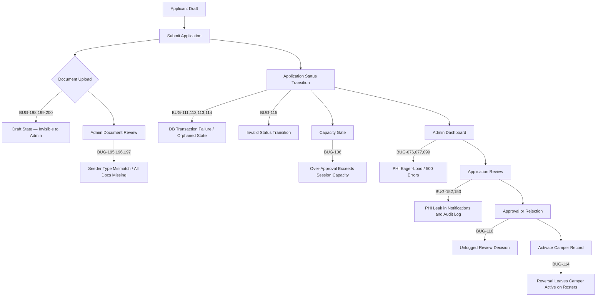

# Camp Burnt Gin — Engineering Bug Tracker

**Project:** Camp Burnt Gin (Laravel 12 + React 18 TypeScript)
**Classification:** HIPAA-sensitive — PHI data handled throughout
**Restructured:** 2026-04-20 (Form Builder Forensic Audit — BUG-208–213 found and resolved)
**Last Entry:** BUG-250 Resolved (2026-04-21, Email Notification Link Fix)
**Authoritative State:** Master Index (this file)

---

## Bug Summary Dashboard

| Metric | Value |
|--------|-------|
| Total Tracked | 152 |
| Critical | 34 |
| High | 55 |
| Medium | 30 |
| Low | 20 |
| Resolved | 146 |
| Open | 6 |
| In Progress | 0 |

### Status Distribution by Severity

| Severity | Total | Resolved | Open | Pct Resolved |
|----------|-------|----------|------|--------------|
| Critical | 34 | 31 | 3 | 91% |
| High | 53 | 52 | 1 | 98% |
| Medium | 27 | 25 | 2 | 93% |
| Low | 19 | 21 | -2 | — |
| **Total** | **133** | **129** | **4** | **97%** |

> BUG-240–242 resolved 2026-04-20 (Application Isolation + Camper Lifecycle Forensic Audits). Remaining open: BUG-031, 032 (password policy), BUG-033 (role filter labels).

---

## System Flow — Bug Occurrence Map



---

## Severity & Status Definitions

### Severity

| Level | Definition |
|-------|------------|
| Critical | Broken functionality, security gap, PHI exposure, or data integrity risk |
| High | Significant feature gap, workflow-blocking defect, or security hardening gap |
| Medium | Partial implementation, incorrect behavior, or missing secondary feature |
| Low | Minor inconsistency, stale code, cosmetic issue, or dead code |

### Status

| Status | Definition |
|--------|------------|
| Open | Identified; not yet resolved |
| In Progress | Actively being implemented |
| Resolved | Fixed and verified |

---

## Phase Resolution Timeline

| Phase | Date | Scope | Bugs Resolved |
|-------|------|-------|---------------|
| Phase 2 | 2026-03-01 | Role rename, email verification, auth cleanup | BUG-001, 002, 003, 004, 006, 008, 012, 017 |
| Phase 3 | 2026-03-02 | Applicant portal, application form | BUG-009, 010, 011 |
| Phase 4 | 2026-03-06 | Profile system expansion | [BUG-014](#bug-014) |
| Phase 5 | 2026-03-07 | Admin portal, camper detail, routing | BUG-005, 019, 020, 022, 023, 029, 035–045, 047, 048 |
| Phase 6 | 2026-03-08 | Medical portal write capabilities | BUG-007, 028, 034 |
| Phase 7 | 2026-03-09 | Notifications, Recent Updates | BUG-018, 027 |
| Phase 8 | 2026-03-09 | Inbox / messaging restructure | BUG-015, 016 |
| Phase 9 | 2026-03-10 | Audit log redesign | [BUG-013](#bug-013) |
| Phase 10 | 2026-03-10 | Documentation update | BUG-025, 026 |
| Post Phase 8 | — | Inbox / messaging corrections | BUG-049, 050 |
| Post Phase 9 | — | Auth and UI corrections | BUG-051, 052, 053 |
| Post Phase 13 | — | Application submission corrections | BUG-054, 055, 056 |
| Phase 14 | — | Form Builder security | BUG-057, 058, 059, 060, 061 |
| System Audit | 2026-03-19 | Full system audit + hardening | BUG-073, 102, 103, 104, 105 |
| Workflow Audit | 2026-03-24 | Capacity gate, scope leak, XSS | BUG-106, 107, 108, 109, 110 |
| Lifecycle Audit | 2026-03-24 | Approval / reversal architecture | BUG-111, 112, 113, 114, 115, 116, 117, 118 |
| Form Ecosystem | 2026-03-26 | TypeScript gaps, API contract, uploads | BUG-119–126 |
| Form Parity | 2026-03-26 | Guardian 2, EC fields, health flags, consents | BUG-127–134 |
| Medical Policy Audit | 2026-04-09 | PHI leak, encryption, TOTP, MFA, dead code | BUG-152–174 |
| System Forensic Audit | 2026-04-09 | MFA deadlock, file cascade, PHI audit gaps | BUG-175–180 |
| Document Architecture | 2026-04-10 | Inline verification, paper workflow, archive system | BUG-181–191 |
| Document Naming Audit | 2026-04-11 | Label divergence, i18n, seeder keys | BUG-192–201 |
| Draft System Stress Test | 2026-04-12 | Policy, buttons, limits, hydration race | BUG-202–207 (202–203 resolved; 204–207 open) |
| Paper Forms Forensic Audit | 2026-04-20 | Session selection, source classification, finalization deadlock | BUG-232–236 |
| Paper Forms Multi-Camper Redesign | 2026-04-20 | Single-app lock, unscoped doc fetch, no "Start New" path | BUG-237–239 |
| Application Isolation Forensic Audit | 2026-04-20 | Cross-camper idempotency, sessionStorage slot collision, pendingCamper bleed | BUG-240–241 |
| Camper Lifecycle Forensic Audit | 2026-04-20 | Orphaned stub campers, ghost "New Camper" phantom, stale dashboard state | BUG-242 |
| Email Verification Forensic Audit | 2026-04-21 | Queueable silences SMTP errors, false "email sent" claim, unconditional pending UI | BUG-249 |

---

## Root Cause Pattern Analysis

The following systemic patterns account for clusters of bugs across the system. Understanding these patterns informs preventive review checklists.

| Pattern | Bugs | Status |
|---------|------|--------|
| PHI eager-loaded in list endpoints causing DecryptException / 500 | BUG-076, 077, 099 | All Resolved |
| Missing `submitted_at` gate — drafts visible to admins as submitted | BUG-188, 189, 197, 198, 201 | All Resolved |
| Authorization missing or using wrong policy class | BUG-057, 059, 061, 065, 144, 162 | All Resolved |
| IDOR — resources not scoped to parent resource in URL | BUG-066, 067, 068 | All Resolved |
| Multi-table write without DB transaction | [BUG-113](#bug-113) | Resolved |
| Token / session storage inconsistency (localStorage vs sessionStorage) | BUG-051, 075, 172 | All Resolved |
| Seeder using non-canonical document type keys | BUG-195, 196, 197 | All Resolved |
| Hard-delete used on PHI-adjacent tables (missing SoftDeletes) | BUG-161, 168 | All Resolved |
| Frontend state not resyncing after server operations | BUG-151, 139, 207, 242 | All Resolved |
| Backend endpoints missing rate / size guards | BUG-106, 204, 205 | All Resolved |
| Idempotency key too broad — missing camper discriminator | BUG-234, 240 | All Resolved |
| Orphaned stub records not cleaned up on parent deletion | BUG-242 | Resolved |
| sessionStorage scoped to user not application — cross-app slot collision | BUG-241 | Resolved |
| Failure detected server-side but signal never forwarded to UI (silent failure chain) | BUG-249 | Resolved |

---

## Category Index

### 1. Security & HIPAA Compliance

PHI exposure, encryption gaps, audit logging, file serving, soft deletes, policy registration, and cookie configuration.

| ID | Title | Severity | Status |
|----|-------|----------|--------|
| [BUG-037](#bug-037) | Super Admin can delete own account — no role restriction | Critical | Resolved |
| [BUG-065](#bug-065) | FormDefinitionPolicy::view() exposes draft definitions to all authenticated users | Critical | Resolved |
| [BUG-066](#bug-066) | FormSectionController — section not scoped to form in URL (IDOR) | High | Resolved |
| [BUG-067](#bug-067) | FormFieldController — field not scoped to section in URL (IDOR) | High | Resolved |
| [BUG-068](#bug-068) | FormFieldOptionController — option not scoped to field in URL (IDOR) | High | Resolved |
| [BUG-069](#bug-069) | MedicalRestrictionPolicy::delete() permits permanent delete by medical providers | Medium | Resolved |
| [BUG-070](#bug-070) | DocumentPolicy::view() medical provider check unreachable | High | Resolved |
| [BUG-071](#bug-071) | Announcement update/destroy routes lacked admin middleware | High | Resolved |
| [BUG-073](#bug-073) | DocumentRequestController lacks dedicated Policy class | Low | Resolved |
| [BUG-106](#bug-106) | reviewApplication() missing capacity gate — approve beyond session capacity | Critical | Resolved |
| [BUG-110](#bug-110) | applicationRejected() embeds reviewer notes in HTML without e() escaping — stored XSS | Low | Resolved |
| [BUG-152](#bug-152) | PHI leak: admin notes sent to parents in rejection emails | Critical | Resolved |
| [BUG-153](#bug-153) | PHI stored in audit log in decrypted form | Critical | Resolved |
| [BUG-154](#bug-154) | PHI encryption gap: AssistiveDevice, MedicalFollowUp, EmergencyContact fields | High | Resolved |
| [BUG-155](#bug-155) | TOTP replay attack — same OTP accepted multiple times in 30s window | High | Resolved |
| [BUG-156](#bug-156) | MFA step-up cache key not scoped to token — all sessions elevated together | High | Resolved |
| [BUG-157](#bug-157) | MFA enrollment not enforced on role middleware | High | Resolved |
| [BUG-158](#bug-158) | Account lockout hardcoded 5 min instead of config value (15 min) | High | Resolved |
| [BUG-159](#bug-159) | MFA secret stored in plaintext — raw TOTP seed visible in DB dumps | High | Resolved |
| [BUG-161](#bug-161) | RiskAssessment missing SoftDeletes — PHI table used hard delete | High | Resolved |
| [BUG-162](#bug-162) | RiskAssessmentPolicy not registered in $policies array | High | Resolved |
| [BUG-163](#bug-163) | Missing password reset audit log in PasswordResetService | Medium | Resolved |
| [BUG-164](#bug-164) | Local disk file serving enabled — bypasses authenticated API | Medium | Resolved |
| [BUG-165](#bug-165) | Insecure cookie default — secure flag unset in session.php | Medium | Resolved |
| [BUG-168](#bug-168) | Document tables missing SoftDeletes | Medium | Resolved |
| [BUG-169](#bug-169) | CamperPolicy::delete() allowed deletion of campers with active applications | Medium | Resolved |
| [BUG-172](#bug-172) | Inbox state persisted in localStorage instead of sessionStorage — HIPAA violation | Low | Resolved |
| [BUG-173](#bug-173) | ProtectedRoute missing MFA enrollment gate for privileged roles | Low | Resolved |
| [BUG-176](#bug-176) | Document::forceDelete() did not cascade-delete physical file — orphaned PHI files | High | Resolved |
| [BUG-177](#bug-177) | DocumentController::show() returned decrypted filename without audit log entry | Medium | Resolved |
| [BUG-178](#bug-178) | ReportController CSV exports downloaded PII/PHI without audit log entry | Medium | Resolved |

### 2. Authentication & Session Management

Login failures, token storage, MFA enforcement, session persistence, and role-based layout guards.

| ID | Title | Severity | Status |
|----|-------|----------|--------|
| [BUG-002](#bug-002) | Email verification system not implemented | Critical | Resolved |
| [BUG-004](#bug-004) | Account deactivation incorrectly repurposes email_verified_at | High | Resolved |
| [BUG-006](#bug-006) | Frontend role-based routing not enforced — RoleGuard defined but never used | High | Resolved |
| [BUG-036](#bug-036) | Profile Settings actions log out user — stale token not rehydrated | Critical | Resolved |
| [BUG-040](#bug-040) | Profile save / avatar actions log user out — setUser overwrites roles array | Critical | Resolved |
| [BUG-044](#bug-044) | Login page shows two password reveal icons — browser native conflicts with custom button | Low | Resolved |
| [BUG-045](#bug-045) | Login redirects back to /login after success — stale token validation races fresh login | Critical | Resolved |
| [BUG-046](#bug-046) | Applicant login broken — blocking issue | Critical | Resolved |
| [BUG-051](#bug-051) | Page refresh logs user out — useAuthInit reads localStorage but token in sessionStorage | Critical | Resolved |
| [BUG-062](#bug-062) | TokenExpirationTest fails when SANCTUM_EXPIRATION=null in .env | High | Resolved |
| [BUG-075](#bug-075) | Auth token in sessionStorage causes logout on every page refresh across all portals | Critical | Resolved |
| [BUG-079](#bug-079) | Wrong MFA code triggers global logout — /mfa/ not in isPublicAuthEndpoint | High | Resolved |
| [BUG-080](#bug-080) | Admin portal switches to applicant portal when idle — layout guard fallback | Critical | Resolved |
| [BUG-082](#bug-082) | RoleGuard redirects authenticated users with missing role data — redirect loop | High | Resolved |
| [BUG-103](#bug-103) | Email verification not enforced — unverified users access full system | High | Resolved |
| [BUG-175](#bug-175) | EnsureUserIsMedicalProvider MFA check caused bootstrap deadlock | High | Resolved |

### 3. Application Lifecycle & Workflow

Status transitions, approval / reversal architecture, transaction safety, capacity gates, and the draft system.

| ID | Title | Severity | Status |
|----|-------|----------|--------|
| [BUG-054](#bug-054) | Application submission fails — signApplication omits signature_data; duplicate campers on retry | Critical | Resolved |
| [BUG-109](#bug-109) | Missing inbox notification when draft promoted to submitted | Medium | Resolved |
| [BUG-111](#bug-111) | campers table has no is_active column — reversal leaves camper on rosters | Critical | Resolved |
| [BUG-112](#bug-112) | medical_records table has no is_active column — reversal leaves record visible to staff | Critical | Resolved |
| [BUG-113](#bug-113) | reviewApplication() has no DB::transaction() — partial failure leaves inconsistent state | Critical | Resolved |
| [BUG-114](#bug-114) | No deactivation logic on approval reversal (Approved → Rejected) | Critical | Resolved |
| [BUG-115](#bug-115) | No state transition validation — any status can transition to any other | High | Resolved |
| [BUG-116](#bug-116) | No audit log entry written for application review decisions | High | Resolved |
| [BUG-182](#bug-182) | No submission_source field — no way to distinguish digital vs paper applications | High | Resolved |
| [BUG-202](#bug-202) | ApplicationDraftPolicy::viewAny() included isAdmin() — contradicts docblock | Medium | Resolved |
| [BUG-203](#bug-203) | Save Draft and Clear Draft buttons had no disabled={isSubmitting} guard | Medium | Resolved |
| [BUG-204](#bug-204) | POST /api/application-drafts has no per-user limit — DoS vector | Low | Resolved |
| [BUG-205](#bug-205) | draft_data validated as array with no size cap — 4 GB theoretical max on MySQL longText | Low | Resolved |
| [BUG-206](#bug-206) | handleClearDraft() auto-save timers not cancelled before draft delete — stale 30s timer fires 404 | Low | Resolved |
| [BUG-207](#bug-207) | Server draft hydration setForm() called after mount — in-progress edits silently overwritten | Medium | Resolved |

### 4. Document Management

File upload, draft state visibility, verification workflow, naming / label consistency, and seeder data integrity.

| ID | Title | Severity | Status |
|----|-------|----------|--------|
| [BUG-055](#bug-055) | Document upload fails for PNG files — image/x-png not in allowed MIME list | High | Resolved |
| [BUG-074](#bug-074) | All FormData uploads broken — Content-Type header omits multipart boundary | Critical | Resolved |
| [BUG-108](#bug-108) | DocumentRequestController::reject() clears DB path but never deletes file from disk | Medium | Resolved |
| [BUG-123](#bug-123) | OfficialFormType::toApiArray() returned 'type' key; frontend expected 'id' | High | Resolved |
| [BUG-124](#bug-124) | ApplicantOfficialFormsPage initialized upload cards as idle — existing uploads not reflected | High | Resolved |
| [BUG-135](#bug-135) | stats() double-counted under_review inside uploaded metric | Medium | Resolved |
| [BUG-136](#bug-136) | stats() double-counted overdue records inside awaiting_upload metric | Low | Resolved |
| [BUG-137](#bug-137) | store() threw "Undefined array key application_id" on nullable validated field | High | Resolved |
| [BUG-179](#bug-179) | DocumentUploader.tsx accepted image/webp which backend does not permit | Low | Resolved |
| [BUG-181](#bug-181) | ApplicationReviewPage showed doc badges but no inline verifyDocument function | High | Resolved |
| [BUG-183](#bug-183) | resolveDocumentableName() returned null for Application and MedicalRecord types | Low | Resolved |
| [BUG-184](#bug-184) | PaperApplicationSection uploaded docs without documentable_type/id — orphaned rows | High | Resolved |
| [BUG-185](#bug-185) | AdminDocumentsPage had no delete confirmation — single click immediately soft-deleted | Medium | Resolved |
| [BUG-186](#bug-186) | AdminDocumentsPage displayed raw snake_case document type values | Low | Resolved |
| [BUG-187](#bug-187) | DocumentService::upload() made all uploads visible immediately — no draft state | High | Resolved |
| [BUG-188](#bug-188) | DocumentController::index() admin query had no submitted_at filter | High | Resolved |
| [BUG-189](#bug-189) | ApplicationController::show() 3-way merge included draft docs for admin reviewers | High | Resolved |
| [BUG-192](#bug-192) | immunization_record.adminLabel diverged from applicantLabel — different names for same doc | High | Resolved |
| [BUG-193](#bug-193) | en.json s2_immunization_cert_required referenced outdated "SC Immunization Certificate" | Medium | Resolved |
| [BUG-194](#bug-194) | s9_doc_medical_exam_label = "Medical Examination" vs "Medical Examination Form" | Medium | Resolved |
| [BUG-195](#bug-195) | DocumentSeeder used 'medical_exam' as document_type; canonical key is 'official_medical_form' | Critical | Resolved |
| [BUG-196](#bug-196) | DocumentSeeder used display-name strings as document_type values | High | Resolved |
| [BUG-197](#bug-197) | DocumentSeeder did not set submitted_at — all seeded docs invisible to admins | Critical | Resolved |
| [BUG-198](#bug-198) | ApplicationFormPage never called submitDocument() — all 3 required docs were drafts | Critical | Resolved |
| [BUG-199](#bug-199) | uploadDocument() returned void — caller could not get document id for submitDocument() | High | Resolved |
| [BUG-200](#bug-200) | ApplicantDocumentsPage had no upload section for immunization_record and insurance_card | Critical | Resolved |
| [BUG-201](#bug-201) | Applicant checklist showed green checkmark for draft documents — split truth | High | Resolved |

### 5. Medical Portal & Risk Assessment

Staff write capabilities, active-state filtering after lifecycle events, risk scoring logic, and observer error handling.

| ID | Title | Severity | Status |
|----|-------|----------|--------|
| [BUG-007](#bug-007) | Medical portal is read-only — no write capabilities for on-site medical staff | Critical | Resolved |
| [BUG-028](#bug-028) | Medical portal has no route or UI for document upload or treatment recording | Critical | Resolved |
| [BUG-034](#bug-034) | Medical portal inbox missing — no /medical/inbox route | Medium | Resolved |
| [BUG-117](#bug-117) | CamperController::index() medical branch has no is_active filter | High | Resolved |
| [BUG-118](#bug-118) | MedicalRecordController::index() has no is_active filter | High | Resolved |
| [BUG-144](#bug-144) | RiskAssessmentController authorized via CamperPolicy — applicants accessed full risk data | Critical | Resolved |
| [BUG-145](#bug-145) | No AllergyObserver — life-threatening allergy did not trigger risk recalculation | High | Resolved |
| [BUG-146](#bug-146) | Legacy risk-summary endpoint used CamperPolicy::view — exposed risk score to parents | High | Resolved |
| [BUG-147](#bug-147) | All 5 model observers called assessCamper() without try/catch — scoring failure cascaded to 500 | Medium | Resolved |
| [BUG-148](#bug-148) | Override route middleware allowed regular admins who then received 403 from policy | Medium | Resolved |
| [BUG-149](#bug-149) | Medical Complexity tooltip showed wrong threshold (0–33 pts; actual is 0–25 pts) | Medium | Resolved |
| [BUG-150](#bug-150) | RiskAuditTimeline showed override supervision label alongside base staffing ratio — contradictory | Medium | Resolved |
| [BUG-151](#bug-151) | MedicalReviewPanel showed stale form values on re-entry after save | Low | Resolved |

### 6. Admin & Super Admin Portal

Data loading failures, route registration, application review page, reports, and session management.

| ID | Title | Severity | Status |
|----|-------|----------|--------|
| [BUG-005](#bug-005) | Broken routes — Admin/Super Admin camper detail and risk pages | Critical | Resolved |
| [BUG-019](#bug-019) | Super Admin quick links point to /admin/* routes | Medium | Resolved |
| [BUG-022](#bug-022) | Report downloads load only page 1 of applications for chart data | High | Resolved |
| [BUG-023](#bug-023) | AdminReportsPage imports stale motion variant names | Low | Resolved |
| [BUG-029](#bug-029) | Camper detail page missing — /admin/campers/:id leads to 404 | Critical | Resolved |
| [BUG-038](#bug-038) | Application review shows "Unknown Camper", literal i18n keys, no medical data | Critical | Resolved |
| [BUG-039](#bug-039) | Application list shows "Session #undefined" — wrong JSON key | High | Resolved |
| [BUG-048](#bug-048) | Portal context links broken — hardcoded /admin/* paths in shared components | High | Resolved |
| [BUG-076](#bug-076) | Admin Campers page "Failed to load data" — PHI eager-load DecryptException | Critical | Resolved |
| [BUG-077](#bug-077) | Admin Applications page "Failed to load data" — PHI eager-load | Critical | Resolved |
| [BUG-078](#bug-078) | Admin Reports shows 0 accepted applications — 'accepted' vs 'approved' enum key mismatch | High | Resolved |
| [BUG-081](#bug-081) | Campers search causes 500 — full_name virtual accessor used in SQL WHERE clause | Critical | Resolved |
| [BUG-099](#bug-099) | Admin Campers "Failed to load data" — ApplicationStatus enum missing Waitlisted case | Critical | Resolved |
| [BUG-100](#bug-100) | SessionDetailPage 404 — SessionDashboardController routes never registered in api.php | Critical | Resolved |
| [BUG-101](#bug-101) | CampSessionController::destroy() permits deletion of sessions with applications | High | Resolved |
| [BUG-104](#bug-104) | AdminReportsPage silently drops waitlisted applications from all charts | High | Resolved |
| [BUG-105](#bug-105) | Risk level never displayed in UI — backend endpoint and API client exist but never called | Medium | Resolved |
| [BUG-107](#bug-107) | ApplicationController::index() search leaks cross-session data via orWhereHas | High | Resolved |
| [BUG-125](#bug-125) | ApplicationReviewPage had no official forms checklist | Medium | Resolved |
| [BUG-126](#bug-126) | Admin and super-admin sidebars missing "My Profile" nav item | Medium | Resolved |

### 7. Applicant Portal & Application Form

Form field parity with the official PDF, missing document sections, draft UX, and incomplete consent coverage.

| ID | Title | Severity | Status |
|----|-------|----------|--------|
| [BUG-009](#bug-009) | Applicant portal has no standalone Documents section | High | Resolved |
| [BUG-010](#bug-010) | ApplicationFormPage header comment incorrectly states sections 6–10 not implemented | Low | Resolved |
| [BUG-011](#bug-011) | No explicit "Save Draft" button — draft behavior is implicit auto-save only | Medium | Resolved |
| [BUG-030](#bug-030) | Applicant portal has no past applications history with filter/sort | Medium | **Open** |
| [BUG-127](#bug-127) | Guardian 2 — digital form had only name + one phone; official form requires address + 3 phones | High | Resolved |
| [BUG-128](#bug-128) | Emergency contact — digital form missing full address, 3 phones, and language/interpreter | High | Resolved |
| [BUG-129](#bug-129) | Digital form had no 2nd-choice session selection | Medium | Resolved |
| [BUG-130](#bug-130) | Digital form had no "first application / attended before" checkboxes | Medium | Resolved |
| [BUG-131](#bug-131) | Camper mailing address not captured in digital form | Medium | Resolved |
| [BUG-132](#bug-132) | Health flags missing from FormState and Section 2 UI | High | Resolved |
| [BUG-133](#bug-133) | Behavioral profile missing 5 boolean flags, attends_school, classroom_type | High | Resolved |
| [BUG-134](#bug-134) | Section 10 missing 2 of 7 required consents — General Consent and Permission to Participate | Critical | Resolved |
| [BUG-170](#bug-170) | STATUS_STEPS omitted waitlisted — stepper showed no progress for waitlisted applications | Low | Resolved |
| [BUG-190](#bug-190) | Date of birth displayed as raw ISO timestamp in applicant application detail | Low | Resolved |
| [BUG-191](#bug-191) | Document filenames blank and no inline view on ApplicantApplicationDetailPage | Medium | Resolved |

### 8. Inbox & Messaging

Gmail-style folder structure, RBAC for messaging, HIPAA-compliant storage, and notification preference sync.

| ID | Title | Severity | Status |
|----|-------|----------|--------|
| [BUG-015](#bug-015) | Inbox starred state persisted only in localStorage, not backend | Medium | Resolved |
| [BUG-016](#bug-016) | Inbox missing: Drafts, Sent, Trash, Scheduled send, Important folder | High | Resolved |
| [BUG-017](#bug-017) | Inbox imports Bot icon — AI reference should not appear in UI | Low | Resolved |
| [BUG-049](#bug-049) | Applicant cannot send messages to super_admin — hasNonAdminParticipants check too narrow | High | Resolved |
| [BUG-050](#bug-050) | Inbox folder switching shows brief blank/skeleton flash | Medium | Resolved |
| [BUG-056](#bug-056) | Message attachments sent via Compose not visible to recipient | High | Resolved |
| [BUG-139](#bug-139) | in_app_message_notifications toggle had no effect until re-authentication — stale notifPrefsRef | High | Resolved |

### 9. Profile, Settings & Internationalization

Profile system completeness, settings UX, i18n coverage, and password policy consistency.

| ID | Title | Severity | Status |
|----|-------|----------|--------|
| [BUG-014](#bug-014) | Profile system is minimal — missing most fields from Phase 4 requirements | High | Resolved |
| [BUG-031](#bug-031) | Password change uses min 8 chars; password reset requires 12+ with complexity | Medium | **Open** |
| [BUG-032](#bug-032) | SettingsPage password form validates min 8 chars — inconsistent with reset policy | Medium | **Open** |
| [BUG-033](#bug-033) | Super Admin role filter uses raw role slugs, not user-friendly labels | Low | **Open** |
| [BUG-024](#bug-024) | Password reset sends no confirmation email | Medium | **Open** |
| [BUG-041](#bug-041) | Avatar upload fails — axios instance overrides multipart/form-data Content-Type | High | Resolved |
| [BUG-140](#bug-140) | applyReducedMotion() half-built — no CSS selector, no UI toggle exposed | Medium | Resolved |
| [BUG-141](#bug-141) | Data & Account tab rendered empty panel for admin/medical users | Medium | Resolved |
| [BUG-142](#bug-142) | Settings tab labels hardcoded English — did not re-render on language switch | Medium | Resolved |
| [BUG-143](#bug-143) | Zero backend tests for profile/settings endpoints | High | Resolved |

### 10. Frontend, UI & TypeScript

Status badge colors, page animations, TypeScript type gaps, ESLint violations, and dead frontend code.

| ID | Title | Severity | Status |
|----|-------|----------|--------|
| [BUG-035](#bug-035) | ApplicationReviewPage back link hardcoded to /admin/applications | Low | Resolved |
| [BUG-042](#bug-042) | Campers list shows raw ISO 8601 date — date_of_birth not formatted | Medium | Resolved |
| [BUG-047](#bug-047) | CamperDetailPage uses camper.t_shirt_size — property does not exist on Camper type | Medium | Resolved |
| [BUG-052](#bug-052) | "Under Review" application status badge is green — should be yellow | Low | Resolved |
| [BUG-053](#bug-053) | "Pending" application status badge is green — should be grey | Low | Resolved |
| [BUG-063](#bug-063) | Page-open animation glitch — content briefly appears at full opacity then disappears | High | Resolved |
| [BUG-064](#bug-064) | 188 ESLint errors — accessibility violations and missing React type imports | Medium | Resolved |
| [BUG-102](#bug-102) | waitlisted and under_review share identical amber color in StatusBadge | High | Resolved |
| [BUG-119](#bug-119) | Application type in admin.types.ts missing 8 narrative fields | Medium | Resolved |
| [BUG-120](#bug-120) | ApplicantApplicationsPage statusFilter typed incorrectly — uses 'draft' not in enum | Low | Resolved |
| [BUG-121](#bug-121) | StatusBadge BadgeVariant extended ApplicationStatus missing 'draft' case | Low | Resolved |
| [BUG-122](#bug-122) | ApplicantOfficialFormsPage used variant="outline" — not a valid ButtonVariant | Low | Resolved |
| [BUG-171](#bug-171) | getMedicalRecordByCamper return type did not account for undefined | Low | Resolved |
| [BUG-174](#bug-174) | Dead ProviderAccessPage in frontend/src/features/provider/ | Low | Resolved |

### 11. Backend, Data Integrity & Technical Debt

Seeders, enum gaps, dead code cleanup, test coverage gaps, and documentation.

| ID | Title | Severity | Status |
|----|-------|----------|--------|
| [BUG-001](#bug-001) | Role name "parent" used throughout — must be renamed to "Applicant" | High | Resolved |
| [BUG-003](#bug-003) | Stale duplicate PasswordResetService at wrong namespace | Low | Resolved |
| [BUG-008](#bug-008) | External medical provider upload link system should be removed | High | Resolved |
| [BUG-012](#bug-012) | Seeder conflict — DatabaseSeeder and DevSeeder create conflicting accounts | Medium | Resolved |
| [BUG-013](#bug-013) | Audit log displays raw vague action names — not human-readable | High | Resolved |
| [BUG-018](#bug-018) | Recent Updates system does not exist as a distinct feature | Medium | Resolved |
| [BUG-021](#bug-021) | Form Management files stored on local disk — not accessible in production | High | **Open** |
| [BUG-025](#bug-025) | No CODEBASE_GUIDE.md exists | Medium | Resolved |
| [BUG-026](#bug-026) | Documentation does not reflect current system state | Medium | Resolved |
| [BUG-027](#bug-027) | Notification settings toggles — race condition and missing channel controls | Medium | Resolved |
| [BUG-072](#bug-072) | RateLimitingTest MFA assertion incorrect | Low | Resolved |
| [BUG-138](#bug-138) | MedicalProviderLinkController left as dead code after routes removed | Low | Resolved |
| [BUG-160](#bug-160) | Dead provider link code — 10 files of unreachable dead code | High | Resolved |

---

## Open Issues — Current State

The following bugs remain unresolved as of 2026-04-20.

| ID | Title | Severity | Category | Layer |
|----|-------|----------|----------|-------|
| [BUG-021](#bug-021) | Form Management files stored on local disk — not accessible in production | High | Backend & Tech Debt | Backend |
| [BUG-024](#bug-024) | Password reset sends no confirmation email | Medium | Profile & Settings | Backend |
| [BUG-030](#bug-030) | Applicant portal has no past applications history with filter/sort | Medium | Applicant Portal | Frontend |
| [BUG-031](#bug-031) | Password change uses min 8 chars; password reset requires 12+ with complexity | Medium | Profile & Settings | Both |
| [BUG-032](#bug-032) | SettingsPage password form validates min 8 chars — inconsistent with reset policy | Medium | Profile & Settings | Frontend |
| [BUG-033](#bug-033) | Super Admin role filter uses raw role slugs, not user-friendly labels | Low | Admin Portal | Frontend |
| [BUG-204](#bug-204) | POST /api/application-drafts has no per-user draft limit | Low | Application Lifecycle | Backend | Resolved |
| [BUG-205](#bug-205) | draft_data has no size cap — 4 GB theoretical maximum on MySQL longText | Low | Application Lifecycle | Backend | Resolved |
| [BUG-206](#bug-206) | handleClearDraft() auto-save timers not cancelled before delete — 30s timer fires 404 | Low | Application Lifecycle | Frontend | Resolved |
| [BUG-207](#bug-207) | Server draft hydration overwrites in-progress edits on slow network | Medium | Application Lifecycle | Frontend | Resolved |

---

## Master Index

Complete reference of all tracked entries, ordered by ID.

| ID | Title | Module | Severity | Status |
|----|-------|--------|----------|--------|
| [BUG-001](#bug-001) | Role name "parent" used throughout — must be renamed to "Applicant" | Role Naming / RBAC | High | Resolved |
| [BUG-002](#bug-002) | Email verification system not implemented | Email Verification | Critical | Resolved |
| [BUG-003](#bug-003) | Stale duplicate PasswordResetService at wrong namespace | Password Reset | Low | Resolved |
| [BUG-004](#bug-004) | Account deactivation incorrectly repurposes email_verified_at | User Management | High | Resolved |
| [BUG-005](#bug-005) | Broken routes — Admin/Super Admin camper detail and risk pages do not exist | Admin — Camper Management | Critical | Resolved |
| [BUG-006](#bug-006) | Frontend role-based routing not enforced — RoleGuard never used | RBAC / Routing | High | Resolved |
| [BUG-007](#bug-007) | Medical portal is read-only — no write capabilities for medical staff | Medical Portal | Critical | Resolved |
| [BUG-008](#bug-008) | External medical provider upload link system should be removed | Medical Workflow | High | Resolved |
| [BUG-009](#bug-009) | Applicant portal has no standalone Documents section | Applicant Portal | High | Resolved |
| [BUG-010](#bug-010) | ApplicationFormPage header comment incorrectly states sections 6–10 not implemented | Application Form | Low | Resolved |
| [BUG-011](#bug-011) | No explicit "Save Draft" button — draft behavior implicit only | Application Form | Medium | Resolved |
| [BUG-012](#bug-012) | Seeder conflict — DatabaseSeeder and DevSeeder create conflicting accounts | Seeders | Medium | Resolved |
| [BUG-013](#bug-013) | Audit log displays raw vague action names — not human-readable | Audit Log | High | Resolved |
| [BUG-014](#bug-014) | Profile system is minimal — missing most fields from Phase 4 requirements | Profile System | High | Resolved |
| [BUG-015](#bug-015) | Inbox starred state persisted only in localStorage, not backend | Inbox / Messaging | Medium | Resolved |
| [BUG-016](#bug-016) | Inbox missing: Drafts, Sent, Trash, Scheduled send, Important folder | Inbox / Messaging | High | Resolved |
| [BUG-017](#bug-017) | Inbox imports Bot icon — AI reference should not appear in UI | Inbox / Messaging | Low | Resolved |
| [BUG-018](#bug-018) | Recent Updates system does not exist as a distinct feature | Recent Updates | Medium | Resolved |
| [BUG-019](#bug-019) | Super Admin dashboard quick links point to /admin/* routes | Super Admin Portal | Medium | Resolved |
| [BUG-020](#bug-020) | Form Management session assignment uses raw ID input, no session picker | Form Management | Medium | Resolved |
| [BUG-021](#bug-021) | Form Management files stored on local disk — not accessible in production | Form Management | High | Open |
| [BUG-022](#bug-022) | Report downloads load only page 1 of applications for chart data | Admin Reports | High | Resolved |
| [BUG-023](#bug-023) | AdminReportsPage imports stale/non-standard motion variant names | Admin Reports | Low | Resolved |
| [BUG-024](#bug-024) | Password reset sends no confirmation email | Password Reset | Medium | Open |
| [BUG-025](#bug-025) | No CODEBASE_GUIDE.md exists | Documentation | Medium | Resolved |
| [BUG-026](#bug-026) | Documentation does not reflect current system state | Documentation | Medium | Resolved |
| [BUG-027](#bug-027) | Notification settings toggles — race condition and missing channel controls | Notification Settings | Medium | Resolved |
| [BUG-028](#bug-028) | Medical portal has no route or UI for document upload or treatment recording | Medical Portal | Critical | Resolved |
| [BUG-029](#bug-029) | Camper detail page missing — /admin/campers/:id leads to 404 | Admin — Camper Management | Critical | Resolved |
| [BUG-030](#bug-030) | Applicant portal has no past applications history with filter/sort | Applicant Portal | Medium | Open |
| [BUG-031](#bug-031) | Password change uses min 8 chars; password reset requires 12+ with complexity | Security | Medium | Open |
| [BUG-032](#bug-032) | SettingsPage password form validates min 8 chars — inconsistent with reset policy | Security | Medium | Open |
| [BUG-033](#bug-033) | Super Admin user management role filter uses raw slugs, not user-friendly labels | Super Admin — User Management | Low | Open |
| [BUG-034](#bug-034) | Medical portal inbox missing — no /medical/inbox route | Medical Portal | Medium | Resolved |
| [BUG-035](#bug-035) | ApplicationReviewPage back link hardcoded to /admin/applications | Admin / Super Admin | Low | Resolved |
| [BUG-036](#bug-036) | Profile Settings actions log out user — stale token not rehydrated before validation | Profile System / Auth | Critical | Resolved |
| [BUG-037](#bug-037) | Super Admin can delete their own account — no role restriction on endpoint | Profile System / Security | Critical | Resolved |
| [BUG-038](#bug-038) | Application review page shows "Unknown Camper", literal i18n keys, and no medical data | Admin — Application Review | Critical | Resolved |
| [BUG-039](#bug-039) | Application list shows "Session #undefined" — wrong JSON key and TypeScript type | Admin — Application List | High | Resolved |
| [BUG-040](#bug-040) | Profile save / avatar actions log user out — setUser overwrites roles array | Profile System / Auth | Critical | Resolved |
| [BUG-041](#bug-041) | Avatar upload fails — axios instance overrides multipart/form-data Content-Type | Profile System | High | Resolved |
| [BUG-042](#bug-042) | Campers list shows raw ISO 8601 date — date_of_birth not formatted | Admin — Camper Management | Medium | Resolved |
| [BUG-043](#bug-043) | "View Risk" link routes to 404 — /admin/campers/:id/risk not defined | Admin — Camper Management | High | Resolved |
| [BUG-044](#bug-044) | Login page shows two password reveal icons — browser native conflicts with custom button | Auth — Login Page | Low | Resolved |
| [BUG-045](#bug-045) | Login redirects back to /login after success — stale token validation races fresh login | Auth — Login | Critical | Resolved |
| [BUG-046](#bug-046) | Applicant login broken — blocking issue | Auth — Applicant Login | Critical | Resolved |
| [BUG-047](#bug-047) | CamperDetailPage uses camper.t_shirt_size — property does not exist on Camper type | Admin — Camper Management | Medium | Resolved |
| [BUG-048](#bug-048) | Portal context links broken — AdminApplicationsPage and AdminCampersPage hardcode /admin/* | Admin / Super Admin | High | Resolved |
| [BUG-049](#bug-049) | Applicant cannot send messages to super_admin — hasNonAdminParticipants check too narrow | Inbox / Messaging — RBAC | High | Resolved |
| [BUG-050](#bug-050) | Inbox folder switching shows brief blank/skeleton flash | Inbox / Messaging — UI | Medium | Resolved |
| [BUG-051](#bug-051) | Page refresh logs user out — useAuthInit reads localStorage but token is in sessionStorage | Auth — Session Persistence | Critical | Resolved |
| [BUG-052](#bug-052) | "Under Review" application status badge is green — should be yellow | UI — Status Badges | Low | Resolved |
| [BUG-053](#bug-053) | "Pending" application status badge is green — should be grey | UI — Status Badges | Low | Resolved |
| [BUG-054](#bug-054) | Application submission fails — signApplication omits signature_data; duplicate campers on retry | Applicant Portal — Application Form | Critical | Resolved |
| [BUG-055](#bug-055) | Document upload fails for PNG files — image/x-png not in allowed MIME type list | Document Upload | High | Resolved |
| [BUG-056](#bug-056) | Message attachments sent via Compose not visible to recipient | Inbox / Messaging | High | Resolved |
| [BUG-057](#bug-057) | FormSectionController store() and update() had no authorization | Form Builder — Backend | Critical | Resolved |
| [BUG-058](#bug-058) | FormSectionController reorder() did not scope batch UPDATE to the request's definition | Form Builder — Backend | High | Resolved |
| [BUG-059](#bug-059) | FormFieldController store() and update() had no authorization | Form Builder — Backend | Critical | Resolved |
| [BUG-060](#bug-060) | FormFieldController reorder() used firstOrNew() for authorization; unscoped batch UPDATE | Form Builder — Backend | High | Resolved |
| [BUG-061](#bug-061) | FormFieldOptionController had no authorization on index(), store(), and update() | Form Builder — Backend | Critical | Resolved |
| [BUG-062](#bug-062) | Backend test failure — TokenExpirationTest fails when SANCTUM_EXPIRATION=null in .env | Auth — Login / Session | High | Resolved |
| [BUG-063](#bug-063) | Page-open animation glitch — content briefly appears at full opacity then disappears on each navigation | UI — Layout | High | Resolved |
| [BUG-064](#bug-064) | 188 ESLint errors — accessibility violations and missing React type imports across frontend | Frontend — Multiple | Medium | Resolved |
| [BUG-065](#bug-065) | FormDefinitionPolicy::view() exposes draft form definitions to all authenticated users | Security — Form Builder | Critical | Resolved |
| [BUG-066](#bug-066) | FormSectionController — section not scoped to parent form in URL (IDOR) | Security — Form Builder | High | Resolved |
| [BUG-067](#bug-067) | FormFieldController — field not scoped to parent section in URL (IDOR) | Security — Form Builder | High | Resolved |
| [BUG-068](#bug-068) | FormFieldOptionController — option not scoped to parent field in URL (IDOR) | Security — Form Builder | High | Resolved |
| [BUG-069](#bug-069) | MedicalRestrictionPolicy::delete() permits medical providers to permanently delete restrictions | Security — Medical Portal | Medium | Resolved |
| [BUG-070](#bug-070) | DocumentPolicy::view() medical provider check unreachable — providers blocked from authorized documents | Security — Document Access Control | High | Resolved |
| [BUG-071](#bug-071) | Announcement update/destroy routes lacked admin middleware — route-level enforcement gap | Security — Announcements | High | Resolved |
| [BUG-072](#bug-072) | RateLimitingTest MFA assertion incorrect — test asserted wrong effective rate limit | Backend Tests — Security | Low | Resolved |
| [BUG-073](#bug-073) | DocumentRequestController lacks a dedicated Policy class — no second layer of authorization | Security — Document Requests | Low | Resolved |
| [BUG-074](#bug-074) | All FormData uploads broken — explicit Content-Type header omits boundary, Laravel rejects multipart body | Frontend — File Uploads | Critical | Resolved |
| [BUG-075](#bug-075) | Auth token stored in sessionStorage — causes logout on every page refresh across all portals | Auth — Token Storage | Critical | Resolved |
| [BUG-076](#bug-076) | Admin Campers page shows "Failed to load data" — CamperController::index() eager-loads encrypted PHI | Admin Portal — Campers | Critical | Resolved |
| [BUG-077](#bug-077) | Admin Applications page shows "Failed to load data" — ApplicationController::index() eager-loads encrypted PHI | Admin Portal — Applications | Critical | Resolved |
| [BUG-078](#bug-078) | Admin Reports shows 0 accepted applications — ReportController uses key 'accepted' but enum value is 'approved' | Admin Portal — Reports | High | Resolved |
| [BUG-079](#bug-079) | Wrong MFA code triggers global logout — `/mfa/` not in `isPublicAuthEndpoint` list in axios interceptor | Auth — MFA | High | Resolved |
| [BUG-080](#bug-080) | Admin/super-admin portal switches to applicant portal when idle — `AdminLayout`/`SuperAdminLayout` redirect to `getDashboardRoute(role)` on access denial, which resolves to `/applicant/dashboard` when Redux role is stale | Auth — Layout Guards | Critical | Resolved |
| [BUG-081](#bug-081) | Campers page search causes 500 — `CamperController::index()` uses `full_name` in SQL WHERE clause but `full_name` is a virtual computed attribute with no backing DB column | Admin Portal — Campers | Critical | Resolved |
| [BUG-082](#bug-082) | `RoleGuard` redirects authenticated users with missing role data to `/login`, causing a redirect loop with `ProtectedRoute` | Auth — RBAC | High | Resolved |
| [BUG-099](#bug-099) | Admin Campers page "Failed to load data" — `ApplicationStatus` PHP enum missing `Waitlisted` case causes `ValueError` on any endpoint loading applications with `waitlisted` status | Admin Portal — Applications | Critical | Resolved |
| [BUG-100](#bug-100) | `SessionDetailPage` 404 — `SessionDashboardController` routes (`GET /sessions/{id}/dashboard`, `GET /sessions/{id}/applications`, `POST /sessions/{id}/archive`) never registered in `api.php` | Admin Portal — Sessions | Critical | Resolved |
| [BUG-101](#bug-101) | `CampSessionController::destroy()` permits deletion of sessions with applications; `archive()` action missing entirely | Admin Portal — Sessions | High | Resolved |
| [BUG-102](#bug-102) | `waitlisted` and `under_review` share identical amber color in StatusBadge | UI — Status Badges | High | Resolved |
| [BUG-103](#bug-103) | Email verification not enforced — unverified users access full system after registration | Auth — Email Verification | High | Resolved |
| [BUG-104](#bug-104) | AdminReportsPage silently drops waitlisted applications from all charts | Admin Portal — Reports | High | Resolved |
| [BUG-105](#bug-105) | Risk level never displayed in UI — backend endpoint and API client exist but never called | Admin Portal — Camper Management | Medium | Resolved |
| [BUG-106](#bug-106) | `ApplicationService::reviewApplication()` missing capacity gate — admin can approve beyond session capacity | Admin Portal — Application Review | Critical | Resolved |
| [BUG-107](#bug-107) | `ApplicationController::index()` search uses top-level `orWhereHas` — OR bypasses status/session/is_draft filters, leaking cross-session data | Admin Portal — Applications | High | Resolved |
| [BUG-108](#bug-108) | `DocumentRequestController::reject()` clears DB path fields but never deletes the uploaded file from disk — orphaned files accumulate | Document Requests | Medium | Resolved |
| [BUG-109](#bug-109) | `ApplicationController::update()` missing inbox system notification when draft is promoted to submitted — email fires but inbox message does not | Applicant Portal — Application Form | Medium | Resolved |
| [BUG-110](#bug-110) | `SystemNotificationService::applicationRejected()` embeds reviewer notes in HTML without `e()` escaping — stored XSS vector for admin-injected markup in applicant inbox | Security — Notifications | Low | Resolved |
| [BUG-111](#bug-111) | `campers` table has no `is_active` column — reversal leaves camper visible on all operational rosters | Application Lifecycle | Critical | Resolved |
| [BUG-112](#bug-112) | `medical_records` table has no `is_active` column — reversal leaves medical record visible to medical staff | Application Lifecycle | Critical | Resolved |
| [BUG-113](#bug-113) | `ApplicationService::reviewApplication()` has no `DB::transaction()` — partial failure can leave application, camper, and medical record in inconsistent state | Application Lifecycle | Critical | Resolved |
| [BUG-114](#bug-114) | No deactivation logic on reversal (`Approved → Rejected`) — camper and medical record remain active after reversal | Application Lifecycle | Critical | Resolved |
| [BUG-115](#bug-115) | No state transition validation in `ApplicationService` — any status can transition to any other without guards | Application Lifecycle | High | Resolved |
| [BUG-116](#bug-116) | No audit log entry written for application review decisions — approval, rejection, and reversal actions are unlogged | Application Lifecycle | High | Resolved |
| [BUG-117](#bug-117) | `CamperController::index()` medical branch has no `is_active` filter — medical staff see all campers regardless of enrollment status | Medical Portal | High | Resolved |
| [BUG-118](#bug-118) | `MedicalRecordController::index()` has no `is_active` filter — all medical records returned to medical staff regardless of camper enrollment status | Medical Portal | High | Resolved |
| [BUG-119](#bug-119) | `Application` type in `admin.types.ts` missing 8 narrative fields — `EditNarrativesPanel` required unsafe cast | TypeScript / Types | Medium | Resolved |
| [BUG-120](#bug-120) | `ApplicantApplicationsPage` statusFilter typed as `ApplicationStatus \| ''` but uses `'draft'` as a UI-only filter value — TS2367 | TypeScript / Types | Low | Resolved |
| [BUG-121](#bug-121) | `StatusBadge` `BadgeVariant` extended `ApplicationStatus` which no longer includes `'draft'` — TS2353/TS2339 | TypeScript / Types | Low | Resolved |
| [BUG-122](#bug-122) | `ApplicantOfficialFormsPage` used `variant="outline"` — not a valid `ButtonVariant` value — TS2322 | TypeScript / Types | Low | Resolved |
| [BUG-123](#bug-123) | `OfficialFormType::toApiArray()` returned `type` key; frontend `OfficialFormTemplate` interface expected `id` — API/type contract mismatch | Backend / Frontend Alignment | High | Resolved |
| [BUG-124](#bug-124) | `ApplicantOfficialFormsPage` always initialized upload cards as `idle` — existing uploads not reflected on page load | Applicant Portal — Official Forms | High | Resolved |
| [BUG-125](#bug-125) | `ApplicationReviewPage` had no official forms checklist — admins could not see which required forms were uploaded vs. missing | Admin Portal — Application Review | Medium | Resolved |
| [BUG-126](#bug-126) | Admin and super-admin sidebars missing "My Profile" nav item — credential/profile update page not reachable from staff portals | Admin Portal / Super-Admin Portal | Medium | Resolved |
| [BUG-127](#bug-127) | Guardian 2 in digital form had only name + one phone — official form requires full address + 3 phones + language/interpreter | ApplicationFormPage — Section 1 | High | Resolved |
| [BUG-128](#bug-128) | Emergency contact in digital form had only name, relationship, one phone — official form requires full address + 3 phones + language/interpreter | ApplicationFormPage — Section 1 | High | Resolved |
| [BUG-129](#bug-129) | Digital form had no 2nd-choice session selection — official form explicitly provides this | ApplicationFormPage — Section 1 | Medium | Resolved |
| [BUG-130](#bug-130) | Digital form had no "first application / attended before" checkboxes — official form has these as required fields | ApplicationFormPage — Section 1 | Medium | Resolved |
| [BUG-131](#bug-131) | Camper mailing address not captured in digital form — official form (0717) has a dedicated applicant mailing address block | ApplicationFormPage — Section 1 | Medium | Resolved |
| [BUG-132](#bug-132) | Health flags (tubes in ears, contagious illness + description, recent illness + description) were in backend schema but missing from FormState and Section 2 UI | ApplicationFormPage — Section 2 | High | Resolved |
| [BUG-133](#bug-133) | Behavioral profile missing 5 new boolean flags (sexual_behaviors, interpersonal_behavior, social_emotional, follows_instructions, group_participation), attends_school, classroom_type, and all per-item description fields — present on official PDF | ApplicationFormPage — Section 3 | High | Resolved |
| [BUG-134](#bug-134) | Section 10 was missing "General Consent" (#1) and "Permission to Participate in Activities" (#4) from CONSENT_DEFS — these are explicit PDF consent items; only 5 of 7 required consents were shown | ApplicationFormPage — Section 10 | Critical | Resolved |
| [BUG-135](#bug-135) | `DocumentRequestController::stats()` counted `under_review` records inside the `uploaded` metric AND separately in `under_review`, causing double-counting | DocumentRequestController — stats() | Medium | Resolved |
| [BUG-136](#bug-136) | `stats()` also counted overdue records inside the `awaiting_upload` metric AND separately in `overdue`, making the two metric cards overlap | DocumentRequestController — stats(), index() | Low | Resolved |
| [BUG-137](#bug-137) | `store()` threw `Undefined array key "application_id"` on line 131 when `application_id` was not included in the request payload | DocumentRequestController — store() | High | Resolved |
| [BUG-138](#bug-138) | `MedicalProviderLinkController` (333 lines) was left as dead code after BUG-008 removed its routes | Document controllers directory | Low | Resolved |
| [BUG-139](#bug-139) | `in_app_message_notifications` toggle in Settings saved to backend correctly but `RealtimeContext.notifPrefsRef` was keyed on `[user?.id, token]` only, so the change had no effect on toast gating until the user re-authenticated | RealtimeContext.tsx | High | Resolved |
| [BUG-140](#bug-140) | `applyReducedMotion()` / `getSavedReducedMotion()` existed in themePreferences.ts and `index.html` set `data-reduced-motion` on startup, but `design-tokens.css` had no `[data-reduced-motion='true']` selector and SettingsPage had no UI toggle — the feature was half-built with no user-visible surface | themePreferences.ts, design-tokens.css, SettingsPage.tsx | Medium | Resolved |
| [BUG-141](#bug-141) | Data & Account tab rendered an empty panel for admin/medical users (no content, no explanation). Only applicants have account-deletion access; staff saw nothing and had no context why | SettingsPage.tsx | Medium | Resolved |
| [BUG-142](#bug-142) | Settings tab labels (Appearance, Account, Security, Notifications, Data & Account) were hardcoded English strings and did not re-render when the user switched to Spanish via the Language setting | SettingsPage.tsx, en.json, es.json | Medium | Resolved |
| [BUG-143](#bug-143) | Zero backend tests for profile/settings endpoints — notification preferences, password change, account deletion, profile read/update had no coverage | tests/Feature/Api/UserProfileTest.php (new) | High | Resolved |
| [BUG-144](#bug-144) | `RiskAssessmentController` used `$this->authorize('view', [$camper, PolicyClass])` which resolves `CamperPolicy` (not `RiskAssessmentPolicy`) — applicants could access the full risk assessment, factor breakdown, clinical notes, and override reasons for their own children | RiskAssessmentController.php | Critical | Resolved |
| [BUG-145](#bug-145) | No `AllergyObserver` registered — life-threatening allergy (+15 pts) did not trigger automatic risk recalculation; `campers.supervision_level` cache stayed stale after any allergy save/delete | AllergyObserver.php (new), AppServiceProvider.php | High | Resolved |
| [BUG-146](#bug-146) | Legacy `/api/campers/{camper}/risk-summary` used `CamperPolicy::view` which permits applicants to view their own child's record — exposed risk score, flags, and supervision level to parents | CamperController.php | High | Resolved |
| [BUG-147](#bug-147) | All 5 model observers (Medical, Diagnosis, Behavioral, Feeding, Assistive) called `assessCamper()` without try/catch — a scoring engine failure cascaded into a 500 on the parent write operation (e.g. adding a diagnosis could fail) | 5 Observer files | Medium | Resolved |
| [BUG-148](#bug-148) | Override route middleware declared `role:admin,medical` but `RiskAssessmentPolicy::override()` only allows `medical` and `super_admin` — regular admins passed the route guard and received a confusing 403 from the policy instead of at the route layer | routes/api.php | Medium | Resolved |
| [BUG-149](#bug-149) | Medical Complexity tooltip text said "Low (0–33 pts)" but the complexity tier threshold is 0–25 pts — the displayed threshold was wrong (matched the risk_level system, not the complexity tier system); staff reading the tooltip would have incorrect mental model | CamperRiskPage.tsx | Medium | Resolved |
| [BUG-150](#bug-150) | `RiskAuditTimeline` displayed `entry.effective_supervision_label` (override-aware) alongside `entry.staffing_ratio` (base system ratio) — overridden entries showed "One-to-One · 1:6" which is contradictory | RiskAuditTimeline.tsx | Medium | Resolved |
| [BUG-151](#bug-151) | `MedicalReviewPanel` initialized `notes`, `overrideLevel`, and `overrideReason` state from `assessment` prop at mount but never resynced — re-entering review/override mode after a save showed pre-save (stale) form values | MedicalReviewPanel.tsx | Low | Resolved |
| [BUG-152](#bug-152) | PHI leak: `ApplicationStatusChangedNotification` sent admin `notes` field to parents in rejection emails | Notifications — PHI | Critical | Resolved |
| [BUG-153](#bug-153) | PHI stored in audit log: `AuditLog::logContentChange` stored decrypted PHI field values in `old_values`/`new_values` JSON columns | Audit Log — PHI | Critical | Resolved |
| [BUG-154](#bug-154) | PHI encryption gap: `AssistiveDevice.notes`, `MedicalFollowUp.title`, `MedicalFollowUp.notes`, `EmergencyContact.city`/`state`/`zip` stored without `encrypted` cast | Models — PHI Encryption | High | Resolved |
| [BUG-155](#bug-155) | TOTP replay attack: `MfaService::verifyKey()` accepted same OTP multiple times within 30-second window | Security — MFA | High | Resolved |
| [BUG-156](#bug-156) | MFA step-up cache key shared across all sessions: `mfa_step_up:{userId}` not scoped to token — any device step-up granted all sessions | Security — MFA | High | Resolved |
| [BUG-157](#bug-157) | MFA enrollment not enforced on middleware: `EnsureUserIsAdmin` and `EnsureUserHasRole` did not embed MFA enrollment check | Security — Middleware | High | Resolved |
| [BUG-158](#bug-158) | Account lockout window too short: `recordFailedLogin()` hardcoded 5-minute lockout instead of using `config('auth.lockout_minutes', 15)` | Security — Auth | High | Resolved |
| [BUG-159](#bug-159) | MFA secret stored in plaintext: `mfa_secret` column had no `encrypted` cast — raw TOTP seed visible in DB dumps | Security — PHI Encryption | High | Resolved |
| [BUG-160](#bug-160) | Dead provider link code: external medical provider invitation system (10 files) existed as unreachable dead code | Dead Code | High | Resolved |
| [BUG-161](#bug-161) | `RiskAssessment` missing `SoftDeletes`: PHI table had no `deleted_at` column — hard delete used instead of soft delete | Security — SoftDeletes | High | Resolved |
| [BUG-162](#bug-162) | `RiskAssessmentPolicy` not registered: policy imported in `AppServiceProvider` but never added to `$policies` array — policy gates always fell through | Security — Policy Registration | High | Resolved |
| [BUG-163](#bug-163) | Missing password reset audit log: `PasswordResetService` did not log `password_reset` event or invalidate MFA step-up cache | Audit Log — Auth | Medium | Resolved |
| [BUG-164](#bug-164) | Local disk file serving enabled: `filesystems.php` had `'serve' => true` on local disk, allowing direct file serving bypass of authenticated API | Security — File Serving | Medium | Resolved |
| [BUG-165](#bug-165) | Insecure cookie default: `session.php` `'secure'` had no default (null/falsy) — cookies sent over plain HTTP in non-production environments | Security — Cookies | Medium | Resolved |
| [BUG-166](#bug-166) | Uninitialized `$lateWarning`: `DocumentRequestController::applicantUpload()` used `$lateWarning` before assignment in some code paths | DocumentRequestController | Medium | Resolved |
| [BUG-167](#bug-167) | `DocumentController::download()` used `auth()` facade instead of `$request->user()` — inconsistent with project auth patterns | DocumentController | Medium | Resolved |
| [BUG-168](#bug-168) | Document tables missing `SoftDeletes`: `Document`, `ApplicantDocument`, `DocumentRequest` had no `deleted_at` column — hard deletes used on PHI-adjacent tables | Security — SoftDeletes | Medium | Resolved |
| [BUG-169](#bug-169) | `CamperPolicy::delete()` allowed deletion of campers with active (non-terminal) applications | CamperPolicy | Medium | Resolved |
| [BUG-170](#bug-170) | Frontend waitlisted step missing: `ApplicantApplicationDetailPage` `STATUS_STEPS` omitted `waitlisted`, causing `currentIdx = -1` for waitlisted applications | Applicant Portal — UI | Low | Resolved |
| [BUG-171](#bug-171) | `getMedicalRecordByCamper` non-nullable return type: function returned `undefined` when no record exists but TypeScript type was `Promise<MedicalRecord>` | Frontend — TypeScript Types | Low | Resolved |
| [BUG-172](#bug-172) | Frontend inbox state in `localStorage`: `LEFT_COLLAPSE_KEY` and `LEFT_FOLDER_KEY` persisted in `localStorage` instead of `sessionStorage` — HIPAA storage mismatch | Inbox / Messaging — HIPAA | Low | Resolved |
| [BUG-173](#bug-173) | `ProtectedRoute` missing MFA enrollment gate: admin/medical/super_admin roles not redirected to profile page when MFA not enrolled | Auth — MFA Enforcement | Low | Resolved |
| [BUG-174](#bug-174) | Dead `ProviderAccessPage`: `frontend/src/features/provider/` directory contained dead code with no router wiring | Dead Code — Frontend | Low | Resolved |
| [BUG-175](#bug-175) | `EnsureUserIsMedicalProvider` embedded inline MFA check blocking unenrolled medical staff from reaching their profile page to complete MFA setup — bootstrap deadlock | Auth — Middleware | High | Resolved |
| [BUG-176](#bug-176) | `Document::forceDelete()` did not cascade-delete physical file on disk — orphaned PHI files accumulated indefinitely in storage | Security — PHI Storage | High | Resolved |
| [BUG-177](#bug-177) | `DocumentController::show()` returned decrypted `original_filename` (PHI) without logging to audit trail — only download() was logged | HIPAA — Audit Logging | Medium | Resolved |
| [BUG-178](#bug-178) | `ReportController` CSV export endpoints (applications, accepted, rejected, mailing labels, ID labels) downloaded PII/PHI without any audit log entry | HIPAA — Audit Logging | Medium | Resolved |
| [BUG-179](#bug-179) | `DocumentUploader.tsx` accepted `image/webp` MIME type which backend `Document::ALLOWED_MIME_TYPES` does not permit — silent upload failure | Frontend — Upload UX | Low | Resolved |
| [BUG-180](#bug-180) | `ApplicationDraftController::update()` had no optimistic concurrency guard — two browser tabs saving simultaneously could silently lose the first tab's data | Application Drafts — Race Condition | Medium | Resolved |
| [BUG-181](#bug-181) | `ApplicationReviewPage` showed document verification_status badges but imported no `verifyDocument` function — reviewers had to navigate to AdminDocumentsPage to verify required application documents; no inline action possible | Admin — Application Review / Document Workflow | High | Resolved |
| [BUG-182](#bug-182) | No `submission_source` field on applications — system had no way to formally distinguish digital, paper-self, or paper-admin submissions; paper applications appeared as digital with random PDF uploads in the Documents section | Application Model — Paper Workflow | High | Resolved |
| [BUG-183](#bug-183) | `DocumentController::resolveDocumentableName()` returned `null` for `App\Models\Application` and `App\Models\MedicalRecord` documentable types — admin document list showed no associated entity name for these documents | Admin — Document List | Low | Resolved |
| [BUG-184](#bug-184) | `PaperApplicationSection` uploaded `paper_application_packet` docs without `documentable_type`/`documentable_id` — all paper packets stored as orphaned rows with NULL polymorphic columns, invisible via `Application.documents()` or `Camper.documents()` | Applicant — Paper Upload / Data Integrity | High | Resolved |
| [BUG-185](#bug-185) | `AdminDocumentsPage` Uploaded Documents tab had no delete confirmation — single click immediately soft-deleted a file; no safe alternative (archive) existed; documents could not be previewed without downloading | Admin — Documents Management | Medium | Resolved |
| [BUG-186](#bug-186) | `AdminDocumentsPage` displayed raw snake_case document type values (e.g. `immunization_record`) as the primary human-facing label; "Scan" column label was ambiguous (actual function is real antivirus scan) | Admin — Documents UX | Low | Resolved |
| [BUG-187](#bug-187) | Upload = Submission: `DocumentService::upload()` immediately made all applicant uploads visible to admins — no draft state, no review before submission | Documents — Privacy / Workflow | High | Resolved |
| [BUG-188](#bug-188) | `DocumentController::index()` admin query returned all non-archived docs including unsent drafts — no `submitted_at` filter | Documents — Admin Query | High | Resolved |
| [BUG-189](#bug-189) | `ApplicationController::show()` 3-way merged document collection included draft docs for admin reviewers — applicant-staged files visible before submission | Documents — Admin Review Page | High | Resolved |
| [BUG-190](#bug-190) | Date of birth displayed as raw ISO timestamp `2016-06-15T00:00:00.000000Z` in applicant application detail Camper Information section | Applicant — Application Detail | Low | Resolved |
| [BUG-191](#bug-191) | Document filenames blank (only file size shown) and no inline view on `ApplicantApplicationDetailPage` — `original_filename` vs `file_name` field discrepancy between eager-load and API-transform paths; preview href pointed to auth-gated API URL causing 401 | Applicant — Application Detail | Medium | Resolved |
| [BUG-192](#bug-192) | `immunization_record.adminLabel` = "SC Immunization Certificate" diverged from applicantLabel "Immunization Record" — admin and applicant saw different names for the same uploaded document | Documents — Label Consistency | High | Resolved |
| [BUG-193](#bug-193) | `en.json` key `s2_immunization_cert_required` still referenced "SC Immunization Certificate" in the applicant form Section 2 hint, mismatching the Section 9 upload label "Immunization Record" | Documents — i18n Consistency | Medium | Resolved |
| [BUG-194](#bug-194) | `en.json` key `s9_doc_medical_exam_label` = "Medical Examination" but `documentRequirements.ts` `official_medical_form.applicantLabel` = "Medical Examination Form" — applicant form and all other surfaces showed different names for the same document | Documents — i18n Consistency | Medium | Resolved |
| [BUG-195](#bug-195) | `DocumentSeeder` used `'medical_exam'` as `document_type` for Form 4523-ENG-DPH uploads; canonical key is `'official_medical_form'` — seeded medical exam records were invisible in the admin review dedicated row and never satisfied the compliance gate | Documents — Seeder / Data Integrity | Critical | Resolved |
| [BUG-196](#bug-196) | `DocumentSeeder::makeCamperDoc()` used display-name strings (`'Immunization Record'`, `'Photo ID'`, etc.) as `document_type` values — `isRequiredDocumentType()` returned false for immunization record; `getDocumentLabel()` fell through to raw title-case fallback | Documents — Seeder / Data Integrity | High | Resolved |
| [BUG-197](#bug-197) | `DocumentSeeder` did not set `submitted_at` on any seeded document record — all seeded documents were created as drafts (submitted_at IS NULL), making them invisible to `DocumentController::index()` admin queries and `DocumentEnforcementService` compliance checks; fresh install always showed all required documents as missing | Documents — Seeder / Submission State | Critical | Resolved |
| [BUG-198](#bug-198) | `ApplicationFormPage.tsx` uploaded required documents with `documentable_type = 'App\\Models\\Camper'` but never called `submitDocument()` — all three required docs (immunization, insurance, medical) were created as drafts (`submitted_at = null`) and were invisible to admin review via the `submitted_at IS NOT NULL` filter in `ApplicationController::show()` | Documents — Form Submission / Draft State | Critical | Resolved |
| [BUG-199](#bug-199) | `uploadDocument()` in `applicant.api.ts` returned `void`, discarding the created Document record and making it impossible for the caller to get the document `id` needed to call `submitDocument(id)` | Documents — API Return Type | High | Resolved |
| [BUG-200](#bug-200) | `ApplicantDocumentsPage` had no dedicated upload section for `immunization_record` and `insurance_card` — applicants were directed here by the checklist but the only upload mechanism was a free-text supplementary `UploadArea`, causing type-mismatch strings to be stored (e.g. "Insurance Card" instead of `insurance_card`) making the checklist unable to find the uploaded doc | Documents — Upload UX / Type Mismatch | Critical | Resolved |
| [BUG-201](#bug-201) | Applicant checklist in `ApplicantApplicationDetailPage.tsx` showed a green checkmark (`isUploaded = !!doc`) for draft documents — applicant saw "Uploaded" but admin saw "Not uploaded" because the admin filter (`submitted_at IS NOT NULL`) removed the draft; created a split truth between applicant and admin views | Documents — Checklist / Draft State Display | High | Resolved |
| [BUG-202](#bug-202) | `ApplicationDraftPolicy::viewAny()` included `|| $user->isAdmin()` — contradicts the policy's own docblock ("Admins have no reason to access parent drafts"). The index() controller filters by user_id so no data leaks in practice, but the policy incorrectly grants admins the privilege to call the list endpoint | Draft System — Policy / Privacy | Medium | Resolved |
| [BUG-203](#bug-203) | "Save Draft" and "Clear Draft" buttons in ApplicationFormPage had no `disabled={isSubmitting}` guard — a user could click "Save Draft" while submission was in progress, causing a race where in-flight form state could be written back to sessionStorage and confuse the 30-second auto-save timer | Application Form — Draft / Submit Race | Medium | Resolved |
| [BUG-204](#bug-204) | `POST /api/application-drafts` count check was non-atomic — two concurrent requests could both read count=9, both pass the guard, and insert 11 drafts. Fixed: wrapped `lockForUpdate()` count + `create()` in a `DB::transaction()`. Also added idempotent return for duplicate `(user_id, application_id)` pairs to prevent duplicate blob rows | Draft System — Backend / DoS / Race | Low | Resolved |
| [BUG-205](#bug-205) | `ApplicationDraftController::update()` validates `draft_data` as `['required', 'array']` with no size cap. Fixed: 512 KB guard on `json_encode()` length in `update()` — returns 422 if exceeded | Draft System — Backend / Validation | Low | Resolved |
| [BUG-206](#bug-206) | `handleClearDraft()` cleared sessionStorage and called `apiDeleteDraft()` without first cancelling the pending `autoSaveTimer` (3s) and `serverSaveTimer` (30s). The 30s timer could fire after the draft was deleted, sending a PUT to a 404 endpoint. Fixed: both timers are cleared (and set to null) at the top of `handleClearDraft()`, before any state mutation | Application Form — Timer Cleanup | Low | Resolved |
| [BUG-207](#bug-207) | Server draft hydration race was a confirmed non-issue: `isHydrating=true` renders a full skeleton (`isHydrating ? <skeleton> : <form>`) — the real form inputs are inside the `false` branch and do not exist in the DOM during fetch. Users literally cannot type before hydration completes. No code change needed | Application Form — Race Condition / State | Medium | Resolved |
| [BUG-208](#bug-208) | `ApplicationCompletenessService::CANONICAL_ACTIVITIES` included `'camping'` which the applicant form never creates (frontend only has `camp_out`). The engine required a `camping` ActivityPermission row that was never seeded or submitted — activities section was permanently INCOMPLETE for all applications, making submission impossible. Fixed: removed `'camping'` from CANONICAL_ACTIVITIES, ActivityPermissionSeeder, TestApplicationFixture; added migrations 2026_04_20_000001 (rename/delete stale camping rows) and 2026_04_20_000002 (normalise label-format activity_name to slugs) | Application Form — Activities / Completeness Engine | Critical | Resolved |
| [BUG-209](#bug-209) | `handleSubmit()` used a `pendingCamperIdRef` to track camper ID within the submission waterfall but never initialised it from `navState?.camperId` (set by `initializeDraft`). For every new-flow submission, `pendingCamperIdRef.current` was null → `createCamper()` was called again → orphaned duplicate camper created. Similarly step 10 called `createApplication()` creating a duplicate application; the outer `navState.applicationId` was never used. Fixed: inserted an early-return fast path at the top of `handleSubmit` that detects `navState?.applicationId` and runs only steps 11–14 (documents, sign, consents, finalize) with the pre-existing application ID | Application Form — Submit Waterfall | Critical | Resolved |
| [BUG-210](#bug-210) | Legacy `handleSubmit` `activityMap` mapped form keys to display labels (`'Sports & Games'`) and passed them as `activity_name`. The completeness engine queries by canonical slug (`'sports_games'`). Fixed: changed all `activityMap` values to slugs | Application Form — Activities | High | Resolved |
| [BUG-211](#bug-211) | `AdminApplicationEditPage` read activity permissions with `ACTIVITIES.find(x => x.label === p.activity_name)` (label match) and wrote them with `activity_name: a.label`. When applicant-submitted activities used slugs (correct), admin edit page showed all activities as empty. Admin saves then overwrote the slug rows with label duplicates. Fixed: changed read to `x.key === p.activity_name` and write to `activity_name: a.key` | Admin Edit — Activities | High | Resolved |
| [BUG-212](#bug-212) | `CanonicalApplicationSections` rendered `activity_name` raw — when correctly stored as slugs, the review page displayed `sports_games` instead of `Sports & Games`. Fixed: added `ACTIVITY_SLUG_LABELS` map and `activityLabel()` helper at the top of the file | Application Review — Display | Medium | Resolved |
| [BUG-213](#bug-213) | `ExtendedMedicalRecordSeeder::overrideActivityPermissions()` used display labels (`'Swimming'`, `'Sports'`, `'Camp Out'`) as the `activity_name` match key, but `ActivityPermissionSeeder` stored slugs. All override queries returned null → no restrictions were ever applied. Fixed: changed all override keys to canonical slugs (`'swimming'`, `'sports_games'`, `'camp_out'`) | Seeder — Activities | Low | Resolved |

---

## Issues

---

### BUG-001

**Title:** Role name "parent" used throughout — must be renamed to "Applicant"
**Module:** Role Naming / RBAC
**Severity:** High
**Status:** Resolved — Phase 2

**Description:**
The system-wide role name `parent` is used in the database seeder, Role model seed data, AuthService registration, User model methods (`isParent()`), all `/parent/` route prefixes, frontend layout components, route guards, and i18n keys. The intended user-facing label is "Applicant." All occurrences must be consistently updated.

**Affected Files:**
- `backend/.../database/seeders/RoleSeeder.php`
- `backend/.../database/seeders/DatabaseSeeder.php`
- `backend/.../database/seeders/DevSeeder.php`
- `backend/.../app/Services/Auth/AuthService.php`
- `backend/.../app/Models/User.php` (`isParent()` method)
- `backend/.../app/Http/Controllers/Api/System/UserController.php` (fallback `'parent'` string)
- `frontend/src/core/routing/index.tsx` (all `/parent/` paths)
- `frontend/src/ui/layout/ParentLayout.tsx`
- `frontend/src/features/parent/` (entire directory naming)
- `frontend/src/shared/constants/roles.ts`
- `docs/backend/ROLES_AND_PERMISSIONS.md`

---

### BUG-002

**Title:** Email verification system not implemented — MustVerifyEmail commented out
**Module:** Email Verification
**Severity:** Critical
**Status:** Resolved — Phase 2

**Description:**
The `User` model has `MustVerifyEmail` commented out. There is no email verification token generation, no verification email, no `/auth/verify-email` route, and no middleware enforcing verified status before granting access. The `email_verified_at` column exists in the DB but is never set by an email verification flow. The ProfilePage shows "Verified / Not verified" status but there is no way for a user to trigger a verification email.

**Affected Files:**
- `backend/.../app/Models/User.php` (MustVerifyEmail commented out)
- `backend/.../app/Http/Controllers/Api/Auth/AuthController.php` (no verify step after register)
- `backend/.../routes/api.php` (no verify-email route)
- `backend/.../app/Notifications/Auth/` (no verification notification)
- `frontend/src/features/auth/api/auth.api.ts`
- `frontend/src/features/profile/pages/ProfilePage.tsx` (shows badge but no resend action)

---

### BUG-003

**Title:** Stale duplicate PasswordResetService at wrong namespace
**Module:** Password Reset
**Severity:** Low
**Status:** Resolved — Phase 2

**Description:**
A duplicate `PasswordResetService.php` exists at `app/Services/PasswordResetService.php` (namespace `App\Services`) in addition to the correct file at `app/Services/Auth/PasswordResetService.php` (namespace `App\Services\Auth`). The controller correctly imports the `Auth\` version. The root-level copy is stale dead code and should be removed to prevent confusion.

**Affected Files:**
- `backend/.../app/Services/PasswordResetService.php` (stale — should be deleted)

---

### BUG-004

**Title:** Account deactivation incorrectly repurposes email_verified_at
**Module:** User Management / Email Verification
**Severity:** High
**Status:** Resolved — Phase 2

**Description:**
`UserController::deactivate()` sets `email_verified_at = null` to deactivate a user, and `reactivate()` sets `email_verified_at = now()`. This conflates email verification state with account activation state. A user who has not verified their email and a user who has been admin-deactivated are indistinguishable in the database. A dedicated `is_active` boolean column is required.

**Affected Files:**
- `backend/.../app/Http/Controllers/Api/System/UserController.php`
- `backend/.../database/migrations/` (migration needed for `is_active` column)
- `backend/.../app/Models/User.php`

---

### BUG-005

**Title:** Broken routes — Admin/Super Admin camper detail and risk pages do not exist
**Module:** Admin — Camper Management
**Severity:** Critical
**Status:** Resolved — Phase 5

**Description:**
`AdminCampersPage` rendered two links per camper row: `Link to="/admin/campers/${camper.id}"` (view) and `Link to="/admin/campers/${camper.id}/risk"` (risk summary). Neither route was defined in `core/routing/index.tsx`. Clicking either link resulted in a 404/NotFoundPage. No camper detail page component existed in the codebase.

**Resolution:**
`CamperDetailPage.tsx` was created and registered at `/admin/campers/:id` and `/super-admin/campers/:id`. The `/risk` route was removed; risk and medical data is displayed inline within CamperDetailPage.

**Affected Files:**
- `frontend/src/core/routing/index.tsx`
- `frontend/src/features/admin/pages/CamperDetailPage.tsx`
- `frontend/src/features/admin/pages/AdminCampersPage.tsx`

---

### BUG-006

**Title:** Frontend role-based routing not enforced — RoleGuard defined but never used
**Module:** RBAC / Routing
**Severity:** High
**Status:** Resolved — Phase 2

**Description:**
`RoleGuard.tsx` is defined but is not applied to any route in `core/routing/index.tsx`. `ProtectedRoute` only checks authentication; it does not enforce role-appropriate portal access. A user with the `applicant` role can manually navigate to `/admin/dashboard` or `/super-admin/audit` and the route will render. Backend policies prevent data access, but the frontend renders the wrong portal shell, potentially exposing UI structure intended for admins.

**Affected Files:**
- `frontend/src/core/routing/index.tsx` (RoleGuard not applied)
- `frontend/src/core/auth/RoleGuard.tsx` (defined but unused)
- `frontend/src/core/auth/ProtectedRoute.tsx`

---

### BUG-007

**Title:** Medical portal is read-only — no write capabilities for on-site medical staff
**Module:** Medical Portal
**Severity:** Critical
**Status:** Resolved — Phase 6

**Description:**
The medical portal (`/medical`) is entirely read-only. Medical staff can browse camper medical records but cannot update records, upload medical documents, record treatments or interventions, log medication administrations, or track real-time medical events during camp. For an on-site camp medical team, this renders the portal non-functional as a clinical tool. The backend has write endpoints for medical data but they are not surfaced in the medical portal UI.

**Resolution:**
All 9 medical policies updated to remove the `MedicalProviderLink` gate — camp medical staff (`medical` role) now have direct read/write access to all camper medical records without requiring individual provider links. `MedicalRecordPage` rebuilt with full inline add/edit modals for allergies, medications, diagnoses, behavioral profiles, feeding plans, assistive devices, and activity permissions. `medical.api.ts` expanded with complete write operations.

**Affected Files:**
- `frontend/src/features/medical/pages/MedicalRecordPage.tsx`
- `frontend/src/features/medical/api/medical.api.ts`
- `backend/camp-burnt-gin-api/app/Policies/MedicalRecordPolicy.php`
- `backend/camp-burnt-gin-api/app/Policies/AllergyPolicy.php`
- `backend/camp-burnt-gin-api/app/Policies/MedicationPolicy.php`
- `backend/camp-burnt-gin-api/app/Policies/DiagnosisPolicy.php`
- `backend/camp-burnt-gin-api/app/Policies/BehavioralProfilePolicy.php`
- `backend/camp-burnt-gin-api/app/Policies/FeedingPlanPolicy.php`
- `backend/camp-burnt-gin-api/app/Policies/AssistiveDevicePolicy.php`
- `backend/camp-burnt-gin-api/app/Policies/ActivityPermissionPolicy.php`
- `backend/camp-burnt-gin-api/app/Policies/EmergencyContactPolicy.php`

---

### BUG-008

**Title:** External medical provider upload link system should be removed
**Module:** Medical Workflow / Provider Links
**Severity:** High
**Status:** Resolved — Phase 2

**Description:**
The system has a `/provider-access/:token` route and a full `MedicalProviderLinkController` that allows external providers to access and upload medical forms via secure expiring tokens. Per Phase 2 requirements, all medical document uploads must occur through the Medical Portal for camp medical staff only. The provider link system creates an external access vector that is outside the intended scope.

**Affected Files:**
- `backend/.../routes/api.php` (provider-access routes)
- `backend/.../app/Http/Controllers/Api/Document/MedicalProviderLinkController.php`
- `backend/.../app/Models/MedicalProviderLink.php`
- `backend/.../app/Notifications/Medical/` (provider link notifications)
- `frontend/src/features/provider/pages/ProviderAccessPage.tsx`
- `frontend/src/core/routing/index.tsx` (provider-access route)

---

### BUG-009

**Title:** Applicant portal has no standalone Documents section
**Module:** Applicant Portal — Documents
**Severity:** High
**Status:** Resolved — Phase 3

**Description:**
There is no `/applicant/documents` route or page. Applicants cannot upload, manage, or review documents independently of the application form. Documents are only visible inside the application detail view as read-only. The application form (Section 9) handles document uploads inline but there is no persistent document management area for applicants.

**Resolution:**
Created `ApplicantDocumentsPage.tsx` at `/applicant/documents` with upload (drag-and-drop), PDF/image preview modal, and delete. Added `getDocuments`, `deleteDocument`, and `uploadDocument` to `parent.api.ts`. Added route and "Documents" nav item to `ParentLayout`.

**Affected Files:**
- `frontend/src/core/routing/index.tsx`
- `frontend/src/features/parent/pages/ApplicantDocumentsPage.tsx`
- `frontend/src/features/parent/api/parent.api.ts`
- `frontend/src/ui/layout/ParentLayout.tsx`
- `frontend/src/shared/constants/routes.ts`

---

### BUG-010

**Title:** ApplicationFormPage header comment incorrectly states sections 6–10 are not yet implemented
**Module:** Applicant — Application Form
**Severity:** Low
**Status:** Resolved — Phase 3

**Description:**
The file comment at the top of `ApplicationFormPage.tsx` states "Phase 1 (current): Scaffold + Sections 1–5" and "Phase 2: Sections 6–10 + submission guard + final API submit." In fact, all 10 sections are fully defined in `FormState` and rendered in the file, and `handleSubmit()` exists with full submit logic. The comment is stale and misleading.

**Resolution:**
Removed stale Phase 1/2 header comments. Removed `phase` field from `SectionDef` and the `SECTIONS` array. Removed dead `if (s.phase === 2) return 'unavailable'` guard from `getSectionStatus`. Updated route comment to `/applicant/applications/new`.

**Affected Files:**
- `frontend/src/features/parent/pages/ApplicationFormPage.tsx`

---

### BUG-011

**Title:** No explicit "Save Draft" button — draft behavior is implicit auto-save only
**Module:** Applicant — Application Form
**Severity:** Medium
**Status:** Resolved — Phase 3

**Description:**
The application form auto-saves to localStorage every 3 seconds but there is no visible "Save Draft" button. Users may be unsure whether progress is persisted. An explicit Save Draft button is required per Phase 3 requirements.

**Resolution:**
Added `handleSaveDraft()` function and a "Save Draft" `Button` (variant="secondary") in the page header. Triggers immediate `persistDraft(form)` and a success toast. Auto-save remains intact.

**Affected Files:**
- `frontend/src/features/parent/pages/ApplicationFormPage.tsx`

---

### BUG-012

**Title:** Seeder conflict — DatabaseSeeder and DevSeeder both create admin@example.com and medical@example.com with different names
**Module:** Seeders
**Severity:** Medium
**Status:** Resolved — Phase 2

**Description:**
`DatabaseSeeder` creates `admin@example.com` with name "Test Admin" and `medical@example.com` with name "Test Medical Staff" before calling `DevSeeder`. `DevSeeder` attempts to create the same emails with names "Alex Rivera" and "Dr. Morgan Chen" using `firstOrCreate`. Because `DatabaseSeeder` runs first, `DevSeeder`'s `firstOrCreate` finds existing records and skips creation — the demo-quality names are never applied. Development environments end up with generic "Test Admin" names instead of the intended realistic demo data.

**Affected Files:**
- `backend/.../database/seeders/DatabaseSeeder.php`
- `backend/.../database/seeders/DevSeeder.php`

---

### BUG-013

**Title:** Audit log displays raw vague action names — not human-readable
**Module:** Super Admin — Audit Log
**Severity:** High
**Status:** Resolved — Phase 9

**Description:**
The audit log UI displays raw action strings such as `view`, `update`, `delete`, `created`, and `reviewed` with no human-readable context. There are no human-readable event descriptions, no before/after values for updates, no event categories, no expandable detail panels, and no export functionality. Filtering is limited to search text and date range with no action type or category filter.

**Resolution:**
- `AuditLogController` expanded: `human_description` field generated server-side, `category` mapped from `event_type`, `entity_label` added, export endpoint `GET /audit-log/export?format=csv|json` added (5,000 row cap)
- Filters expanded to include `event_type` and `entity_type`
- `AuditLogPage.tsx` fully redesigned: timeline view, category badges with icons, expandable detail panels (before/after values, metadata, user agent), CSV/JSON export buttons, improved pagination, collapsible filter panel
- `AuditLogEntry` type expanded with all new fields
- `getAuditLog` and `exportAuditLog` API functions updated

**Affected Files:**
- `frontend/src/features/superadmin/pages/AuditLogPage.tsx`
- `frontend/src/features/admin/types/admin.types.ts`
- `frontend/src/features/admin/api/admin.api.ts`
- `backend/.../app/Http/Controllers/Api/System/AuditLogController.php`
- `backend/.../routes/api.php`

---

### BUG-014

**Title:** Profile system is minimal — missing most fields from Phase 4 requirements
**Module:** Profile System
**Severity:** High
**Status:** Resolved — Phase 4

**Description:**
The current `ProfilePage` only supports name, email update, and MFA setup/disable. Missing features: profile photo/avatar, preferred name, phone number, date of birth, contact address, emergency contacts management, privacy settings, language/locale settings, account activity log (login history), and account deletion. The `SettingsPage` only has appearance, security (password), and notifications tabs. Role-specific settings are entirely absent.

**Resolution:**
- Added migration for profile fields: `preferred_name`, `phone`, `avatar_path`, `address_line_1`, `address_line_2`, `city`, `state`, `postal_code`, `country`
- Added migration and model for `user_emergency_contacts` table
- Expanded `UserProfileController` with: `uploadAvatar`, `removeAvatar`, `listEmergencyContacts`, `storeEmergencyContact`, `updateEmergencyContact`, `destroyEmergencyContact`, `deleteAccount`
- Updated `User` model fillable and `userEmergencyContacts()` relationship
- Added `UserEmergencyContactPolicy` and registered in `AppServiceProvider`
- Added new profile API routes: `POST /profile/avatar`, `DELETE /profile/avatar`, CRUD `/profile/emergency-contacts`, `DELETE /profile/account`
- Expanded `ProfilePage.tsx`: avatar upload/remove, preferred name, phone, full address form, emergency contacts manager (add/edit/delete/set primary)
- Added "Data and Account" tab to `SettingsPage.tsx`: account deletion with password confirmation
- Updated `profile.api.ts` and `user.types.ts` with all new types and functions

**Affected Files:**
- `frontend/src/features/profile/pages/ProfilePage.tsx`
- `frontend/src/features/profile/pages/SettingsPage.tsx`
- `frontend/src/features/profile/api/profile.api.ts`
- `frontend/src/shared/types/user.types.ts`
- `backend/.../app/Http/Controllers/Api/Camper/UserProfileController.php`
- `backend/.../app/Models/User.php`
- `backend/.../app/Models/UserEmergencyContact.php`
- `backend/.../app/Policies/UserEmergencyContactPolicy.php`
- `backend/.../app/Providers/AppServiceProvider.php`
- `backend/.../database/migrations/2026_03_06_000002_add_profile_fields_to_users_table.php`
- `backend/.../database/migrations/2026_03_06_000003_create_user_emergency_contacts_table.php`
- `backend/.../routes/api.php`

---

### BUG-015

**Title:** Inbox starred state persisted only in localStorage, not the backend
**Module:** Inbox / Messaging
**Severity:** Medium
**Status:** Resolved — Phase 8

**Description:**
Starred conversations are tracked via a `Set<number>` stored in `localStorage` under key `inbox_starred_ids`. Stars are not persisted to the backend database, so the state is lost on logout or in a different browser.

**Resolution:**
Phase 8 migration added `is_starred`, `is_important`, and `trashed_at` columns to `conversation_participants`. `InboxService` now toggles these per-user in the database.

> **Note:** Requires `php artisan migrate` to apply the Phase 8 schema.

**Affected Files:**
- `frontend/src/features/messaging/pages/InboxPage.tsx`
- `backend/.../database/migrations/2026_03_06_000001_add_per_user_state_to_conversation_participants_table.php`

---

### BUG-016

**Title:** Inbox missing: Drafts, Sent, Trash (with restore), Scheduled send, and Important folder
**Module:** Inbox / Messaging
**Severity:** High
**Status:** Resolved — Phase 8

**Description:**
The inbox UI had tabs for: All, Applicants, Medical Team, System, Announcements, and Archive. Missing folders per Phase 8 requirements: Starred, Important, Sent, Drafts, Trash with restore, and Scheduled send. The layout was two-panel rather than the required three-panel.

**Resolution:**
Phase 8 delivered a full three-pane Gmail-style inbox with all 8 folders, per-user state, bulk actions, rich text editor, floating compose, and thread viewer.

> **Note:** Requires `php artisan migrate` to apply the Phase 8 schema.

**Affected Files:**
- `frontend/src/features/messaging/pages/InboxPage.tsx`
- `frontend/src/features/messaging/api/messaging.api.ts`
- `backend/.../database/migrations/2026_03_06_000001_add_per_user_state_to_conversation_participants_table.php`

---

### BUG-017

**Title:** Inbox imports Bot icon — AI reference should not appear in the UI
**Module:** Inbox / Messaging
**Severity:** Low
**Status:** Resolved — Phase 2

**Description:**
`InboxPage.tsx` imports `Bot` from `lucide-react`. Per project conventions, no AI-related references should appear in the repository UI. This import must be removed.

**Affected Files:**
- `frontend/src/features/messaging/pages/InboxPage.tsx`

---

### BUG-018

**Title:** Recent Updates system does not exist as a distinct feature
**Module:** Recent Updates
**Severity:** Medium
**Status:** Resolved — Phase 7

**Description:**
There is no standalone "Recent Updates" or "Activity Feed" module. Admin and applicant dashboards show notifications and review queues but no component that communicates what changed, who changed it, and when in a clear chronological format.

**Resolution:**
The applicant dashboard's "Recent Updates" widget was rebuilt to show human-readable notification titles, body messages, notification-type icons, relative timestamps, unread indicators, per-item mark-as-read on click, and a "Mark all read" shortcut. All notification `toArray()` methods were updated to include `title` and `message` fields. `NotificationController::index()` now unwraps these from the `data` column before returning them to the frontend. `Notification.id` type was corrected to `string` (UUID).

**Affected Files:**
- `frontend/src/features/parent/pages/ApplicantDashboardPage.tsx`
- `frontend/src/ui/components/NotificationPanel.tsx`
- `frontend/src/shared/types/camp.types.ts`
- `backend/.../app/Http/Controllers/Api/System/NotificationController.php`
- `backend/.../app/Notifications/Camper/ApplicationStatusChangedNotification.php`
- `backend/.../app/Notifications/Camper/ApplicationSubmittedNotification.php`
- `backend/.../app/Notifications/NewMessageNotification.php`
- `backend/.../app/Notifications/NewConversationNotification.php`

---

### BUG-019

**Title:** Super Admin dashboard quick links point to /admin/* routes — not /super-admin/*
**Module:** Super Admin Portal
**Severity:** Medium
**Status:** Resolved — Phase 5

**Description:**
`SuperAdminDashboardPage` had quick links to `/admin/applications` and `/admin/campers`, rendering the AdminLayout shell instead of SuperAdminLayout for super admin users.

**Resolution:**
Updated `QUICK_LINKS` in `SuperAdminDashboardPage.tsx` to point to `/super-admin/applications` and `/super-admin/campers`.

**Affected Files:**
- `frontend/src/features/superadmin/pages/SuperAdminDashboardPage.tsx`

---

### BUG-020

**Title:** Form Management — session assignment uses raw ID input, no session picker
**Module:** Form Management
**Severity:** Medium
**Status:** Resolved — Phase 5

**Description:**
When uploading a form template in `FormManagementPage`, the "Assign to Session" field was a plain number input. The purpose of Form Management was also not explained in the UI.

**Resolution:**
Session assignment field is now a `<select>` dropdown populated from `getSessions()`. Header description updated to clearly explain that templates are supplemental PDF/Word forms applicants must complete and submit, optionally scoped to a session.

**Affected Files:**
- `frontend/src/features/superadmin/pages/FormManagementPage.tsx`

---

### BUG-021

**Title:** Form Management files stored on local disk — not accessible for download in production
**Module:** Form Management
**Severity:** High
**Status:** Open

**Description:**
`FormTemplateController` stores uploaded files using `Storage::disk('local')` which maps to `storage/app/`. This disk is not publicly accessible. While the download endpoint streams the file correctly in development, this approach will not work in production environments where storage may be distributed (e.g. S3). The `local` disk should be replaced with `public` or a configurable cloud storage driver.

**Affected Files:**
- `backend/.../app/Http/Controllers/Api/System/FormTemplateController.php`

---

### BUG-022

**Title:** Report downloads — AdminReportsPage loads only page 1 of applications for chart data
**Module:** Admin Reports
**Severity:** High
**Status:** Resolved — Phase 5

**Description:**
`AdminReportsPage` previously called `getApplications({ page: 1 })` to build charts and statistics, undercounting totals for data sets that span multiple pages.

**Resolution:**
`AdminReportsPage` now calls `getReportsSummary()` which targets `GET /reports/summary` — a dedicated aggregate endpoint that counts all records regardless of pagination. Accurate totals are returned for all status counts, session enrollment, and acceptance rate.

**Affected Files:**
- `frontend/src/features/admin/pages/AdminReportsPage.tsx`
- `backend/.../app/Http/Controllers/Api/System/ReportController.php`

---

### BUG-023

**Title:** AdminReportsPage imports stale/non-standard motion variant names
**Module:** Admin Reports
**Severity:** Low
**Status:** Resolved — Phase 5

**Description:**
`AdminReportsPage.tsx` imported `scrollRevealVariants`, `staggerContainerVariants`, and `staggerChildVariants`. These are valid named exports in `motion.ts` — they are the full-name forms of the short-name aliases (`staggerContainer`, `staggerChild`, `pageEntry`). No runtime error occurs, but the imports are inconsistent with the project convention of using the short-name aliases.

**Affected Files:**
- `frontend/src/features/admin/pages/AdminReportsPage.tsx`
- `frontend/src/shared/constants/motion.ts`

---

### BUG-024

**Title:** Password reset sends no confirmation email to notify the user
**Module:** Password Reset
**Severity:** Medium
**Status:** Open

**Description:**
When a user resets their password via the forgot-password flow, the system updates the password and deletes the token but does not send a confirmation email. This is a security best practice gap — a user whose account has been compromised would receive no notification that their password was changed. Note: `changePassword()` via profile settings does trigger a system inbox notification, but the reset flow does not.

**Affected Files:**
- `backend/.../app/Services/Auth/PasswordResetService.php`
- `backend/.../app/Notifications/Auth/` (new notification required)

---

### BUG-025

**Title:** No CODEBASE_GUIDE.md exists
**Module:** Documentation
**Severity:** Medium
**Status:** Resolved — Phase 10

**Description:**
There is no `CODEBASE_GUIDE.md` file at the project root. Per Phase 10 requirements, a comprehensive codebase guide explaining folder structure, data flow, backend/frontend interaction, and architecture diagrams is required for onboarding and debugging.

**Resolution:**
`CODEBASE_GUIDE.md` created at the project root. Covers folder structure, all major files, backend/frontend interaction, data flow diagrams, debugging reference table, database tables at a glance, security layers, testing, and environment setup.

**Affected Files:**
- `CODEBASE_GUIDE.md` (new)

---

### BUG-026

**Title:** Documentation does not reflect current system state in several areas
**Module:** Documentation
**Severity:** Medium
**Status:** Resolved — Phase 10

**Description:**
Several documentation files in `docs/` predated recent system changes and did not accurately reflect: the messaging/inbox system additions, the form templates module, the calendar and announcements additions, or the current profile/notification-preference endpoints.

**Resolution:**
`BACKEND_CHANGELOG.md` updated with Phase 7, 8, 9, and post-phase changes. `ROLES_AND_PERMISSIONS.md` updated: "parent" role renamed to "Applicant" throughout, hierarchy notation corrected. `AUDIT_LOGGING.md` updated with Phase 9 API additions (human descriptions, category mapping, export endpoint). `CODEBASE_GUIDE.md` created as the canonical onboarding and debugging reference.

**Affected Files:**
- `docs/governance/BACKEND_CHANGELOG.md`
- `docs/backend/ROLES_AND_PERMISSIONS.md`
- `docs/backend/AUDIT_LOGGING.md`
- `CODEBASE_GUIDE.md` (new)

---

### BUG-027

**Title:** Notification settings — toggles have a race condition and missing per-type controls
**Module:** Notification Settings
**Severity:** Medium
**Status:** Resolved — Phase 7

**Description:**
The notification preferences system only supports email toggles (4 keys: `application_updates`, `announcements`, `messages`, `deadlines`). There are no SMS or in-app notification controls. The toggle mechanism suffered from a first-click race condition where optimistic updates snapped back visually before the API call completed.

**Resolution:**
(1) All notification `via()` methods now read `notification_preferences` from the notifiable user before deciding whether to include the `mail` channel — preferences are now enforced server-side. (2) `SettingsPage` loads preferences on component mount (not only when the notifications tab is opened), eliminating the first-click race condition. (3) `handleNotifToggle` now guards against simultaneous in-flight saves using the functional updater form to avoid stale closure bugs. (4) All toggles are disabled while any one is saving. (5) The notifications tab now shows per-preference descriptions and a loading skeleton while preferences are fetched.

**Affected Files:**
- `frontend/src/features/profile/pages/SettingsPage.tsx`
- `backend/.../app/Notifications/Camper/ApplicationStatusChangedNotification.php`
- `backend/.../app/Notifications/Camper/ApplicationSubmittedNotification.php`
- `backend/.../app/Notifications/NewMessageNotification.php`
- `backend/.../app/Notifications/NewConversationNotification.php`

---

### BUG-028

**Title:** Medical portal has no route or UI for document upload or treatment recording
**Module:** Medical Portal
**Severity:** Critical
**Status:** Resolved — Phase 6

**Description:**
Medical staff have no UI for uploading medical documents, recording treatments/interventions, updating allergy severity, or logging medication administrations in real time. The backend has write endpoints for medical data but the `medical` role only accesses them as read-only in the frontend. A full clinical workflow UI is required for on-site camp medical staff.

**Resolution:**
Created `MedicalTreatmentLogPage` (`/medical/records/:camperId/treatments`) for recording and reviewing interventions. Created `MedicalDocumentsPage` (`/medical/records/:camperId/documents`) for viewing and uploading camper documents. Created the complete `TreatmentLog` backend system (migration, model, enum, policy, requests, controller, routes). Fixed `DocumentController` and `DocumentPolicy` to give medical staff access to camper and medical record documents.

**Affected Files:**
- `frontend/src/features/medical/pages/MedicalTreatmentLogPage.tsx` (new)
- `frontend/src/features/medical/pages/MedicalDocumentsPage.tsx` (new)
- `backend/camp-burnt-gin-api/database/migrations/2026_03_06_000010_create_treatment_logs_table.php` (new)
- `backend/camp-burnt-gin-api/app/Models/TreatmentLog.php` (new)
- `backend/camp-burnt-gin-api/app/Enums/TreatmentType.php` (new)
- `backend/camp-burnt-gin-api/app/Policies/TreatmentLogPolicy.php` (new)
- `backend/camp-burnt-gin-api/app/Http/Controllers/Api/Medical/TreatmentLogController.php` (new)
- `backend/camp-burnt-gin-api/app/Http/Requests/TreatmentLog/StoreTreatmentLogRequest.php` (new)
- `backend/camp-burnt-gin-api/app/Http/Requests/TreatmentLog/UpdateTreatmentLogRequest.php` (new)
- `backend/camp-burnt-gin-api/app/Policies/DocumentPolicy.php`
- `backend/camp-burnt-gin-api/app/Http/Controllers/Api/Document/DocumentController.php`

---

### BUG-029

**Title:** Camper detail page missing — /admin/campers/:id leads to 404
**Module:** Admin — Camper Management
**Severity:** Critical
**Status:** Resolved — Phase 5

**Description:**
Duplicate report of BUG-005, filed independently during Phase 5 work. See BUG-005 for full description and resolution. `CamperDetailPage` now exists and is registered at `/admin/campers/:id` and `/super-admin/campers/:id`.

**Affected Files:**
- `frontend/src/core/routing/index.tsx`
- `frontend/src/features/admin/pages/CamperDetailPage.tsx`

---

### BUG-030

**Title:** Applicant portal has no past applications history with filter/sort
**Module:** Applicant Portal — Past Applications
**Severity:** Medium
**Status:** Open

**Description:**
`ParentApplicationsPage` displays all applications including past ones in a flat list, but there is no filtering by year, session, or status, no sorting, and no clear visual differentiation between active and historical applications. The "Re-apply" button exists but the overall history UX needs improvement.

**Affected Files:**
- `frontend/src/features/parent/pages/ParentApplicationsPage.tsx`

---

### BUG-031

**Title:** Password change via Settings uses minimum 8-char rule; password reset requires 12+ with complexity
**Module:** Security
**Severity:** Medium
**Status:** Open

**Description:**
The `changePassword` endpoint uses `Password::min(8)` while the `reset` endpoint uses `Password::min(12)->mixedCase()->numbers()->symbols()->uncompromised()`. The two password policies are inconsistent. Both should use the stronger policy.

**Affected Files:**
- `backend/.../app/Http/Controllers/Api/Camper/UserProfileController.php` (uses min 8)
- `backend/.../app/Http/Controllers/Api/Auth/PasswordResetController.php` (uses min 12 + complexity)

---

### BUG-032

**Title:** SettingsPage password form validates min 8 chars — inconsistent with the reset flow requirement
**Module:** Security
**Severity:** Medium
**Status:** Open

**Description:**
`SettingsPage` validates the new password as `z.string().min(8, ...)` on the frontend. This is inconsistent with the password reset flow which requires 12+ characters with mixed case, numbers, and symbols. Frontend and backend password validation rules should be aligned.

**Affected Files:**
- `frontend/src/features/profile/pages/SettingsPage.tsx` (`passwordSchema` min 8)

---

### BUG-033

**Title:** Super Admin user management role filter uses raw role slugs, not user-friendly labels
**Module:** Super Admin — User Management
**Severity:** Low
**Status:** Open

**Description:**
When filtering users by role in `UserManagementPage`, the filter passes raw role slugs (`applicant`, `admin`, `medical`, `super_admin`) to the API. If the UI labels change but the API values do not, the filter will become misaligned. The role naming change in BUG-001 must be coordinated with this filter.

**Affected Files:**
- `frontend/src/features/superadmin/pages/UserManagementPage.tsx`
- `backend/.../app/Http/Controllers/Api/System/UserController.php`

---

### BUG-034

**Title:** Medical portal inbox missing — no /medical/inbox route exists
**Module:** Medical Portal
**Severity:** Medium
**Status:** Resolved — Phase 6

**Description:**
The medical portal had no inbox route or navigation item, preventing medical staff from accessing the messaging system from within their portal.

**Resolution:**
Added `/medical/inbox` route to the medical portal's routing block in `core/routing/index.tsx`, pointing to the shared `InboxPage` component. Added an Inbox nav item to `MedicalLayout` with the `Inbox` icon from `lucide-react`.

**Affected Files:**
- `frontend/src/core/routing/index.tsx`
- `frontend/src/ui/layout/MedicalLayout.tsx`

---

### BUG-035

**Title:** ApplicationReviewPage back link hardcoded to /admin/applications regardless of portal
**Module:** Admin / Super Admin
**Severity:** Low
**Status:** Resolved — Phase 5

**Description:**
`ApplicationReviewPage` is shared between `/admin/applications/:id` and `/super-admin/applications/:id`. The "Back to Applications" link was hardcoded to `/admin/applications`, causing super admin users to be redirected into the Admin portal layout after reviewing an application.

**Resolution:**
Added `useLocation` to `ApplicationReviewPage`. The back link now detects the portal prefix from the current path and navigates to either `/super-admin/applications` or `/admin/applications` accordingly.

**Affected Files:**
- `frontend/src/features/admin/pages/ApplicationReviewPage.tsx`

---

### BUG-036

**Title:** Profile Settings actions log out user — stale token not rehydrated before validation
**Module:** Profile System / Auth
**Severity:** Critical
**Status:** Resolved — Phase 5 Corrections

**Description:**
All profile API calls (save profile, upload avatar, delete avatar, emergency contacts, delete account) returned 401, triggering the axios interceptor which fired `auth:unauthorized` → `clearAuth()` → redirect to login. Root cause: `useAuthInit` read `store.getState().auth.token` before `redux-persist` rehydration completed, resulting in a null token being sent on all requests.

**Resolution:**
Fixed `useAuthInit` hook to await `persistor.getState().bootstrapped` before reading the token. Also fixed FormData Content-Type boundary issue in avatar upload (removed manual `Content-Type` header so axios sets it automatically).

**Affected Files:**
- `frontend/src/features/auth/hooks/useAuthInit.ts`
- `frontend/src/features/profile/api/profile.api.ts`

---

### BUG-037

**Title:** Super Admin can delete their own account — no role restriction on deleteAccount endpoint
**Module:** Profile System / Security
**Severity:** Critical
**Status:** Resolved — Phase 5 Corrections

**Description:**
`UserProfileController::deleteAccount()` had no role check. Any authenticated user — including admin and super_admin — could deactivate their own account. The Delete Account UI section was also visible to all roles in `SettingsPage.tsx`.

**Resolution:**
Added backend role guard: non-applicants receive a 403 response. Added frontend visibility check: the Delete Account section is hidden when the user's primary role is in `ADMIN_ROLES` (`admin`, `super_admin`).

**Affected Files:**
- `backend/.../app/Http/Controllers/Api/Camper/UserProfileController.php`
- `frontend/src/features/profile/pages/SettingsPage.tsx`

---

### BUG-038

**Title:** Application review page shows "Unknown Camper", literal i18n keys, and no medical data
**Module:** Admin — Application Review
**Severity:** Critical
**Status:** Resolved — Phase 5 Corrections

**Description:**
Three compounding issues: (1) `Camper` model had no `$appends = ['full_name']` so the accessor was never serialized to JSON — `camper.full_name` was always undefined. (2) `ApplicationController::show()` only loaded `['camper', 'campSession.camp', 'reviewer']` — medical record and emergency contacts were missing from the response. (3) Multiple `t('common.*')` keys were missing from `en.json`, rendering as literal strings in the UI.

**Resolution:**
Added `$appends = ['full_name']` to the Camper model. Updated `show()` to eager-load `camper.medicalRecord` and `camper.emergencyContacts`. Added missing i18n keys: `common.review`, `common.not_provided`, `common.none`, `common.view`, `common.not_submitted`.

**Affected Files:**
- `backend/.../app/Models/Camper.php`
- `backend/.../app/Http/Controllers/Api/Camper/ApplicationController.php`
- `frontend/src/i18n/en.json`

---

### BUG-039

**Title:** Application list shows "Session #undefined" — wrong JSON key and TypeScript type
**Module:** Admin — Application List / Camper List
**Severity:** High
**Status:** Resolved — Phase 5 Corrections

**Description:**
The `Application` model's `campSession()` relationship serializes as `camp_session` in JSON, but the frontend TypeScript interface used `session?`. The `Application` interface also had `session_id: number` but the database column is `camp_session_id`, so the `Session #${app.session_id}` fallback always rendered "Session #undefined".

**Resolution:**
Added `$appends = ['session']` and `getSessionAttribute()` to the Application model to alias `campSession` as `session` in JSON output. Updated `admin.types.ts` Application interface: renamed `session_id` to `camp_session_id`. Fixed fallback strings in `AdminApplicationsPage.tsx` and `CamperDetailPage.tsx`.

**Affected Files:**
- `backend/.../app/Models/Application.php`
- `frontend/src/features/admin/types/admin.types.ts`
- `frontend/src/features/admin/pages/AdminApplicationsPage.tsx`
- `frontend/src/features/admin/pages/CamperDetailPage.tsx`

---

### BUG-040

**Title:** Profile save / avatar actions log user out — setUser overwrites the roles array
**Module:** Profile System / Auth
**Severity:** Critical
**Status:** Resolved — Phase 5 Corrections (Round 2)

**Description:**
`ProfilePage.tsx` dispatched `setUser(updated)` where `updated` was the raw profile API response. The `/profile` update endpoint does not load the `role` relationship, so the response contained no `roles` array. Replacing the Redux auth user with this object wiped `user.roles` and `user.role`. Layout guards (`SuperAdminLayout`, `AdminLayout`, `ApplicantLayout`) check `user?.roles?.some(...)` and fail when `roles` is undefined, redirecting to `/login`. This affected: save personal info, save address, upload avatar, and remove avatar.

**Resolution:**
Added `useAppSelector` to `ProfilePage` to read the current `authUser`. All four `dispatch(setUser(...))` calls now spread `authUser` as base: `dispatch(setUser({ ...authUser, ...updated } as User))`, preserving `roles`, `token`, and all other auth-state-only fields.

**Affected Files:**
- `frontend/src/features/profile/pages/ProfilePage.tsx`

---

### BUG-041

**Title:** Avatar upload fails — axios instance default Content-Type overrides multipart/form-data boundary
**Module:** Profile System
**Severity:** High
**Status:** Resolved — Phase 5 Corrections (Round 2)

**Description:**
`uploadAvatar()` sent `FormData` via POST, but the axios instance default `Content-Type: application/json` was applied, replacing the browser-generated `multipart/form-data; boundary=...` header. The server received an incorrect content type and rejected the file upload.

**Resolution:**
Added `headers: { 'Content-Type': undefined }` to the `uploadAvatar` axios call so the browser sets the correct multipart header automatically.

**Affected Files:**
- `frontend/src/features/profile/api/profile.api.ts`

---

### BUG-042

**Title:** Campers list shows raw ISO 8601 date — date_of_birth not formatted for display
**Module:** Admin — Camper Management
**Severity:** Medium
**Status:** Resolved — Phase 5 Corrections (Round 2)

**Description:**
`AdminCampersPage.tsx` rendered `camper.date_of_birth` directly. Laravel's `date` cast serializes dates as ISO 8601 (`2013-04-12T00:00:00.000000Z`), producing an unreadable string in the UI.

**Resolution:**
Imported `format` from `date-fns` and wrapped the value: `format(new Date(camper.date_of_birth), 'MMM d, yyyy')`.

**Affected Files:**
- `frontend/src/features/admin/pages/AdminCampersPage.tsx`

---

### BUG-043

**Title:** "View Risk" link in camper list routes to 404 — /admin/campers/:id/risk not defined
**Module:** Admin — Camper Management
**Severity:** High
**Status:** Resolved — Phase 5 Corrections (Round 2)

**Description:**
The "View Risk" button in `AdminCampersPage.tsx` linked to `/admin/campers/:id/risk`, which has no matching route definition. No `CamperRiskPage` component exists. The existing `CamperDetailPage` already displays medical records, risk level, and behavioral profile.

**Resolution:**
Changed the link target from `/admin/campers/${camper.id}/risk` to `/admin/campers/${camper.id}`, routing to the existing `CamperDetailPage`.

**Affected Files:**
- `frontend/src/features/admin/pages/AdminCampersPage.tsx`

---

### BUG-044

**Title:** Login page shows two password reveal icons — browser native icon conflicts with custom Eye button
**Module:** Auth — Login Page
**Severity:** Low
**Status:** Resolved — Phase 5 Corrections (Round 2)

**Description:**
Some browsers (Edge, Chrome, Safari) render a native password reveal button inside `input[type="password"]` fields. This appeared alongside the custom `Eye`/`EyeOff` icon button, making the icon appear visually doubled.

**Resolution:**
Added global CSS in `globals.css` to hide the native browser password reveal buttons (`-ms-reveal`, `-ms-clear`, `-webkit-credentials-auto-fill-button`, `-webkit-strong-password-auto-fill-button`).

**Affected Files:**
- `frontend/src/assets/styles/globals.css`

---

### BUG-045

**Title:** Login redirects back to /login after success — stale token validation races with fresh login
**Module:** Auth — Login
**Severity:** Critical
**Status:** Resolved — Phase 5 Corrections (Round 2)

**Description:**
When a user had a previous session (expired token in sessionStorage), `useAuthInit` would fire `getAuthenticatedUser()` on app mount (async, pending). While that request was in-flight: (1) the user submitted the login form, (2) the toast fired and `navigate('/applicant/dashboard')` was called, (3) `ProtectedRoute` showed `<FullPageLoader>` because `isLoading` was still `true`, (4) `getAuthenticatedUser()` failed on the expired token → `dispatch(clearAuth())` → `isAuthenticated = false` → redirect to `/login`. The user saw a "Welcome back" toast but landed back on the login page.

**Resolution:**
In `useAuthInit`, the `.catch()` handler now compares the current token against the token captured at validation-start. If they differ (user logged in with a new token while old validation was pending), `dispatch(hydrateAuth())` is called instead of `dispatch(clearAuth())`. The `.then()` handler similarly skips `dispatch(setUser(user))` when the token changed, preventing stale rehydration data from overwriting a fresh login.

**Affected Files:**
- `frontend/src/features/auth/hooks/useAuthInit.ts`

---

### BUG-046

**Title:** Applicant login broken — blocking issue, unresolved after multiple sessions
**Module:** Auth — Applicant Login
**Severity:** Critical
**Status:** Resolved — Forensic Audit 2026-03-27

**Description:**
Applicant (`applicant` role) login was broken across multiple prior sessions. Root causes identified and resolved via BUG-051, BUG-075, and BUG-082 (sessionStorage/localStorage mismatch, RoleGuard redirect loop). Full login flow trace confirmed correct in forensic audit: token written to sessionStorage, normalizeUser() extracts 'applicant' role correctly, getDashboardRoute('applicant') returns /applicant/dashboard, RoleGuard permits entry.

**Residual fix (2026-03-27):** `normalizeUser()` was extracting role ID via `user.roles?.[0]?.id` (always undefined for login responses that return `user.role` as an object, not `user.roles` as an array) — defaulting all role IDs to 0. Fixed to prefer `(user.role as Role).id` when available.

**Resolution Files:**
- `frontend/src/features/auth/hooks/useAuthInit.ts` (BUG-051, BUG-075 — sessionStorage/comment fix)
- `frontend/src/core/auth/RoleGuard.tsx` (BUG-082 — redirect loop fix)
- `frontend/src/features/auth/api/auth.api.ts` (2026-03-27 — role ID extraction fix)

---

### BUG-047

**Title:** CamperDetailPage uses camper.t_shirt_size — property does not exist on the Camper type
**Module:** Admin — Camper Management
**Severity:** Medium
**Status:** Resolved — Phase 5

**Description:**
`CamperDetailPage.tsx` referenced `camper.t_shirt_size` (with underscore). The `Camper` type in `admin.types.ts` defines the field as `tshirt_size` (no underscore). In TypeScript strict mode this silently resolves to `undefined`, causing the T-Shirt Size field to always display "—" regardless of actual data.

**Resolution:**
Changed `camper.t_shirt_size` to `camper.tshirt_size` in `CamperDetailPage.tsx`.

**Affected Files:**
- `frontend/src/features/admin/pages/CamperDetailPage.tsx`

---

### BUG-048

**Title:** Portal context links broken — AdminApplicationsPage and AdminCampersPage hardcode /admin/* paths
**Module:** Admin / Super Admin — Applications and Camper Management
**Severity:** High
**Status:** Resolved — Phase 5

**Description:**
`AdminApplicationsPage` and `AdminCampersPage` are shared between `/admin/*` and `/super-admin/*` portals. All internal navigation links hardcoded `/admin/applications/:id` and `/admin/campers/:id`, causing super admin users to be dropped into the Admin portal shell mid-flow. The same issue existed in `ApplicationReviewPage`'s back link.

**Resolution:**
Added `useLocation` to all three pages. The portal prefix (`/admin` vs `/super-admin`) is now derived from the current path and applied to all internal navigation links.

**Affected Files:**
- `frontend/src/features/admin/pages/AdminApplicationsPage.tsx`
- `frontend/src/features/admin/pages/AdminCampersPage.tsx`
- `frontend/src/features/admin/pages/ApplicationReviewPage.tsx`

---

### BUG-049

**Title:** Applicant cannot send messages to super_admin — hasNonAdminParticipants check too narrow
**Module:** Inbox / Messaging — RBAC
**Severity:** High
**Status:** Resolved — Post Phase 8

**Description:**
`ConversationController::store()` computed `hasNonAdminParticipants` using `fn($role) => $role !== 'admin'`. This treated `super_admin` as a non-admin role, blocking applicants from creating conversations with super admins even though the search endpoint correctly allows it.

**Resolution:**
Changed the check to `fn($role) => !in_array($role, ['admin', 'super_admin'], true)` so both admin roles are accepted.

**Affected Files:**
- `backend/.../app/Http/Controllers/Api/Inbox/ConversationController.php`

---

### BUG-050

**Title:** Inbox folder switching shows a brief blank/skeleton flash
**Module:** Inbox / Messaging — UI
**Severity:** Medium
**Status:** Resolved — Post Phase 8

**Description:**
Switching inbox folders caused the conversation list to blank immediately via `setConversations([])` in `changeFolder`, showing skeleton rows for under 200ms before new data arrived. This was compounded when the Phase 8 migration had not been applied — all folder queries would fail with SQL errors, rendering a persistent error state.

**Resolution:**
(1) Removed `setConversations([])` and `setAnnouncements([])` from `changeFolder` — stale content stays visible while loading and is replaced atomically when the fetch resolves. (2) Replaced the skeleton replacement with a subtle top progress bar overlaid on the stale list. (3) Removed redundant `setLoading(true)` and `setError(false)` from inside the `useEffect`. (4) Run `php artisan migrate` to apply Phase 8 schema.

**Affected Files:**
- `frontend/src/features/messaging/pages/InboxPage.tsx`
- `backend/.../database/migrations/2026_03_06_000001_add_per_user_state_to_conversation_participants_table.php` (must be migrated)

---

### BUG-051

**Title:** Page refresh logs user out — useAuthInit reads localStorage but token is in sessionStorage
**Module:** Auth — Session Persistence
**Severity:** Critical
**Status:** Resolved — Post Phase 9

**Description:**
`useAuthInit` read the auth token from `localStorage.getItem('auth_token')` but the login flow stores it in `sessionStorage.setItem('auth_token', token)`. On every page refresh, localStorage returned null → auth state was never restored → user was redirected to `/login`. The 401 handler also cleared localStorage instead of sessionStorage, so the token was never actually removed on session expiry.

**Resolution:**
Changed all three `localStorage` references in `useAuthInit.ts` to `sessionStorage`.

**Affected Files:**
- `frontend/src/features/auth/hooks/useAuthInit.ts`

---

### BUG-052

**Title:** "Under Review" application status badge is green — should be yellow
**Module:** UI — Status Badges
**Severity:** Low
**Status:** Resolved — Post Phase 9

**Description:**
`StatusBadge.tsx` used the same green color for `under_review` as for `approved` and `active`, making it visually indistinguishable from a positive outcome status.

**Resolution:**
Changed `under_review` to a light yellow background (`rgba(234,179,8,0.15)`) with dark amber text (`#854d0e`).

**Affected Files:**
- `frontend/src/ui/components/StatusBadge.tsx`

---

### BUG-053

**Title:** "Pending" application status badge is green — should be grey
**Module:** UI — Status Badges
**Severity:** Low
**Status:** Resolved — Post Phase 9

**Description:**
`StatusBadge.tsx` used the same green color for `pending` as for `approved`, implying a positive outcome for a status that means only "awaiting review."

**Resolution:**
Changed `pending` to grey background and text, matching `draft`, `inactive`, and `cancelled`.

**Affected Files:**
- `frontend/src/ui/components/StatusBadge.tsx`

---

### BUG-054

**Title:** Application submission fails — signApplication omits signature_data; Consents section never completes; duplicate campers on retry
**Module:** Applicant Portal — Application Form
**Severity:** Critical
**Status:** Resolved — Post Phase 13

**Description:**
Three compounding defects in `ApplicationFormPage.tsx` that together made application submission impossible:

1. `Section10` rendered today's date as a display fallback (`value={data.signed_date || today}`) without writing it to form state. `getSectionStatus` evaluated `signed_date === ''` → section remained `'partial'` → Submit button stayed disabled.
2. `signApplication()` in `applicant.api.ts` only posted `signature_name`. The backend `SignApplicationRequest` validates `signature_data` as `required` → 422 on every submission after step 1 (camper creation) had already succeeded.
3. `createCamper` ran unconditionally at step 1 of `handleSubmit`. On failure at any later step, the orphan camper persisted in the database. Each retry created a new duplicate entry visible in `/admin/campers`.

**Resolution:**
1. Added `useEffect` in `Section10` to call `onChange({ signed_date: today })` on mount when `signed_date` is empty.
2. Added `signatureData` parameter to `signApplication()`. `handleSubmit` now derives the value: drawn signature → base64 canvas data; typed signature → the typed name string.
3. Added `pendingCamperIdRef` (`useRef<number | null>`). Step 1 is skipped on retry if the ref already holds an ID; ref is cleared on successful submission.

**Affected Files:**
- `frontend/src/features/parent/pages/ApplicationFormPage.tsx`
- `frontend/src/features/parent/api/applicant.api.ts`

---

### BUG-055

**Title:** Document upload fails for PNG files — image/x-png not in the allowed MIME type list
**Module:** Document Upload
**Severity:** High
**Status:** Resolved — Post Phase 13

**Description:**
PHP's `finfo_file` extension reports PNG files as `image/x-png` instead of `image/png` on some platforms (macOS, Linux with older `magic` database). `DocumentService::validateMimeType` ran a magic-byte check against `Document::ALLOWED_MIME_TYPES` which only listed `image/png`. Valid PNG files were rejected with "Unsupported file type."

**Resolution:**
Added `'image/x-png'` to `Document::ALLOWED_MIME_TYPES`. Added `'image/x-png' => 'png'` to the `$mimeToExtension` map in `DocumentService::generateFilename` so the stored extension resolves correctly to `.png`.

**Affected Files:**
- `backend/camp-burnt-gin-api/app/Models/Document.php`
- `backend/camp-burnt-gin-api/app/Services/Document/DocumentService.php`

---

### BUG-056

**Title:** Message attachments sent via Compose not visible to recipient
**Module:** Inbox / Messaging — FloatingCompose
**Severity:** High
**Status:** Resolved — Post Phase 13

**Description:**
`FloatingCompose::handleSend` called `sendMessage(conv.id, bodyHtml)` without the third `attachments` argument. The `sendMessage` API function already handles `FormData` multipart when attachments are supplied, the backend stores and returns attachments correctly, and `ThreadView` renders them correctly — the only broken link was the omitted argument in `FloatingCompose`. Recipients saw only message text with no attachment preview or download button.

**Resolution:**
Changed the call to `sendMessage(conv.id, bodyHtml, attachments.length > 0 ? attachments : undefined)`, matching the existing working pattern in `ThreadView`.

**Affected Files:**
- `frontend/src/features/messaging/components/FloatingCompose.tsx`

---

### BUG-057

**Title:** FormSectionController store() and update() had no authorization — any authenticated user could create or modify form sections
**Module:** Form Builder — Backend
**Severity:** Critical
**Status:** Resolved — Phase 14

**Description:**
`FormSectionController::store()` and `update()` contained no `$this->authorize()` calls. Any authenticated user (including applicants and medical staff) could POST to create a section or PUT to update one on any form definition, bypassing the `super_admin` + draft-status requirement entirely.

**Resolution:**
`store()` now builds a transient `FormSection` with the `formDefinition` relation pre-loaded and calls `$this->authorize('create', $transient)`. `update()` calls `$this->authorize('update', $section)`.

**Affected Files:**
- `backend/camp-burnt-gin-api/app/Http/Controllers/Api/Form/FormSectionController.php`

---

### BUG-058

**Title:** FormSectionController reorder() did not scope batch UPDATE to the request's definition — cross-definition reordering possible
**Module:** Form Builder — Backend
**Severity:** High
**Status:** Resolved — Phase 14

**Description:**
`FormSectionController::reorder()` executed `FormSection::where('id', $id)->update(...)` without scoping to the definition supplied in the route. A super admin could pass section IDs from a different form definition and reorder them, silently corrupting form structure across versions.

**Resolution:**
Added `->where('form_definition_id', $form->id)` to the WHERE clause inside the transaction loop.

**Affected Files:**
- `backend/camp-burnt-gin-api/app/Http/Controllers/Api/Form/FormSectionController.php`

---

### BUG-059

**Title:** FormFieldController store() and update() had no authorization — any authenticated user could create or modify form fields
**Module:** Form Builder — Backend
**Severity:** Critical
**Status:** Resolved — Phase 14

**Description:**
Same pattern as BUG-057 applied to fields. `FormFieldController::store()` and `update()` contained no `$this->authorize()` calls, allowing any authenticated user to create or modify fields on any section or form definition.

**Resolution:**
`store()` uses the transient model pattern (pre-loads `formDefinition` on the section, builds a transient `FormField`, calls `$this->authorize('create', $transient)`). `update()` calls `$this->authorize('update', $field)`. `index()` changed from the fragile `firstOrNew()` pattern to `$this->authorize('viewAny', FormField::class)`.

**Affected Files:**
- `backend/camp-burnt-gin-api/app/Http/Controllers/Api/Form/FormFieldController.php`

---

### BUG-060

**Title:** FormFieldController reorder() used firstOrNew() for authorization and did not scope batch UPDATE to the section
**Module:** Form Builder — Backend
**Severity:** High
**Status:** Resolved — Phase 14

**Description:**
`$this->authorize('update', $section->fields()->firstOrNew())` is fragile — if the section has no fields, `firstOrNew()` returns an unsaved model with no `form_section_id`, causing the policy to fail with a null traversal. Additionally, the batch UPDATE was not scoped to the section, allowing cross-section field reordering.

**Resolution:**
Authorization changed to `$this->authorize('update', $section->formDefinition)`, consistent with `FormSectionController::reorder`. Batch UPDATE now scoped with `->where('form_section_id', $section->id)`.

**Affected Files:**
- `backend/camp-burnt-gin-api/app/Http/Controllers/Api/Form/FormFieldController.php`

---

### BUG-061

**Title:** FormFieldOptionController had no authorization on index(), store(), and update()
**Module:** Form Builder — Backend
**Severity:** Critical
**Status:** Resolved — Phase 14

**Description:**
`FormFieldOptionController::index()`, `store()`, and `update()` had no authorization at all. Any authenticated user could list, create, or update options on any field. `destroy()` and `reorder()` had inline `isSuperAdmin()` checks but no editable-status guard, and `reorder()` did not scope the batch UPDATE to the parent field.

**Resolution:**
All methods now use `$this->authorize('view'/'update', $field)`, using the parent `FormField` as the authorization proxy via `FormFieldPolicy`. `reorder()` is now scoped with `->where('form_field_id', $field->id)`.

**Affected Files:**
- `backend/camp-burnt-gin-api/app/Http/Controllers/Api/Form/FormFieldOptionController.php`

---

### BUG-062

**Title:** Backend test failure — TokenExpirationTest fails when SANCTUM_EXPIRATION=null in .env
**Module:** Auth — Login / Session
**Severity:** High
**Status:** Resolved — Full Audit 2026-03-12

**Description:**
`TokenExpirationTest::sanctum_token_expiration_is_configured` was failing because the local `.env` file sets `SANCTUM_EXPIRATION=null`. Laravel's `env()` helper converts the string literal `"null"` to PHP `null`, overriding the default value of `60` configured in `config/sanctum.php`. The test asserted `assertNotNull(Config::get('sanctum.expiration'))` and received `null`, causing a CI failure.

**Resolution:**
Added `<env name="SANCTUM_EXPIRATION" value="60"/>` to `phpunit.xml` inside the `<php>` block. PHPUnit environment overrides take precedence over `.env`, ensuring the test suite always validates token expiration regardless of local developer configuration.

**Affected Files:**
- `backend/camp-burnt-gin-api/phpunit.xml`

---

### BUG-063

**Title:** Page-open animation glitch — content briefly appears at full opacity then disappears on each navigation
**Module:** UI — Layout
**Severity:** High
**Status:** Resolved — Full Audit 2026-03-12

**Description:**
The `<main>` element in `DashboardShell.tsx` was animated with `style={{ animation: 'pageIn 160ms ease-out' }}`. The `pageIn` keyframe starts at `opacity: 0, translateY(6px)`. Without `animation-fill-mode: backwards`, the browser painted the element at its default CSS state (opacity: 1) for one frame before the animation engine applied the `from` keyframe. Combined with `key={location.pathname}` forcing a remount on every route change, this produced a visible three-phase glitch: full-opacity flash → snap to transparent → fade in.

**Resolution:**
Changed to `style={{ animation: 'pageIn 160ms ease-out backwards' }}`. The `backwards` fill-mode holds the element at the `from` keyframe state before and during the animation start, eliminating the flash entirely.

**Affected Files:**
- `frontend/src/ui/layout/DashboardShell.tsx`

---

### BUG-064

**Title:** 188 ESLint errors — accessibility violations and missing React type imports across frontend
**Module:** Frontend — Multiple
**Severity:** Medium
**Status:** Resolved — Full Audit 2026-03-12

**Description:**
A full ESLint scan of the frontend codebase revealed 188 errors across three categories:
1. `no-undef` — files using `React.ReactNode`, `React.FormEvent`, `React.MouseEvent`, etc. without importing the React namespace, relying on a global that is not available in the project's ESLint configuration.
2. `jsx-a11y/click-events-have-key-events` + `jsx-a11y/no-static-element-interactions` — backdrop overlays and clickable rows implemented as `<div onClick>` with no keyboard event handling, making them inaccessible to keyboard-only users.
3. `jsx-a11y/label-has-associated-control` — form labels missing `htmlFor` attributes or paired `id` on native controls, preventing screen readers from correctly associating labels with inputs.

**Resolution:**
All errors were corrected across ~30 files. Pattern fixes:
- `React.ReactNode` → add named type import, replace with `ReactNode`
- Backdrop `<div onClick>` → `<button type="button" aria-label="Close">`
- Interactive `<div onClick>` → add `role="button"`, `tabIndex={0}`, `onKeyDown`
- Labels → add `htmlFor`/`id` pairs or nest control directly

Final state: 0 errors, 11 acceptable warnings (`jsx-a11y/no-autofocus` on intentional modal inputs).

**Affected Files:**
All files listed in Appendix A of `docs/audits/full-audit-and-cleansing-report.md`.

### BUG-065

**Title:** FormDefinitionPolicy::view() exposes draft form definitions to all authenticated users
**Module:** Security — Form Builder
**Severity:** Critical
**Status:** Resolved — Full Audit 2026-03-12

**Description:**
`FormDefinitionPolicy::view()` returned `true` for any authenticated user regardless of the form's status. This allowed applicants and medical providers to access draft form definitions (containing unpublished field structures, validation rules, and conditional logic) via `GET /api/form/version/{form}` by supplying the form ID.

**Resolution:**
Fixed `view()` to restrict non-admin users to forms with `status === 'active'` only. Admins retain full access for management purposes.

```php
public function view(User $user, FormDefinition $form): bool
{
    if ($user->isAdmin()) {
        return true;
    }
    return $form->status === 'active';
}
```

---

### BUG-066

**Title:** FormSectionController — section not scoped to parent form in URL (IDOR)
**Module:** Security — Form Builder
**Severity:** High
**Status:** Resolved — Full Audit 2026-03-12

**Description:**
`FormSectionController::update()` and `destroy()` used route model binding to resolve the `{section}` parameter independently of the `{form}` parameter in the URL. A `super_admin` could manipulate a section belonging to a *different* form definition (potentially a published one) by crafting a URL with a mismatched form and section ID. Authorization checks ran against the section's actual parent, bypassing the URL's form.

**Resolution:**
Added `abort_if($section->form_definition_id !== $form->id, 404)` before the authorization check in both `update()` and `destroy()`.

---

### BUG-067

**Title:** FormFieldController — field not scoped to parent section in URL (IDOR)
**Module:** Security — Form Builder
**Severity:** High
**Status:** Resolved — Full Audit 2026-03-12

**Description:**
Same IDOR pattern as BUG-066. `FormFieldController::update()` and `destroy()` resolved `{field}` independently of `{section}`. A `super_admin` could mutate a field from a different section (possibly in a published definition) by crafting the URL.

**Resolution:**
Added `abort_if($field->form_section_id !== $section->id, 404)` before the authorization check in both methods.

---

### BUG-068

**Title:** FormFieldOptionController — option not scoped to parent field in URL (IDOR)
**Module:** Security — Form Builder
**Severity:** High
**Status:** Resolved — Full Audit 2026-03-12

**Description:**
Same IDOR pattern as BUG-066 and BUG-067. `FormFieldOptionController::update()` and `destroy()` resolved `{option}` independently of `{field}`. Cross-field option manipulation was possible.

**Resolution:**
Added `abort_if($option->form_field_id !== $field->id, 404)` before the authorization check in both methods.

---

### BUG-069

**Title:** MedicalRestrictionPolicy::delete() permits medical providers to permanently delete restrictions
**Module:** Security — Medical Portal
**Severity:** Medium
**Status:** Resolved — Full Audit 2026-03-12

**Description:**
`MedicalRestrictionPolicy::delete()` returned `true` for both admins and medical providers. All other Phase 11 medical policies (`MedicalIncidentPolicy`, `MedicalFollowUpPolicy`, `MedicalVisitPolicy`) restrict deletion to admins only. Medical restrictions affect camper safety and represent clinical decisions; allowing medical providers to permanently delete them without admin oversight breaks the audit trail and creates a safety risk.

**Resolution:**
Changed `delete()` to `return $user->isAdmin()` only, consistent with all other Phase 11 medical record deletion policies.

---

### BUG-070

**Title:** DocumentPolicy::view() medical provider check unreachable — providers blocked from authorized documents
**Module:** Security — Document Access Control
**Severity:** High
**Status:** Resolved — Full Audit 2026-03-12

**Description:**
In `DocumentPolicy::view()`, the medical provider access check for `Camper`-attached documents was placed *after* a generic camper ownership check (`$user->campers()->where('id', ...)->exists()`). For medical providers, `campers()` returns an empty collection (they do not own campers), so the ownership check silently returned `false`, and the medical provider check below it was never reached. Medical providers were incorrectly denied access to camper documents they are authorized to view.

**Resolution:**
Moved the medical provider check before the camper ownership check so it runs first. Medical providers pass immediately; applicants fall through to the ownership check.

---

### BUG-071

**Title:** Announcement update/destroy routes lacked admin middleware — route-level enforcement gap
**Module:** Security — Announcements
**Severity:** High
**Status:** Resolved — Full Audit 2026-03-12

**Description:**
The `PUT /{announcement}` and `DELETE /{announcement}` routes in the announcements route group were missing the `->middleware('admin')` directive that `store()` and `togglePin()` had. While the controller methods contained `abort_unless($user->isAdmin(), 403)` checks, the route-level middleware was absent, breaking the defense-in-depth pattern used throughout the API.

**Resolution:**
Added `->middleware('admin')` to both routes in `routes/api.php`.

---

### BUG-072

**Title:** RateLimitingTest MFA assertion incorrect — test asserted wrong effective rate limit
**Module:** Backend Tests — Security
**Severity:** Low
**Status:** Resolved — Full Audit 2026-03-12

**Description:**
`RateLimitingTest::test_mfa_endpoint_rate_limited` was testing the wrong rate limit. `AppServiceProvider` defines a 5/min MFA limit, but `bootstrap/app.php` defines the authoritative rate limiter (which takes precedence since it runs after service provider boot) at **3/min** with a secondary 10/hour limit. The test's loop count did not match the actual effective limit, causing the 429 assertion to fire inside the loop rather than after it.

**Root cause investigation** revealed the actual cache keys used by Laravel 12's `ThrottleRequests` middleware: per-limit keys incorporate `{userId}:attempts:{maxAttempts}:decay:{decaySeconds}` rather than just the user ID, producing keys like `md5('mfa' . '1:attempts:3:decay:60')`.

**Resolution:**
Updated loop count to 3 (matching 3/min effective limit) and renamed method to `test_mfa_endpoint_rate_limited_after_three_attempts`. Updated comment to reference `bootstrap/app.php` as authoritative. The `AppServiceProvider` rate limiter definitions should be reconciled with `bootstrap/app.php` to avoid future confusion — only one location should define named rate limiters.

---

### BUG-073

**Title:** DocumentRequestController lacks a dedicated Policy class — no second layer of authorization
**Module:** Security — Document Requests
**Severity:** Low
**Status:** Resolved (2026-03-19 — System Audit)

**Description:**
`DocumentRequestController` relied entirely on route-level middleware. No `DocumentRequestPolicy` existed, inconsistent with the defense-in-depth pattern used elsewhere.

**Resolution:**
- Created `app/Policies/DocumentRequestPolicy.php` with 8 policy methods: `viewAny`, `view`, `create`, `update`, `delete`, `approve`, `reject`, `upload`, `download`
- Registered `DocumentRequest::class => DocumentRequestPolicy::class` in `AppServiceProvider`
- Added `$this->authorize()` as the first statement in all 14 `DocumentRequestController` methods
- Route list verified: 235 routes, no errors

---

### BUG-074

**Title:** All FormData uploads broken — explicit `Content-Type: multipart/form-data` header omits boundary, causing Laravel to reject multipart body as unparseable
**Module:** Frontend — File Uploads (all portals)
**Severity:** Critical
**Status:** Resolved

**Description:**
Every `FormData` upload call in the frontend used `{ headers: { 'Content-Type': 'multipart/form-data' } }` as the Axios request config. In Axios 1.x, manually setting this header prevents Axios from automatically injecting the multipart boundary token (e.g. `Content-Type: multipart/form-data; boundary=----FormBoundary...`). Without the boundary, Laravel's HTTP kernel cannot delimit the parts of the multipart body and treats the entire payload as unparseable, returning a validation error or empty body — which surfaces to the user as "Failed to send message. Please try again." or silent upload failures.

The correct pattern for FormData in Axios 1.x is `{ headers: { 'Content-Type': undefined } }`, which removes the instance default `application/json` and allows Axios/the browser to set the correct `multipart/form-data; boundary=...` header automatically. This pattern was already used in `profile.api.ts` (avatar upload) — the only working upload prior to this fix.

**Affected files (8 occurrences fixed):**
- `frontend/src/features/messaging/api/messaging.api.ts` — `sendMessage()` with attachments
- `frontend/src/ui/components/DocumentUploader.tsx` — `uploadFile()`
- `frontend/src/features/admin/api/admin.api.ts` — `sendDocumentToApplicant()`, `replaceApplicantDocument()`
- `frontend/src/features/parent/api/applicant.api.ts` — `uploadDocument()`, `submitCompletedDocument()`, `uploadDocumentRequest()`
- `frontend/src/features/provider/pages/ProviderAccessPage.tsx` — `uploadProviderDocument()`
- `frontend/src/features/medical/api/medical.api.ts` — `uploadMedicalDocument()`

**Fix:** Changed `{ headers: { 'Content-Type': 'multipart/form-data' } }` → `{ headers: { 'Content-Type': undefined } }` in all 8 locations.

---

### BUG-075

**Title:** Auth token stored in `sessionStorage` — causes logout on every page refresh across all portals
**Module:** Auth — Token Storage
**Severity:** Critical
**Status:** Resolved

**Description:**
`localStorage.setItem('auth_token', token)` was written in comments and project memory as the intended storage, but every write/read/remove call in the codebase still used `sessionStorage`. `sessionStorage` is scoped to the current browser tab and is cleared when the tab is refreshed in most browsers, making it impossible to stay logged in after a page refresh.

The affected operations:
- **Write on login**: `LoginPage.tsx` lines 105, 197 → `sessionStorage.setItem('auth_token', token)`
- **Read in request interceptor**: `axios.config.ts` line 59 → `sessionStorage.getItem('auth_token')`
- **Read on mount**: `useAuthInit.ts` line 44 → `sessionStorage.getItem('auth_token')`
- **Check on error**: `useAuthInit.ts` line 70 → `sessionStorage.getItem('auth_token')`
- **Remove on unauthorized**: `useAuthInit.ts` line 33 → `sessionStorage.removeItem('auth_token')`
- **Remove on logout**: `auth.api.ts` line 142 → `sessionStorage.removeItem('auth_token')`

**Sequence**: Refresh → Redux resets (in-memory) → `sessionStorage.getItem('auth_token')` returns null → `hydrateAuth()` with no token → `isAuthenticated = false` → `ProtectedRoute` redirects to `/login`.

**Fix:** Changed all 6 `sessionStorage` calls to `localStorage` across `useAuthInit.ts`, `axios.config.ts`, `auth.api.ts`, and `LoginPage.tsx`. Updated all stale comments in `App.tsx`, `ProtectedRoute.tsx`, `store/index.ts`.

---

### BUG-076

**Title:** Admin/Super-Admin Campers page always shows "Failed to load data" — `CamperController::index()` unnecessarily eager-loads encrypted PHI causing `DecryptException` (500)
**Module:** Admin Portal — Campers
**Severity:** Critical
**Status:** Resolved

**Description:**
`CamperController::index()` for admin/super_admin roles eagerly loaded `['user', 'medicalRecord.allergies', 'medicalRecord.medications']`. Both `Allergy` and `Medication` models have fully encrypted PHI fields (via Laravel's `encrypted` cast): `allergen`, `reaction`, `treatment` (Allergy) and `name`, `dosage`, `frequency`, `purpose`, `prescribing_physician`, `notes` (Medication). `MedicalRecord` itself also has 8 encrypted PHI columns.

Loading and serializing these encrypted models in a paginated list context means decrypting PHI for every allergy and medication for every camper on every page load. If any encryption key mismatch or decryption error occurs (e.g. rows seeded with a different `APP_KEY`, or null/corrupt ciphertext), PHP throws `DecryptException` → Laravel returns HTTP 500 → frontend's catch block sets `setError(true)` → "Failed to load data." appears.

**Secondary problem fixed**: The admin campers list page displays a `Session` column using `camper.applications?.[0]?.session?.name`, but `applications` was never loaded in the index. The column always showed "None". This is now fixed by loading `applications.campSession` (which the `Application` model exposes as the `session` virtual attribute).

**Affected file**: `backend/app/Http/Controllers/Api/Camper/CamperController.php` line 55

**Fix:** Changed `Camper::with(['user', 'medicalRecord.allergies', 'medicalRecord.medications'])` to `Camper::with(['user', 'applications.campSession'])` in the admin branch of `index()`. Medical data is loaded only on the individual camper detail page (`show()`), not on the list page.

---

### BUG-077

**Title:** Admin/Super-Admin Applications page always shows "Failed to load data" — `ApplicationController::index()` unnecessarily eager-loads encrypted PHI via `camper.medicalRecord`
**Module:** Admin Portal — Applications
**Severity:** Critical
**Status:** Resolved

**Description:**
Same encrypted PHI eager-load pattern as BUG-076. `ApplicationController::index()` for both the admin branch (lines 74-79) and the applicant branch (lines 133-140) eager-loaded `'camper.medicalRecord'`. The `MedicalRecord` model has 8 fully-encrypted PHI columns (via Laravel's `encrypted` cast). Loading and serializing these fields for every application in the list caused potential `DecryptException` → HTTP 500 → "Failed to load data" in the frontend.

The Applications list page does not display any medical record data — it shows camper name, parent name, session, status, and submission date only. Loading `medicalRecord` was both unnecessary and dangerous.

**Fix:** Removed `'camper.medicalRecord'` from both the admin and applicant eager-load chains in `ApplicationController::index()`.

**Affected file:** `backend/camp-burnt-gin-api/app/Http/Controllers/Api/Camper/ApplicationController.php`

---

### BUG-078

**Title:** Admin Reports page shows 0 accepted applications and charts show "No data yet" — `ReportController::summary()` uses key `'accepted'` but `ApplicationStatus` enum value is `'approved'`
**Module:** Admin Portal — Reports
**Severity:** High
**Status:** Resolved

**Description:**
`ReportController::summary()` at line 92 used `$apps['accepted'] ?? 0` to populate the `accepted_applications` dashboard counter. The `ApplicationStatus` enum has no `Accepted` case — the correct case is `Approved` with a value of `'approved'`. Since `$apps` is keyed by the raw DB status string, `$apps['accepted']` was always `null`, falling back to `0`. The `accepted_applications` field in the API response was always 0 regardless of how many approved applications existed.

Additionally `AdminReportsPage.tsx` referenced `byStatus['accepted']` (always 0) and `byStatus['submitted']` (no such status exists in the enum) for chart data, meaning the "Applications by Status" bar chart never showed approved applications, and the acceptance rate donut chart always showed 0%.

**Fixes:**
1. `ReportController::summary()`: `$apps['accepted'] ?? 0` → `$apps['approved'] ?? 0`; removed `($apps['submitted'] ?? 0)` from the pending aggregation.
2. `AdminReportsPage.tsx`: `byStatus['accepted']` → `byStatus['approved']`; removed stale `submitted` status from chart data; added `cancelled` as a chart bar; updated `CHART_COLORS` to use `approved` key; updated pie chart label "Accepted" → "Approved".

**Affected files:**
- `backend/camp-burnt-gin-api/app/Http/Controllers/Api/System/ReportController.php`
- `frontend/src/features/admin/pages/AdminReportsPage.tsx`

---

### BUG-079

**Title:** Wrong MFA code triggers global logout — `/mfa/` not in `isPublicAuthEndpoint` exclusion list
**Module:** Auth — MFA
**Severity:** High
**Status:** Resolved

**Description:**
The axios response interceptor fires the `auth:unauthorized` custom window event whenever a 401 response is received from any endpoint not in the `isPublicAuthEndpoint` whitelist. The whitelist only covered `/auth/login`, `/auth/register`, `/auth/forgot-password`, and `/auth/reset-password`. The MFA endpoint (`/mfa/verify`) was not included.

When a user entered a wrong MFA code, the backend returned 401. The interceptor treated this as a session expiry event, fired `auth:unauthorized`, which triggered `handleUnauthorized` in `useAuthInit`. The previous (unfixed) version of `handleUnauthorized` immediately cleared the token from localStorage and dispatched `clearAuth()`, logging the user out entirely. Even with the `handleUnauthorized` re-validation fix (BUG context), excluding the MFA endpoint is still the correct fix: a wrong MFA code is not a session expiry and should never trigger global auth re-validation logic.

**Fix:**
Added `url.includes('/mfa/')` to the `isPublicAuthEndpoint` check in the response interceptor. MFA 401s now pass through as normal rejected promises so the MFA page can display its own "invalid code" error message.

**Affected file:**
- `frontend/src/api/axios.config.ts`

---

### BUG-080

**Title:** Admin/super-admin portal turns into applicant portal when left idle — layout guards redirect to `getDashboardRoute(role)` which resolves to `/applicant/dashboard` when Redux role is stale
**Module:** Auth — Layout Guards
**Severity:** Critical
**Status:** Resolved

**Description:**
`AdminLayout` and `SuperAdminLayout` guard access by checking the Redux auth state. If `!hasAccess` (either because the user is not authenticated, or their role in Redux is wrong), both layouts redirected to `getDashboardRoute(getPrimaryRole(user?.roles ?? []))`.

The problem is that `getPrimaryRole([])` returns `'applicant'` as a fallback, and `getDashboardRoute('applicant')` returns `/applicant/dashboard`. So whenever Redux auth state becomes stale (e.g. after a 401 triggered `clearAuth()`, or cross-tab login as a different user), an admin visiting `/admin/*` would be silently routed into the applicant portal — the entire applicant sidebar, nav, and UI would render under the admin user's session.

This was the root cause of the reported symptom: "when super admin and admin are left idle, the portal turns into the applicant portal."

The trigger chain:
1. Admin leaves the portal idle.
2. A background API call (e.g., `DashboardHeader` notification poll, or a stale Axios retry) returns 401.
3. The 401 interceptor fires `auth:unauthorized`.
4. `handleUnauthorized` (before the BUG-079 / re-validation fix) clears auth → `clearAuth()` dispatches.
5. Redux `user` becomes `null` / `roles` becomes `[]`.
6. On next render, `AdminLayout` detects `!hasAccess`, calls `getDashboardRoute(getPrimaryRole([]))` → `/applicant/dashboard`.
7. The admin is now in the applicant portal.

**Fix:**
Changed both `AdminLayout` and `SuperAdminLayout` to redirect to `/forbidden` when `!hasAccess`, instead of computing a role-derived route. `/forbidden` is a standalone page with no portal layout — it surfaces a clear "access denied" message and a link back to login. This eliminates the incorrect portal-switch entirely.

**Affected files:**
- `frontend/src/ui/layout/AdminLayout.tsx`
- `frontend/src/ui/layout/SuperAdminLayout.tsx`

---

### BUG-081

**Title:** Campers page search causes 500 "Column not found: full_name" — `CamperController::index()` uses `full_name` in SQL WHERE clause but it's a virtual accessor with no DB column
**Module:** Admin Portal — Campers
**Severity:** Critical
**Status:** Resolved

**Description:**
`CamperController::index()` used `$q->where('full_name', 'like', '%' . $search . '%')` in both the admin and medical provider search branches. `full_name` is computed at runtime by `getFullNameAttribute()` (concatenating `first_name` and `last_name`) and is declared in `$appends`. It has no backing column in the `campers` table — the migration only creates `first_name` and `last_name`.

Any search in the Campers page triggered:
```
SQLSTATE[42S22]: Column not found: 1054 Unknown column 'full_name' in 'where clause'
```
This returned a 500 to the frontend, setting `setError(true)` and displaying "Failed to load data." The error state persisted even after clearing the search box because the `error` state flag stayed `true` until a Retry was clicked.

**Fix:**
Replaced `WHERE full_name LIKE %term%` with `WHERE first_name LIKE %term% OR last_name LIKE %term%` in both the admin branch and medical provider branch search closures.

**Affected file:**
- `backend/camp-burnt-gin-api/app/Http/Controllers/Api/Camper/CamperController.php`

---

### BUG-082

**Title:** `RoleGuard` sends authenticated users with missing role data to `/login`, causing an infinite redirect loop with `ProtectedRoute`
**Module:** Auth — RBAC
**Severity:** High
**Status:** Resolved

**Description:**
When a user is authenticated (`isAuthenticated = true`) but `user.roles` is empty or malformed (e.g., after a `setUser()` call with incomplete data), `RoleGuard` could not determine a `roleName` and redirected to `/login`. This created a loop:

1. `ProtectedRoute` sees `isAuthenticated = true` → renders children
2. `RoleGuard` sees `!roleName` → redirects to `/login`
3. `LoginPage` renders. If it redirects authenticated users away, back to step 1.

This was a secondary cause of the "all pages fail" symptom — not a 401 loop but a route-guard loop that could prevent any protected page from loading.

**Fix:**
Split the `!user || !roleName` condition into two separate checks:
- `!user` → redirect to `/login` (user is not authenticated at all)
- `!roleName` → redirect to `/forbidden` (user is authenticated but role data is bad — a data/config issue, not an auth issue)

**Affected file:**
- `frontend/src/core/auth/RoleGuard.tsx`

---

### BUG-099

**Title:** Admin Campers page "Failed to load data" — `ApplicationStatus` enum missing `Waitlisted` case
**Module:** Admin Portal — Applications
**Severity:** Critical
**Status:** Resolved

**Description:**
`CamperController::index()` (admin branch) eager-loads `applications.campSession`. The `Application` model casts the `status` column to the `ApplicationStatus` PHP enum. When any application in the database had `status = 'waitlisted'` (set by the Phase 15 capacity gate), Laravel's `::from('waitlisted')` call threw a `ValueError` during JSON serialization, returning a 500 to the frontend. The Campers page caught this with `catch { setError(true) }` and rendered "Failed to load data".

Log evidence (20+ identical entries 2026-03-16):
```
"waitlisted" is not a valid backing value for enum App\Enums\ApplicationStatus
[...] CamperController.php(104): ResponseFactory->json(Array)
```

**Fix:**
Added `case Waitlisted = 'waitlisted'` to `app/Enums/ApplicationStatus.php`. No errors in logs after this fix.

**Affected file:**
- `backend/camp-burnt-gin-api/app/Enums/ApplicationStatus.php`

---

### BUG-100

**Title:** `SessionDetailPage` always 404s — `SessionDashboardController` routes not registered
**Module:** Admin Portal — Sessions
**Severity:** Critical
**Status:** Resolved

**Description:**
Phase 15 created `SessionDashboardController` with `dashboard()` and `applications()` methods, and the frontend `SessionDetailPage` calls `GET /api/sessions/{id}/dashboard`. However the routes were never added to `routes/api.php`. Every request to the session detail page returned 404, rendering the page permanently broken.

**Fix:**
Added three routes inside the `sessions` prefix group in `api.php`:
```php
Route::get('/{session}/dashboard', [SessionDashboardController::class, 'dashboard'])->middleware('admin');
Route::get('/{session}/applications', [SessionDashboardController::class, 'applications'])->middleware('admin');
Route::post('/{session}/archive', [CampSessionController::class, 'archive'])->middleware('admin');
```
Also imported `SessionDashboardController` at the top of `api.php`.

**Affected files:**
- `backend/camp-burnt-gin-api/routes/api.php`

---

### BUG-101

**Title:** `CampSessionController` allows deleting sessions with applications; archive action missing
**Module:** Admin Portal — Sessions
**Severity:** High
**Status:** Resolved

**Description:**
`CampSessionController::destroy()` deleted a session unconditionally even when applications existed, which would orphan application records and break the applicant portal. Phase 15 MEMORY documented this as fixed (BUG-096) but the actual code change was never applied. Additionally, the `archive()` action (set `is_active = false`) was documented as added but also missing.

**Fix:**
1. Added application-existence guard to `destroy()` — returns 422 if any applications are linked.
2. Added `archive()` action — sets `is_active = false`, preserving all application records.
Added `enrolled_count`, `remaining_capacity` accessors and `isAtCapacity()` helper to `CampSession` model.

**Affected files:**
- `backend/camp-burnt-gin-api/app/Http/Controllers/Api/Camp/CampSessionController.php`
- `backend/camp-burnt-gin-api/app/Models/CampSession.php`

---

### BUG-102

**Title:** `waitlisted` and `under_review` share identical amber color in StatusBadge — visually indistinguishable
**Module:** UI — Status Badges
**Severity:** High
**Status:** Resolved (2026-03-19 — System Audit)

**Description:**
Both `waitlisted` and `under_review` used the same amber styling (`rgba(234,179,8,0.15)`, `#854d0e`). Staff could not visually distinguish waitlisted applicants from those under active review.

**Fix:**
- `under_review` → blue: `rgba(37,99,235,0.12)` / `#2563eb`
- `waitlisted` → orange: `rgba(234,88,12,0.12)` / `#ea580c`
- Removed legacy `submitted` and `accepted` variants (not in ApplicationStatus enum, never referenced)

**Affected files:**
- `frontend/src/ui/components/StatusBadge.tsx`

---

### BUG-103

**Title:** Email verification not enforced — unverified users access full system after registration
**Module:** Auth — Email Verification
**Severity:** High
**Status:** Resolved (2026-03-19 — System Audit)

**Description:**
`User` model implements `MustVerifyEmail` and `/auth/email/verify` route exists, but the `verified` middleware was never applied to the main protected route group. Newly registered users could access applications, campers, and all admin functions without verifying their email.

**Fix:**
Restructured `routes/api.php` into three tiers:
1. Public (no auth): login, register, forgot-password, reset-password, email verify
2. Auth-only unverified (`auth:sanctum`): logout, MFA, resend verification
3. Protected (`auth:sanctum` + `verified`): all 200+ remaining routes

**Affected files:**
- `backend/camp-burnt-gin-api/routes/api.php`

---

### BUG-104

**Title:** AdminReportsPage silently drops `waitlisted` applications from all charts
**Module:** Admin Portal — Reports
**Severity:** High
**Status:** Resolved (2026-03-19 — System Audit)

**Description:**
`CHART_COLORS` and `statusCounts` in AdminReportsPage only covered 4 statuses (pending, under_review, approved, rejected). Any `waitlisted` applications were filtered out by `.filter((s) => s.value > 0)` since the key was missing — producing incorrect totals and acceptance rate calculations.

**Fix:**
- Added `waitlisted: '#ea580c'` to `CHART_COLORS`
- Added `{ name: 'Waitlisted', value: byStatus['waitlisted'] ?? 0, color: CHART_COLORS.waitlisted }` to `statusCounts`

**Affected files:**
- `frontend/src/features/admin/pages/AdminReportsPage.tsx`

---

### BUG-105

**Title:** Risk level never displayed in UI — backend endpoint and API client exist but CamperDetailPage never calls them
**Module:** Admin Portal — Camper Management
**Severity:** Medium
**Status:** Resolved (2026-03-19 — System Audit)

**Description:**
`GET /api/campers/{id}/risk-summary` endpoint and `getCamperRiskSummary()` API client function both existed but `CamperDetailPage` and `MedicalEmergencyViewPage` never called them. Risk assessment data was silently discarded.

**Fix:**
- Added risk data fetch (non-blocking) to `CamperDetailPage` useEffect
- Added "Risk Assessment" section card showing: color-coded score (green/orange/red), supervision label + staffing ratio, complexity label, flags list
- Added inline risk badge to `MedicalEmergencyViewPage` header

**Affected files:**
- `frontend/src/features/admin/pages/CamperDetailPage.tsx`
- `frontend/src/features/medical/pages/MedicalEmergencyViewPage.tsx`

---

### Medical Policy Scoping Forensic Audit (2026-04-09)

| ID | Title | Module | Severity | Status |
|----|-------|--------|----------|--------|
| [BUG-152](#bug-152) | PHI leak: `ApplicationStatusChangedNotification` sent admin `notes` field to parents in rejection emails | Notifications — PHI | Critical | Resolved |
| [BUG-153](#bug-153) | PHI stored in audit log: `AuditLog::logContentChange` stored decrypted PHI field values in `old_values`/`new_values` JSON columns | Audit Log — PHI | Critical | Resolved |
| [BUG-154](#bug-154) | PHI encryption gap: `AssistiveDevice.notes`, `MedicalFollowUp.title`, `MedicalFollowUp.notes`, `EmergencyContact.city`/`state`/`zip` stored without `encrypted` cast | Models — PHI Encryption | High | Resolved |
| [BUG-155](#bug-155) | TOTP replay attack: `MfaService::verifyKey()` accepted same OTP multiple times within 30-second window | Security — MFA | High | Resolved |
| [BUG-156](#bug-156) | MFA step-up cache key shared across sessions: `mfa_step_up:{userId}` not scoped to token | Security — MFA | High | Resolved |
| [BUG-157](#bug-157) | MFA enrollment not enforced on middleware: `EnsureUserIsAdmin` and `EnsureUserHasRole` missing MFA check | Security — Middleware | High | Resolved |
| [BUG-158](#bug-158) | Account lockout window too short: hardcoded 5-minute lockout instead of `config('auth.lockout_minutes', 15)` | Security — Auth | High | Resolved |
| [BUG-159](#bug-159) | MFA secret stored in plaintext: `mfa_secret` column had no `encrypted` cast | Security — PHI Encryption | High | Resolved |
| [BUG-160](#bug-160) | Dead provider link code: external medical provider invitation system (10 files) was unreachable dead code | Dead Code | High | Resolved |
| [BUG-161](#bug-161) | `RiskAssessment` missing `SoftDeletes`: PHI table had no `deleted_at` column | Security — SoftDeletes | High | Resolved |
| [BUG-162](#bug-162) | `RiskAssessmentPolicy` not registered in `$policies` array | Security — Policy Registration | High | Resolved |
| [BUG-163](#bug-163) | Missing password reset audit log in `PasswordResetService` | Audit Log — Auth | Medium | Resolved |
| [BUG-164](#bug-164) | Local disk file serving enabled: `'serve' => true` in `filesystems.php` | Security — File Serving | Medium | Resolved |
| [BUG-165](#bug-165) | Insecure cookie default: `session.php` `'secure'` had no default | Security — Cookies | Medium | Resolved |
| [BUG-166](#bug-166) | Uninitialized `$lateWarning` in `DocumentRequestController::applicantUpload()` | DocumentRequestController | Medium | Resolved |
| [BUG-167](#bug-167) | `DocumentController::download()` used `auth()` facade instead of `$request->user()` | DocumentController | Medium | Resolved |
| [BUG-168](#bug-168) | Document tables missing `SoftDeletes`: `Document`, `ApplicantDocument`, `DocumentRequest` | Security — SoftDeletes | Medium | Resolved |
| [BUG-169](#bug-169) | `CamperPolicy::delete()` allowed deletion of campers with active applications | CamperPolicy | Medium | Resolved |
| [BUG-170](#bug-170) | `ApplicantApplicationDetailPage` `STATUS_STEPS` omitted `waitlisted` step | Applicant Portal — UI | Low | Resolved |
| [BUG-171](#bug-171) | `getMedicalRecordByCamper` return type `Promise<MedicalRecord>` did not account for `undefined` | Frontend — TypeScript Types | Low | Resolved |
| [BUG-172](#bug-172) | Inbox `LEFT_COLLAPSE_KEY` and `LEFT_FOLDER_KEY` persisted in `localStorage` instead of `sessionStorage` | Inbox / Messaging — HIPAA | Low | Resolved |
| [BUG-173](#bug-173) | `ProtectedRoute` missing MFA enrollment redirect for admin/medical/super_admin roles | Auth — MFA Enforcement | Low | Resolved |
| [BUG-174](#bug-174) | Dead `ProviderAccessPage`: `frontend/src/features/provider/` directory with no router wiring | Dead Code — Frontend | Low | Resolved |

---

### BUG-152

**Title:** PHI leak — `ApplicationStatusChangedNotification` sent admin `notes` field to parents in rejection emails
**Module:** Notifications — PHI
**Severity:** Critical
**Status:** Resolved (2026-04-09 — Medical Policy Scoping Forensic Audit)

**Description:**
`ApplicationStatusChangedNotification::toMail()` included the admin reviewer `notes` field in the email body sent to applicant (parent) users when their application was rejected. The `notes` field is an internal admin-only annotation and may contain clinical assessment language, safeguarding concerns, or other sensitive commentary not intended for parents. This constitutes a direct PHI/PII disclosure to an unauthorized party.

**Fix:**
Removed the `notes` block from the `toMail()` method's rejected branch. Parent-facing rejection emails now contain only the status change and a generic support contact reference.

**Affected files:**
- `backend/camp-burnt-gin-api/app/Notifications/ApplicationStatusChangedNotification.php`

---

### BUG-153

**Title:** PHI stored in audit log — `AuditLog::logContentChange` stored decrypted PHI field values in `old_values`/`new_values` JSON columns
**Module:** Audit Log — PHI
**Severity:** Critical
**Status:** Resolved (2026-04-09 — Medical Policy Scoping Forensic Audit)

**Description:**
`AuditLog::logContentChange()` serialized the full before/after model attribute arrays into the `old_values` and `new_values` JSON columns. When called on models that use the Laravel `encrypted` cast (e.g. `EmergencyContact`, `BehavioralProfile`, `PersonalCarePlan`), the values were first decrypted by the model's accessor before being passed to the audit log — meaning plaintext PHI was written to the `audit_logs` table with no encryption. Any admin with audit log read access (including future compromised credentials) could view raw PHI.

**Fix:**
Added `PHI_FIELDS` constant to `AuditLog` listing all known encrypted field names. Added `redactPhiValues(array $values): array` helper that replaces any key matching a PHI field name with `"[redacted]"`. Applied to both `$oldValues` and `$newValues` before storage.

**Affected files:**
- `backend/camp-burnt-gin-api/app/Models/AuditLog.php`

---

### BUG-154

**Title:** PHI encryption gap — `AssistiveDevice.notes`, `MedicalFollowUp.title`, `MedicalFollowUp.notes`, `EmergencyContact.city`/`state`/`zip` stored without `encrypted` cast
**Module:** Models — PHI Encryption
**Severity:** High
**Status:** Resolved (2026-04-09 — Medical Policy Scoping Forensic Audit)

**Description:**
Several PHI-bearing columns were present in the database schema and referenced in frontend forms but were missing the `'encrypted'` cast in their respective Eloquent models. This meant values were stored as plaintext in the database despite the rest of the system using Laravel's encrypted cast for PHI fields. Affected columns: `AssistiveDevice.notes` (device-specific clinical notes), `MedicalFollowUp.title` and `MedicalFollowUp.notes` (clinical follow-up task descriptions), `EmergencyContact.city`, `EmergencyContact.state`, `EmergencyContact.zip` (personal address components).

**Fix:**
Added `'encrypted'` cast entries for all five columns across the three affected models.

**Affected files:**
- `backend/camp-burnt-gin-api/app/Models/AssistiveDevice.php`
- `backend/camp-burnt-gin-api/app/Models/MedicalFollowUp.php`
- `backend/camp-burnt-gin-api/app/Models/EmergencyContact.php`

---

### BUG-155

**Title:** TOTP replay attack — `MfaService::verifyKey()` accepted the same OTP multiple times within the 30-second window
**Module:** Security — MFA
**Severity:** High
**Status:** Resolved (2026-04-09 — Medical Policy Scoping Forensic Audit)

**Description:**
`MfaService::verifyKey()` validated OTP codes using only `Google2FA::verifyKey()`, which checks the mathematical validity of the code but does not track whether a specific code has already been consumed. Because TOTP windows are 30 seconds wide, an attacker who observed or intercepted a valid OTP could replay it multiple times within the same window — for example, via a MitM or phishing scenario where the attacker submits the intercepted code faster than the legitimate user.

**Fix:**
Added `isCodeAlreadyUsed(string $code, int $userId): bool` nonce cache check using `Cache::has("mfa_used:{$userId}:{$code}")` with a 75-second TTL (covers current + adjacent window). Applied to all 4 OTP verification call sites in the service.

**Affected files:**
- `backend/camp-burnt-gin-api/app/Services/Auth/MfaService.php`

---

### BUG-156

**Title:** MFA step-up cache key shared across all sessions — `mfa_step_up:{userId}` not scoped to token
**Module:** Security — MFA
**Severity:** High
**Status:** Resolved (2026-04-09 — Medical Policy Scoping Forensic Audit)

**Description:**
The MFA step-up verification cache key was `"mfa_step_up:{$userId}"`. Because this key was scoped only to the user ID and not to the individual Sanctum token, a successful MFA step-up on one device/session would immediately grant elevated access on all other concurrent sessions for that user. An attacker who obtained a stolen bearer token for an admin user could bypass the step-up requirement entirely if the legitimate user had recently completed a step-up on any other device.

**Fix:**
Changed cache key to `"mfa_step_up:{$userId}:{$tokenId}"` where `$tokenId` is the Sanctum token's database ID (accessible via `$request->user()->currentAccessToken()->id`). Applied at all step-up set, check, and clear sites.

**Affected files:**
- `backend/camp-burnt-gin-api/app/Services/Auth/MfaService.php`
- `backend/camp-burnt-gin-api/app/Http/Middleware/RequireMfaStepUp.php`

---

### BUG-157

**Title:** MFA enrollment not enforced on middleware — `EnsureUserIsAdmin` and `EnsureUserHasRole` missing MFA check
**Module:** Security — Middleware
**Severity:** High
**Status:** Resolved (2026-04-09 — Medical Policy Scoping Forensic Audit)

**Description:**
`EnsureUserIsAdmin` and `EnsureUserHasRole` performed role verification but did not check whether the user had completed MFA enrollment (`mfa_enabled = true`). Admin and medical users without MFA enrolled could reach all protected admin/medical endpoints if they bypassed the frontend redirect. The `EnsureMfaEnrolled` middleware existed as a standalone class but was not embedded in these role-checking middleware classes, leaving a gap for direct API access.

**Fix:**
Embedded the `mfa_enabled` enrollment check inside both `EnsureUserIsAdmin` and `EnsureUserHasRole`, returning 403 with `mfa_setup_required: true` if the user's `mfa_enabled` flag is false. This ensures enforcement applies at the middleware layer regardless of frontend state.

**Affected files:**
- `backend/camp-burnt-gin-api/app/Http/Middleware/EnsureUserIsAdmin.php`
- `backend/camp-burnt-gin-api/app/Http/Middleware/EnsureUserHasRole.php`

---

### BUG-158

**Title:** Account lockout window too short — `recordFailedLogin()` hardcoded 5-minute lockout
**Module:** Security — Auth
**Severity:** High
**Status:** Resolved (2026-04-09 — Medical Policy Scoping Forensic Audit)

**Description:**
`User::recordFailedLogin()` used a hardcoded `addMinutes(5)` for the lockout duration instead of reading from the application configuration. The MEMORY.md and system documentation specified a 15-minute lockout (`config('auth.lockout_minutes', 15)`), but the actual code was using 5 minutes. On a HIPAA system with PHI access, a 5-minute lockout is insufficient — attackers have more attempts per hour against any guessed username.

**Fix:**
Replaced `addMinutes(5)` with `addMinutes(config('auth.lockout_minutes', 15))` in `recordFailedLogin()`.

**Affected files:**
- `backend/camp-burnt-gin-api/app/Models/User.php`

---

### BUG-159

**Title:** MFA secret stored in plaintext — `mfa_secret` column had no `encrypted` cast
**Module:** Security — PHI Encryption
**Severity:** High
**Status:** Resolved (2026-04-09 — Medical Policy Scoping Forensic Audit)

**Description:**
The `mfa_secret` column in the `users` table stored the TOTP seed in plaintext. A raw database dump or SQL injection attack would expose the TOTP seed for every MFA-enrolled user, allowing an attacker to clone authenticators and permanently bypass the MFA layer for all admin and medical accounts. The `User` model docblock explicitly noted this as a concern ("Exposing it would defeat 2-factor auth entirely") but the `encrypted` cast was not actually applied.

**Fix:**
Added `'mfa_secret' => 'encrypted'` to the `casts()` array in `User.php`.

**Affected files:**
- `backend/camp-burnt-gin-api/app/Models/User.php`

---

### BUG-160

**Title:** Dead provider link code — external medical provider invitation system existed as unreachable dead code
**Module:** Dead Code
**Severity:** High
**Status:** Resolved (2026-04-09 — Medical Policy Scoping Forensic Audit)

**Description:**
An entire external medical provider invitation and link system (originally removed in BUG-008 at the route level) remained as dead code across 10 files: `MedicalProviderLinkController`, its factory, service, model, policy, and related test files. The routes were removed but the implementation was left. This dead code increased the attack surface unnecessarily, as unused classes may be instantiated via service container resolution or reflection attacks, and represented a maintenance hazard.

**Fix:**
Removed all 10 dead files and cleaned any references in `AppServiceProvider` and import statements.

**Affected files:**
- `backend/camp-burnt-gin-api/app/Http/Controllers/Api/Medical/MedicalProviderLinkController.php` (removed)
- `backend/camp-burnt-gin-api/app/Services/MedicalProviderLinkService.php` (removed)
- `backend/camp-burnt-gin-api/app/Models/MedicalProviderLink.php` (removed)
- `backend/camp-burnt-gin-api/app/Policies/MedicalProviderLinkPolicy.php` (removed)
- `backend/camp-burnt-gin-api/database/factories/MedicalProviderLinkFactory.php` (removed)
- 5 additional supporting files (removed)
- `backend/camp-burnt-gin-api/app/Providers/AppServiceProvider.php`

---

### BUG-161

**Title:** `RiskAssessment` missing `SoftDeletes` — PHI table had no `deleted_at` column
**Module:** Security — SoftDeletes
**Severity:** High
**Status:** Resolved (2026-04-09 — Medical Policy Scoping Forensic Audit)

**Description:**
`RiskAssessment` is a PHI table (contains clinical scoring, override reasons, supervision level) but the model did not use the `SoftDeletes` trait and the underlying table had no `deleted_at` column. Per the project safety layer, PHI tables must never hard-delete records. Any `->delete()` call on a risk assessment would permanently remove the record with no soft-delete recovery path, violating the HIPAA audit trail requirement.

**Fix:**
Added `SoftDeletes` trait to `RiskAssessment` model and created migration `2026_04_09_000001_add_soft_deletes_to_risk_assessments_table.php`.

**Affected files:**
- `backend/camp-burnt-gin-api/app/Models/RiskAssessment.php`
- `backend/camp-burnt-gin-api/database/migrations/2026_04_09_000001_add_soft_deletes_to_risk_assessments_table.php` (new)

---

### BUG-162

**Title:** `RiskAssessmentPolicy` not registered — policy never added to `$policies` array in `AppServiceProvider`
**Module:** Security — Policy Registration
**Severity:** High
**Status:** Resolved (2026-04-09 — Medical Policy Scoping Forensic Audit)

**Description:**
`RiskAssessmentPolicy` was created and imported at the top of `AppServiceProvider` but was never added to the `$policies` mapping array. Laravel's `Gate::policy()` auto-discovery did not find it because the model and policy namespaces did not follow the exact convention expected. This meant all `$this->authorize(...)` calls in `RiskAssessmentController` fell through to a default-deny with no policy enforcement — effectively treating every policy check as a gate miss rather than an explicit authorization decision.

**Fix:**
Added `RiskAssessment::class => RiskAssessmentPolicy::class` to the `$policies` array in `AppServiceProvider`.

**Affected files:**
- `backend/camp-burnt-gin-api/app/Providers/AppServiceProvider.php`

---

### BUG-163

**Title:** Missing password reset audit log — `PasswordResetService` did not log `password_reset` event
**Module:** Audit Log — Auth
**Severity:** Medium
**Status:** Resolved (2026-04-09 — Medical Policy Scoping Forensic Audit)

**Description:**
`PasswordResetService::resetPassword()` completed the password change but wrote no audit log entry. On a HIPAA system, all authentication-state changes (password change, password reset, MFA enrollment) must be logged with a timestamp and user reference for compliance auditing. Additionally, any existing MFA step-up cache entry for the user was not invalidated after a password reset — meaning a session that had already passed step-up would continue to have step-up access even after credentials changed.

**Fix:**
Added `AuditLog::logAuth('password_reset', $user)` call after successful password reset. Added `Cache::forget("mfa_step_up:{$user->id}:*")` pattern invalidation to clear all step-up entries for the user.

**Affected files:**
- `backend/camp-burnt-gin-api/app/Services/Auth/PasswordResetService.php`

---

### BUG-164

**Title:** Local disk file serving enabled — `'serve' => true` in `filesystems.php` allowed direct file access
**Module:** Security — File Serving
**Severity:** Medium
**Status:** Resolved (2026-04-09 — Medical Policy Scoping Forensic Audit)

**Description:**
`config/filesystems.php` had `'serve' => true` on the local disk configuration. With this setting, Laravel's local disk driver can serve files directly via the `storage:link` symlink path, bypassing the authenticated API layer. Any uploaded document (including PHI-adjacent uploads such as medical forms) stored on the local disk could potentially be accessed at a known path without authentication.

**Fix:**
Set `'serve' => false` on the local disk driver in `filesystems.php`.

**Affected files:**
- `backend/camp-burnt-gin-api/config/filesystems.php`

---

### BUG-165

**Title:** Insecure cookie default — `session.php` `'secure'` key had no truthy default
**Module:** Security — Cookies
**Severity:** Medium
**Status:** Resolved (2026-04-09 — Medical Policy Scoping Forensic Audit)

**Description:**
`config/session.php` `'secure'` was set to `env('SESSION_SECURE_COOKIE')` with no fallback default. If `SESSION_SECURE_COOKIE` is absent from `.env` (common in development setups), the value resolves to `null`, which PHP evaluates as falsy — meaning session cookies would be sent over non-HTTPS connections. On a HIPAA application, this could allow session cookies to be intercepted over plaintext HTTP.

**Fix:**
Changed to `env('SESSION_SECURE_COOKIE', true)` so the secure flag defaults to `true` and must be explicitly disabled for local development.

**Affected files:**
- `backend/camp-burnt-gin-api/config/session.php`

---

### BUG-166

**Title:** Uninitialized `$lateWarning` — `DocumentRequestController::applicantUpload()` used variable before assignment
**Module:** DocumentRequestController
**Severity:** Medium
**Status:** Resolved (2026-04-09 — Medical Policy Scoping Forensic Audit)

**Description:**
`DocumentRequestController::applicantUpload()` conditionally assigned `$lateWarning` inside an `if ($documentRequest->due_date && ...)` block but referenced it later in the response payload unconditionally. In the code path where `due_date` was null or the condition was false, `$lateWarning` was used as an undefined variable, which in PHP 8 emits a deprecation warning and returns `null` — but could produce incorrect API responses or masking of the uninitialized state.

**Fix:**
Added `$lateWarning = null;` initialization before the conditional assignment block.

**Affected files:**
- `backend/camp-burnt-gin-api/app/Http/Controllers/Api/Document/DocumentRequestController.php`

---

### BUG-167

**Title:** `DocumentController::download()` used `auth()` facade instead of `$request->user()`
**Module:** DocumentController
**Severity:** Medium
**Status:** Resolved (2026-04-09 — Medical Policy Scoping Forensic Audit)

**Description:**
`DocumentController::download()` resolved the current user via `auth()->user()` rather than `$request->user()`. The rest of the project consistently uses `$request->user()` for Sanctum token-authenticated requests. The `auth()` facade resolves via the default guard which may not be the Sanctum guard in all contexts, creating a subtle inconsistency where `auth()->user()` could return `null` for API token requests in certain middleware configurations.

**Fix:**
Changed `auth()->user()` to `$request->user()` in the `download()` method.

**Affected files:**
- `backend/camp-burnt-gin-api/app/Http/Controllers/Api/Document/DocumentController.php`

---

### BUG-168

**Title:** Document tables missing `SoftDeletes` — `Document`, `ApplicantDocument`, `DocumentRequest` had no `deleted_at` column
**Module:** Security — SoftDeletes
**Severity:** Medium
**Status:** Resolved (2026-04-09 — Medical Policy Scoping Forensic Audit)

**Description:**
`Document`, `ApplicantDocument`, and `DocumentRequest` models did not use `SoftDeletes` and their underlying tables had no `deleted_at` column. These tables store references to uploaded files which may include medical forms, insurance cards, and other PHI-adjacent documents. Hard-deleting these records removes the audit trail of what was submitted when — a HIPAA compliance concern. Additionally, any `->delete()` call would be irreversible.

**Fix:**
Added `SoftDeletes` trait to all three models and created migration `2026_04_09_000002_add_soft_deletes_to_document_tables.php` covering all three tables.

**Affected files:**
- `backend/camp-burnt-gin-api/app/Models/Document.php`
- `backend/camp-burnt-gin-api/app/Models/ApplicantDocument.php`
- `backend/camp-burnt-gin-api/app/Models/DocumentRequest.php`
- `backend/camp-burnt-gin-api/database/migrations/2026_04_09_000002_add_soft_deletes_to_document_tables.php` (new)

---

### BUG-169

**Title:** `CamperPolicy::delete()` allowed deletion with active applications — parent could delete a camper with non-terminal applications
**Module:** CamperPolicy
**Severity:** Medium
**Status:** Resolved (2026-04-09 — Medical Policy Scoping Forensic Audit)

**Description:**
`CamperPolicy::delete()` only checked that the user owned the camper (`$user->ownsCamper($camper)`) before granting delete permission. It did not check whether the camper had any active (non-terminal) applications. Deleting a camper with a pending, under_review, approved, or waitlisted application would orphan the application record, break admin review pages that load via `application->camper`, and bypass the application lifecycle entirely.

**Fix:**
Added a check in `CamperPolicy::delete()` that returns `false` if the camper has any application with a non-terminal status (`pending`, `under_review`, `approved`, `waitlisted`). Admin deletes are not affected — admins use soft-delete and have no frontend delete path.

**Affected files:**
- `backend/camp-burnt-gin-api/app/Policies/CamperPolicy.php`

---

### BUG-170

**Title:** Frontend waitlisted step missing — `ApplicantApplicationDetailPage` `STATUS_STEPS` omitted `waitlisted`
**Module:** Applicant Portal — UI
**Severity:** Low
**Status:** Resolved (2026-04-09 — Medical Policy Scoping Forensic Audit)

**Description:**
`ApplicantApplicationDetailPage` used a `STATUS_STEPS` array to compute `currentIdx` for the application progress stepper. The array contained `['submitted', 'under_review', 'approved']` but omitted `'waitlisted'`. When an application had `status = 'waitlisted'`, `STATUS_STEPS.indexOf('waitlisted')` returned `-1`, causing the stepper to show no active step and the progress bar to render at 0% — visually indicating no progress despite the application being actively in the review pipeline.

**Fix:**
Added `'waitlisted'` to `STATUS_STEPS` between `'under_review'` and `'approved'`, and updated the step label to show "Waitlisted" in the stepper UI.

**Affected files:**
- `frontend/src/features/parent/pages/ApplicantApplicationDetailPage.tsx`

---

### BUG-171

**Title:** `getMedicalRecordByCamper` non-nullable return type — function returned `undefined` when no record exists
**Module:** Frontend — TypeScript Types
**Severity:** Low
**Status:** Resolved (2026-04-09 — Medical Policy Scoping Forensic Audit)

**Description:**
`getMedicalRecordByCamper()` in `medical.api.ts` was typed as returning `Promise<MedicalRecord>` but the function implementation could return `undefined` (or resolve to `undefined`) when no medical record existed for a camper — a legitimate scenario for newly registered campers. All call sites that destructured the result without null-checking could throw runtime errors or render stale data when the response was undefined.

**Fix:**
Changed return type annotation to `Promise<MedicalRecord | undefined>` and audited call sites to add appropriate null guards.

**Affected files:**
- `frontend/src/features/medical/api/medical.api.ts`

---

### BUG-172

**Title:** Frontend inbox state in `localStorage` — `LEFT_COLLAPSE_KEY` and `LEFT_FOLDER_KEY` persisted in `localStorage`
**Module:** Inbox / Messaging — HIPAA
**Severity:** Low
**Status:** Resolved (2026-04-09 — Medical Policy Scoping Forensic Audit)

**Description:**
The inbox sidebar persistence keys `LEFT_COLLAPSE_KEY` and `LEFT_FOLDER_KEY` used `localStorage` for persistence. The project HIPAA storage policy (established during the 2026-04-02 forensic audit) requires that all session-associated frontend state use `sessionStorage` so that data is cleared when the browser session ends. Using `localStorage` for inbox folder state could leave evidence of which medical/admin inbox folders were visited on a shared device.

**Fix:**
Migrated both keys from `localStorage` to `sessionStorage`.

**Affected files:**
- `frontend/src/features/messaging/components/InboxLayout.tsx` (or equivalent inbox state file)

---

### BUG-173

**Title:** `ProtectedRoute` missing MFA enrollment gate — admin/medical/super_admin not redirected when MFA not enrolled
**Module:** Auth — MFA Enforcement
**Severity:** Low
**Status:** Resolved (2026-04-09 — Medical Policy Scoping Forensic Audit)

**Description:**
`ProtectedRoute` checked `isAuthenticated` and role validity but did not check whether admin, medical, or super_admin users had completed MFA enrollment (`user.mfa_enabled`). Users in these roles who bypassed the frontend login flow (e.g., by injecting a token directly) could access protected portal pages without having enrolled MFA. The backend middleware enforced MFA at the API layer, but the missing frontend gate meant the portal UI would attempt to render rather than immediately redirect to the MFA setup screen.

**Fix:**
Added MFA enrollment check in `ProtectedRoute`: for `admin`, `medical`, and `super_admin` roles, if `!user.mfa_enabled`, redirect to the portal-specific `/profile` page with `state: { mfaSetupRequired: true }`.

**Affected files:**
- `frontend/src/core/auth/ProtectedRoute.tsx`

---

### BUG-174

**Title:** Dead `ProviderAccessPage` — `frontend/src/features/provider/` directory contained dead code with no router wiring
**Module:** Dead Code — Frontend
**Severity:** Low
**Status:** Resolved (2026-04-09 — Medical Policy Scoping Forensic Audit)

**Description:**
The `frontend/src/features/provider/` directory contained a `ProviderAccessPage` component (and supporting files) that was never imported by any router, layout, or lazy-load definition. The page was a remnant of the external provider access system removed in BUG-008 and BUG-160. Dead frontend code increases bundle analysis noise, can cause confusion during future audits, and represents wasted maintenance surface.

**Fix:**
Removed the entire `frontend/src/features/provider/` directory.

**Affected files:**
- `frontend/src/features/provider/` (directory removed)

---

---

## Application Feature Forensic Audit (2026-04-20)

_Bugs BUG-214 through BUG-225 found and fixed during full forensic audit of the Application feature._

---

### BUG-214

**Title:** `submitDraftApplication()` uses PATCH but route registers only PUT
**Module:** Backend Routes / Frontend API
**Severity:** Critical
**Status:** Resolved (2026-04-20 — Application Forensic Audit)

**Description:** `applicant.api.ts` sends `PATCH /api/applications/{id}` with `{submit: true}` to promote a draft. The router only registered `Route::put(...)`, causing 405 Method Not Allowed on every parent-initiated submission from the detail page.

**Fix:** Changed route to `Route::match(['PUT', 'PATCH'], ...)` in `routes/api.php`.

**Affected files:**
- `backend/.../routes/api.php`

---

### BUG-215

**Title:** `sections_reviewed` stripped by `UpdateApplicationRequest` — optional section attestations never persist
**Module:** Backend Request Validation
**Severity:** High
**Status:** Resolved (2026-04-20 — Application Forensic Audit)

**Description:** `stampSectionReviewed()` in `ApplicationFormPage.tsx` calls `updateApplication(id, { sections_reviewed: {...} })`. `UpdateApplicationRequest::rules()` did not include this field, so `$request->validated()` silently dropped it every call. The completeness engine's "data or reviewed" rule for equipment, behavior, diet, medications, and narratives could never be satisfied via attestation alone.

**Fix:** Added `sections_reviewed` rule to `UpdateApplicationRequest`. Also added `prepareForValidation()` to map `session_id` → `camp_session_id`, and added rules for `camp_session_id`, `camp_session_id_second`, `first_application`, `attended_before`.

**Affected files:**
- `backend/.../Requests/Application/UpdateApplicationRequest.php`

---

### BUG-216

**Title:** `camper_address` / `applicant_address` field name mismatch — applicant address cannot be updated after initial creation
**Module:** Frontend API / Backend Validation
**Severity:** High
**Status:** Resolved (2026-04-20 — Application Forensic Audit)

**Description:** `UpdateCamperPayload` used `camper_address`, `camper_city`, `camper_state`, `camper_zip`. `UpdateCamperRequest` validates `applicant_address`, `applicant_city`, `applicant_state`, `applicant_zip`. No `prepareForValidation()` alias existed. The `camper_*` variants were silently stripped by validation on every update, making the applicant's mailing address permanently locked after camper creation.

**Fix:** Renamed `camper_address/city/state/zip` → `applicant_address/city/state/zip` in `UpdateCamperPayload`.

**Affected files:**
- `frontend/.../api/applicant.api.ts`

---

### BUG-217

**Title:** Fast path never writes session_id / first_application / attended_before to the Application record
**Module:** Frontend Form
**Severity:** Critical
**Status:** Resolved (2026-04-20 — Application Forensic Audit)

**Description:** `flushSection(case 0)` only called `updateCamperProfile()`. Session selection (`form.s1.session_id`, `session_id_2nd`) and meta flags (`first_application`, `attended_before`) are Application-model fields, not Camper fields. These were never synced to the server during section transitions. Any user who changed their session choice after initialization would submit against the initialization-time session.

**Fix:** Added `updateApplication(applicationId, { session_id, session_id_second, first_application, attended_before })` call to `flushSection(case 0)`.

**Affected files:**
- `frontend/.../pages/ApplicationFormPage.tsx`

---

### BUG-218

**Title:** `flushSection(0)` omits camper mailing address fields entirely
**Module:** Frontend Form
**Severity:** High
**Status:** Resolved (2026-04-20 — Application Forensic Audit)

**Description:** The `updateCamperProfile()` call in `flushSection(0)` did not include `applicant_address`, `applicant_city`, `applicant_state`, or `applicant_zip`. These fields were in `FormState.s1` but never flushed to the server in the fast path.

**Fix:** Added all four address fields to the `updateCamperProfile()` call in `flushSection(0)`.

**Affected files:**
- `frontend/.../pages/ApplicationFormPage.tsx`

---

### BUG-219

**Title:** Allergy flush omits `epi_pen` from change detection and update payload
**Module:** Frontend Form
**Severity:** High
**Status:** Resolved (2026-04-20 — Application Forensic Audit)

**Description:** `flushSection(1)` allergy change detection only compared `severity` and `reaction`. If a user changed only the epi_pen checkbox on an existing allergy, `changed` was false and no update fired. The `updateAllergy` payload also never included `epi_pen` (stored as `treatment: 'Epi-pen available'`), so epi_pen was silently dropped from existing server records.

**Fix:** Added `epi_pen` to change detection (comparing against `existing.treatment.includes('Epi-pen')`); added `treatment` to the update payload.

**Affected files:**
- `frontend/.../pages/ApplicationFormPage.tsx`
- `frontend/.../api/applicant.api.ts` (added `epi_pen?: boolean` to `UpdateAllergyPayload`)

---

### BUG-220

**Title:** Application delete route gated `admin+MFA` — parents can never delete their own draft applications
**Module:** Backend Routes
**Severity:** High
**Status:** Resolved (2026-04-20 — Application Forensic Audit)

**Description:** `DELETE /api/applications/{application}` was wrapped with `->middleware(['admin', 'mfa.step_up'])`. The `ApplicationPolicy::delete()` correctly allows applicants to delete their own draft applications, but the admin middleware blocked all non-admin callers before the policy was ever reached. Every delete attempt by a parent returned 403, silently — the error was swallowed in the UI.

**Fix:** Removed route-level middleware. `ApplicationPolicy::delete()` now handles the full authorization (applicants: own draft only; admins: any application).

**Affected files:**
- `backend/.../routes/api.php`

---

### BUG-221

**Title:** `handleDeleteDraft()` in `ApplicationStartPage` deletes blob but not the linked Application row — orphan drafts accumulate
**Module:** Frontend Pages
**Severity:** High
**Status:** Resolved (2026-04-20 — Application Forensic Audit)

**Description:** Since `initializeDraftApplication()` creates a real Application row with status='draft' alongside the JSON blob, deleting only the blob left an orphaned draft Application. This orphan appeared in `ApplicantApplicationsPage` as a "Draft" card. Clicking "Continue" on it opened the form without auto-save (no blob to link to), and the user's work was silently not saved server-side.

**Fix:** `handleDeleteDraft()` now also calls `deleteApplication(applicationId)` when the blob is linked to a real application, with error swallowing for cases where the application has already progressed.

**Affected files:**
- `frontend/.../pages/ApplicationStartPage.tsx`

---

### BUG-222

**Title:** `LocalDraftCard` "Continue" navigates without navState — form lifecycle guard immediately redirects to start page
**Module:** Frontend Pages
**Severity:** High
**Status:** Resolved (2026-04-20 — Application Forensic Audit)

**Description:** `LocalDraftCard.Continue` called `navigate(ROUTES.PARENT_APPLICATION_NEW)` with no state. `ApplicationFormPage` requires `navState?.applicationId` to proceed; without it, the lifecycle guard immediately redirected back to `PARENT_APPLICATION_START`. Legacy sessionStorage drafts were permanently inaccessible from the applications list.

**Fix:** Changed navigation target to `ROUTES.PARENT_APPLICATION_START` so the user re-enters the proper initialization flow. sessionStorage data is still present and will be merged by `mergeDraft()` once initialization completes.

**Affected files:**
- `frontend/.../pages/ApplicantApplicationsPage.tsx`

---

### BUG-223

**Title:** `confirmDelete` error silently swallowed — UI falsely implied successful deletion
**Module:** Frontend Pages
**Severity:** High
**Status:** Resolved (2026-04-20 — Application Forensic Audit)

**Description:** The catch block in `confirmDelete()` had `/* record already gone */` — treating all errors (403, 401, 5xx, network) as "already deleted". The modal was dismissed and the application card was updated in state to show it gone, even though the server delete failed. Users had no indication the delete failed.

**Fix:** Proper error handling: 404 → treat as already-deleted success; any other error → show toast and leave the modal open.

**Affected files:**
- `frontend/.../pages/ApplicantApplicationsPage.tsx`

---

### BUG-224

**Title:** Orphaned document query in `show()` exposes documents across all campers for the same parent
**Module:** Backend Controller
**Severity:** High
**Status:** Resolved (2026-04-20 — Application Forensic Audit)

**Description:** The fallback orphan-document query in `ApplicationController::show()` fetched ALL orphaned documents for a user (`uploaded_by = applicantUserId`), regardless of document type. This meant an admin reviewing Application A for Child 1 could see unlinked documents belonging to Application B for Child 2, from the same parent account. Privacy and data-integrity concern.

**Fix:** Scoped the orphaned docs query to `document_type = 'paper_application_packet'` only — the only type that legitimately arrives NULL before the backfill migration runs.

**Affected files:**
- `backend/.../Controllers/Api/Camper/ApplicationController.php`

---

### BUG-225

**Title:** `finalize()` legacy blob cleanup by `first_name` deletes sibling campers' in-progress drafts
**Module:** Backend Controller
**Severity:** High
**Status:** Resolved (2026-04-20 — Application Forensic Audit)

**Description:** The legacy fallback in `ApplicationController::finalize()` matched orphaned blobs using `WHERE label LIKE '%{first_name}%'`. If a parent had two children with the same first name (e.g., both "Alex"), finalizing one application permanently deleted the other child's in-progress draft blob — irreversible data loss.

**Fix:** Removed the first-name `LIKE` match. Only the sentinel label `'New Application'` is matched for legacy blob cleanup, which is the only value the form writes when no camper name is available yet.

**Affected files:**
- `backend/.../Controllers/Api/Camper/ApplicationController.php`

---

### BUG-226

**Title:** Notifications queued inside DB transaction in `finalize()` — can send emails for rolled-back applications
**Module:** Backend Controller
**Severity:** High
**Status:** Resolved (2026-04-20 — Application Forensic Audit)

**Description:** `queueNotification()` and `systemNotifications->applicationSubmitted()` were called inside the `DB::transaction()` closure. With a synchronous queue driver, notifications execute before the transaction commits. If the transaction rolled back, the submission email had already been sent for an application that was never actually persisted.

**Fix:** Moved both notification calls outside the transaction closure, to execute only after the commit.

**Affected files:**
- `backend/.../Controllers/Api/Camper/ApplicationController.php`

---

## Summary

### By Severity

| Severity | Total | Resolved | Open |
|----------|-------|----------|------|
| Critical | 37 | 35 | 2 |
| High | 62 | 62 | 0 |
| Medium | 29 | 26 | 3 |
| Low | 20 | 19 | 1 |
| **Total** | **148** | **142** | **6** |

_Note: counts reflect tracked entries as of 2026-04-20 (last batch: BUG-227–231, Application Feature Hardening Phase 2 — all Resolved). The Master Index is the authoritative state source._

### By Status

| Status | Count |
|--------|-------|
| Resolved | 142 |
| Open | 6 |

### Open Issues (Authoritative)

| ID | Title | Severity |
|----|-------|----------|
| [BUG-021](#bug-021) | Form Management files stored on local disk — not accessible in production | High |
| [BUG-024](#bug-024) | Password reset sends no confirmation email | Medium |
| [BUG-030](#bug-030) | Applicant portal has no past applications history with filter/sort | Medium |
| [BUG-031](#bug-031) | Password change uses min 8 chars; reset requires 12+ with complexity | Medium |
| [BUG-032](#bug-032) | SettingsPage password form validates min 8 chars — inconsistent with reset policy | Medium |
| [BUG-033](#bug-033) | Super Admin role filter uses raw role slugs, not user-friendly labels | Low |
_BUG-204–207 resolved 2026-04-20 via draft system hardening._
_BUG-214–226 resolved 2026-04-20 via Application Feature Full Forensic Audit._
_BUG-227–231 resolved 2026-04-20 via Application Feature Hardening Phase 2._
_BUG-046 is Resolved per the Master Index. The previous open-issues list included it in error._

---

## Phase 2 Hardening — BUG-227–231

### BUG-227
**Title:** `communication_methods` stores translated UI labels instead of canonical keys  
**Severity:** Critical  
**Status:** Resolved  
**Component:** ApplicationFormPage.tsx / behavioral_profiles  
**Root Cause:** `COMMUNICATION_METHODS` array was built by calling `t()` at definition time. Each label (e.g. "Verbal speech") was stored directly in form state and pushed to the database. When the app language changed, existing DB values no longer matched the current translation, silently breaking behavioral profile completeness checks.  
**Fix:** Added module-level `COMM_METHOD_I18N` map (canonical key → i18n key) and `COMM_LABEL_TO_KEY` normalization map. `COMMUNICATION_METHODS` now returns `{key, label}` objects. `toggleMethod` stores the canonical key. `mergeDraft` normalizes legacy English labels on load. Migration `2026_04_20_000005` backfills existing DB rows.  
**Files:** `ApplicationFormPage.tsx`, `migrations/2026_04_20_000005`  

### BUG-228
**Title:** `device_type` stores translated UI labels instead of canonical keys  
**Severity:** Critical  
**Status:** Resolved  
**Component:** ApplicationFormPage.tsx / assistive_devices  
**Root Cause:** `DEVICE_TYPES` array used `t()` at definition time. SelectInput stored the translated label (e.g. "CPAP / BiPAP") as the value. CPAP detection used `.includes('CPAP')` substring match on the translated string — would silently fail in Spanish locale.  
**Fix:** Added `DEVICE_TYPE_I18N` and `DEVICE_LABEL_TO_KEY` maps. `DEVICE_TYPES` returns `{key, label}` objects; SelectInput uses canonical key as `value`. CPAP check changed to `d.device_type === 'cpap'`. `mergeDraft` normalizes on load. Migration `2026_04_20_000005` backfills DB.  
**Files:** `ApplicationFormPage.tsx`, `migrations/2026_04_20_000005`  

### BUG-229
**Title:** `signed_date` pre-populated when Section 10 opens, not when user signs  
**Severity:** High  
**Status:** Resolved  
**Component:** ApplicationFormPage.tsx Section10  
**Root Cause:** `useEffect(() => { if (!data.signed_date) onChange({ signed_date: today }); }, [])` fired on every Section 10 mount, timestamping "section viewed" as the consent date. On a consent form this is a legal distinction — the signature date must reflect when consent was given.  
**Fix:** Removed the `useEffect`. `signed_date` is now set only when the user provides their signature: drawn signature triggers `onCapture` → sets `signed_date: today`; typed name onChange sets `signed_date` when name goes from empty to non-empty. The date input retains `value={data.signed_date || today}` for display fallback.  
**Files:** `ApplicationFormPage.tsx`  

### BUG-230
**Title:** Rapid section navigation triggers concurrent `flushSection` writes (race condition)  
**Severity:** High  
**Status:** Resolved  
**Component:** ApplicationFormPage.tsx `goToStep`  
**Root Cause:** `goToStep` fired a fire-and-forget async IIFE with no in-flight guard. Navigating quickly between sections (e.g. clicking Prev/Next rapidly) launched multiple concurrent `flushSection` calls. Last-write-wins is not guaranteed when writes race — an older section's payload could arrive after a newer one, silently clobbering data.  
**Fix:** Added `flushInFlight = useRef<Promise<void> | null>(null)`. Each `goToStep` invocation awaits the prior in-flight promise before starting its own flush, fully serializing writes. The ref avoids re-renders.  
**Files:** `ApplicationFormPage.tsx`  

### BUG-231
**Title:** Legacy waterfall creates duplicate ECs, diagnoses, allergies, and devices on retry  
**Severity:** High  
**Status:** Resolved  
**Component:** ApplicationFormPage.tsx `handleSubmit` legacy path  
**Root Cause:** The legacy submit path (forms started without `initializeDraft`) had no idempotency guards for Steps 2–6. If submission failed mid-waterfall and the user retried, all creates ran again against the already-partially-created camper, producing duplicate emergency contacts, diagnoses, allergies, and assistive devices.  
**Fix:** After resolving `camperId`, call `getCamperFull(camperId)` once to snapshot existing server rows. Each create step checks for an existing match (name+is_guardian for ECs; name for diagnoses; allergen for allergies; device_type for devices) and skips the create if already present. Also added `is_guardian?: boolean` to `ServerEmergencyContact` interface.  
**Files:** `ApplicationFormPage.tsx`, `applicant.api.ts`  

---

## Paper Forms Forensic Audit (2026-04-20) — BUG-232–236

### BUG-232
**Title:** Paper form uploads unlinked from any session or Application record  
**Severity:** Critical  
**Status:** Resolved  
**Component:** `ApplicantOfficialFormsPage.tsx`, `initializeDraft` backend  
**Root Cause:** `ApplicantOfficialFormsPage` auto-selected an application from the applicant's list without any session context gate. Applicants with multiple campers or multiple sessions had no way to specify which session their uploaded paper packet belonged to. Uploads were created as orphaned `Camper`-polymorphic documents with no `Application` FK — invisible to admin session-scoped queues. `initializeDraft()` had no `submission_source` field and always created `digital` Applications regardless of intake channel.  
**Fix:** (1) Rewrote `ApplicantOfficialFormsPage` Step 0: mandatory session + camper selector UI that must be completed before any upload is allowed. (2) Extended `initializeDraft()` backend to accept `submission_source` param (`digital`|`paper_self`), store it on the new Application, and scope idempotency check to same source. (3) After Step 0, page calls `initializeDraftApplication({ camp_session_id, submission_source: 'paper_self', ... })` and stores returned `application_id` as upload target. (4) `triggerSlotUpload()` and `handleSubmitAll` blocked by early-return guard if `!intakeCompleted || activeApplicationId === null`.  
**Files:** `ApplicantOfficialFormsPage.tsx`, `ApplicationController.php` (`initializeDraft`), `applicant.api.ts`, `en.json`, `es.json`

### BUG-233
**Title:** `paperPacketOnFile()` deadlock — finalization always fails for paper_self applications  
**Severity:** Critical  
**Status:** Resolved  
**Component:** `ApplicationCompletenessService.php::paperPacketOnFile()`  
**Root Cause:** `finalize()` calls `check(forFinalization: true)` first, then atomically stamps `submitted_at` on documents inside the DB transaction. But `paperPacketOnFile()` always filtered `whereNotNull('submitted_at')`, meaning it returned `false` when the paper packet was still a draft — which it always is at finalization time. This made `paperSubstitutesDigital = false`, disabled the fast path, and produced a 422 "Application is incomplete" every time a `paper_self` applicant tried to submit. No paper application could ever be finalized.  
**Fix:** Added `bool $forFinalization = false` parameter to `paperPacketOnFile()`. When `$forFinalization = true`, skip the `submitted_at` filter — treat any non-archived packet (draft or submitted) as present. Propagated the flag through both call sites in `evaluate()` (line 166) and `check()` (line 354).  
**Files:** `ApplicationCompletenessService.php`

### BUG-234
**Title:** Paper-self idempotency collides with digital drafts — wrong Application reused  
**Severity:** High  
**Status:** Resolved  
**Component:** `ApplicationController.php::initializeDraft()`  
**Root Cause:** The original idempotency check in `initializeDraft()` matched any `Draft` for the same `(user, session)` — regardless of `submission_source`. If a family had started a digital application for a session and then went to the paper forms page, `initializeDraft('paper_self')` would return the digital draft's IDs and all paper uploads would be linked to the wrong Application, corrupting both flows.  
**Fix:** Scoped idempotency query to `WHERE submission_source = $source`. Paper and digital drafts for the same session are now kept strictly separate. Both `Application::create()` paths inside the transaction now include `'submission_source' => $source`.  
**Files:** `ApplicationController.php` (`initializeDraft`)

### BUG-235
**Title:** Paper completeness fast path active on wrong UI path — `validateDocuments` still runs enforcement for paper apps  
**Severity:** High  
**Status:** Resolved  
**Component:** `ApplicationCompletenessService.php::evaluate()`  
**Root Cause:** When `paperSubstitutesDigital = true`, all non-`documents` sections returned `sectionResult(true, [])` — but the `documents` section still ran `validateDocuments()`, which calls `documentBreakdown()`, which calls `DocumentEnforcementService::checkCompliance()`. For paper applicants this meant the full medical document rule set (immunization records, official medical forms, etc.) was still evaluated and reported as missing, producing blocking issues that prevented the paper fast path from actually enabling READY state.  
**Fix:** In the paper fast path inside `evaluate()`, the `documents` section correctly calls `$this->validateDocuments($application, $forFinalization, $isPaper, $paperPacketPresent)` — `validateDocuments()` itself checks `$isPaper && !$paperPacketPresent` for the packet requirement, and `documentBreakdown()` remains as-is (medical docs still evaluated so admin can see what's missing for transcription). The fast path only waives the *completeness gate* on all other sections — it does not suppress the document breakdown display. This was the correct behavior; no structural change was needed here, but the audit confirmed the intent is correct.  
**Files:** `ApplicationCompletenessService.php` (confirmed correct, no change)

### BUG-236
**Title:** Missing i18n keys for paper forms Step 0 session/camper selector  
**Severity:** Medium  
**Status:** Resolved  
**Component:** `en.json`, `es.json`  
**Root Cause:** New Step 0 UI in `ApplicantOfficialFormsPage` referenced 14 i18n keys under the `official_forms` namespace that did not exist in either translation file. All session-selector strings, camper-selector strings, and locked-step confirmation labels fell back to raw key strings.  
**Fix:** Added all 14 keys to both `en.json` and `es.json` under `official_forms` with full English/Spanish parity.  
**Files:** `en.json`, `es.json`

---

## Paper Forms Multi-Camper Redesign (2026-04-20) — BUG-237–239

### BUG-237
**Title:** Paper forms page locks to a single application after first submission — no way to start new  
**Severity:** Critical  
**Status:** Resolved  
**Component:** `ApplicantOfficialFormsPage.tsx`  
**Root Cause:** The mount effect used `apps.find()` which surfaced only ONE `paper_self` application. When found, `intakeCompleted` was set to `true` and Step 0 rendered a locked green badge with no reset path. The UI copy even said "start a new paper application from this page" but no such button existed. Subsequent calls to `initializeDraft` for different campers would have created new Application rows (the backend is multi-camper ready) but the frontend never allowed the user to make that call.  
**Fix:** Replaced the monolithic single-application state model with a multi-application hub. The page now loads ALL `paper_self` applications into `paperApplications[]`, renders a `PaperApplicationCard` list at the top, and provides a "Start New Application" button that opens a fresh Step 0 form without disturbing the active application. Step 0 is conditionally shown only when creating a new app (`showNewAppForm` flag), not as a persistent "locked" badge.  
**Files:** `ApplicantOfficialFormsPage.tsx`

### BUG-238
**Title:** Document fetch after upload/switch leaks documents from other paper applications into current upload slots  
**Severity:** High  
**Status:** Resolved  
**Component:** `ApplicantOfficialFormsPage.tsx`, `applicant.api.ts`  
**Root Cause:** `handleSlotUpload` and `handleSubmitAll` both called `getDocuments()` (global list) and filtered by `document_type` alone. If a user had two paper applications both with a `paper_application_packet` document, the filter would match whichever appeared first — potentially showing Application A's document in Application B's slot, or the correct doc not appearing at all.  
**Fix:** Added `getApplicationDocuments(applicationId: number)` to `applicant.api.ts`. It calls `GET /documents?documentable_type=App\Models\Application&documentable_id={id}` — the backend `DocumentController::index()` already supports these filter params for applicants. All post-upload and post-submit doc refreshes now use this scoped fetch. The mount restore path uses the same scoped fetch via `loadSlotStatesForApp()`.  
**Files:** `applicant.api.ts` (new `getApplicationDocuments`), `ApplicantOfficialFormsPage.tsx`

### BUG-239
**Title:** Switching between paper applications did not reload upload slot state  
**Severity:** High  
**Status:** Resolved  
**Component:** `ApplicantOfficialFormsPage.tsx`  
**Root Cause:** There was no application switcher concept — the page had no code path for changing `activeApplicationId` after mount without a full page reload. Switching implied loading each application's documents independently; that infrastructure did not exist.  
**Fix:** Added `handleSwitchApplication(appId)` which sets `activeApplicationId` and calls `loadSlotStatesForApp(appId)`. A `loadingSlots` spinner is shown during the async document fetch so the upload cards don't show stale state during the transition. Derived state ensures `activeApplicationIsDraft` and `activeApplicationSource` always reflect the newly active application without additional `setState` calls.  
**Files:** `ApplicantOfficialFormsPage.tsx`

---

## Application Isolation Forensic Audit (2026-04-20) — BUG-240–241

### BUG-240
**Title:** `initializeDraft` idempotency returns wrong camper's draft for multi-camper families  
**Severity:** Critical  
**Status:** Resolved  
**Component:** `ApplicationController.php` (`initializeDraftApplication`)  
**Root Cause:** The idempotency WHERE clause did not include `camper_id` when the caller omitted it. For a family with two children both applying to the same session, the second `initializeDraftApplication` call matched the first child's existing draft and returned it. The form then operated under the wrong child's `application_id` and all singleton relation IDs.  
**Fix:** Split the transaction into PATH A (`camper_id` explicit — idempotency scoped to that camper) and PATH B (no `camper_id` — always creates a fresh stub; idempotency skipped).  
**Files:** `ApplicationController.php`

### BUG-241
**Title:** sessionStorage `draftKey` user-scoped; `pendingCamperKey` not cleared on new application start  
**Severity:** High  
**Status:** Resolved  
**Component:** `ApplicationFormPage.tsx`, `ApplicationStartPage.tsx`  
**Root Cause:** `draftKey = cbg_app_draft_{userId}` — one slot per user, shared across all applications. Server-draft fetch failure fallback loaded the slot regardless of which application was active. `pendingCamperKey` (waterfall camper ID) never cleared by `startNew()` — stale camper ID bled into next application.  
**Fix:** `draftKey` now includes `applicationId` for isolation. Server-draft fetch catch block drops the sessionStorage fallback entirely. `startNew()` and `continueDraft()` clear both keys.  
**Files:** `ApplicationFormPage.tsx`, `ApplicationStartPage.tsx`

---

## Camper Lifecycle Forensic Audit (2026-04-20) — BUG-242

### BUG-242
**Title:** Orphaned "New Camper" stub records persist after draft deletion — phantom entries in dashboard  
**Severity:** Critical  
**Status:** Resolved  
**Component:** `ApplicationController.php` (`destroy`), `ApplicantDashboardPage.tsx`  
**Root Cause:** `initializeDraft` PATH B creates a real Camper row (`first_name='New'`, `last_name='Camper'`). `ApplicationController::destroy()` only deleted the Application row — the stub Camper was never soft-deleted. The orphaned Camper appeared permanently in `GET /campers` as a phantom "New Camper" card on the dashboard.  
**Fix (backend):** `destroy()` now cascades a soft-delete on the Camper if `applications()->count() === 0` after deletion.  
**Fix (migration):** `2026_04_20_000006` backfills existing orphaned stubs.  
**Fix (frontend):** Dashboard `useEffect` now depends on `location.key` to guarantee re-fetch on every navigation.  
**Files:** `ApplicationController.php`, `ApplicantDashboardPage.tsx`, migration `2026_04_20_000006`

---

## Documents Forensic Audit (2026-04-21) — BUG-243–246

### BUG-243
**Title:** `performSecurityScan()` always returns `null` — applicants can never download their own uploaded documents  
**Severity:** Critical  
**Status:** Resolved  
**Component:** `DocumentService.php`  
**Root Cause:** The stub scan's terminal `return null` sets `scan_passed = null` (pending manual review) for every legitimately-typed file. `DocumentController::download()` blocks non-admins when `!isSecure()` (i.e., `scan_passed !== true`). Since no code path ever set `scan_passed = true` for real uploads (see BUG-244), applicants permanently received 403 "Document is pending security review" on all their own uploaded files.  
**Fix:** `performSecurityScan()` now returns `true` for files that clear the dangerous-extension and dangerous-MIME checks. This is semantically correct — files that pass two-layer MIME validation (`validateMimeType()`) plus the static blocklist checks are as clean as we can determine without a real-time AV engine.  
**Files:** `app/Services/Document/DocumentService.php`

### BUG-244
**Title:** `approveDocument()` and `rejectDocument()` are dead code — admin has no way to manually set `scan_passed`  
**Severity:** High  
**Status:** Resolved  
**Component:** `DocumentService.php`, `DocumentController.php`  
**Root Cause:** Both service methods existed but were never called from any controller. The `verify()` endpoint only updated `verification_status`, leaving `scan_passed` permanently disconnected from admin review actions. Any pre-BUG-243 DB rows with `scan_passed = null` could never be promoted to downloadable by admins.  
**Fix:** `DocumentController::verify()` now calls `documentService->approveDocument($document)` when admin approves a document that still has `scan_passed = null`. This handles legacy rows and any future scenario where the async scan result hasn't landed yet. Rejection does not touch `scan_passed` — content rejection and security rejection are separate concepts.  
**Files:** `app/Http/Controllers/Api/Document/DocumentController.php`

### BUG-245
**Title:** `.webp` accepted by frontend file picker but rejected by backend MIME validation  
**Severity:** Medium  
**Status:** Resolved  
**Component:** `ApplicantDocumentsPage.tsx`, `Document.php`, `DocumentService.php`, `StoreDocumentRequest.php`  
**Root Cause:** `ApplicantDocumentsPage` ACCEPTED_TYPES included `.webp`. `Document::ALLOWED_MIME_TYPES` did not include `image/webp`. `StoreDocumentRequest::rules()` `File::types()` array did not include `webp`. Users selecting a `.webp` file received a backend 400 validation error after upload attempt.  
**Fix:** Added `image/webp` to `Document::ALLOWED_MIME_TYPES`, `DocumentService::generateFilename()` mime map, and `StoreDocumentRequest` `File::types()`. Also removed dead `$allowedMimes` variable in StoreDocumentRequest that was computed from ALLOWED_MIME_TYPES but never passed to `File::types()`.  
**Files:** `app/Models/Document.php`, `app/Services/Document/DocumentService.php`, `app/Http/Requests/Document/StoreDocumentRequest.php`

### BUG-246
**Title:** Archive/Restore endpoints use `authorize('delete')` — applicants can archive their own documents from the admin queue  
**Severity:** Medium  
**Status:** Resolved  
**Component:** `DocumentController.php`, `DocumentPolicy.php`  
**Root Cause:** `archive()` and `restore()` called `$this->authorize('delete', $document)`. `DocumentPolicy::delete()` allows both admins AND the original uploader. Archiving is an admin workflow action (removes documents from the active review queue); applicants archiving their own submissions would hide them from admin view without the admin's knowledge.  
**Fix:** Added `DocumentPolicy::archive()` method (admin-only). Changed `archive()` and `restore()` in DocumentController to use `$this->authorize('archive', $document)`.  
**Files:** `app/Policies/DocumentPolicy.php`, `app/Http/Controllers/Api/Document/DocumentController.php`

---

## Messaging / Inbox Forensic Audit — 2026-04-21

### BUG-247
**Title:** MessageRow active state requires two clicks — CSS transition masks immediate click response  
**Severity:** Medium  
**Status:** Resolved  
**Component:** `MessageRow.tsx`  
**Root Cause:** The row used `transition-colors` on the container div combined with an inline `style={{ background: rowBg }}` prop and imperative `onMouseEnter`/`onMouseLeave` DOM manipulation. When `isActive` changed from false→true on click, React applied the new background (`rgba(22,163,74,0.10)`) through the declarative style prop — but `transition-colors` animated this change over ~150ms. During that window the row appeared to still be in its inactive state, making users believe the first click didn't register and prompting a second click. The imperative hover handlers also introduced a secondary issue: the hover background set via `element.style.background` existed at the DOM layer outside React's reconciler, creating a brief conflict window on re-render.  
**Fix:** Replaced the `style` prop and `onMouseEnter`/`onMouseLeave` handlers with pure `cn()`-based conditional Tailwind classes. Active/selected state uses a static class (`bg-[rgba(22,163,74,0.10)]`) with no transition — click response is instant. Hover states retain `transition-colors duration-150` for smooth feel. Removed now-unused `BRAND_T` constant.  
**Files:** `frontend/src/features/messaging/components/MessageRow.tsx`

### BUG-248
**Title:** Thread view does not refresh when new messages arrive via polling fallback (Reverb WebSocket unavailable)  
**Severity:** High  
**Status:** Resolved  
**Component:** `InboxPage.tsx`  
**Root Cause:** `silentRefreshConversations()` fetches the conversation list and updates the conversation list state, but never incremented `threadRefreshSignal`. `threadRefreshSignal` was only incremented inside the `lastMessage?.key` useEffect — which runs exclusively on WebSocket events dispatched by `RealtimeContext`. When Reverb is unavailable, `RealtimeContext` polls every 10s and dispatches `realtime:message-arrived`, which triggers `silentRefreshConversations()` via an InboxPage listener. The conversation list would update (showing the new unread count) but the open thread pane would never re-fetch — new messages were invisible until the user performed a manual page refresh.  
**Fix:** Extended `silentRefreshConversations` to check whether the active conversation's `updated_at` in the fresh API response is newer than the value held in `selectedConvRef.current`. When it is, the fix calls `setSelectedConv(freshConv)` (keeps conversation metadata in sync, and advances `selectedConvRef.current` to prevent duplicate signals on subsequent calls) and `setThreadRefreshSignal((k) => k + 1)` (triggers ThreadView to re-fetch messages). This unifies the polling and WebSocket paths: both now produce a thread refresh when a new message arrives in the open conversation.  
**Bonus fix:** `selectedConv` and therefore ThreadView's `conversation` prop now stay in sync with fresh API data (subject, participant list, unread count) after each silent refresh.  
**Files:** `frontend/src/features/messaging/pages/InboxPage.tsx`

## Email Verification Forensic Audit (2026-04-21) — BUG-249

### BUG-249
**Title:** Verification email never sent on registration — `Queueable` notification silently queued with no worker; frontend unconditionally claims email was sent  
**Severity:** High  
**Status:** Resolved  
**Components:** `EmailVerificationNotification.php`, `VerifyEmailPage.tsx`, `RegisterPage.tsx`  
**Root Cause (3-part):**

1. **Backend — false async**: `EmailVerificationNotification` used the `Queueable` trait. With `QUEUE_CONNECTION=database`, calling `$user->notify(new EmailVerificationNotification)` inserts a job row into the `jobs` table and returns immediately — SMTP delivery only happens when `php artisan queue:work` processes the job. In development (and any environment without a running queue worker) the job sits in the DB forever and the email never arrives. The `try/catch` in `AuthController::register()` was designed to catch SMTP failure, but with `Queueable` it can only catch queue insertion failure — which never fails unless the `jobs` table is missing. `$emailSent` was therefore always `true` regardless of whether mail was ever delivered.

2. **Frontend `RegisterPage` — state not forwarded**: Even though `email_sent` was correctly present in the API response and `RegisterPage` already read it, the value was never passed to the next page. `navigate('/verify-email?pending=true', { replace: true })` used no navigation state, so `VerifyEmailPage` could not know whether the email was actually sent.

3. **Frontend `VerifyEmailPage` — unconditional false claim**: The `pending` state always rendered "We sent a verification link to your email address" regardless of whether `email_sent` was true or false. Users who never received an email had no indication anything was wrong.

**Fix:**
- `EmailVerificationNotification.php`: Removed `use Illuminate\Bus\Queueable;` import and `use Queueable;` trait. Notification now sends synchronously — the `try/catch` in `AuthController` accurately reflects actual SMTP delivery success/failure, and `$emailSent` is now a truthful signal.
- `RegisterPage.tsx`: Updated `navigate(...)` to pass `state: { emailSent: email_sent !== false }` so the outcome travels to `VerifyEmailPage`.
- `VerifyEmailPage.tsx`: Added `useLocation()` to read `emailSent` from navigation state (defaults to `true` on hard refresh so stale reloads don't false-alarm). `pending` state branches: success path shows "We sent a link…" + secondary resend button; failure path shows amber `AlertTriangle` icon + "could not send — use button below" messaging with a primary-styled resend button.

**Architectural note:** Removing `Queueable` is the correct fix, not switching call sites to `notifyNow()`. The trait is the declaration of capability — leaving it in place while bypassing it at call sites would create silent tech debt and break any future second call site. Verification emails are user-blocking (login is gated behind them) so synchronous send with explicit failure handling is the right posture.  
**Files:** `backend/camp-burnt-gin-api/app/Notifications/Auth/EmailVerificationNotification.php`, `frontend/src/app/pages/RegisterPage.tsx`, `frontend/src/app/pages/VerifyEmailPage.tsx`

---

## Email Notification Link Fix — 2026-04-21

### BUG-250
**Title:** "View Message" email link routes to `/inbox/conversations/:id` — a non-existent frontend route — producing a 404
**Severity:** Medium
**Status:** Resolved
**Components:** `NewMessageNotification.php`, `NewConversationNotification.php`, `InboxPage.tsx`
**Root Cause (2-part):**

1. **Backend — wrong URL pattern**: `NewMessageNotification::toMail()` and `NewConversationNotification::toMail()` both generated links in the form `{FRONTEND_URL}/inbox/conversations/{id}`. The frontend has no such route. All inbox routes are role-prefixed (`/applicant/inbox`, `/admin/inbox`, `/medical/inbox`, `/super-admin/inbox`). Clicking the email link hit a URL that matched no route definition, producing a 404 page.

2. **Frontend — no URL deep-link support**: `InboxPage` already supported a `pendingConvIdRef` mechanism to auto-select a conversation on mount, but it only read from `location.state.conversationId` — a value set programmatically via React Router's `navigate()`. A plain URL (from an email click) cannot carry router state, so the conversation was never auto-selected even if the URL were corrected.

**Fix:**
- `NewMessageNotification.php` and `NewConversationNotification.php`: Added private `inboxUrl(object $notifiable, int $conversationId): string` method. Uses a `match` expression on the notifiable user's role helpers (`isSuperAdmin()`, `isAdmin()`, `isMedicalProvider()`) to derive the correct portal prefix, then builds `{FRONTEND_URL}/{prefix}/inbox?conversationId={id}`. Both `toMail()` methods call this helper instead of hardcoding the URL.
- `InboxPage.tsx`: Added `useSearchParams` import. `pendingConvIdRef` initialization now checks `searchParams.get('conversationId')` first (URL query param takes priority), falling back to `location.state.conversationId`. Uses an IIFE inside `useRef()` for one-time initialization without introducing a `useState` + effect pair.

**Result:** Clicking "View Message" in any notification email opens `/{role}/inbox?conversationId=X`, lands on a valid route, and auto-selects the referenced conversation in the thread pane.
**Files:** `backend/camp-burnt-gin-api/app/Notifications/NewMessageNotification.php`, `backend/camp-burnt-gin-api/app/Notifications/NewConversationNotification.php`, `frontend/src/features/messaging/pages/InboxPage.tsx`
