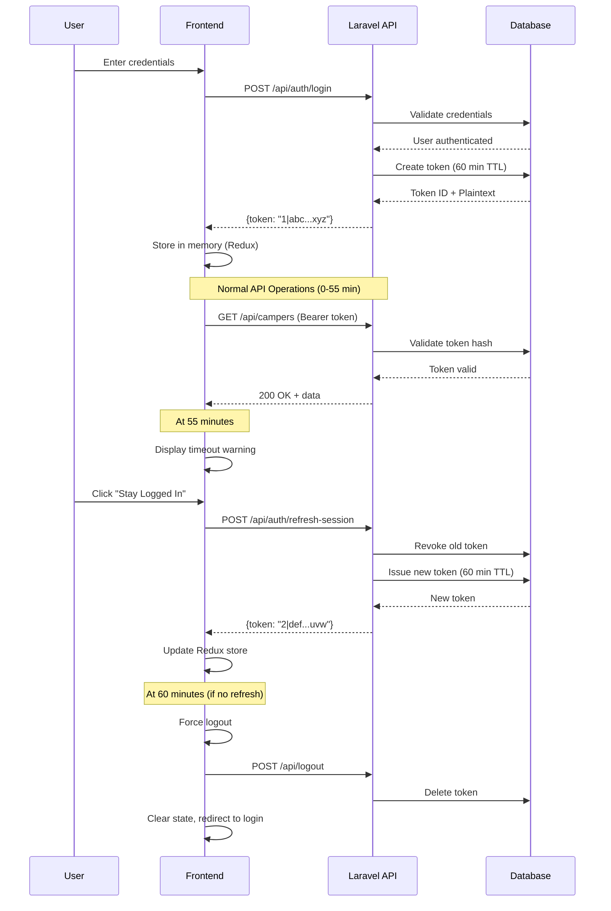
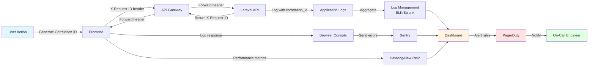

# Frontend Architecture Considerations
## Camp Burnt Gin Application Software

**Document Type:** Technical Architecture Guidance
**Intended Audience:** Frontend Development Team
**Purpose:** Define frontend planning, architecture, UI flows, component design, security boundaries, API contracts, and state management
**Backend Version:** Laravel 12.0 REST API
**Date:** February 13, 2026
**Status:** Authoritative

---

## Document Alignment

This document aligns with:
- **System Requirements Specification (SRS)** — Deliverable 2
- **Software Development & Design Document** — Deliverable 3
- **Interview Documentation** — Deliverable 1
- **Phase 1 Rubric** — CSCI 475

The frontend must maintain:
- HIPAA compliance for Protected Health Information (PHI)
- Role-Based Access Control (RBAC) enforcement
- Multi-Factor Authentication (MFA) requirement
- Mobile-first responsive design
- Modular, scalable architecture
- Requirements Traceability Matrix (RTM) alignment

---

## Terminology Clarification

To ensure architectural precision, the following terms have specific meanings throughout this document:

| Term | Definition | Context |
|------|------------|---------|
| **Camp** | Organizational entity representing the Camp Burnt Gin program | System configuration |
| **Camp Session** | Time-bound program instance with specific dates, capacity, and age requirements | Registration target |
| **Camper** | Child participant registered by a parent/guardian for a camp session | Primary data subject |
| **Parent/Guardian** | Legal guardian who creates camper profiles and submits applications | Primary system user |
| **Medical Provider** | Healthcare professional with authenticated access to Protected Health Information | PHI-authorized role |
| **Application** | Formal registration request linking a camper to a specific camp session | Core workflow entity |

**Critical Distinction:** When this document references "camper management," it refers exclusively to managing child participant records, not camp organizational data. Camp and session management are administrative functions restricted to the Administrator role.

---

## 1. Executive Summary

### 1.1 Backend Architecture

The Camp Burnt Gin Application Software backend is an enterprise-grade RESTful API built with Laravel 12.0 and PHP 8.2+. The system implements security-first architecture for handling Protected Health Information in HIPAA-compliant environments. The architecture follows Model-View-Controller (MVC) pattern with service layer enhancement, policy-based authorization, and comprehensive audit logging.

The backend has achieved 100% completion of 114 requirements across authentication, user management, camp operations, camper registration, application workflows, medical information handling, document management, notifications, and administrative reporting. All APIs are production-ready with 228 automated tests covering 430 assertions.

**Technology Stack:**

| Layer | Technology | Version | Purpose |
|-------|-----------|---------|---------|
| Framework | Laravel | 12.0 | Core application framework |
| Language | PHP | 8.2+ | Server-side programming |
| Authentication | Laravel Sanctum | 4.2 | Token-based API authentication |
| MFA | PragmaRX Google2FA | 9.0 | TOTP two-factor authentication |
| Database | MySQL/MariaDB | 8.0+ | Data persistence |
| ORM | Eloquent | Laravel 12 | Database abstraction |
| Authorization | Policies + Middleware | Laravel 12 | RBAC enforcement |
| Queue | Laravel Queues | Laravel 12 | Async job processing |
| Storage | Laravel Storage | Laravel 12 | Document management |
| Email | Laravel Mail | Laravel 12 | Notification delivery |
| Testing | PHPUnit + Pest | Latest | Automated testing |

**Architectural Characteristics:**

- **Stateless:** Token authentication enables horizontal scalability
- **Resource-Oriented:** RESTful resources with standard HTTP verbs
- **Layered:** Routes → Controllers → Services → Models → Database
- **Service Layer:** Complex logic in dedicated service classes
- **Policy-Based:** Fine-grained access control via Policy classes
- **Event-Driven:** Async queues for notifications and heavy operations
- **Defense-in-Depth:** Multi-layer security (TLS, Sanctum, MFA, Policies, Validation, Audit)

**API Standards:**

- Content Type: `application/json`
- Authentication: `Authorization: Bearer {token}`
- Base Path: `/api`
- Versioning: Implicit v1 (future: `/api/v2` for breaking changes)
- Pagination: Laravel format, 15 items default
- Rate Limiting: Tiered (5/min auth, 60/min general)

### 1.2 Frontend Integration Requirements

**Authentication & Session:**
- Secure token storage (memory-only recommended)
- 60-minute token expiration with graceful timeout
- MFA TOTP verification flow
- Account lockout detection (15 minutes after 5 failures)
- Password reset with email token verification

**Role-Based Access Control:**
- Route guards for Administrator, Parent, Medical Provider roles
- Conditional UI rendering based on role and ownership
- Data scoping to prevent unauthorized exposure
- Clear access denial messaging

**Application Workflow:**
- Draft auto-save functionality
- Digital signature capture
- Six-state workflow: pending, under_review, approved, rejected, waitlisted, cancelled
- Edit prevention for final states
- Status transition notifications

**File Handling:**
- Client validation: 10 MB max, specific MIME types
- Upload progress with cancellation
- Security scan status checks (pending, passed, failed)
- Medical provider link expiration handling
- Drag-and-drop interface

**Performance:**
- Route-based lazy loading
- Pagination for large datasets
- Rate limit handling with retry timers
- Static data caching with TTL
- Optimistic UI updates

**Security & HIPAA:**
- No PHI in localStorage/sessionStorage
- State clearing on logout
- Automatic logout on expiration
- No PHI in URLs
- Audit event logging
- Console log protection

**Data Model Alignment:**
- Frontend state mirrors backend Eloquent models
- Referential integrity maintenance
- Validation rule matching
- Polymorphic relationship support

---

## 2. Backend API Surface Analysis

### 2.1 API Configuration

| Configuration | Value |
|--------------|-------|
| Base URL | `/api` |
| Protocol | HTTPS (production enforced) |
| Content Type | `application/json` |
| Authentication | Bearer token in `Authorization` header |
| Token Format | `Bearer {token_id}\|{token_string}` |
| Encoding | UTF-8 |
| DateTime Format | ISO 8601 (`YYYY-MM-DDTHH:MM:SS.ssssssZ`) |
| Pagination | Laravel format with `data`, `links`, `meta` |

### 2.2 Authentication Endpoints

All authentication endpoints are public but rate-limited (5/min, 20/hour per IP).

#### POST /api/auth/register

Creates new user account (defaults to parent role).

**Request:**
```json
{
  "name": "Jane Doe",
  "email": "jane.doe@example.com",
  "password": "SecurePassword123!",
  "password_confirmation": "SecurePassword123!"
}
```

**Validation:**
- `name`: required, string, max 255 chars
- `email`: required, valid email, unique
- `password`: required, min 12 chars, uppercase, lowercase, number, symbol, confirmed, not compromised (haveibeenpwned check)

**Response (201):**
```json
{
  "user": {
    "id": 1,
    "name": "Jane Doe",
    "email": "jane.doe@example.com",
    "role_id": 2,
    "role": {"id": 2, "name": "parent", "display_name": "Parent"},
    "mfa_enabled": false,
    "created_at": "2026-02-13T10:30:00.000000Z"
  },
  "token": "1|KpPJQm8tGqHZ5wNrYxV3LbC7DfMj4sRt"
}
```

**Error (422):**
```json
{
  "message": "The given data was invalid.",
  "errors": {
    "email": ["The email has already been taken."],
    "password": ["The password must be at least 12 characters."]
  }
}
```

#### POST /api/auth/login

Authenticates user and issues token.

**Request (without MFA):**
```json
{
  "email": "jane.doe@example.com",
  "password": "SecurePassword123!"
}
```

**Request (with MFA):**
```json
{
  "email": "jane.doe@example.com",
  "password": "SecurePassword123!",
  "mfa_code": "123456"
}
```

**Response (200):**
```json
{
  "user": {
    "id": 1,
    "name": "Jane Doe",
    "email": "jane.doe@example.com",
    "role_id": 2,
    "role": {"id": 2, "name": "parent", "display_name": "Parent"},
    "mfa_enabled": true,
    "created_at": "2026-02-13T10:30:00.000000Z"
  },
  "token": "1|KpPJQm8tGqHZ5wNrYxV3LbC7DfMj4sRt",
  "expires_at": "2026-02-13T11:30:00.000000Z"
}
```

**Error (401 - Invalid Credentials):**
```json
{
  "message": "Invalid credentials."
}
```

**Error (403 - Account Locked):**
```json
{
  "success": false,
  "message": "Account locked due to too many failed attempts. Try again in 14 minute(s).",
  "lockout": true,
  "retry_after": 840
}
```

#### POST /api/auth/forgot-password

Sends password reset email.

**Request:**
```json
{
  "email": "jane.doe@example.com"
}
```

**Response (200):**
```json
{
  "message": "Password reset link sent to your email address."
}
```

*Note: Always returns 200 to prevent email enumeration.*

#### POST /api/auth/reset-password

Resets password using emailed token.

**Request:**
```json
{
  "email": "jane.doe@example.com",
  "token": "64-character-reset-token",
  "password": "NewSecurePassword123!",
  "password_confirmation": "NewSecurePassword123!"
}
```

**Response (200):**
```json
{
  "message": "Password has been reset successfully."
}
```

### 2.3 Multi-Factor Authentication Endpoints

Authenticated, rate-limited: 3/min, 10/hour per user.

#### POST /api/mfa/setup

Initializes MFA enrollment.

**Response (200):**
```json
{
  "secret": "BASE32ENCODEDSECRETKEY",
  "qr_code_url": "otpauth://totp/Camp%20Burnt%20Gin:jane.doe@example.com?secret=BASE32ENCODEDSECRETKEY&issuer=Camp%20Burnt%20Gin",
  "manual_entry_key": "BASE32 ENCODED SECRET KEY"
}
```

#### POST /api/mfa/verify

Verifies TOTP code and enables MFA.

**Request:**
```json
{
  "code": "123456"
}
```

**Response (200):**
```json
{
  "message": "MFA has been enabled successfully.",
  "mfa_enabled": true,
  "mfa_verified_at": "2026-02-13T10:35:00.000000Z"
}
```

#### POST /api/mfa/disable

Disables MFA (requires password + TOTP).

**Request:**
```json
{
  "password": "SecurePassword123!",
  "code": "123456"
}
```

**Response (200):**
```json
{
  "message": "MFA has been disabled successfully.",
  "mfa_enabled": false
}
```

### 2.4 User Profile Endpoints

#### GET /api/user

Returns authenticated user profile.

**Response (200):**
```json
{
  "id": 1,
  "name": "Jane Doe",
  "email": "jane.doe@example.com",
  "role_id": 2,
  "role": {"id": 2, "name": "parent", "display_name": "Parent"},
  "mfa_enabled": true,
  "created_at": "2026-02-13T10:30:00.000000Z",
  "updated_at": "2026-02-13T10:30:00.000000Z"
}
```

#### POST /api/logout

Revokes current token.

**Response (200):**
```json
{
  "message": "Logged out successfully."
}
```

#### PUT /api/profile

Updates user profile.

**Request:**
```json
{
  "name": "Jane Marie Doe",
  "email": "jane.m.doe@example.com"
}
```

#### GET /api/profile/prefill

Returns pre-fill data for returning parents/guardians.

**Response (200):**
```json
{
  "campers": [
    {
      "id": 1,
      "first_name": "Sarah",
      "last_name": "Doe",
      "date_of_birth": "2015-03-15",
      "gender": "female"
    }
  ],
  "emergency_contacts": [
    {
      "name": "John Doe",
      "relationship": "father",
      "primary_phone": "555-0100",
      "is_primary": true
    }
  ]
}
```

### 2.5 Camp Management Endpoints

| Method | Endpoint | Auth | Role | Description |
|--------|----------|------|------|-------------|
| GET | `/api/camps` | Yes | Any | List active camps |
| GET | `/api/camps/{id}` | Yes | Any | Get camp details |
| POST | `/api/camps` | Yes | Admin | Create camp |
| PUT | `/api/camps/{id}` | Yes | Admin | Update camp |
| DELETE | `/api/camps/{id}` | Yes | Admin | Delete camp |

#### GET /api/camps

**Response (200):**
```json
{
  "data": [
    {
      "id": 1,
      "name": "Camp Burnt Gin Summer 2026",
      "description": "Week-long summer camp for children with special health care needs",
      "location": "Burnt Gin Camp Facility, VA",
      "is_active": true,
      "created_at": "2025-11-01T10:00:00.000000Z",
      "sessions_count": 3
    }
  ]
}
```

### 2.6 Camp Session Endpoints

| Method | Endpoint | Auth | Role | Description |
|--------|----------|------|------|-------------|
| GET | `/api/sessions` | Yes | Any | List sessions with filters |
| GET | `/api/sessions/{id}` | Yes | Any | Get session details |
| POST | `/api/sessions` | Yes | Admin | Create session |
| PUT | `/api/sessions/{id}` | Yes | Admin | Update session |
| DELETE | `/api/sessions/{id}` | Yes | Admin | Delete session |

**Query Parameters:**
- `camp_id`: Filter by camp
- `is_active`: Filter by status

### 2.7 Camper Endpoints

| Method | Endpoint | Auth | Role | Description |
|--------|----------|------|------|-------------|
| GET | `/api/campers` | Yes | Admin, Parent | List child participants (scoped by role) |
| POST | `/api/campers` | Yes | Admin, Parent | Create child participant profile |
| GET | `/api/campers/{id}` | Yes | Admin, Parent (own) | Get child participant details |
| PUT | `/api/campers/{id}` | Yes | Admin, Parent (own) | Update child participant profile |
| DELETE | `/api/campers/{id}` | Yes | Admin, Parent (own) | Soft delete child participant |

**Note:** "Camper" refers exclusively to child participants registered by parents/guardians.

#### POST /api/campers

**Request:**
```json
{
  "first_name": "Sarah",
  "last_name": "Doe",
  "date_of_birth": "2015-03-15",
  "gender": "female"
}
```

**Validation:**
- `first_name`: required, string, max 255
- `last_name`: required, string, max 255
- `date_of_birth`: required, date, before today
- `gender`: nullable, string, max 50

### 2.8 Application Endpoints

| Method | Endpoint | Auth | Role | Description |
|--------|----------|------|------|-------------|
| GET | `/api/applications` | Yes | Admin, Parent | List with filters |
| POST | `/api/applications` | Yes | Admin, Parent | Create (draft/submit) |
| GET | `/api/applications/{id}` | Yes | Admin, Parent (own) | Get details |
| PUT | `/api/applications/{id}` | Yes | Admin, Parent (own) | Update |
| POST | `/api/applications/{id}/sign` | Yes | Admin, Parent (own) | Digital signature |
| POST | `/api/applications/{id}/review` | Yes | Admin | Approve/reject/waitlist |
| DELETE | `/api/applications/{id}` | Yes | Admin | Delete |

**Query Parameters:**
- `status`: pending, under_review, approved, rejected, waitlisted, cancelled
- `camp_session_id`: Filter by session
- `date_from`, `date_to`: Date range
- `search`: Child participant name search
- `page`, `per_page`: Pagination

#### POST /api/applications

**Request (Draft):**
```json
{
  "camper_id": 1,
  "camp_session_id": 1,
  "is_draft": true
}
```

**Request (Submit):**
```json
{
  "camper_id": 1,
  "camp_session_id": 1,
  "is_draft": false
}
```

**Constraint:** One application per child participant per session.

#### POST /api/applications/{id}/sign

**Request:**
```json
{
  "signature_data": "data:image/png;base64,iVBORw0KGgo...",
  "signature_name": "Jane Doe"
}
```

#### POST /api/applications/{id}/review

**Request:**
```json
{
  "status": "approved",
  "notes": "Application approved. All requirements met."
}
```

**Status Options:** approved, rejected, waitlisted

### 2.9 Medical Record Endpoints

| Method | Endpoint | Auth | Role | Description |
|--------|----------|------|------|-------------|
| GET | `/api/medical-records` | Yes | Admin, Medical, Parent | List records (scoped) |
| POST | `/api/medical-records` | Yes | Admin, Medical, Parent | Create record |
| GET | `/api/medical-records/{id}` | Yes | Admin, Medical, Parent (own) | Get details |
| PUT | `/api/medical-records/{id}` | Yes | Admin, Medical, Parent (own) | Update record |
| DELETE | `/api/medical-records/{id}` | Yes | Admin | Delete record |

### 2.10 Allergy Endpoints

| Method | Endpoint | Auth | Role | Description |
|--------|----------|------|------|-------------|
| GET | `/api/allergies` | Yes | Admin, Medical, Parent | List allergies (scoped) |
| POST | `/api/allergies` | Yes | Admin, Medical, Parent | Create allergy |
| GET | `/api/allergies/{id}` | Yes | Admin, Medical, Parent (own) | Get details |
| PUT | `/api/allergies/{id}` | Yes | Admin, Medical, Parent (own) | Update |
| DELETE | `/api/allergies/{id}` | Yes | Admin, Parent (own) | Delete |

**Note:** Medical providers can create/update but not delete allergies.

### 2.11 Medication Endpoints

| Method | Endpoint | Auth | Role | Description |
|--------|----------|------|------|-------------|
| GET | `/api/medications` | Yes | Admin, Medical, Parent | List medications (scoped) |
| POST | `/api/medications` | Yes | Admin, Medical, Parent | Create medication |
| GET | `/api/medications/{id}` | Yes | Admin, Medical, Parent (own) | Get details |
| PUT | `/api/medications/{id}` | Yes | Admin, Medical, Parent (own) | Update |
| DELETE | `/api/medications/{id}` | Yes | Admin, Parent (own) | Delete |

**Note:** Medical providers can create/update but not delete medications.

### 2.12 Emergency Contact Endpoints

| Method | Endpoint | Auth | Role | Description |
|--------|----------|------|------|-------------|
| GET | `/api/emergency-contacts` | Yes | Admin, Medical, Parent | List contacts (scoped) |
| POST | `/api/emergency-contacts` | Yes | Admin, Parent | Create contact |
| GET | `/api/emergency-contacts/{id}` | Yes | Admin, Medical, Parent (own) | Get details |
| PUT | `/api/emergency-contacts/{id}` | Yes | Admin, Parent (own) | Update |
| DELETE | `/api/emergency-contacts/{id}` | Yes | Admin, Parent (own) | Delete |

**Note:** Medical providers have read-only access.

### 2.13 Document Endpoints

| Method | Endpoint | Auth | Role | Description |
|--------|----------|------|------|-------------|
| GET | `/api/documents` | Yes | Admin, Parent | List documents |
| POST | `/api/documents` | Yes | Admin, Parent | Upload document |
| GET | `/api/documents/{id}` | Yes | Admin, Parent (own) | Get metadata |
| GET | `/api/documents/{id}/download` | Yes | Admin, Parent (own) | Download file |
| DELETE | `/api/documents/{id}` | Yes | Admin, Parent (own) | Delete document |

**Upload Constraints:**
- Max size: 10 MB
- Allowed: PDF, JPG, PNG, GIF, DOC, DOCX
- Blocked: EXE, BAT, CMD, SH, PHP, JS, VBS, COM, PIF, SCR

**Security Scanning:**
- Status: pending, passed, failed
- Downloads blocked if scan failed (non-admin users)

### 2.14 Medical Provider Link Endpoints

| Method | Endpoint | Auth | Role | Description |
|--------|----------|------|------|-------------|
| GET | `/api/medical-provider-links` | Yes | Admin, Parent | List links |
| POST | `/api/medical-provider-links` | Yes | Admin, Parent | Create secure link |
| GET | `/api/medical-provider-links/{token}/validate` | No | None | Validate link |
| POST | `/api/medical-provider-links/{token}/submit` | No | None | Submit via link |
| POST | `/api/medical-provider-links/{id}/revoke` | Yes | Admin, Parent (own) | Revoke link |

**Link Properties:**
- 72-hour expiration
- Single-use (consumed on first submission)
- Secure token-based access
- Email delivery to medical provider

### 2.15 Report Endpoints

| Method | Endpoint | Auth | Role | Description |
|--------|----------|------|------|-------------|
| GET | `/api/reports/applications` | Yes | Admin | Applications summary |
| GET | `/api/reports/accepted-applicants` | Yes | Admin | Accepted list |
| GET | `/api/reports/rejected-applicants` | Yes | Admin | Rejected list |
| GET | `/api/reports/mailing-labels` | Yes | Admin | Mailing labels |
| GET | `/api/reports/id-labels` | Yes | Admin | ID labels |

**Query Parameters:**
- `camp_session_id`: Filter by session
- `format`: pdf, csv, excel

### 2.16 Notification Endpoints

| Method | Endpoint | Auth | Role | Description |
|--------|----------|------|------|-------------|
| GET | `/api/notifications` | Yes | Any | List notifications |
| POST | `/api/notifications/{id}/mark-read` | Yes | Any | Mark as read |
| POST | `/api/notifications/mark-all-read` | Yes | Any | Mark all read |

**Notification Types:**
- application_submitted
- application_reviewed
- document_uploaded
- medical_provider_link_accessed
- session_reminder
- account_activity

**Delivery Channels:**
- Email (always enabled)
- In-app (polled via API)

### 2.17 API Versioning Strategy

#### 2.17.1 Versioning Mechanism

The Camp Burnt Gin API uses **URL-based versioning** for explicit version management and clear deprecation boundaries.

**Current State:** Implicit v1 (no version prefix)
- All endpoints: `/api/resource`
- Assumed version: 1.0

**Future State:** Explicit versioning for v2+
- Version 2 endpoints: `/api/v2/resource`
- Legacy v1 endpoints: `/api/resource` (maintained during transition)

**Rationale:** URL-based versioning provides:
- Clear visual indication of API version in client code
- Simplified proxy/gateway routing rules
- Explicit deprecation timeline (URL remains but returns deprecation warnings)
- Easier client migration planning

#### 2.17.2 Versioning Policy Matrix

| Change Type | Versioning Impact | Strategy | Example |
|-------------|-------------------|----------|---------|
| **Additive (non-breaking)** | No version increment | Add to current version | New optional field in response |
| **Modification (breaking)** | Major version increment | Create new version, maintain old | Change field type from `string` to `int` |
| **Removal (breaking)** | Major version increment | Create new version, deprecate old | Remove deprecated field |
| **Behavioral change** | Major version increment | Create new version | Change validation rules |
| **Bug fix** | No version increment | Patch current version | Fix incorrect calculation |

**Breaking Change Definition:**
- Removing or renaming a field
- Changing field data type
- Changing response structure
- Modifying status code behavior
- Altering authentication requirements
- Changing error response format

#### 2.17.3 Deprecation Strategy

| Phase | Timeline | Backend Behavior | Frontend Impact |
|-------|----------|------------------|-----------------|
| **1. Announcement** | T+0 | Document deprecation, set sunset date | No impact - plan migration |
| **2. Warning Period** | T+3 months | Add `Deprecation: true` header to responses | Display console warnings in dev mode |
| **3. Sunset Warning** | T+6 months | Add `Sunset: <date>` header (RFC 8594) | Display in-app migration prompts |
| **4. Sunset** | T+12 months | Return `HTTP 410 Gone` for deprecated endpoints | Force client upgrade |
| **5. Removal** | T+18 months | Remove endpoint code from codebase | N/A (clients must have migrated) |

**Example Deprecation Response Headers:**
```http
HTTP/1.1 200 OK
Deprecation: true
Sunset: Sat, 31 Dec 2027 23:59:59 GMT
Link: </api/v2/campers>; rel="alternate"; type="application/json"
Warning: 299 - "This endpoint is deprecated. Migrate to /api/v2/campers before Dec 2027."
```

#### 2.17.4 Breaking Change Policy

**When Breaking Changes Are Allowed:**
- Major version releases only (v1 → v2, v2 → v3)
- After 3-month public announcement period
- With migration guide published
- With parallel version support (minimum 12 months)

**When Breaking Changes Are Prohibited:**
- Within minor versions (v1.1 → v1.2)
- Within patch versions (v1.1.1 → v1.1.2)
- Without deprecation warnings
- For actively used endpoints (>10% traffic)

**Migration Approach:**
1. Publish v2 endpoints with breaking changes
2. Maintain v1 endpoints unchanged (deprecation warnings only)
3. Provide automated migration tooling where feasible
4. Monitor v1 traffic until < 5% of total
5. Sunset v1 endpoints after 12-month minimum support window

#### 2.17.5 Backward Compatibility Guarantees

| Version | Guarantee | Support Window | EOL Policy |
|---------|-----------|----------------|------------|
| **Current (v1)** | No breaking changes within v1.x | Until v2.0 sunsets v1 | Minimum 12 months after v2 release |
| **Previous Major (v2 after v3 release)** | Security patches only | 12 months | Hard cutoff after 18 months |
| **Legacy (v1 after v2 sunset)** | No support | 0 months | Immediate 410 Gone response |

**Frontend Impact:**
- Frontend must specify API version explicitly (via URL or header)
- Frontend should monitor response headers for deprecation warnings
- Frontend should implement version-agnostic abstractions (API service layer)

#### 2.17.6 Minimum Support Window

**API Version Support Lifecycle:**

```
v1.0 Release ━━━━━━━━━━━━━━━━━━━━━━━━━━━━━━━━━━━━━━━━━━┓
                                                      ┃
    v2.0 Release ━━━━━━━━━━━━━━━━━━━━━━━━━━━━━━━━━━━━┓┃
                                                      ┃┃
        v1 Deprecation Period (3 months) ────────────┨┃
                                                      ┃┃
        v1 Sunset Warning Period (6 months) ─────────┨┃
                                                      ┃┃
        v1 Sunset (12 months minimum) ───────────────┨┃
                                                      ┃┃
        v1 Removal (18 months) ──────────────────────┛┃
                                                       ┃
            v3.0 Release ━━━━━━━━━━━━━━━━━━━━━━━━━━━━━┓┃
                                                      ┃┃
                v2 Deprecation Period (3 months) ────┨┃
                                                      ┃┃
                v2 Sunset (12 months minimum) ───────┨┃
                                                      ┃┃
                v2 Removal (18 months) ──────────────┛┃
                                                       ┃
                    v2 Active Support ─────────────────┛
```

**Minimum Support Windows:**
- **Active Support:** Indefinite (until next major version release)
- **Deprecation Warning:** Minimum 3 months
- **Sunset Warning:** Minimum 6 months
- **Parallel Support:** Minimum 12 months after new version release
- **Grace Period:** Additional 6 months before hard removal (18 months total)

#### 2.17.7 Frontend Version Detection

**Recommended Implementation:**
```typescript
// api/config.ts
export const API_VERSION = import.meta.env.VITE_API_VERSION || 'v1';
export const API_BASE_URL = import.meta.env.VITE_API_BASE_URL || '/api';

// For v1 (current): /api/campers
// For v2 (future): /api/v2/campers
export const getVersionedUrl = (endpoint: string): string => {
  if (API_VERSION === 'v1') {
    return `${API_BASE_URL}${endpoint}`;
  }
  return `${API_BASE_URL}/${API_VERSION}${endpoint}`;
};

// Deprecation warning interceptor
axios.interceptors.response.use(response => {
  const deprecation = response.headers['deprecation'];
  const sunset = response.headers['sunset'];

  if (deprecation && import.meta.env.DEV) {
    console.warn(`API Deprecation Warning: ${response.config.url}`);
    if (sunset) {
      console.warn(`Sunset Date: ${sunset}`);
    }
  }

  return response;
});
```

---

## 3. Authentication & Session Architecture

### 3.1 Token-Based Authentication Flow

```
1. User submits credentials → POST /api/auth/login
2. Backend validates credentials
3. If MFA enabled → Backend requires mfa_code
4. Backend issues token (60-minute TTL)
5. Frontend stores token in memory (Redux store)
6. All subsequent requests include: Authorization: Bearer {token}
7. Token expires after 60 minutes (HIPAA requirement)
8. Frontend rotates token proactively at 55 minutes (revoke old, issue new)
9. On logout → POST /api/logout revokes token
```

**Note:** Token "refresh" is implemented as token rotation (revoke + reissue) via custom endpoint. See Section 3.6 for detailed lifecycle documentation.

### 3.2 Multi-Factor Authentication Flow

**Initial Setup (First Login):**

```
1. User logs in with credentials
2. Backend response indicates mfa_enabled: false
3. Frontend redirects to MFA setup
4. Call POST /api/mfa/setup → Receive QR code
5. Display QR code for user to scan with authenticator app
6. User enters 6-digit TOTP code
7. Call POST /api/mfa/verify {code: "123456"}
8. Backend enables MFA, returns confirmation
9. Frontend proceeds to dashboard
```

**Subsequent Logins:**

```
1. User submits email + password
2. Backend requires MFA code (returns error if missing)
3. User enters 6-digit code from authenticator app
4. Frontend submits POST /api/auth/login {email, password, mfa_code}
5. Backend validates TOTP code
6. Backend issues token if valid
7. Frontend stores token and proceeds
```

### 3.3 Session Timeout Implementation

**HIPAA Requirement:** 60-minute automatic logout

**Frontend Implementation:**

```
1. Store token expiration time (now + 60 minutes)
2. Start idle timer
3. At 55 minutes → Display warning modal
4. Show 5-minute countdown
5. Provide "Stay Logged In" button
6. If clicked → Refresh token, reset timer
7. If not clicked → Force logout at 60 minutes
8. Auto-save draft data before logout
9. Clear all PHI from application state
10. Redirect to login page
```

### 3.4 Account Lockout Handling

**Backend Behavior:**
- 5 failed login attempts → Account locked
- Lockout duration: 15 minutes
- Additional attempts extend lockout by 10 minutes

**Frontend Response:**

```typescript
// Detect lockout
if (response.status === 403 && response.data.lockout) {
  const retryAfter = response.data.retry_after; // seconds

  // Display countdown timer
  displayLockoutMessage(`Account locked. Retry in ${formatTime(retryAfter)}`);

  // Start countdown
  startCountdown(retryAfter);

  // Disable login form
  disableLoginForm();
}
```

### 3.5 Password Requirements

**Backend Validation:**
- Minimum 12 characters
- At least one uppercase letter
- At least one lowercase letter
- At least one number
- At least one symbol
- Not compromised (haveibeenpwned API check)

**Frontend Implementation:**
- Real-time validation display
- Password strength meter
- Visual requirement checklist
- Immediate feedback on input

### 3.6 Token Lifecycle & Session Strategy

#### 3.6.1 Laravel Sanctum Token Architecture

Laravel Sanctum uses **stateless personal access tokens** for API authentication. Unlike session-based authentication or OAuth refresh token patterns, Sanctum tokens do not support native token refresh. The token lifecycle is deterministic and immutable.

**Token Structure:**
```
{token_id}|{plaintext_token}
Example: 1|KpPJQm8tGqHZ5wNrYxV3LbC7DfMj4sRt
```

**Token Properties:**
- **Token ID:** Database reference (visible)
- **Plaintext Token:** SHA-256 hashed in database (never retrievable after issuance)
- **Expiration:** Configured via `sanctum.expiration` (default: 60 minutes for HIPAA compliance)
- **Revocation:** Achieved via token deletion (logout, manual revocation, expiration cleanup)

#### 3.6.2 Token Lifecycle Diagram



#### 3.6.3 Token Refresh Strategy

**Critical Clarification:** Laravel Sanctum does not natively support token refresh in the OAuth 2.0 sense. Token "refresh" is implemented as **re-authentication with automatic token rotation**.

**Recommended Implementation:**

| Approach | Mechanism | Security Posture | User Experience |
|----------|-----------|------------------|-----------------|
| **Proactive Rotation** | At 55 min, call custom refresh endpoint that revokes old token and issues new token | High - Short-lived tokens | Seamless - User unaware |
| **Forced Re-authentication** | At 60 min, force logout and require re-login | Highest - No token extension | Disruptive - HIPAA compliant |

**Selected Approach for Camp Burnt Gin:** **Proactive Rotation with User Consent**

**Implementation Requirements:**

1. **Backend:** Create custom `POST /api/auth/refresh-session` endpoint
   ```php
   public function refreshSession(Request $request)
   {
       $user = $request->user();

       // Revoke current token
       $request->user()->currentAccessToken()->delete();

       // Issue new token (60 min TTL)
       $newToken = $user->createToken('auth_token', ['*'], now()->addMinutes(60));

       return response()->json(['token' => $newToken->plainTextToken]);
   }
   ```

2. **Frontend:** Implement warning modal at 55 minutes
   ```typescript
   useEffect(() => {
     const expiresAt = loginTime + 55 * 60 * 1000; // 55 min
     const timeoutId = setTimeout(() => {
       setShowSessionWarning(true);
     }, expiresAt - Date.now());

     return () => clearTimeout(timeoutId);
   }, [loginTime]);
   ```

3. **Frontend:** Automatic forced logout at 60 minutes if no action taken
   ```typescript
   useEffect(() => {
     if (showSessionWarning) {
       const forceLogoutId = setTimeout(() => {
         dispatch(logout());
         navigate('/login');
       }, 5 * 60 * 1000); // 5 min countdown

       return () => clearTimeout(forceLogoutId);
     }
   }, [showSessionWarning]);
   ```

#### 3.6.4 Session Expiration Handling Matrix

| Scenario | Frontend Behavior | Backend Behavior | User Experience |
|----------|-------------------|------------------|-----------------|
| **Token expires (60 min)** | Detect 401, clear state, redirect to login | Return 401 Unauthorized | "Session expired. Please log in again." |
| **User clicks "Stay Logged In" at 55 min** | Call refresh endpoint, update Redux token | Revoke old token, issue new token | Seamless continuation |
| **User ignores warning at 55 min** | Force logout at 60 min, clear PHI | Token expires naturally | Redirect to login with message |
| **Token manually revoked (logout)** | Clear state immediately | Delete token from database | Immediate logout |
| **Concurrent session detection** | Detect 401 on API call, force logout | Token already deleted | "You've been logged out from another device." |

#### 3.6.5 Token Storage Strategy

**HIPAA Compliance Requirement:** Tokens providing access to PHI must not persist beyond session lifetime.

| Storage Location | Security Level | Persistence | Recommendation |
|------------------|----------------|-------------|----------------|
| **localStorage** | Low - Persistent, XSS vulnerable | Survives page refresh, browser close | ❌ **Never use for auth tokens** |
| **sessionStorage** | Medium - Session-scoped, XSS vulnerable | Cleared on tab close | ❌ **Not recommended** |
| **Cookie (httpOnly)** | High - Server-controlled, XSS resistant | Configurable | ⚠️ **Not applicable** (Sanctum uses Bearer tokens, not cookies for SPA) |
| **Memory (Redux)** | Medium - No persistence, XSS vulnerable | Cleared on page refresh | ✅ **Required for HIPAA** |

**Selected Approach:** Memory-only storage (Redux state)

**Implementation:**
```typescript
// store/slices/authSlice.ts
const authSlice = createSlice({
  name: 'auth',
  initialState: {
    token: null, // Never persisted
    user: null,
    loginTime: null,
  },
  reducers: {
    setCredentials: (state, action) => {
      state.token = action.payload.token;
      state.user = action.payload.user;
      state.loginTime = Date.now();
    },
    logout: (state) => {
      state.token = null;
      state.user = null;
      state.loginTime = null;
    }
  }
});

// Note: No redux-persist configuration for auth slice
```

**Trade-off:** Page refresh forces re-authentication. This is acceptable and required for HIPAA compliance.

#### 3.6.6 Re-authentication Boundary Conditions

| Condition | Trigger | Frontend Action | User Impact |
|-----------|---------|-----------------|-------------|
| **Page refresh** | Token cleared from memory | Redirect to login | User must re-authenticate |
| **Browser restart** | Token cleared from memory | Redirect to login | User must re-authenticate |
| **Network interruption** | API calls fail | Display offline banner, retry on reconnect | Temporary, recovers automatically |
| **401 from backend** | Token expired or revoked | Force logout, redirect | User must re-authenticate |
| **60-minute expiration** | Timer reaches limit | Force logout | User must re-authenticate |

**Architectural Decision:** Accept page refresh logout as necessary security trade-off for HIPAA compliance.

---

## 4. Role-Based Access Control (RBAC)

### 4.1 Role Definitions

| Role | Code | Purpose | Target Audience |
|------|------|---------|-----------------|
| Administrator | `admin` | System and camp management | Camp staff, admins |
| Parent | `parent` | Self-service for families | Parents/guardians |
| Medical Provider | `medical` | Medical record review | Internal medical staff |

**Note:** External medical providers use unauthenticated token links, not the Medical Provider role.

### 4.2 Permission Matrix

#### Camper Management

| Operation | Admin | Parent | Medical |
|-----------|-------|--------|---------|
| List all child participants | Yes | Own only | No |
| View child participant | Yes | Own only | No |
| Create child participant | Yes | Yes | No |
| Update child participant | Yes | Own only | No |
| Delete child participant | Yes | Own only | No |

#### Application Management

| Operation | Admin | Parent | Medical |
|-----------|-------|--------|---------|
| List applications | Yes | Own only | No |
| View application | Yes | Own only | No |
| Create application | Yes | Yes (own campers) | No |
| Update application | Yes | Own only (if pending) | No |
| Sign application | Yes | Yes (own only) | No |
| Review application | Yes | No | No |
| Delete application | Yes | No | No |

#### Medical Records

| Operation | Admin | Parent | Medical |
|-----------|-------|--------|---------|
| List records | Yes | No | Yes |
| View record | Yes | Own campers | Yes |
| Create record | Yes | Yes (own campers) | No |
| Update record | Yes | Yes (own campers) | Yes |
| Delete record | Yes | No | No |

#### Allergies & Medications

| Operation | Admin | Parent | Medical |
|-----------|-------|--------|---------|
| List | Yes | No | Yes |
| View | Yes | Own campers | Yes |
| Create | Yes | Yes (own campers) | Yes |
| Update | Yes | Yes (own campers) | Yes |
| Delete | Yes | Yes (own campers) | No |

**Rationale:** Medical providers can document but not delete critical health information.

#### Emergency Contacts

| Operation | Admin | Parent | Medical |
|-----------|-------|--------|---------|
| List | Yes | No | Yes |
| View | Yes | Own campers | Yes |
| Create | Yes | Yes (own campers) | No |
| Update | Yes | Yes (own campers) | No |
| Delete | Yes | Yes (own campers) | No |

#### Documents

| Operation | Admin | Parent | Medical |
|-----------|-------|--------|---------|
| List | Yes | Own only | No |
| View | Yes | Own only | No |
| Upload | Yes | Yes | No |
| Download | Yes | Own only | No |
| Delete | Yes | Own only | No |

#### Medical Provider Links

| Operation | Admin | Parent | Medical |
|-----------|-------|--------|---------|
| List | Yes | Own only | No |
| View | Yes | Own only | No |
| Create | Yes | Yes (own campers) | No |
| Revoke | Yes | Yes (own links) | No |
| Resend | Yes | No | No |

#### Reports

| Operation | Admin | Parent | Medical |
|-----------|-------|--------|---------|
| All reports | Yes | No | No |

#### Camp Management

| Operation | Admin | Parent | Medical |
|-----------|-------|--------|---------|
| List camps | Yes | Yes (read) | No |
| View camp | Yes | Yes (read) | No |
| Create camp | Yes | No | No |
| Update camp | Yes | No | No |
| Delete camp | Yes | No | No |
| Manage sessions | Yes | No | No |

### 4.3 Frontend Authorization Implementation

**Route Protection:**

```typescript
// router/ProtectedRoute.tsx
import { Navigate, Outlet, useLocation } from 'react-router-dom';
import { useAppSelector } from '@/store/hooks';

interface ProtectedRouteProps {
  allowedRoles?: string[];
  requireMFA?: boolean;
}

export function ProtectedRoute({ allowedRoles, requireMFA = true }: ProtectedRouteProps) {
  const location = useLocation();
  const { isAuthenticated, user, mfaVerified } = useAppSelector(state => state.auth);

  if (!isAuthenticated) {
    return <Navigate to="/login" state={{ from: location }} replace />;
  }

  if (requireMFA && !mfaVerified) {
    return <Navigate to="/mfa/verify" replace />;
  }

  if (allowedRoles && !allowedRoles.includes(user?.role.name || '')) {
    return <Navigate to="/forbidden" replace />;
  }

  return <Outlet />;
}

// Usage in routes
<Route element={<ProtectedRoute allowedRoles={['admin']} />}>
  <Route path="/admin/reports" element={<ReportsView />} />
</Route>
```

**Permission Hook:**

```typescript
// hooks/usePermissions.ts
import { useMemo } from 'react';
import { useAppSelector } from '@/store/hooks';

export function usePermissions() {
  const user = useAppSelector(state => state.auth.user);

  const isAdmin = useMemo(() => user?.role.name === 'admin', [user]);
  const isParent = useMemo(() => user?.role.name === 'parent', [user]);
  const isMedical = useMemo(() => user?.role.name === 'medical', [user]);

  const canViewCamper = (camperId: number): boolean => {
    if (isAdmin) return true;
    if (isParent) {
      return user?.campers?.some(c => c.id === camperId) ?? false;
    }
    return false;
  };

  const canReviewApplication = (): boolean => {
    return isAdmin;
  };

  return { isAdmin, isParent, isMedical, canViewCamper, canReviewApplication };
}
```

**UI Conditional Rendering:**

```typescript
// components/applications/ApplicationActions.tsx
import { usePermissions } from '@/hooks/usePermissions';

export function ApplicationActions({ applicationId }: { applicationId: number }) {
  const { canReviewApplication, isAdmin, isParent } = usePermissions();

  return (
    <div className="flex gap-2">
      {canReviewApplication() && (
        <button
          className="px-4 py-2 bg-blue-600 text-white rounded hover:bg-blue-700"
          onClick={() => reviewApplication(applicationId)}
        >
          Review Application
        </button>
      )}

      {(isAdmin || isParent) && (
        <button className="px-4 py-2 bg-gray-600 text-white rounded hover:bg-gray-700">
          View Details
        </button>
      )}
    </div>
  );
}
```

---

## 5. Application Workflow Mapping

### 5.1 Application Status States

| Status | Description | Editable | Final State |
|--------|-------------|----------|-------------|
| `pending` | Submitted, awaiting admin review | No | No |
| `under_review` | Admin is reviewing | No | No |
| `approved` | Accepted for camp session | No | Yes |
| `rejected` | Denied | No | Yes |
| `waitlisted` | On waitlist | No | No |
| `cancelled` | Cancelled by parent/admin | No | Yes |

### 5.2 State Transitions

```
Draft (is_draft: true)
  ↓ Parent signs
Pending (submitted_at set)
  ↓ Admin begins review
Under Review
  ↓ Admin decision
  ├─→ Approved (final)
  ├─→ Rejected (final)
  └─→ Waitlisted
      ↓ Spot opens
      Approved (final)
```

### 5.3 Workflow Rules

**Draft State:**
- Editable by parent/guardian
- Not visible to admin review queue
- No signature required
- Auto-save every 30 seconds

**Submission Requirements:**
- Digital signature required
- Child participant profile complete
- Medical records submitted (if required by session)
- Terms accepted

**Review Process:**
- Only admins can review
- Review requires status selection and notes
- Status change triggers email notification
- Audit log entry created

**Final States:**
- Approved, Rejected, Cancelled are immutable
- No editing allowed
- Status visible to parents/guardians
- Included in reports

### 5.4 Frontend Implementation

**Draft Auto-Save:**

```typescript
// hooks/useAutoSave.ts
import { useEffect, useRef } from 'react';
import { applicationsApi } from '@/api/applications.api';

export function useAutoSave(formData: any, applicationId: number, interval = 30000) {
  const saveTimer = useRef<NodeJS.Timeout>();
  const lastSaved = useRef<Date>();

  useEffect(() => {
    const scheduleSave = async () => {
      if (saveTimer.current) clearTimeout(saveTimer.current);

      saveTimer.current = setTimeout(async () => {
        try {
          await applicationsApi.update(applicationId, {
            ...formData,
            is_draft: true
          });
          lastSaved.current = new Date();
        } catch (error) {
          console.error('Auto-save failed:', error);
        }
      }, interval);
    };

    scheduleSave();

    return () => {
      if (saveTimer.current) clearTimeout(saveTimer.current);
    };
  }, [formData, applicationId, interval]);

  return { lastSaved: lastSaved.current };
}
```

**Signature Capture:**

```typescript
// components/applications/SignatureCanvas.tsx
import { useRef, useState } from 'react';

export function SignatureCanvas({ onSave }: { onSave: (signature: string) => void }) {
  const canvasRef = useRef<HTMLCanvasElement>(null);
  const [isDrawing, setIsDrawing] = useState(false);

  const startDrawing = (e: React.MouseEvent<HTMLCanvasElement>) => {
    setIsDrawing(true);
    const ctx = canvasRef.current?.getContext('2d');
    if (ctx) {
      ctx.beginPath();
      ctx.moveTo(e.nativeEvent.offsetX, e.nativeEvent.offsetY);
    }
  };

  const draw = (e: React.MouseEvent<HTMLCanvasElement>) => {
    if (!isDrawing) return;
    const ctx = canvasRef.current?.getContext('2d');
    if (ctx) {
      ctx.lineTo(e.nativeEvent.offsetX, e.nativeEvent.offsetY);
      ctx.stroke();
    }
  };

  const stopDrawing = () => setIsDrawing(false);

  const clearSignature = () => {
    const ctx = canvasRef.current?.getContext('2d');
    if (ctx && canvasRef.current) {
      ctx.clearRect(0, 0, canvasRef.current.width, canvasRef.current.height);
    }
  };

  const saveSignature = () => {
    const dataUrl = canvasRef.current?.toDataURL('image/png');
    if (dataUrl) onSave(dataUrl);
  };

  return (
    <div className="space-y-4">
      <canvas
        ref={canvasRef}
        width={500}
        height={200}
        className="border-2 border-gray-300 rounded cursor-crosshair"
        onMouseDown={startDrawing}
        onMouseMove={draw}
        onMouseUp={stopDrawing}
        onMouseLeave={stopDrawing}
      />
      <div className="flex gap-2">
        <button
          onClick={clearSignature}
          className="px-4 py-2 bg-gray-500 text-white rounded hover:bg-gray-600"
        >
          Clear
        </button>
        <button
          onClick={saveSignature}
          className="px-4 py-2 bg-blue-600 text-white rounded hover:bg-blue-700"
        >
          Sign Application
        </button>
      </div>
    </div>
  );
}
```

**Status Badge Component:**

```typescript
// components/applications/StatusBadge.tsx
import { ApplicationStatus } from '@/types/application.types';

const statusConfig: Record<ApplicationStatus, { label: string; className: string }> = {
  pending: { label: 'Pending', className: 'bg-gray-500 text-white' },
  under_review: { label: 'Under Review', className: 'bg-blue-500 text-white' },
  approved: { label: 'Approved', className: 'bg-green-500 text-white' },
  rejected: { label: 'Rejected', className: 'bg-red-500 text-white' },
  waitlisted: { label: 'Waitlisted', className: 'bg-yellow-500 text-white' },
  cancelled: { label: 'Cancelled', className: 'bg-gray-500 text-white' }
};

export function StatusBadge({ status }: { status: ApplicationStatus }) {
  const config = statusConfig[status];

  return (
    <span className={`px-3 py-1 rounded-full text-sm font-medium ${config.className}`}>
      {config.label}
    </span>
  );
}
```

---

## 6. Data Models & Frontend State Design

### 6.1 TypeScript Type Definitions

```typescript
// types/user.types.ts
export interface User {
  id: number;
  name: string;
  email: string;
  role_id: number;
  role: Role;
  mfa_enabled: boolean;
  created_at: string;
  updated_at: string;
}

export interface Role {
  id: number;
  name: 'admin' | 'parent' | 'medical';
  display_name: string;
}

// types/camper.types.ts
export interface Camper {
  id: number;
  user_id: number;
  first_name: string;
  last_name: string;
  date_of_birth: string;
  gender: string | null;
  age: number;
  created_at: string;
  updated_at: string;
}

// types/application.types.ts
export type ApplicationStatus =
  | 'pending'
  | 'under_review'
  | 'approved'
  | 'rejected'
  | 'waitlisted'
  | 'cancelled';

export interface Application {
  id: number;
  camper_id: number;
  camp_session_id: number;
  status: ApplicationStatus;
  is_draft: boolean;
  submitted_at: string | null;
  reviewed_at: string | null;
  reviewed_by: number | null;
  signature_name: string | null;
  signed_at: string | null;
  created_at: string;
  updated_at: string;
  camper?: Camper;
  camp_session?: CampSession;
}

// types/medical.types.ts
export interface MedicalRecord {
  id: number;
  camper_id: number;
  diagnosis: string;
  treatment: string | null;
  physician_name: string | null;
  physician_phone: string | null;
  created_at: string;
  updated_at: string;
}

export interface Allergy {
  id: number;
  camper_id: number;
  allergen: string;
  reaction: string;
  severity: 'mild' | 'moderate' | 'severe' | 'life-threatening';
  treatment: string | null;
  created_at: string;
  updated_at: string;
}

export interface Medication {
  id: number;
  camper_id: number;
  name: string;
  dosage: string;
  frequency: string;
  administration_method: string | null;
  prescribing_physician: string | null;
  created_at: string;
  updated_at: string;
}

export interface EmergencyContact {
  id: number;
  camper_id: number;
  name: string;
  relationship: string;
  primary_phone: string;
  secondary_phone: string | null;
  is_primary: boolean;
  can_pickup: boolean;
  created_at: string;
  updated_at: string;
}

// types/document.types.ts
export type DocumentScanStatus = 'pending' | 'passed' | 'failed';

export interface Document {
  id: number;
  documentable_type: string;
  documentable_id: number;
  name: string;
  file_path: string;
  mime_type: string;
  size: number;
  scan_status: DocumentScanStatus;
  scanned_at: string | null;
  created_at: string;
  updated_at: string;
}

// types/notification.types.ts
export interface Notification {
  id: string;
  type: string;
  data: {
    title: string;
    message: string;
    action_url?: string;
  };
  read_at: string | null;
  created_at: string;
}

// types/camp.types.ts
export interface Camp {
  id: number;
  name: string;
  description: string;
  location: string;
  is_active: boolean;
  created_at: string;
  updated_at: string;
  sessions?: CampSession[];
}

export interface CampSession {
  id: number;
  camp_id: number;
  name: string;
  start_date: string;
  end_date: string;
  capacity: number;
  min_age: number;
  max_age: number;
  registration_opens_at: string;
  registration_closes_at: string;
  is_active: boolean;
  applications_count?: number;
  approved_count?: number;
  available_spots?: number;
}

// types/api.types.ts
export interface ApiResponse<T> {
  data: T;
  status: number;
  statusText: string;
}

export interface PaginatedResponse<T> {
  data: T[];
  links: {
    first: string;
    last: string;
    prev: string | null;
    next: string | null;
  };
  meta: {
    current_page: number;
    from: number;
    last_page: number;
    per_page: number;
    to: number;
    total: number;
  };
}

export interface ValidationError {
  message: string;
  errors: Record<string, string[]>;
}
```

### 6.2 Redux Toolkit Store Architecture

**Auth Slice:**

```typescript
// store/slices/authSlice.ts
import { createSlice, PayloadAction } from '@reduxjs/toolkit';
import type { User } from '@/types/user.types';

interface AuthState {
  token: string | null;
  tokenExpiry: Date | null;
  user: User | null;
  mfaVerified: boolean;
  isAuthenticated: boolean;
}

const initialState: AuthState = {
  token: null,
  tokenExpiry: null,
  user: null,
  mfaVerified: false,
  isAuthenticated: false
};

export const authSlice = createSlice({
  name: 'auth',
  initialState,
  reducers: {
    setToken: (state, action: PayloadAction<string>) => {
      state.token = action.payload;
      state.tokenExpiry = new Date(Date.now() + 60 * 60 * 1000);
      state.isAuthenticated = true;
    },
    setUser: (state, action: PayloadAction<User>) => {
      state.user = action.payload;
    },
    setMfaVerified: (state, action: PayloadAction<boolean>) => {
      state.mfaVerified = action.payload;
    },
    clearAuth: (state) => {
      state.token = null;
      state.tokenExpiry = null;
      state.user = null;
      state.mfaVerified = false;
      state.isAuthenticated = false;
    }
  }
});

export const { setToken, setUser, setMfaVerified, clearAuth } = authSlice.actions;
export default authSlice.reducer;
```

**Campers Slice:**

```typescript
// store/slices/campersSlice.ts
import { createSlice, createAsyncThunk, PayloadAction } from '@reduxjs/toolkit';
import { campersApi } from '@/api/campers.api';
import type { Camper } from '@/types/camper.types';

interface CampersState {
  campers: Camper[];
  currentCamper: Camper | null;
  loading: boolean;
  error: string | null;
}

const initialState: CampersState = {
  campers: [],
  currentCamper: null,
  loading: false,
  error: null
};

export const fetchCampers = createAsyncThunk('campers/fetchAll', async () => {
  const response = await campersApi.index();
  return response.data.data;
});

export const createCamper = createAsyncThunk(
  'campers/create',
  async (data: Partial<Camper>) => {
    const response = await campersApi.store(data);
    return response.data;
  }
);

export const campersSlice = createSlice({
  name: 'campers',
  initialState,
  reducers: {
    setCurrentCamper: (state, action: PayloadAction<Camper | null>) => {
      state.currentCamper = action.payload;
    }
  },
  extraReducers: (builder) => {
    builder
      .addCase(fetchCampers.pending, (state) => {
        state.loading = true;
      })
      .addCase(fetchCampers.fulfilled, (state, action) => {
        state.loading = false;
        state.campers = action.payload;
      })
      .addCase(fetchCampers.rejected, (state, action) => {
        state.loading = false;
        state.error = action.error.message || 'Failed to fetch child participants';
      })
      .addCase(createCamper.fulfilled, (state, action) => {
        state.campers.push(action.payload);
      });
  }
});

export const { setCurrentCamper } = campersSlice.actions;
export default campersSlice.reducer;
```

**Store Configuration:**

```typescript
// store/index.ts
import { configureStore } from '@reduxjs/toolkit';
import authReducer from './slices/authSlice';
import campersReducer from './slices/campersSlice';

export const store = configureStore({
  reducer: {
    auth: authReducer,
    campers: campersReducer
  }
});

export type RootState = ReturnType<typeof store.getState>;
export type AppDispatch = typeof store.dispatch;
```

---

## 7. File Upload & Document Handling

### 7.1 Upload Constraints

- **Maximum Size:** 10 MB (10,485,760 bytes)
- **Allowed Types:** PDF, JPG, PNG, GIF, DOC, DOCX
- **Blocked Extensions:** EXE, BAT, CMD, SH, PHP, JS, VBS, COM, PIF, SCR
- **Rate Limits:** 5 uploads/minute, 50 uploads/hour per user

### 7.2 Security Scanning

**Three-State Process:**

1. **Pending:** File uploaded, scan queued
2. **Passed:** No threats detected, download allowed
3. **Failed:** Threat detected, download blocked (except admin)

**Frontend Handling:**

```typescript
function canDownload(document: Document, userRole: string): boolean {
  if (userRole === 'admin') return true;
  if (document.scan_status === 'passed') return true;
  return false;
}
```

### 7.3 File Upload Implementation

```typescript
// hooks/useFileUpload.ts
import { useState } from 'react';
import axios from 'axios';

const MAX_SIZE = 10 * 1024 * 1024;
const ALLOWED_TYPES = [
  'application/pdf',
  'image/jpeg',
  'image/png',
  'image/gif',
  'application/msword',
  'application/vnd.openxmlformats-officedocument.wordprocessingml.document'
];

export function useFileUpload() {
  const [uploadProgress, setUploadProgress] = useState(0);

  const validateFile = (file: File): { valid: boolean; error?: string } => {
    if (file.size > MAX_SIZE) {
      return {
        valid: false,
        error: `File exceeds 10 MB limit (${formatFileSize(file.size)})`
      };
    }

    if (!ALLOWED_TYPES.includes(file.type)) {
      return {
        valid: false,
        error: `File type not allowed: ${file.type}`
      };
    }

    return { valid: true };
  };

  const uploadFile = async (
    file: File,
    documentableType: string,
    documentableId: number
  ) => {
    const validation = validateFile(file);
    if (!validation.valid) {
      throw new Error(validation.error);
    }

    const formData = new FormData();
    formData.append('file', file);
    formData.append('documentable_type', documentableType);
    formData.append('documentable_id', documentableId.toString());

    const response = await axios.post('/api/documents', formData, {
      headers: { 'Content-Type': 'multipart/form-data' },
      onUploadProgress: (progressEvent) => {
        const percentCompleted = Math.round(
          (progressEvent.loaded * 100) / (progressEvent.total || 1)
        );
        setUploadProgress(percentCompleted);
      }
    });

    return response.data;
  };

  return { validateFile, uploadFile, uploadProgress };
}

function formatFileSize(bytes: number): string {
  return `${(bytes / (1024 * 1024)).toFixed(2)} MB`;
}
```

### 7.4 Medical Provider Links

**Link Properties:**
- 72-hour expiration from creation
- Single-use (invalidated after first submission)
- Secure token-based access
- Email delivery

**Link Creation:**

```typescript
async function createMedicalProviderLink(camperId: number, providerEmail: string) {
  const response = await medicalProviderLinksApi.create({
    camper_id: camperId,
    provider_email: providerEmail,
    expires_at: new Date(Date.now() + 72 * 60 * 60 * 1000) // 72 hours
  });

  return response.data;
}
```

**Link Expiration Handling:**

```typescript
// components/medical/ExpiredLink.tsx
export function ExpiredLink() {
  return (
    <div className="flex items-center justify-center min-h-screen bg-gray-50">
      <div className="max-w-md p-8 bg-white rounded-lg shadow-lg text-center">
        <div className="w-16 h-16 mx-auto mb-4 rounded-full bg-yellow-100 flex items-center justify-center">
          <svg className="w-10 h-10 text-yellow-600" fill="none" viewBox="0 0 24 24" stroke="currentColor">
            <path strokeLinecap="round" strokeLinejoin="round" strokeWidth={2} d="M12 9v2m0 4h.01m-6.938 4h13.856c1.54 0 2.502-1.667 1.732-3L13.732 4c-.77-1.333-2.694-1.333-3.464 0L3.34 16c-.77 1.333.192 3 1.732 3z" />
          </svg>
        </div>
        <h2 className="text-2xl font-bold text-gray-900 mb-2">Link Expired</h2>
        <p className="text-gray-600 mb-4">
          This medical provider link has expired or was already used.
        </p>
        <div className="text-sm text-gray-500 space-y-2">
          <p>Medical provider links expire after 72 hours and can only be used once.</p>
          <p>Please contact the parent/guardian to request a new link.</p>
        </div>
      </div>
    </div>
  );
}
```

---

## 8. Notification Architecture

### 8.1 Notification Channels

- **Email:** Always enabled, server-side delivery
- **In-App:** Polled via API, user-controlled

### 8.2 Notification Types

| Type | Trigger | Recipients |
|------|---------|------------|
| `application_submitted` | Application submitted | Parent, Admin |
| `application_reviewed` | Status changed | Parent |
| `document_uploaded` | File uploaded | Admin |
| `medical_provider_link_accessed` | Link opened | Parent |
| `session_reminder` | Camp approaching | Parent |
| `account_activity` | Login from new device | User |

### 8.3 Polling Implementation

**Recommended: 30-second intervals**

```typescript
// store/slices/notificationsSlice.ts
import { createSlice, createAsyncThunk } from '@reduxjs/toolkit';
import { notificationsApi } from '@/api/notifications.api';
import type { Notification } from '@/types/notification.types';

interface NotificationsState {
  notifications: Notification[];
  unreadCount: number;
  pollingInterval: NodeJS.Timeout | null;
}

const initialState: NotificationsState = {
  notifications: [],
  unreadCount: 0,
  pollingInterval: null
};

export const fetchNotifications = createAsyncThunk(
  'notifications/fetch',
  async () => {
    const response = await notificationsApi.index();
    return response.data.data;
  }
);

export const notificationsSlice = createSlice({
  name: 'notifications',
  initialState,
  reducers: {
    markAsRead: (state, action) => {
      const notification = state.notifications.find(n => n.id === action.payload);
      if (notification) {
        notification.read_at = new Date().toISOString();
        state.unreadCount = state.notifications.filter(n => !n.read_at).length;
      }
    }
  },
  extraReducers: (builder) => {
    builder.addCase(fetchNotifications.fulfilled, (state, action) => {
      state.notifications = action.payload;
      state.unreadCount = action.payload.filter(n => !n.read_at).length;
    });
  }
});

export const { markAsRead } = notificationsSlice.actions;
export default notificationsSlice.reducer;
```

**Polling Hook:**

```typescript
// hooks/useNotificationPolling.ts
import { useEffect } from 'react';
import { useAppDispatch } from '@/store/hooks';
import { fetchNotifications } from '@/store/slices/notificationsSlice';

export function useNotificationPolling(interval = 30000) {
  const dispatch = useAppDispatch();

  useEffect(() => {
    dispatch(fetchNotifications());

    const intervalId = setInterval(() => {
      dispatch(fetchNotifications());
    }, interval);

    return () => clearInterval(intervalId);
  }, [dispatch, interval]);
}
```

---

## 9. Performance & Scalability

### 9.1 Non-Functional Requirements

| Requirement | Target | Source |
|-------------|--------|--------|
| API Response Time | < 2 seconds | SRS |
| Concurrent Users | 250 minimum | SRS |
| System Uptime | 99.5% | SRS |
| User Scalability | 1000 users | SRS |
| Initial Page Load | < 3 seconds | SRS |

### 9.2 Lazy Loading Strategy

**Route-Based Code Splitting:**

```typescript
// router/index.tsx
import { lazy } from 'react';

const CampersIndex = lazy(() => import('@/features/campers/pages/CampersIndex'));
const ApplicationsIndex = lazy(() => import('@/features/applications/pages/ApplicationsIndex'));

const routes = [
  {
    path: '/campers',
    element: <CampersIndex />
  },
  {
    path: '/applications',
    element: <ApplicationsIndex />
  }
];
```

### 9.3 Pagination

**Backend Format:**

```json
{
  "data": [...],
  "meta": {
    "current_page": 1,
    "per_page": 15,
    "total": 67,
    "last_page": 5
  }
}
```

**Frontend Implementation:**

```typescript
// hooks/usePagination.ts
import { useState, useCallback } from 'react';

export function usePagination<T>(fetchFn: (page: number, perPage: number) => Promise<any>) {
  const [currentPage, setCurrentPage] = useState(1);
  const [perPage] = useState(15);
  const [total, setTotal] = useState(0);
  const [data, setData] = useState<T[]>([]);
  const [loading, setLoading] = useState(false);

  const fetchPage = useCallback(async (page: number) => {
    setLoading(true);
    try {
      const response = await fetchFn(page, perPage);
      setData(response.data.data);
      setTotal(response.data.meta.total);
      setCurrentPage(page);
    } finally {
      setLoading(false);
    }
  }, [fetchFn, perPage]);

  return { currentPage, perPage, total, data, loading, fetchPage };
}
```

### 9.4 Caching Strategy

| Resource Type | Cache Strategy | TTL | Location |
|---------------|----------------|-----|----------|
| Static Assets | Immutable with hash | 1 year | Browser |
| Camps/Sessions | In-memory | 5-10 min | Redux |
| User Data | No cache | N/A | Always fetch |
| PHI Data | Never cache | N/A | Always fetch |

### 9.5 Rate Limit Handling

```typescript
// api/axiosConfig.ts
import axios from 'axios';

axios.interceptors.response.use(
  response => response,
  async error => {
    if (error.response?.status === 429) {
      const retryAfter = error.response.headers['retry-after'] || 60;

      // Display toast notification
      toast.warning(`Rate limit exceeded. Retry in ${retryAfter} seconds.`, {
        duration: retryAfter * 1000
      });

      // Wait and retry
      await new Promise(resolve => setTimeout(resolve, retryAfter * 1000));
      return axios(error.config);
    }

    return Promise.reject(error);
  }
);
```

---

## 10. Security & HIPAA Compliance

### 10.1 Session Timeout

**HIPAA Requirement:** 60-minute automatic logout

**Implementation:**

```typescript
// hooks/useSessionTimeout.ts
import { useEffect, useRef } from 'react';
import { useAppDispatch } from '@/store/hooks';
import { clearAuth } from '@/store/slices/authSlice';

const WARNING_TIME = 55 * 60 * 1000; // 55 minutes
const TIMEOUT_TIME = 60 * 60 * 1000; // 60 minutes

export function useSessionTimeout() {
  const dispatch = useAppDispatch();
  const warningTimer = useRef<NodeJS.Timeout>();
  const logoutTimer = useRef<NodeJS.Timeout>();

  const resetTimers = () => {
    if (warningTimer.current) clearTimeout(warningTimer.current);
    if (logoutTimer.current) clearTimeout(logoutTimer.current);

    warningTimer.current = setTimeout(showWarning, WARNING_TIME);
    logoutTimer.current = setTimeout(forceLogout, TIMEOUT_TIME);
  };

  const showWarning = async () => {
    const result = window.confirm(
      'Session expiring in 5 minutes. Stay logged in?'
    );

    if (result) {
      // Call token rotation endpoint (POST /api/auth/refresh-session)
      // See Section 3.6 for implementation details
      await dispatch(rotateAuthToken());
      resetTimers();
    } else {
      dispatch(clearAuth());
    }
  };

  const forceLogout = () => {
    dispatch(clearAuth());
    alert('Session expired due to inactivity.');
  };

  useEffect(() => {
    const events = ['mousedown', 'keydown', 'scroll', 'touchstart'];
    events.forEach(event => document.addEventListener(event, resetTimers));
    resetTimers();

    return () => {
      if (warningTimer.current) clearTimeout(warningTimer.current);
      if (logoutTimer.current) clearTimeout(logoutTimer.current);
      events.forEach(event => document.removeEventListener(event, resetTimers));
    };
  }, []);
}
```

### 10.2 PHI Display Rules

| Data Type | List View | Detail View | Export |
|-----------|-----------|-------------|--------|
| Child Participant Name | Full | Full | Admin only |
| Date of Birth | MM/DD/YYYY | MM/DD/YYYY | Admin only |
| Medical Records | Count only | Full detail | No |
| Allergies | Count only | Full with severity | Admin, Medical |
| Medications | Count only | Full with dosage | Admin, Medical |
| Emergency Contacts | Primary only | All with phones | Admin only |

### 10.3 Data Storage Restrictions

**HIPAA Requirements:**

- **Prohibited:** PHI in localStorage, sessionStorage, cookies
- **Allowed:** PHI in Redux store (memory only, cleared on logout/refresh)
- **Required:** `Cache-Control: no-store, no-cache` headers for PHI responses

### 10.4 XSS Protection

**React Automatic Escaping:**

```typescript
// Safe: Auto-escaped
<p>{userInput}</p>

// Dangerous: Never use with user input
<div dangerouslySetInnerHTML={{ __html: userInput }} />
```

**Sanitization for Rich Text:**

```typescript
import DOMPurify from 'dompurify';

function sanitizeHTML(html: string): string {
  return DOMPurify.sanitize(html, {
    ALLOWED_TAGS: ['p', 'br', 'strong', 'em', 'u'],
    ALLOWED_ATTR: []
  });
}
```

### 10.5 CSRF Protection

```typescript
// api/axiosConfig.ts
import axios from 'axios';

axios.defaults.withCredentials = true;
axios.defaults.xsrfCookieName = 'XSRF-TOKEN';
axios.defaults.xsrfHeaderName = 'X-XSRF-TOKEN';
```

### 10.6 Frontend Threat Model Summary

#### 10.6.1 Threat Classification Matrix

This threat model identifies frontend-specific attack vectors, mitigation strategies, and residual risk assessments for the Camp Burnt Gin Application Software operating in a HIPAA-regulated environment.

| Threat ID | Threat Category | Attack Vector | Likelihood | Impact | Severity |
|-----------|----------------|---------------|------------|--------|----------|
| TM-01 | Token Theft | XSS, localStorage access, network interception | Medium | Critical | High |
| TM-02 | XSS Injection | Reflected/Stored XSS via user input | Medium | Critical | High |
| TM-03 | CSRF | Forged requests from malicious sites | Low | High | Medium |
| TM-04 | Replay Attack | Token reuse after logout/expiration | Low | Medium | Low |
| TM-05 | PHI Leakage | Client-side logging, localStorage, URL params | Medium | Critical | High |
| TM-06 | Brute Force | Automated login attempts | Medium | Medium | Medium |
| TM-07 | Rate Limit Abuse | API exhaustion, resource starvation | Low | Low | Low |
| TM-08 | Medical Link Misuse | Link sharing, unauthorized PHI access | Medium | Critical | High |
| TM-09 | Client Storage Exposure | Browser extensions, devtools access | Low | Medium | Low |
| TM-10 | Session Fixation | Forced token reuse | Very Low | High | Low |

#### 10.6.2 Detailed Threat Analysis

**TM-01: Token Theft**

| Attribute | Details |
|-----------|---------|
| **Attack Vector** | Attacker gains access to authentication token via XSS, malicious browser extension, network sniffing, or localStorage compromise |
| **Threat Actor** | External attacker, malicious insider with system access |
| **Attack Scenario** | 1) Attacker injects malicious script via XSS<br>2) Script reads token from Redux DevTools or memory<br>3) Attacker uses stolen token to access PHI |
| **STRIDE Category** | Spoofing, Information Disclosure |
| **Mitigation Strategy** | - Memory-only token storage (no localStorage)<br>- HttpOnly cookies for CSRF token<br>- HTTPS enforcement (TLS 1.2+)<br>- Content Security Policy headers<br>- Redux DevTools disabled in production<br>- 60-minute token expiration |
| **Residual Risk** | **Low** - Multi-layer defense makes exploitation difficult. Remaining risk: XSS via third-party dependency vulnerability |

**TM-02: Cross-Site Scripting (XSS)**

| Attribute | Details |
|-----------|---------|
| **Attack Vector** | Injection of malicious JavaScript via user-controlled input fields (camper name, medical notes, etc.) |
| **Threat Actor** | External attacker, malicious parent user |
| **Attack Scenario** | 1) Attacker submits `<script>alert(document.cookie)</script>` in camper name<br>2) Admin views camper profile<br>3) Script executes in admin context, steals session |
| **STRIDE Category** | Tampering, Information Disclosure |
| **Mitigation Strategy** | - React automatic escaping (JSX)<br>- DOMPurify for any `dangerouslySetInnerHTML` usage<br>- Backend HTML sanitization (HTMLPurifier)<br>- Content Security Policy: `script-src 'self'`<br>- No `eval()` or `Function()` usage<br>- Input validation on all text fields |
| **Residual Risk** | **Very Low** - React's automatic escaping provides strong default protection. Remaining risk: Developer bypassing safety mechanisms |

**TM-03: Cross-Site Request Forgery (CSRF)**

| Attribute | Details |
|-----------|---------|
| **Attack Vector** | Malicious website triggers authenticated API request using victim's session |
| **Threat Actor** | External attacker hosting phishing site |
| **Attack Scenario** | 1) Victim logs into Camp Burnt Gin application<br>2) Victim visits malicious site in another tab<br>3) Malicious site sends `POST /api/applications/123/approve` using victim's credentials |
| **STRIDE Category** | Tampering, Elevation of Privilege |
| **Mitigation Strategy** | - Laravel Sanctum CSRF token verification<br>- `SameSite=Lax` cookie attribute<br>- Axios automatic CSRF token injection<br>- CORS policy enforcement<br>- State-changing operations require POST/PUT/DELETE<br>- Critical actions require re-authentication (e.g., approve application) |
| **Residual Risk** | **Very Low** - Sanctum provides robust CSRF protection. Remaining risk: Browser without SameSite cookie support |

**TM-04: Replay Attack**

| Attribute | Details |
|-----------|---------|
| **Attack Vector** | Attacker captures valid token and replays it after user logout |
| **Threat Actor** | Network attacker (MITM), malicious insider |
| **Attack Scenario** | 1) Attacker intercepts token during transmission<br>2) User logs out<br>3) Attacker uses captured token to access system |
| **STRIDE Category** | Spoofing |
| **Mitigation Strategy** | - HTTPS enforcement (prevents network interception)<br>- Token revocation on logout (backend deletes token)<br>- Short token lifetime (60 minutes)<br>- No token reuse after expiration<br>- Backend validates token not in revocation list |
| **Residual Risk** | **Low** - HTTPS + token revocation mitigates risk. Remaining risk: Token used before explicit logout |

**TM-05: PHI Leakage**

| Attribute | Details |
|-----------|---------|
| **Attack Vector** | Sensitive medical information exposed via client-side storage, console logs, URL parameters, or error messages |
| **Threat Actor** | Accidental exposure, curious bystander, malicious browser extension |
| **Attack Scenario** | 1) Developer logs `console.log(camper.medicalRecord)`<br>2) PHI visible in browser DevTools<br>3) Unauthorized person views sensitive data |
| **STRIDE Category** | Information Disclosure |
| **Mitigation Strategy** | - No PHI in localStorage/sessionStorage<br>- No PHI in URL parameters (use POST body)<br>- Console.log stripped in production build<br>- Error messages sanitized (no stack traces with PHI)<br>- No PHI in Redux DevTools (disabled in prod)<br>- Audit logging for all PHI access<br>- Screen blanking on idle (60 min timeout) |
| **Residual Risk** | **Medium** - Human error remains highest risk. Remaining risk: Developer accidentally commits PHI in logs |

**TM-06: Brute Force Login**

| Attribute | Details |
|-----------|---------|
| **Attack Vector** | Automated credential guessing via login endpoint |
| **Threat Actor** | External attacker with credential dictionary |
| **Attack Scenario** | 1) Attacker runs automated script against `/api/auth/login`<br>2) Script tries common passwords<br>3) Attacker gains access to weak account |
| **STRIDE Category** | Elevation of Privilege |
| **Mitigation Strategy** | - Rate limiting: 5 attempts per minute<br>- Account lockout: 15 minutes after 5 failures<br>- Progressive lockout: +10 minutes per additional attempt<br>- Strong password requirements (12+ chars, complexity)<br>- haveibeenpwned API check on registration<br>- MFA required for all users<br>- CAPTCHA on repeated failures (future enhancement) |
| **Residual Risk** | **Very Low** - Multi-layer rate limiting + MFA makes brute force impractical. Remaining risk: Distributed attack from many IPs |

**TM-07: Rate Limit Abuse**

| Attribute | Details |
|-----------|---------|
| **Attack Vector** | Excessive API requests exhaust backend resources |
| **Threat Actor** | External attacker, malicious bot |
| **Attack Scenario** | 1) Attacker floods `/api/notifications` endpoint<br>2) Backend overwhelmed with requests<br>3) Legitimate users experience degraded performance |
| **STRIDE Category** | Denial of Service |
| **Mitigation Strategy** | - Backend rate limiting: 60 requests/minute per user<br>- Frontend polling throttle: 30-second intervals<br>- Exponential backoff on 429 responses<br>- Request debouncing for search inputs<br>- Nginx/Cloudflare rate limiting by IP<br>- Circuit breaker pattern for repeated failures |
| **Residual Risk** | **Low** - Rate limiting prevents single-source attacks. Remaining risk: Distributed DoS attack |

**TM-08: Medical Provider Link Misuse**

| Attribute | Details |
|-----------|---------|
| **Attack Vector** | Medical provider link shared or intercepted, granting unauthorized PHI access |
| **Threat Actor** | Unauthorized recipient, network attacker |
| **Attack Scenario** | 1) Parent creates medical provider link<br>2) Link sent via unencrypted email<br>3) Attacker intercepts link and accesses PHI |
| **STRIDE Category** | Information Disclosure, Elevation of Privilege |
| **Mitigation Strategy** | - Time-limited links (7-day expiration)<br>- Single-use links (revoked after first access)<br>- Link access audit logging<br>- HTTPS-only link delivery<br>- Email security recommendations to users<br>- Link revocation capability<br>- No PHI in link URL (token only) |
| **Residual Risk** | **Medium** - Email interception risk persists. Remaining risk: Parent forwards link to unauthorized person |

**TM-09: Client-Side Storage Exposure**

| Attribute | Details |
|-----------|---------|
| **Attack Vector** | Malicious browser extension or local access reads sensitive data from client storage |
| **Threat Actor** | Malicious browser extension, shared computer user |
| **Attack Scenario** | 1) User installs malicious browser extension<br>2) Extension reads localStorage/cookies<br>3) Extension exfiltrates data to attacker |
| **STRIDE Category** | Information Disclosure |
| **Mitigation Strategy** | - Memory-only token storage (Redux, no persistence)<br>- No PHI in client-side storage<br>- Session timeout clears all state<br>- No sensitive data in cookies (except httpOnly CSRF)<br>- User education: avoid untrusted extensions<br>- Browser security recommendations documented |
| **Residual Risk** | **Medium** - Malicious extensions can still access DOM and memory. Remaining risk: User installs malware disguised as extension |

**TM-10: Session Fixation**

| Attribute | Details |
|-----------|---------|
| **Attack Vector** | Attacker forces victim to use attacker-controlled session token |
| **Threat Actor** | External attacker with social engineering capability |
| **Attack Scenario** | 1) Attacker obtains valid token<br>2) Attacker tricks victim into using that token<br>3) Attacker accesses victim's session |
| **STRIDE Category** | Spoofing, Elevation of Privilege |
| **Mitigation Strategy** | - Token regenerated on every login<br>- Old token revoked on new login<br>- No token accepted from URL parameters<br>- Token only issued via POST response<br>- User cannot manually set token (Redux read-only) |
| **Residual Risk** | **Very Low** - Token issuance controls prevent fixation. Remaining risk: Sophisticated phishing attack |

#### 10.6.3 STRIDE Analysis Summary

| STRIDE Category | Applicable Threats | Primary Mitigations |
|-----------------|-------------------|---------------------|
| **Spoofing** | TM-01, TM-04, TM-10 | HTTPS, token expiration, MFA, token revocation |
| **Tampering** | TM-02, TM-03 | React escaping, CSRF tokens, input validation |
| **Repudiation** | *(Low risk - audit logging handles)* | Backend audit logs for all PHI access |
| **Information Disclosure** | TM-01, TM-02, TM-05, TM-08, TM-09 | Memory-only storage, HTTPS, no PHI in logs/URLs |
| **Denial of Service** | TM-07 | Rate limiting, exponential backoff, circuit breakers |
| **Elevation of Privilege** | TM-03, TM-06, TM-08, TM-10 | RBAC, MFA, strong passwords, rate limiting |

#### 10.6.4 Residual Risk Summary

After applying all mitigation strategies, the following residual risks remain acceptable for production deployment:

| Risk Category | Residual Risk Level | Justification |
|---------------|---------------------|---------------|
| **XSS via third-party dependency** | Low | Dependency scanning + React's default protections reduce likelihood |
| **Email interception (medical links)** | Medium | User education + link expiration limit exposure window |
| **Developer error (PHI in logs)** | Medium | Code review + linting rules + prod log stripping reduce risk |
| **Malicious browser extensions** | Medium | Browser-level threat outside application control; user education required |
| **Distributed brute force** | Very Low | MFA makes brute force impractical even if rate limits bypassed |

**Overall Risk Posture:** **Acceptable** for HIPAA-regulated production environment with documented compensating controls.

---

## 11. Error Handling & Resilience

### 11.1 HTTP Status Code Mapping

| Status | Backend Meaning | User Message | Action |
|--------|-----------------|--------------|--------|
| 400 | Bad Request | "Invalid request. Please try again." | Display error |
| 401 | Unauthorized | "Session expired. Please log in again." | Redirect to login |
| 403 | Forbidden | "You don't have permission for this action." | Display error, disable |
| 404 | Not Found | "Resource not found." | Display error |
| 422 | Validation | Field-specific errors | Inline field errors |
| 429 | Rate Limit | "Too many requests. Wait {X} seconds." | Countdown timer |
| 500 | Server Error | "Unexpected error. Try again later." | Log, notify support |

### 11.2 Network Resilience & Offline Handling

**Offline Detection:**

```typescript
// hooks/useOnlineStatus.ts
import { useState, useEffect } from 'react';

export function useOnlineStatus() {
  const [isOnline, setIsOnline] = useState(navigator.onLine);

  useEffect(() => {
    const handleOnline = () => setIsOnline(true);
    const handleOffline = () => setIsOnline(false);

    window.addEventListener('online', handleOnline);
    window.addEventListener('offline', handleOffline);

    return () => {
      window.removeEventListener('online', handleOnline);
      window.removeEventListener('offline', handleOffline);
    };
  }, []);

  return isOnline;
}
```

**Graceful Degradation:**
- Display offline banner when network unavailable
- Queue draft auto-saves for retry when connection restored
- Disable form submissions with clear messaging
- Cache last known session list for read-only access

### 11.3 API Timeout Strategy

**Axios Configuration:**

```typescript
// api/axiosConfig.ts
import axios from 'axios';

axios.defaults.timeout = 30000; // 30 seconds default

// Per-request timeout override for long-running operations
export const longTimeoutConfig = {
  timeout: 120000 // 2 minutes for reports
};
```

### 11.4 Exponential Backoff Retry Logic

```typescript
// utils/retryWithBackoff.ts
export async function retryWithBackoff<T>(
  fn: () => Promise<T>,
  maxRetries = 3,
  initialDelay = 1000
): Promise<T> {
  let lastError: Error;

  for (let attempt = 0; attempt < maxRetries; attempt++) {
    try {
      return await fn();
    } catch (error) {
      lastError = error as Error;

      // Don't retry client errors (4xx except 429)
      if (axios.isAxiosError(error) && error.response) {
        const status = error.response.status;
        if (status >= 400 && status < 500 && status !== 429) {
          throw error;
        }
      }

      if (attempt < maxRetries - 1) {
        const delay = initialDelay * Math.pow(2, attempt);
        await new Promise(resolve => setTimeout(resolve, delay));
      }
    }
  }

  throw lastError!;
}
```

### 11.5 Idempotency Enforcement

**Application Submission:**

```typescript
// Idempotency key generation
import { v4 as uuidv4 } from 'uuid';

export async function submitApplication(data: ApplicationSubmission) {
  const idempotencyKey = uuidv4();

  const response = await axios.post('/api/applications', data, {
    headers: {
      'Idempotency-Key': idempotencyKey
    }
  });

  return response.data;
}
```

**Critical Operations Requiring Idempotency:**
- Application submission (prevent duplicate registrations)
- Payment processing (if implemented)
- Digital signature capture
- Medical provider link creation

### 11.6 Form Submission Protection

```typescript
// hooks/useFormSubmission.ts
import { useState } from 'react';

export function useFormSubmission<T>(
  submitFn: (data: T) => Promise<void>
) {
  const [isSubmitting, setIsSubmitting] = useState(false);
  const [submitCount, setSubmitCount] = useState(0);

  const handleSubmit = async (data: T) => {
    if (isSubmitting) return; // Prevent double submission

    setIsSubmitting(true);
    setSubmitCount(prev => prev + 1);

    try {
      await submitFn(data);
    } finally {
      setIsSubmitting(false);
    }
  };

  return { handleSubmit, isSubmitting, submitCount };
}
```

**UI Implementation:**
- Disable submit button when `isSubmitting === true`
- Display loading spinner during submission
- Prevent form re-submission on Enter key
- Show success confirmation before allowing re-access

### 11.7 Optimistic UI Reconciliation

**Pattern:**

```typescript
// Optimistic update example
export async function updateCamperOptimistic(id: number, updates: Partial<Camper>) {
  const dispatch = useAppDispatch();

  // 1. Optimistically update UI
  dispatch(updateCamperLocal({ id, updates }));

  try {
    // 2. Send to backend
    const response = await campersApi.update(id, updates);

    // 3. Reconcile with backend response
    dispatch(updateCamperSuccess({ id, data: response.data }));
  } catch (error) {
    // 4. Rollback on failure
    dispatch(updateCamperRollback(id));
    throw error;
  }
}
```

**Reconciliation Rules:**
- Backend response always wins
- Display success confirmation only after backend confirms
- Show inline error if reconciliation fails
- Maintain version tracking to detect conflicts

### 11.8 Notification Polling Resilience

**Graceful Degradation:**

```typescript
// hooks/useNotificationPolling.ts (enhanced)
export function useNotificationPolling(interval = 30000) {
  const dispatch = useAppDispatch();
  const [failureCount, setFailureCount] = useState(0);

  useEffect(() => {
    const fetchWithErrorHandling = async () => {
      try {
        await dispatch(fetchNotifications()).unwrap();
        setFailureCount(0); // Reset on success
      } catch (error) {
        setFailureCount(prev => prev + 1);

        // Stop polling after 3 consecutive failures
        if (failureCount >= 3) {
          console.warn('Notification polling suspended due to repeated failures');
          return;
        }
      }
    };

    fetchWithErrorHandling();
    const intervalId = setInterval(fetchWithErrorHandling, interval);

    return () => clearInterval(intervalId);
  }, [dispatch, interval, failureCount]);
}
```

**Failure Strategy:**
- Continue core functionality if polling fails
- Display warning banner after 3 consecutive failures
- Do not block user from accessing application
- Retry polling when user performs manual refresh

### 11.9 Global Error Handler

```typescript
// utils/errorHandler.ts
import { AxiosError } from 'axios';
import { toast } from 'react-hot-toast';
import { store } from '@/store';
import { clearAuth } from '@/store/slices/authSlice';

export class GlobalErrorHandler {
  static handle(error: AxiosError) {
    const status = error.response?.status;

    switch (status) {
      case 401:
        this.handleUnauthorized();
        break;
      case 403:
        this.handleForbidden(error);
        break;
      case 422:
        this.handleValidation(error);
        break;
      case 429:
        this.handleRateLimit(error);
        break;
      case 500:
      case 502:
      case 503:
        this.handleServerError(error);
        break;
      default:
        this.handleGeneric(error);
    }
  }

  private static handleUnauthorized() {
    store.dispatch(clearAuth());
    toast.error('Session expired. Please log in again.');
  }

  private static handleValidation(error: AxiosError) {
    const errors = (error.response?.data as any)?.errors;
    if (errors) {
      const messages = Object.values(errors).flat() as string[];
      toast.error(messages[0]);
    }
  }

  private static handleRateLimit(error: AxiosError) {
    const retryAfter = error.response?.headers['retry-after'] || 60;
    toast.error(`Rate limit exceeded. Wait ${retryAfter} seconds.`, {
      duration: retryAfter * 1000
    });
  }

  private static handleServerError(error: AxiosError) {
    toast.error('An unexpected error occurred. Our team has been notified.', {
      duration: 0
    });

    if (window.Sentry) {
      window.Sentry.captureException(error);
    }
  }

  private static handleGeneric(error: AxiosError) {
    toast.error('An error occurred. Please try again.');
  }

  private static handleForbidden(error: AxiosError) {
    toast.error("You don't have permission for this action.");
  }
}
```

### 11.10 Axios Interceptor

```typescript
// api/axiosConfig.ts
import axios from 'axios';
import { GlobalErrorHandler } from '@/utils/errorHandler';
import { retryWithBackoff } from '@/utils/retryWithBackoff';

axios.interceptors.response.use(
  response => response,
  async error => {
    const originalRequest = error.config;

    // Force logout on 401 (token expired or invalid)
    // Note: Do not attempt automatic token refresh on 401
    // HIPAA compliance requires explicit user re-authentication
    if (error.response?.status === 401 && !originalRequest._isRetry) {
      originalRequest._isRetry = true;

      // Clear auth state and redirect to login
      store.dispatch(logout());
      window.location.href = '/login?session_expired=true';

      return Promise.reject(error);
    }

    // Retry with exponential backoff for network errors
    if (!error.response && !originalRequest._retried) {
      originalRequest._retried = true;
      try {
        return await retryWithBackoff(() => axios(originalRequest));
      } catch (retryError) {
        GlobalErrorHandler.handle(retryError as AxiosError);
        return Promise.reject(retryError);
      }
    }

    GlobalErrorHandler.handle(error);
    return Promise.reject(error);
  }
);
```

**Note:** Token rotation at 55 minutes (Section 3.6) is handled proactively by the session timeout component, not by the Axios interceptor. The interceptor only handles expired/invalid tokens by forcing re-authentication.

### 11.11 Observability & Monitoring Architecture

#### 11.11.1 Request Correlation Strategy

**Purpose:** End-to-end request tracing across frontend, API, and logging infrastructure for debugging and performance analysis.

**Implementation:** UUID-based correlation ID propagated via `X-Request-ID` header.

```typescript
// utils/correlationId.ts
import { v4 as uuidv4 } from 'uuid';

export class CorrelationIdManager {
  private static current: string | null = null;

  static generate(): string {
    this.current = uuidv4();
    return this.current;
  }

  static getCurrent(): string {
    if (!this.current) {
      this.current = this.generate();
    }
    return this.current;
  }

  static clear(): void {
    this.current = null;
  }
}

// api/axiosConfig.ts
axios.interceptors.request.use(config => {
  // Generate or retrieve correlation ID
  const correlationId = CorrelationIdManager.generate();

  // Attach to request headers
  config.headers['X-Request-ID'] = correlationId;

  // Store in config for later retrieval
  config.metadata = { correlationId, startTime: Date.now() };

  return config;
});

axios.interceptors.response.use(
  response => {
    const duration = Date.now() - response.config.metadata.startTime;
    const correlationId = response.config.metadata.correlationId;

    // Log successful request
    console.debug(`[${correlationId}] ${response.config.method?.toUpperCase()} ${response.config.url} - ${response.status} (${duration}ms)`);

    return response;
  },
  error => {
    const duration = Date.now() - error.config?.metadata?.startTime || 0;
    const correlationId = error.config?.metadata?.correlationId || 'unknown';

    // Log failed request
    console.error(`[${correlationId}] ${error.config?.method?.toUpperCase()} ${error.config?.url} - ${error.response?.status || 'Network Error'} (${duration}ms)`);

    return Promise.reject(error);
  }
);
```

**Backend Laravel Integration:**
```php
// app/Http/Middleware/CorrelationId.php
public function handle($request, Closure $next)
{
    $correlationId = $request->header('X-Request-ID') ?? Str::uuid()->toString();

    // Store in request for logging
    $request->attributes->set('correlation_id', $correlationId);

    // Add to response headers
    $response = $next($request);
    $response->headers->set('X-Request-ID', $correlationId);

    // Log with correlation ID
    Log::withContext(['correlation_id' => $correlationId]);

    return $response;
}
```

#### 11.11.2 Structured Frontend Logging

**Log Levels:**

| Level | Use Case | Example | Production Enabled |
|-------|----------|---------|-------------------|
| **DEBUG** | Development debugging | Component render cycles | No |
| **INFO** | User actions, state changes | "User submitted application" | Yes |
| **WARN** | Recoverable errors, deprecations | "API deprecated, migrate soon" | Yes |
| **ERROR** | Unrecoverable errors | "Payment processing failed" | Yes |
| **FATAL** | Application crash | "Redux store corrupted" | Yes |

**Implementation:**
```typescript
// utils/logger.ts
interface LogContext {
  correlationId?: string;
  userId?: number;
  userRole?: string;
  component?: string;
  action?: string;
  metadata?: Record<string, unknown>;
}

class Logger {
  private isProduction = import.meta.env.PROD;

  private sanitize(data: unknown): unknown {
    // Remove PHI from logs
    if (typeof data === 'object' && data !== null) {
      const sanitized = { ...data as Record<string, unknown> };
      const phiFields = ['ssn', 'medical_notes', 'diagnosis', 'medications', 'allergies'];

      phiFields.forEach(field => {
        if (field in sanitized) {
          sanitized[field] = '[REDACTED]';
        }
      });

      return sanitized;
    }
    return data;
  }

  private format(level: string, message: string, context?: LogContext): string {
    const timestamp = new Date().toISOString();
    const correlationId = context?.correlationId || CorrelationIdManager.getCurrent();
    const userId = context?.userId || 'anonymous';

    return JSON.stringify({
      timestamp,
      level,
      message,
      correlationId,
      userId,
      userRole: context?.userRole,
      component: context?.component,
      action: context?.action,
      metadata: this.sanitize(context?.metadata),
    });
  }

  debug(message: string, context?: LogContext): void {
    if (!this.isProduction) {
      console.debug(this.format('DEBUG', message, context));
    }
  }

  info(message: string, context?: LogContext): void {
    console.info(this.format('INFO', message, context));
  }

  warn(message: string, context?: LogContext): void {
    console.warn(this.format('WARN', message, context));
  }

  error(message: string, context?: LogContext): void {
    console.error(this.format('ERROR', message, context));

    // Send to error tracking service
    if (this.isProduction) {
      this.sendToErrorTracking(message, context);
    }
  }

  fatal(message: string, context?: LogContext): void {
    console.error(this.format('FATAL', message, context));

    // Always send fatal errors
    this.sendToErrorTracking(message, context, 'fatal');
  }

  private sendToErrorTracking(message: string, context?: LogContext, severity: string = 'error'): void {
    // Integration with Sentry, Rollbar, etc.
    // See Section 11.11.3
  }
}

export const logger = new Logger();
```

**Usage Examples:**
```typescript
// Component usage
const handleSubmit = async () => {
  logger.info('Application submission started', {
    component: 'ApplicationForm',
    action: 'submit',
    metadata: { applicationId: application.id }
  });

  try {
    await submitApplication(application);
    logger.info('Application submitted successfully', {
      component: 'ApplicationForm',
      action: 'submit_success',
      metadata: { applicationId: application.id }
    });
  } catch (error) {
    logger.error('Application submission failed', {
      component: 'ApplicationForm',
      action: 'submit_error',
      metadata: { applicationId: application.id, error: (error as Error).message }
    });
  }
};
```

#### 11.11.3 Error Monitoring Integration

**Recommended Service:** Sentry (error tracking and performance monitoring)

**Configuration:**
```typescript
// main.tsx
import * as Sentry from '@sentry/react';
import { BrowserTracing } from '@sentry/tracing';

if (import.meta.env.PROD) {
  Sentry.init({
    dsn: import.meta.env.VITE_SENTRY_DSN,
    integrations: [
      new BrowserTracing(),
      new Sentry.Replay({
        maskAllText: true, // HIPAA compliance - mask all text
        blockAllMedia: true, // Block images/videos
      }),
    ],
    tracesSampleRate: 0.1, // 10% of transactions
    replaysSessionSampleRate: 0.01, // 1% of sessions
    replaysOnErrorSampleRate: 1.0, // 100% of sessions with errors
    environment: import.meta.env.VITE_ENVIRONMENT || 'production',
    beforeSend(event, hint) {
      // Sanitize PHI before sending to Sentry
      if (event.request?.data) {
        event.request.data = sanitizePHI(event.request.data);
      }

      // Add correlation ID
      event.tags = {
        ...event.tags,
        correlation_id: CorrelationIdManager.getCurrent(),
      };

      return event;
    },
  });
}

// Custom error boundary
export const SentryErrorBoundary = Sentry.withErrorBoundary(App, {
  fallback: <ErrorFallbackComponent />,
  showDialog: false, // Don't show Sentry dialog to users
});
```

**PHI Sanitization:**
```typescript
function sanitizePHI(data: unknown): unknown {
  if (typeof data === 'string') {
    // Remove potential SSN patterns
    data = data.replace(/\d{3}-\d{2}-\d{4}/g, '***-**-****');
  }

  if (typeof data === 'object' && data !== null) {
    const sanitized = { ...data as Record<string, unknown> };
    const phiFields = [
      'ssn', 'social_security_number',
      'medical_notes', 'diagnosis', 'medications', 'allergies',
      'date_of_birth', 'dob', 'phone_number', 'address',
    ];

    phiFields.forEach(field => {
      if (field in sanitized) {
        sanitized[field] = '[REDACTED-PHI]';
      }
    });

    return sanitized;
  }

  return data;
}
```

#### 11.11.4 Performance Monitoring

**Metrics Collection:**

| Metric | Target | Measurement Point | Alert Threshold |
|--------|--------|-------------------|-----------------|
| **Initial Load Time** | < 3 seconds | DOMContentLoaded | > 5 seconds |
| **Time to Interactive** | < 4 seconds | Lighthouse TTI | > 6 seconds |
| **API Latency (p95)** | < 500ms | Axios interceptor | > 1000ms |
| **API Latency (p99)** | < 1000ms | Axios interceptor | > 2000ms |
| **Error Rate** | < 0.5% | Error boundary | > 1% |
| **Session Duration (avg)** | 15-20 minutes | Analytics | N/A |

**Implementation:**
```typescript
// utils/performanceMonitor.ts
class PerformanceMonitor {
  private metrics: Map<string, number[]> = new Map();

  recordMetric(name: string, value: number): void {
    if (!this.metrics.has(name)) {
      this.metrics.set(name, []);
    }
    this.metrics.get(name)!.push(value);

    // Send to monitoring service every 100 metrics
    if (this.metrics.get(name)!.length >= 100) {
      this.flush(name);
    }
  }

  private flush(name: string): void {
    const values = this.metrics.get(name)!;
    const p50 = this.percentile(values, 0.5);
    const p95 = this.percentile(values, 0.95);
    const p99 = this.percentile(values, 0.99);

    // Send to analytics
    this.sendToAnalytics(name, { p50, p95, p99, count: values.length });

    // Clear buffer
    this.metrics.set(name, []);
  }

  private percentile(values: number[], p: number): number {
    const sorted = [...values].sort((a, b) => a - b);
    const index = Math.ceil(sorted.length * p) - 1;
    return sorted[index];
  }

  private sendToAnalytics(name: string, data: Record<string, number>): void {
    // Send to monitoring service (e.g., Datadog, New Relic)
    if (import.meta.env.PROD) {
      fetch('/api/metrics', {
        method: 'POST',
        headers: { 'Content-Type': 'application/json' },
        body: JSON.stringify({ metric: name, ...data, timestamp: Date.now() }),
      }).catch(() => {
        // Silently fail - metrics are non-critical
      });
    }
  }
}

export const performanceMonitor = new PerformanceMonitor();

// API latency tracking (in axios interceptor)
axios.interceptors.response.use(
  response => {
    const duration = Date.now() - response.config.metadata.startTime;
    performanceMonitor.recordMetric('api_latency', duration);
    performanceMonitor.recordMetric(`api_latency_${response.config.url}`, duration);
    return response;
  }
);

// Page load time tracking
window.addEventListener('load', () => {
  const perfData = window.performance.timing;
  const loadTime = perfData.loadEventEnd - perfData.navigationStart;
  performanceMonitor.recordMetric('page_load_time', loadTime);
});
```

#### 11.11.5 Production Alerting Strategy

**Alert Severity Levels:**

| Severity | Response Time | Escalation | Example |
|----------|--------------|------------|---------|
| **P0 (Critical)** | Immediate (< 5 min) | Page on-call engineer | Complete outage, data breach |
| **P1 (High)** | < 30 minutes | Email + Slack | Error rate > 5%, API down |
| **P2 (Medium)** | < 2 hours | Slack notification | Error rate > 1%, slow performance |
| **P3 (Low)** | Next business day | Ticket creation | Deprecation warnings, minor issues |

**Alert Rules:**

| Alert Name | Condition | Severity | Action |
|------------|-----------|----------|--------|
| **Frontend Down** | Error rate > 50% for 5 min | P0 | Page on-call, investigate immediately |
| **API Unreachable** | 100% network errors for 2 min | P0 | Page on-call, check backend health |
| **High Error Rate** | Error rate > 5% for 10 min | P1 | Alert team, review error logs |
| **Slow API Response** | p95 latency > 2s for 15 min | P2 | Notify team, investigate slow queries |
| **Session Timeout Spike** | Forced logouts > 100/hour | P2 | Check token expiration logic |
| **Failed Login Spike** | Failed logins > 50/hour | P2 | Potential brute force attack |

**Integration with Monitoring Services:**
```typescript
// alerting/config.ts
export const alertConfig = {
  sentry: {
    errorThreshold: 10, // errors per minute
    notifyChannels: ['email', 'slack'],
  },
  datadog: {
    apiLatencyThreshold: 2000, // ms (p95)
    errorRateThreshold: 0.05, // 5%
  },
  pagerduty: {
    criticalAlerts: ['frontend_down', 'api_unreachable', 'data_breach'],
  },
};
```

#### 11.11.6 Request Flow Observability Diagram



#### 11.11.7 Frontend Metrics Dashboard

**Recommended KPIs:**

```typescript
// Dashboard configuration (Datadog/Grafana)
export const dashboardMetrics = {
  availability: {
    metric: 'frontend.uptime',
    target: 99.9,
    calculation: '(total_requests - error_requests) / total_requests * 100',
  },
  performance: {
    pageLoadTime: { metric: 'frontend.load_time', target: 3000, unit: 'ms' },
    apiLatencyP95: { metric: 'api.latency.p95', target: 500, unit: 'ms' },
    apiLatencyP99: { metric: 'api.latency.p99', target: 1000, unit: 'ms' },
  },
  reliability: {
    errorRate: { metric: 'frontend.error_rate', target: 0.005, unit: 'ratio' },
    failedRequestRate: { metric: 'api.failure_rate', target: 0.01, unit: 'ratio' },
  },
  usage: {
    activeUsers: { metric: 'frontend.active_users', unit: 'count' },
    sessionDuration: { metric: 'frontend.session_duration', unit: 'seconds' },
    pageViews: { metric: 'frontend.page_views', unit: 'count' },
  },
};
```

**Grafana Dashboard Example:**
- Panel 1: Real-time error rate (last 1 hour)
- Panel 2: API latency percentiles (p50, p95, p99)
- Panel 3: Active users by role (admin, parent, medical)
- Panel 4: Top 10 slowest API endpoints
- Panel 5: Error breakdown by component
- Panel 6: Session timeout rate
- Panel 7: Geographic distribution of users
- Panel 8: Browser/device breakdown

---

## 12. Recommended Frontend Architecture

### 12.1 Technology Stack

| Layer | Technology | Version | Purpose |
|-------|-----------|---------|---------|
| Framework | React | 18.x | Component-based UI library |
| Language | TypeScript | 5.x | Type-safe development |
| State | Redux Toolkit | 2.x | State management |
| Router | React Router | 6.x | Client-side routing |
| Styling | Tailwind CSS | 3.x | Utility-first CSS framework |
| HTTP Client | Axios | 1.x | API communication |
| Build Tool | Vite | 5.x | Fast development/build |
| Testing | Vitest + Playwright | Latest | Unit + E2E testing |

### 12.2 Project Structure

```
src/
├── api/                      # API service classes
│   ├── auth.api.ts
│   ├── campers.api.ts
│   ├── applications.api.ts
│   └── axiosConfig.ts
├── assets/                   # Static assets
│   ├── styles/
│   └── images/
├── components/               # Shared components
│   ├── common/
│   │   ├── Button.tsx
│   │   ├── Modal.tsx
│   │   └── Table.tsx
│   └── layout/
│       ├── Header.tsx
│       └── Sidebar.tsx
├── features/                 # Feature-based modules
│   ├── auth/
│   │   ├── components/
│   │   ├── pages/
│   │   └── hooks/
│   ├── campers/
│   │   ├── components/
│   │   ├── pages/
│   │   └── hooks/
│   ├── applications/
│   │   ├── components/
│   │   ├── pages/
│   │   └── hooks/
│   └── medical/
│       ├── components/
│       ├── pages/
│       └── hooks/
├── hooks/                    # Shared custom hooks
│   ├── useAuth.ts
│   ├── usePermissions.ts
│   └── useFileUpload.ts
├── router/                   # Routing config
│   ├── index.tsx
│   └── ProtectedRoute.tsx
├── store/                    # Redux store
│   ├── slices/
│   │   ├── authSlice.ts
│   │   ├── campersSlice.ts
│   │   └── applicationsSlice.ts
│   ├── hooks.ts
│   └── index.ts
├── types/                    # TypeScript types
│   ├── user.types.ts
│   ├── camper.types.ts
│   └── application.types.ts
├── utils/                    # Utility functions
│   ├── errorHandler.ts
│   ├── validators.ts
│   └── formatters.ts
├── App.tsx
└── main.tsx
```

### 12.3 Component Architecture

**Container vs Presentational Components:**

| Aspect | Container (Feature Pages) | Presentational (Common) |
|--------|---------------------------|-------------------------|
| Location | `features/*/pages/` | `components/common/` |
| Redux Access | Yes (useSelector, useDispatch) | No (props only) |
| API Calls | Yes | No (callbacks only) |
| Router | Yes | No |
| Reusability | Low | High |
| Testing | Integration | Unit |

### 12.4 Routing with Guards

```typescript
// router/index.tsx
import { createBrowserRouter, RouterProvider } from 'react-router-dom';
import { ProtectedRoute } from './ProtectedRoute';
import { lazy, Suspense } from 'react';

const Dashboard = lazy(() => import('@/features/dashboard/pages/Dashboard'));
const AdminDashboard = lazy(() => import('@/features/admin/pages/AdminDashboard'));
const Login = lazy(() => import('@/features/auth/pages/Login'));

const router = createBrowserRouter([
  {
    path: '/login',
    element: <Login />
  },
  {
    element: <ProtectedRoute />,
    children: [
      {
        path: '/dashboard',
        element: (
          <Suspense fallback={<div>Loading...</div>}>
            <Dashboard />
          </Suspense>
        )
      }
    ]
  },
  {
    element: <ProtectedRoute allowedRoles={['admin']} />,
    children: [
      {
        path: '/admin',
        element: (
          <Suspense fallback={<div>Loading...</div>}>
            <AdminDashboard />
          </Suspense>
        )
      }
    ]
  }
]);

export function AppRouter() {
  return <RouterProvider router={router} />;
}
```

### 12.5 API Service Layer

```typescript
// api/campers.api.ts
import axios from 'axios';
import type { Camper } from '@/types/camper.types';
import type { ApiResponse } from '@/types/api.types';

export class CampersAPI {
  private static baseURL = '/api/campers';

  static async index(): Promise<ApiResponse<Camper[]>> {
    return axios.get(this.baseURL);
  }

  static async show(id: number): Promise<ApiResponse<Camper>> {
    return axios.get(`${this.baseURL}/${id}`);
  }

  static async store(data: Partial<Camper>): Promise<ApiResponse<Camper>> {
    return axios.post(this.baseURL, data);
  }

  static async update(id: number, data: Partial<Camper>): Promise<ApiResponse<Camper>> {
    return axios.put(`${this.baseURL}/${id}`, data);
  }

  static async destroy(id: number): Promise<ApiResponse<void>> {
    return axios.delete(`${this.baseURL}/${id}`);
  }
}

export const campersApi = new CampersAPI();
```

### 12.6 Design System Governance & UI Consistency

#### Design System Architecture

**Tailwind Token System:**

```typescript
// tailwind.config.js
module.exports = {
  theme: {
    extend: {
      colors: {
        primary: {
          50: '#f0f9ff',
          500: '#3b82f6',
          600: '#2563eb',
          700: '#1d4ed8'
        },
        error: '#ef4444',
        success: '#10b981',
        warning: '#f59e0b',
        disabled: '#9ca3af'
      },
      spacing: {
        'form-gap': '1.5rem',
        'section-gap': '2rem'
      }
    }
  }
};
```

**Centralized Component Library:**

All reusable UI components must reside in `components/common/` and follow atomic design principles:
- **Atoms:** Button, Input, Label, Badge
- **Molecules:** FormField, SearchBar, StatusBadge
- **Organisms:** DataTable, Modal, FormWizard

**Component Standards:**

```typescript
// components/common/Button.tsx
import { ButtonHTMLAttributes, ReactNode } from 'react';

interface ButtonProps extends ButtonHTMLAttributes<HTMLButtonElement> {
  variant?: 'primary' | 'secondary' | 'danger';
  size?: 'sm' | 'md' | 'lg';
  loading?: boolean;
  children: ReactNode;
}

export function Button({
  variant = 'primary',
  size = 'md',
  loading = false,
  disabled,
  children,
  className = '',
  ...props
}: ButtonProps) {
  const baseStyles = 'rounded font-medium transition-colors disabled:opacity-50 disabled:cursor-not-allowed';

  const variantStyles = {
    primary: 'bg-primary-600 text-white hover:bg-primary-700',
    secondary: 'bg-gray-600 text-white hover:bg-gray-700',
    danger: 'bg-error text-white hover:bg-red-600'
  };

  const sizeStyles = {
    sm: 'px-3 py-1.5 text-sm',
    md: 'px-4 py-2 text-base',
    lg: 'px-6 py-3 text-lg'
  };

  return (
    <button
      className={`${baseStyles} ${variantStyles[variant]} ${sizeStyles[size]} ${className}`}
      disabled={disabled || loading}
      {...props}
    >
      {loading ? 'Loading...' : children}
    </button>
  );
}
```

#### Figma Design Integration

**Workflow:**
1. All UI components designed in Figma first
2. Design tokens exported to Tailwind configuration
3. Component implementation reviewed against Figma specs
4. Design sign-off required before production deployment

**Approval Chain:**
- Designer approves Figma prototype
- Frontend lead approves component implementation
- Product owner approves user flow
- Security lead approves PHI display patterns

#### UI Consistency Enforcement

**Prohibited Patterns:**
- Inline styles via `style` attribute
- Direct Tailwind utility modification without token system
- Component duplication across features
- Custom color hex values outside token system

**Mandatory Patterns:**

| UI Element | Required Component | Location |
|------------|-------------------|----------|
| All Buttons | `<Button>` | `components/common/Button.tsx` |
| All Modals | `<Modal>` | `components/common/Modal.tsx` |
| All Forms | `<Form>` wrapper | `components/common/Form.tsx` |
| All Tables | `<DataTable>` | `components/common/DataTable.tsx` |
| Status Indicators | `<StatusBadge>` | `components/applications/StatusBadge.tsx` |

**Layout Standards:**

```typescript
// All forms follow 12-column grid
<form className="grid grid-cols-12 gap-form-gap">
  <div className="col-span-12 md:col-span-6">
    <Input label="First Name" {...register('first_name')} />
  </div>
  <div className="col-span-12 md:col-span-6">
    <Input label="Last Name" {...register('last_name')} />
  </div>
</form>
```

#### Accessibility Enforcement Policy

**WCAG 2.1 AA Compliance Requirements:**
- All interactive elements require ARIA labels
- Color contrast minimum 4.5:1 for text
- Keyboard navigation fully functional
- Focus indicators visible and consistent
- Error messages announced to screen readers
- Form validation errors linked to inputs

**Automated Enforcement:**
- ESLint plugin `jsx-a11y` required
- Pre-commit hook validates accessibility
- CI/CD pipeline runs axe-core automated tests

#### Scalability Design Principle

**3× Growth Readiness:**

The frontend architecture must support scaling to 3× current UI scope without refactoring core architecture:

- **Current Scope:** 6 primary features (Auth, Campers, Applications, Medical, Documents, Admin)
- **Scalability Target:** 18+ features without structural changes

**Architecture Requirements:**
- Feature-based folder structure prevents cross-contamination
- Shared components remain stateless and generic
- Redux slices isolated per feature
- API services follow consistent class-based pattern
- No hardcoded feature-specific logic in layout components

**Scalability Checkpoints:**
- Can a new feature be added in `features/` without modifying existing features? (Required: Yes)
- Can shared components handle new use cases without modification? (Required: 80% reuse rate)
- Does adding a new Redux slice require changes to store configuration? (Required: No)
- Can design tokens accommodate new UI patterns? (Required: Yes)

### 12.7 Server-State Management Strategy Review

#### 12.7.1 Architectural Comparison: Redux Toolkit vs TanStack Query

**Context:** The current architecture uses Redux Toolkit (RTK) for all state management, including server-state caching. This section evaluates whether introducing TanStack Query (React Query) for server-state would improve architectural quality in a HIPAA-regulated environment.

**State Classification:**

| State Type | Examples | Volatility | Source of Truth | Current Solution |
|------------|----------|------------|-----------------|------------------|
| **Client State** | UI toggles, form inputs, modals | High | Frontend | Redux Toolkit ✓ |
| **Authentication State** | Token, user, session | Medium | Backend (verified) | Redux Toolkit ✓ |
| **Server State** | Campers, applications, camps | High | Backend | Redux Toolkit + createAsyncThunk |
| **Derived State** | Filtered lists, computed values | High | Client-side | Redux selectors (useMemo) ✓ |

#### 12.7.2 Redux Toolkit Only Approach (Current)

**Architecture:**

```typescript
// store/slices/campersSlice.ts
const campersSlice = createSlice({
  name: 'campers',
  initialState: {
    items: [],
    loading: false,
    error: null,
    lastFetched: null,
  },
  reducers: {
    // Client actions
  },
  extraReducers: (builder) => {
    builder
      .addCase(fetchCampers.pending, (state) => {
        state.loading = true;
      })
      .addCase(fetchCampers.fulfilled, (state, action) => {
        state.items = action.payload;
        state.loading = false;
        state.lastFetched = Date.now();
      })
      .addCase(fetchCampers.rejected, (state, action) => {
        state.error = action.error.message;
        state.loading = false;
      });
  },
});

export const fetchCampers = createAsyncThunk(
  'campers/fetch',
  async () => {
    const response = await camperService.getAll();
    return response.data;
  }
);
```

**Strengths:**

| Aspect | Evaluation | Details |
|--------|------------|---------|
| **Single Source of Truth** | ✓ Strong | All state in one Redux store, predictable data flow |
| **DevTools Integration** | ✓ Strong | Redux DevTools provides time-travel debugging |
| **Type Safety** | ✓ Strong | TypeScript integration with RTK is excellent |
| **Learning Curve** | ✓ Moderate | Team already familiar with Redux patterns |
| **Bundle Size** | ✓ Good | RTK included, no additional library needed |

**Weaknesses:**

| Aspect | Evaluation | Details |
|--------|------------|---------|
| **Cache Invalidation** | ✗ Manual | Developer must manually invalidate stale data |
| **Background Refetch** | ✗ Manual | No automatic refetch on window focus/reconnect |
| **Optimistic Updates** | ⚠ Complex | Requires manual rollback logic on error |
| **Request Deduplication** | ✗ Manual | Multiple components fetching same data = multiple requests |
| **Stale-While-Revalidate** | ✗ Not built-in | Must implement custom caching logic |
| **Loading State Granularity** | ⚠ Coarse | Single `loading` flag for entire slice |

**Code Complexity Example:**

```typescript
// Manual cache invalidation
useEffect(() => {
  const cacheAge = Date.now() - lastFetched;
  if (cacheAge > 5 * 60 * 1000) { // 5 minutes
    dispatch(fetchCampers());
  }
}, [lastFetched, dispatch]);

// Manual optimistic update with rollback
const handleUpdateCamper = async (camper: Camper) => {
  const previousState = [...campers];
  dispatch(updateCamperOptimistic(camper)); // Immediate UI update

  try {
    await camperService.update(camper);
  } catch (error) {
    dispatch(revertCampers(previousState)); // Manual rollback
    toast.error('Update failed');
  }
};
```

#### 12.7.3 TanStack Query Integration Approach (Alternative)

**Architecture:**

```typescript
// api/queries/camperQueries.ts
export const useCampers = () => {
  return useQuery({
    queryKey: ['campers'],
    queryFn: () => camperService.getAll(),
    staleTime: 5 * 60 * 1000, // 5 minutes
    gcTime: 10 * 60 * 1000, // 10 minutes (formerly cacheTime)
    refetchOnWindowFocus: true,
    refetchOnReconnect: true,
  });
};

export const useUpdateCamper = () => {
  const queryClient = useQueryClient();

  return useMutation({
    mutationFn: (camper: Camper) => camperService.update(camper),
    onMutate: async (newCamper) => {
      // Cancel outgoing refetches
      await queryClient.cancelQueries({ queryKey: ['campers'] });

      // Snapshot previous value
      const previous = queryClient.getQueryData(['campers']);

      // Optimistically update
      queryClient.setQueryData(['campers'], (old: Camper[]) =>
        old.map(c => c.id === newCamper.id ? newCamper : c)
      );

      return { previous };
    },
    onError: (err, newCamper, context) => {
      // Rollback on error
      queryClient.setQueryData(['campers'], context.previous);
    },
    onSettled: () => {
      // Refetch to ensure consistency
      queryClient.invalidateQueries({ queryKey: ['campers'] });
    },
  });
};

// Usage in component
const CamperList = () => {
  const { data: campers, isLoading, error } = useCampers();
  const updateCamper = useUpdateCamper();

  // Automatic cache invalidation, background refetch, deduplication
};
```

**Strengths:**

| Aspect | Evaluation | Details |
|--------|------------|---------|
| **Cache Invalidation** | ✓ Strong | Automatic stale-while-revalidate pattern |
| **Background Refetch** | ✓ Strong | Auto-refetch on window focus, reconnect, interval |
| **Optimistic Updates** | ✓ Strong | Built-in rollback and reconciliation |
| **Request Deduplication** | ✓ Strong | Automatic deduplication by query key |
| **Loading State Granularity** | ✓ Strong | Per-query loading/error states |
| **Developer Experience** | ✓ Excellent | Less boilerplate for common patterns |

**Weaknesses:**

| Aspect | Evaluation | Details |
|--------|------------|---------|
| **Bundle Size** | ⚠ Moderate | +14 KB gzipped (TanStack Query v5) |
| **Learning Curve** | ⚠ Moderate | New paradigm for team (queries vs slices) |
| **DevTools** | ⚠ Separate | Requires separate React Query DevTools |
| **State Fragmentation** | ⚠ Risk | Server state in TanStack, client state in Redux |
| **Redux Integration** | ⚠ Complex | Syncing TanStack cache with Redux requires custom logic |

#### 12.7.4 HIPAA & Compliance Considerations

**Critical Requirement:** PHI must not persist beyond session lifetime.

| Solution | PHI Handling | Compliance Assessment |
|----------|--------------|----------------------|
| **Redux Toolkit** | Memory-only (no redux-persist for PHI) | ✓ Compliant - Full control over storage |
| **TanStack Query** | Memory-only (default), must disable persistence | ✓ Compliant - Requires explicit `gcTime` management |

**TanStack Query PHI Configuration:**

```typescript
// queryClient.ts
const queryClient = new QueryClient({
  defaultOptions: {
    queries: {
      gcTime: 0, // CRITICAL: Never cache PHI beyond component unmount
      staleTime: 0, // Always refetch PHI
      refetchOnWindowFocus: false, // Don't auto-refetch PHI
      retry: false, // Don't retry PHI requests (audit trail accuracy)
    },
  },
});

// For non-PHI data (camps, sessions)
export const useCamps = () => {
  return useQuery({
    queryKey: ['camps'],
    queryFn: () => campService.getAll(),
    gcTime: 30 * 60 * 1000, // 30 minutes - camps are not PHI
    staleTime: 5 * 60 * 1000,
  });
};

// For PHI data (campers, medical records)
export const useCampers = () => {
  return useQuery({
    queryKey: ['campers'],
    queryFn: () => camperService.getAll(),
    gcTime: 0, // NEVER cache PHI
    staleTime: 0,
    refetchOnWindowFocus: false,
  });
};
```

**HIPAA Risk Assessment:**

| Risk | Redux Toolkit | TanStack Query | Mitigation |
|------|---------------|----------------|------------|
| **PHI Persistence** | Low (explicit control) | Medium (requires configuration) | Explicit `gcTime: 0` for PHI queries |
| **Accidental Caching** | Low (no auto-cache) | Medium (default caching) | Query key naming convention (prefix `phi:`) |
| **Audit Trail** | High (Redux DevTools logs) | Medium (React Query DevTools) | Disable DevTools in production |

#### 12.7.5 Performance Comparison

**Scenario:** User navigates to Camper List → Camper Detail → Back to Camper List

| Metric | Redux Toolkit | TanStack Query | Winner |
|--------|---------------|----------------|--------|
| **Initial Load** | 1 API call | 1 API call | Tie |
| **Navigation to Detail** | 0 API calls (cached) | 0 API calls (cached) | Tie |
| **Navigation Back** | 0 API calls (cached) | 0 API calls + background refetch | TanStack (fresher data) |
| **Stale Data Risk** | High (manual invalidation) | Low (auto-revalidation) | TanStack |
| **Network Efficiency** | Developer-controlled | Automatic deduplication | TanStack |
| **Bundle Size** | Smaller | +14 KB | Redux |

**Verdict:** TanStack Query provides better default performance for server-state, but requires careful PHI configuration.

#### 12.7.6 Architectural Recommendation

**Decision Matrix:**

| Criteria | Weight | Redux Toolkit | TanStack Query | Weighted Score |
|----------|--------|---------------|----------------|----------------|
| **HIPAA Compliance** | 30% | 9/10 (full control) | 7/10 (requires config) | RTK: 2.7, TQ: 2.1 |
| **Developer Experience** | 20% | 6/10 (boilerplate) | 9/10 (less boilerplate) | RTK: 1.2, TQ: 1.8 |
| **Performance** | 15% | 7/10 (manual) | 9/10 (automatic) | RTK: 1.05, TQ: 1.35 |
| **Maintainability** | 15% | 7/10 (explicit) | 8/10 (conventions) | RTK: 1.05, TQ: 1.2 |
| **Team Learning Curve** | 10% | 9/10 (familiar) | 6/10 (new) | RTK: 0.9, TQ: 0.6 |
| **Bundle Size** | 5% | 9/10 (included) | 7/10 (+14 KB) | RTK: 0.45, TQ: 0.35 |
| **State Consistency** | 5% | 10/10 (single source) | 6/10 (fragmented) | RTK: 0.5, TQ: 0.3 |
| **Total Score** | 100% | — | — | **RTK: 7.85**, **TQ: 7.70** |

**Final Recommendation: Redux Toolkit Only**

**Justification:**

1. **HIPAA Compliance Simplicity:** Redux Toolkit provides explicit, predictable control over PHI caching. TanStack Query requires careful per-query configuration to avoid accidental PHI persistence.

2. **State Consistency:** Single state management solution (Redux Toolkit) avoids architectural fragmentation. Introducing TanStack Query creates two state paradigms (Redux for client state, TanStack for server state), increasing cognitive load.

3. **Team Familiarity:** Development team already proficient with Redux Toolkit patterns. TanStack Query introduces new learning curve without proportional benefit given HIPAA constraints.

4. **Acceptable Trade-offs:** Manual cache invalidation and optimistic updates are acceptable complexity given the regulatory environment. The additional safety of explicit control outweighs developer convenience.

5. **Regulatory Audit:** Single state management layer simplifies compliance audits. Auditors can inspect Redux store exclusively rather than multiple caching layers.

**Exception Case:** If future requirements include real-time collaboration features (e.g., concurrent application editing), re-evaluate TanStack Query for its superior background synchronization capabilities.

#### 12.7.7 Redux Toolkit Enhancement Strategy

To address Redux Toolkit weaknesses without introducing TanStack Query, implement the following enhancements:

**1. Centralized Cache Invalidation Utility:**

```typescript
// utils/cacheManager.ts
export class CacheManager {
  private static instance: CacheManager;
  private invalidationRules = new Map<string, number>();

  static getInstance(): CacheManager {
    if (!this.instance) {
      this.instance = new CacheManager();
    }
    return this.instance;
  }

  shouldRefetch(sliceName: string, lastFetched: number | null): boolean {
    const maxAge = this.invalidationRules.get(sliceName) || 5 * 60 * 1000; // 5 min default
    if (!lastFetched) return true;
    return Date.now() - lastFetched > maxAge;
  }

  configure(sliceName: string, maxAgeMs: number): void {
    this.invalidationRules.set(sliceName, maxAgeMs);
  }
}

// Usage in component
const CamperList = () => {
  const dispatch = useDispatch();
  const { items, lastFetched } = useSelector(state => state.campers);
  const cacheManager = CacheManager.getInstance();

  useEffect(() => {
    if (cacheManager.shouldRefetch('campers', lastFetched)) {
      dispatch(fetchCampers());
    }
  }, []);
};
```

**2. Request Deduplication Middleware:**

```typescript
// middleware/deduplicationMiddleware.ts
const pendingRequests = new Map<string, Promise<unknown>>();

export const deduplicationMiddleware: Middleware = () => next => action => {
  if (action.type.endsWith('/pending')) {
    const requestId = action.meta.requestId;

    if (pendingRequests.has(requestId)) {
      // Duplicate request, return existing promise
      return pendingRequests.get(requestId);
    }

    const result = next(action);
    pendingRequests.set(requestId, result);

    return result;
  }

  if (action.type.endsWith('/fulfilled') || action.type.endsWith('/rejected')) {
    const requestId = action.meta.requestId;
    pendingRequests.delete(requestId);
  }

  return next(action);
};
```

**3. Optimistic Update Helper:**

```typescript
// utils/optimisticUpdate.ts
export const createOptimisticUpdate = <T>(
  slice: Slice<{ items: T[] }>,
  updateFn: (item: T) => T
) => {
  return {
    update: (item: T) => {
      return async (dispatch: Dispatch, getState: () => RootState) => {
        const previousState = getState()[slice.name].items;

        // Optimistic update
        dispatch(slice.actions.updateItem(updateFn(item)));

        try {
          // Actual API call
          await apiService.update(item);
        } catch (error) {
          // Rollback
          dispatch(slice.actions.setItems(previousState));
          throw error;
        }
      };
    },
  };
};
```

**Conclusion:** Redux Toolkit remains the recommended solution with enhancements to address its weaknesses, providing a secure, auditable, and maintainable architecture for HIPAA-compliant applications.

---

## 13. Identified Gaps & Recommendations

### 13.1 API Design Gaps

**Gap: Inconsistent Pagination**
- **Issue:** Not all list endpoints support pagination
- **Impact:** Difficult to build reusable components
- **Recommendation:** Standardize all list endpoints with optional `?page=X&per_page=Y`

**Gap: Missing Bulk Operations**
- **Issue:** No bulk delete, bulk review endpoints
- **Impact:** Poor admin UX for batch operations
- **Recommendation:** Add `POST /api/applications/bulk-review` for batch approvals

**Gap: Limited Search/Filter**
- **Issue:** List endpoints lack comprehensive filtering
- **Impact:** Users must manually scan long lists
- **Recommendation:** Add `?search=query&status=X&sort=field&order=asc`

**Gap: No Field Selection**
- **Issue:** API always returns full resources
- **Impact:** Unnecessary data transfer
- **Recommendation:** Implement `?fields=id,first_name,last_name` sparse fieldsets

### 13.2 Security Gaps

**Gap: No Per-Endpoint Rate Limiting**
- **Issue:** Global 60/min limit applies to all operations
- **Impact:** Expensive operations (reports) not separately limited
- **Recommendation:** Implement tiered limits (5/min for reports, 30/min for writes)

**Gap: Insufficient Medical Provider Link Tracking**
- **Issue:** No detailed access logging documented
- **Impact:** Difficult to audit PHI access
- **Recommendation:** Log every link access attempt with IP, user agent, timestamp

**Gap: No Account Takeover Detection**
- **Issue:** No login anomaly detection
- **Impact:** Compromised accounts may go undetected
- **Recommendation:** Implement device fingerprinting, geolocation alerts

### 13.3 Performance Gaps

**Gap: Potential N+1 Queries**
- **Issue:** List endpoints may not eager-load relationships
- **Impact:** Slow response times
- **Recommendation:** Use eager loading, document which relationships are included

**Gap: No Caching Strategy**
- **Issue:** No HTTP caching headers documented
- **Impact:** Repeated requests for unchanged data
- **Recommendation:** Implement `Cache-Control` headers for semi-static data

**Gap: Synchronous Report Generation**
- **Issue:** Reports generated in-request
- **Impact:** Long request times, potential timeouts
- **Recommendation:** Async job queue with polling: `POST /api/reports → GET /api/reports/{job_id}`

### 13.4 HIPAA Compliance Gaps

**Gap: No Documented Encryption at Rest**
- **Issue:** Database encryption not documented
- **Impact:** HIPAA requires PHI encryption at rest
- **Recommendation:** Document MySQL encryption, use Laravel encryption for sensitive fields

**Gap: No BAA Workflow**
- **Issue:** Medical provider links sent without BAA confirmation
- **Impact:** HIPAA violation
- **Recommendation:** Require BAA acceptance before link creation, store signature

**Gap: No Data Retention Policy**
- **Issue:** No documented retention/disposal process
- **Impact:** HIPAA requires defined retention
- **Recommendation:** Document retention periods, implement automated purging

### 13.5 Missing Features

**Feature: Draft Auto-Save**
- **Impact:** Users risk losing partial applications
- **Recommendation:** Add `PATCH /api/applications/{id}/auto-save` for background saves

**Feature: Email Verification**
- **Impact:** Cannot verify user email addresses
- **Recommendation:** Require email verification during registration

**Feature: Application Templates**
- **Impact:** Cannot adapt forms to different camp types
- **Recommendation:** Add `GET /api/sessions/{id}/application-template` with dynamic form structure

**Feature: Waitlist Management**
- **Impact:** Manual waitlist processing
- **Recommendation:** Add `waitlist_position`, `POST /api/applications/{id}/promote-from-waitlist`

### 13.6 Documentation Gaps

**Gap: No OpenAPI Specification**
- **Impact:** Cannot auto-generate client code
- **Recommendation:** Generate OpenAPI 3.0 spec, publish at `/api/docs/openapi.json`

**Gap: No Webhook System**
- **Impact:** Frontend must poll for updates
- **Recommendation:** Implement webhook registration for real-time events

---

## 14. Frontend Development Checklist

### Phase 1: Project Setup

**Environment:**
- [ ] Install Node.js 18+, npm/yarn
- [ ] Initialize React 18 + TypeScript project with Vite
- [ ] Configure ESLint and Prettier
- [ ] Set up Git hooks (Husky) for pre-commit linting
- [ ] Create environment files (`.env.development`, `.env.production`)
- [ ] Configure Vite proxy for backend API

**Dependencies:**
- [ ] Install core: `react`, `react-dom`, `react-router-dom`, `@reduxjs/toolkit`, `react-redux`, `axios`
- [ ] Install styling: `tailwindcss`, `postcss`, `autoprefixer`
- [ ] Install utilities: `dompurify`, `react-hot-toast`, `date-fns`, `uuid`
- [ ] Install testing: `vitest`, `@testing-library/react`, `playwright`

**Project Structure:**
- [ ] Create folder structure per Section 12.2
- [ ] Set up TypeScript path aliases (`@/` for `src/`)
- [ ] Configure Tailwind CSS with design tokens
- [ ] Configure VS Code settings and extensions

### Phase 2: Core Architecture

**Type System:**
- [ ] Define all API response types (`types/api.types.ts`)
- [ ] Define entity types (User, Camper, Application, etc.)
- [ ] Export all types from `types/index.ts`

**Routing:**
- [ ] Configure React Router with BrowserRouter
- [ ] Implement ProtectedRoute component with guards
- [ ] Configure route-based code splitting with lazy loading
- [ ] Set up 404 route
- [ ] Test all guards with different roles

**State Management:**
- [ ] Create Redux store with Redux Toolkit
- [ ] Create auth slice with token management
- [ ] Create campers slice with CRUD operations
- [ ] Create applications slice
- [ ] Create notifications slice with polling
- [ ] Test store persistence and reset on logout

**API Layer:**
- [ ] Create API service classes for all endpoints
- [ ] Configure Axios with baseURL, interceptors, timeout
- [ ] Implement CSRF token handling
- [ ] Set up global error handler with retry logic
- [ ] Implement exponential backoff for network errors
- [ ] Test all API services

### Phase 3: Authentication & Authorization

**Login/Registration:**
- [ ] Build login form with validation
- [ ] Build registration form
- [ ] Implement password strength indicator
- [ ] Handle account lockout with countdown
- [ ] Test forgot password flow

**MFA:**
- [ ] Build MFA setup wizard (4 steps)
- [ ] Display QR code for scanning
- [ ] Implement 6-digit code input
- [ ] Handle recovery codes download
- [ ] Test MFA verification flow

**Session Management:**
- [ ] Implement token storage (memory only)
- [ ] Build session timeout warning modal
- [ ] Implement 60-minute auto-logout
- [ ] Add proactive token refresh (55 min)
- [ ] Test timeout across all pages

**Authorization:**
- [ ] Implement `usePermissions` hook
- [ ] Add role-based conditional rendering
- [ ] Test admin, parent, medical role access
- [ ] Verify ownership checks work correctly

### Phase 4: Core Features

**Child Participant Management:**
- [ ] Build child participant list view with Tailwind table
- [ ] Build child participant create form with validation
- [ ] Build child participant edit form
- [ ] Build child participant detail view
- [ ] Implement delete with confirmation modal
- [ ] Test all CRUD operations

**Application Management:**
- [ ] Build application list with filters
- [ ] Build application form (multi-step if needed)
- [ ] Implement draft auto-save (30-second intervals)
- [ ] Build digital signature canvas component
- [ ] Build application review UI (admin)
- [ ] Implement status badge component
- [ ] Implement idempotency for application submission
- [ ] Prevent duplicate form submissions
- [ ] Test all six status states

**Medical Records:**
- [ ] Build medical record forms
- [ ] Implement allergy/medication management
- [ ] Build emergency contact forms
- [ ] Verify PHI access restrictions
- [ ] Test medical role read-only access

**Document Management:**
- [ ] Build file upload with drag-and-drop
- [ ] Implement client-side validation
- [ ] Display upload progress bar
- [ ] Show security scan status
- [ ] Implement file preview and download
- [ ] Test rate limiting (5/minute)

**Notifications:**
- [ ] Implement 30-second polling with custom hook
- [ ] Build notification dropdown/panel
- [ ] Display unread count badge
- [ ] Implement mark as read functionality
- [ ] Implement graceful degradation on polling failure
- [ ] Test polling doesn't cause memory leaks

**Admin Features:**
- [ ] Build admin dashboard
- [ ] Build application review queue
- [ ] Build report generation UI
- [ ] Build audit log viewer
- [ ] Test admin features are inaccessible to non-admins

### Phase 5: Security Implementation

**Input Validation:**
- [ ] Implement client-side validation for all forms
- [ ] Create custom validation hooks
- [ ] Display inline validation errors
- [ ] Test XSS prevention (no `dangerouslySetInnerHTML` with user input)

**HIPAA Compliance:**
- [ ] Verify no PHI in localStorage/sessionStorage
- [ ] Implement session timeout (60 min)
- [ ] Clear PHI on logout
- [ ] Test audit logging for PHI access
- [ ] Verify clipboard protection for sensitive fields

**HTTPS & CSRF:**
- [ ] Configure HTTPS-only in production
- [ ] Set CSP headers
- [ ] Configure Axios CSRF token handling
- [ ] Test mixed content is blocked

### Phase 6: UX & Accessibility

**Loading States:**
- [ ] Add loading spinners for all async operations
- [ ] Use skeleton screens for page loads
- [ ] Disable buttons during submission

**Error Handling:**
- [ ] Display user-friendly error messages with toast
- [ ] Show validation errors inline
- [ ] Use toasts for transient errors
- [ ] Implement offline detection banner
- [ ] Test all error scenarios

**Empty States:**
- [ ] Design empty states for all lists
- [ ] Add call-to-action buttons
- [ ] Use friendly messaging

**Accessibility (WCAG 2.1 AA):**
- [ ] Add ARIA labels to interactive elements
- [ ] Ensure form inputs have labels
- [ ] Test keyboard navigation
- [ ] Test focus indicators
- [ ] Verify color contrast (4.5:1 for text)
- [ ] Test with screen reader
- [ ] Ensure error messages are announced
- [ ] Configure ESLint jsx-a11y plugin

**Responsive Design:**
- [ ] Test on mobile devices
- [ ] Test on tablets
- [ ] Implement mobile-first Tailwind classes
- [ ] Test forms on mobile (proper keyboards)
- [ ] Ensure touch targets are 44x44 pixels

### Phase 7: Performance Optimization

**Code Splitting:**
- [ ] Verify route-based lazy loading
- [ ] Implement component lazy loading where needed
- [ ] Check bundle sizes (< 1 MB main)

**Caching:**
- [ ] Implement client-side caching for camps/sessions in Redux
- [ ] Configure cache TTLs
- [ ] Never cache PHI

**Performance:**
- [ ] Run Lighthouse audit (score > 90)
- [ ] Optimize images
- [ ] Test on 3G connection
- [ ] Measure initial page load (< 3 seconds)

### Phase 8: Design System & UI Consistency

**Component Library:**
- [ ] Build centralized Button component
- [ ] Build centralized Modal component
- [ ] Build centralized Form components
- [ ] Build centralized DataTable component
- [ ] Verify no inline styles exist
- [ ] Audit for component duplication

**Figma Integration:**
- [ ] Export design tokens to Tailwind config
- [ ] Validate all components against Figma specs
- [ ] Obtain design sign-off for all features

**Scalability Validation:**
- [ ] Verify feature-based structure supports 3× growth
- [ ] Test adding mock feature without modifying existing code
- [ ] Validate shared component reusability (80% target)

### Phase 9: Testing

**Unit Tests:**
- [ ] Write tests for custom hooks
- [ ] Write tests for utilities (retryWithBackoff, error handlers)
- [ ] Write tests for Redux slices
- [ ] Achieve 80% coverage

**Component Tests:**
- [ ] Test form components with React Testing Library
- [ ] Test user interactions
- [ ] Test validation behavior
- [ ] Mock API calls

**Integration Tests:**
- [ ] Test authentication flow
- [ ] Test child participant creation flow
- [ ] Test application submission
- [ ] Test authorization flows
- [ ] Test optimistic UI reconciliation

**E2E Tests:**
- [ ] Test complete registration + login + MFA with Playwright
- [ ] Test creating child participant and application
- [ ] Test document upload
- [ ] Test session timeout
- [ ] Test offline detection
- [ ] Run on multiple browsers

### Phase 10: Code Quality

**Code Review:**
- [ ] Run ESLint (fix all errors)
- [ ] Run Prettier
- [ ] Remove console.log statements
- [ ] Remove TODO comments
- [ ] Remove unused imports
- [ ] Add JSDoc comments

**TypeScript:**
- [ ] Enable strict mode
- [ ] Fix all TypeScript errors
- [ ] Avoid `any` type
- [ ] Define explicit return types

**Documentation:**
- [ ] Update README with setup instructions
- [ ] Document environment variables
- [ ] Document project structure
- [ ] Create developer onboarding guide

### Phase 11: Pre-Deployment

**Environment:**
- [ ] Set production API base URL
- [ ] Configure error tracking (Sentry)
- [ ] Remove debug flags
- [ ] Verify SSL certificate

**Build:**
- [ ] Run production build
- [ ] Verify bundle sizes
- [ ] Test production build locally
- [ ] Enable gzip/Brotli compression

**Security:**
- [ ] Review security headers
- [ ] Verify HTTPS enforcement
- [ ] Run npm audit
- [ ] Fix critical vulnerabilities
- [ ] Review OWASP Top 10

**Final Testing:**
- [ ] Run full test suite
- [ ] Smoke test on staging
- [ ] Test with real backend
- [ ] Test critical flows
- [ ] Test network resilience (offline mode)
- [ ] Get stakeholder sign-off

### Phase 12: Deployment

- [ ] Back up current production
- [ ] Deploy to staging
- [ ] Run smoke tests on staging
- [ ] Get QA approval
- [ ] Deploy to production
- [ ] Monitor for errors
- [ ] Verify all pages load
- [ ] Test login, MFA, core flows

### Phase 13: Post-Deployment

**Monitoring:**
- [ ] Set up error tracking
- [ ] Set up performance monitoring
- [ ] Configure alerts
- [ ] Monitor API error rates

**Maintenance:**
- [ ] Review error logs weekly
- [ ] Update dependencies monthly
- [ ] Patch security vulnerabilities immediately
- [ ] Monitor performance trends

### Phase 14: Architectural Validation

**Token & Session Strategy (Section 3.6):**
- [ ] Verify token lifecycle diagram matches implementation
- [ ] Implement custom `/api/auth/refresh-session` endpoint
- [ ] Test proactive token rotation at 55 minutes
- [ ] Verify forced logout at 60 minutes if no action
- [ ] Confirm memory-only token storage (no localStorage)
- [ ] Test re-authentication after page refresh
- [ ] Validate token expiration handling for all edge cases

**API Versioning Strategy (Section 2.17):**
- [ ] Document current API version (implicit v1)
- [ ] Establish deprecation policy with timelines
- [ ] Implement version detection utility (`getVersionedUrl`)
- [ ] Add Axios interceptor for deprecation warning detection
- [ ] Plan migration strategy for future v2 breaking changes
- [ ] Verify 12-month minimum support window for deprecated versions

**Frontend Threat Model (Section 10.6):**
- [ ] Review all 10 identified threats (TM-01 through TM-10)
- [ ] Verify XSS mitigation (React escaping, DOMPurify, CSP)
- [ ] Test CSRF protection (Sanctum token, SameSite cookies)
- [ ] Audit PHI leakage vectors (no localStorage, no URLs, sanitized logs)
- [ ] Test rate limiting and brute force protection
- [ ] Validate medical provider link expiration and audit logging
- [ ] Document residual risks for compliance review
- [ ] Conduct STRIDE analysis review with security team

**Observability & Monitoring (Section 11.11):**
- [ ] Implement correlation ID propagation (`X-Request-ID`)
- [ ] Set up structured frontend logging with PHI sanitization
- [ ] Integrate error monitoring (Sentry with PHI masking)
- [ ] Configure performance monitoring (API latency, load time)
- [ ] Set up production alerting rules (P0/P1/P2/P3 severity)
- [ ] Create observability dashboard (Grafana/Datadog)
- [ ] Test correlation ID flow from frontend to backend logs
- [ ] Verify log aggregation and searchability

**Server-State Management Strategy (Section 12.7):**
- [ ] Confirm Redux Toolkit as recommended solution
- [ ] Implement centralized cache invalidation utility
- [ ] Add request deduplication middleware
- [ ] Create optimistic update helper utilities
- [ ] Document rationale for not using TanStack Query
- [ ] Verify PHI cache management (no persistence)
- [ ] Test manual cache invalidation logic
- [ ] Audit state management consistency

---

**Document Status:** Complete and Authoritative
**Total Sections:** 14
**Target Audience:** Frontend Development Team
**Compliance:** HIPAA, RBAC, MFA, Mobile-First
**Backend:** Laravel 12.0 REST API
**Recommended Frontend:** React 18 + TypeScript + Redux Toolkit + Tailwind CSS
**Design System:** Figma-driven, Tailwind token-based, WCAG 2.1 AA compliant
**Scalability:** 3× growth ready without architectural refactor
